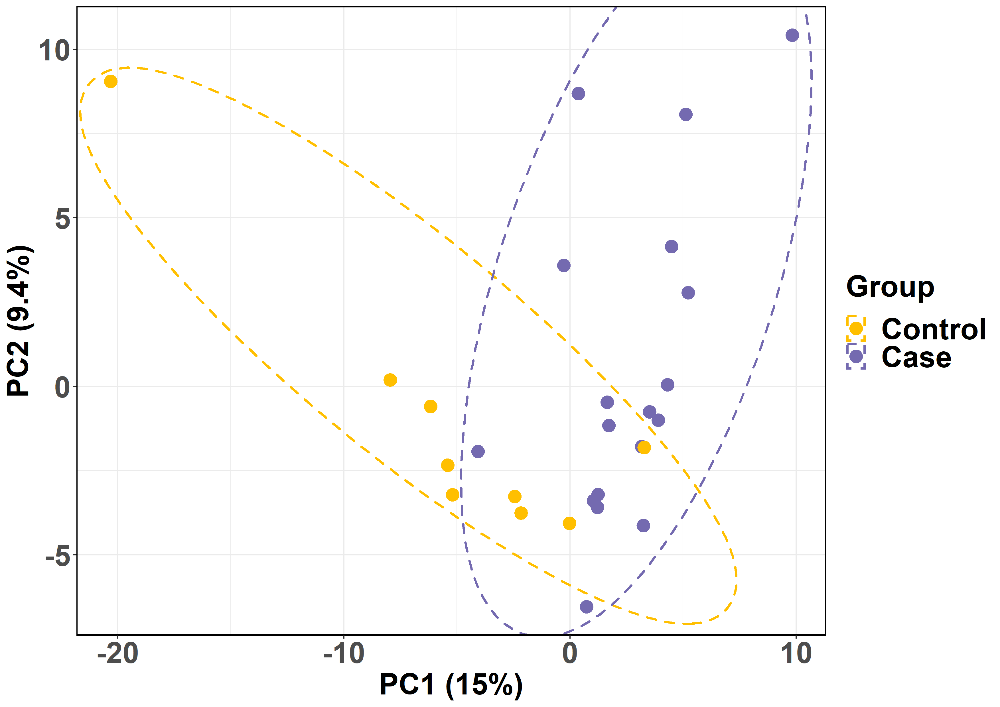

---
output:
  html_document:
    theme: united
---
#### **MetaShiny App allows users to process and visualize Metagenomic short-read sequencing data.**

- *Explore* the app's features with the example count data set pre-loaded by clicking on the Input Data tab.
- *Upload* your own samples list in the "Input Data" tab.

####  **Features**

*Data Visualization*

- ARG Mechanisms (Drug Class vs ARG counts, Resistance Mechanisms, ARG Richness, ARG Abundance)
- Alpha Diversity and Abundance Comparison (Box-plots)
- Clustering (HeatMap, PCA Plot)

####  **Data Format**

- Must be a .csv *comma-separated-value* file.
- File must have two columns with the headers 1: Sample_Id, 2: Group.
- 1: Sample_Id: The name of the sample.
- 2: Group: The group that the sample belongs to.
- The first row of the file is the header.

####  **Input Data**
- Each row from the first column representes the sample name.
- Each row from the second column representes the group (Control or Case).

####  **Output Data**
- Each row of the 3rd column represents the ARG term.
- Additional columns provide information about 
1) Drug Class 
2) Resistance Mechanism 
3) ARG Counts 
4) Bacterial Classification, etc.

####  **Additional Information**

Additional Information and help are provided under the "Additional Information" tab.

#### **App Info**

The MetaShiny App has been develoed by Nirmal Singh Mahar, Anshul Budhraja, Suman Pakala, S.V.Rajagopala and Ishaan Gupta.

**Please cite our App:**

[]

The source code of MetaShiny is available on [Github](https://github.com/Nirmal2310/MetaShiny).

We would appreciate reports of any issues with the app via the issues option of [Github](https://github.com/Nirmal2310/MetaShiny)
