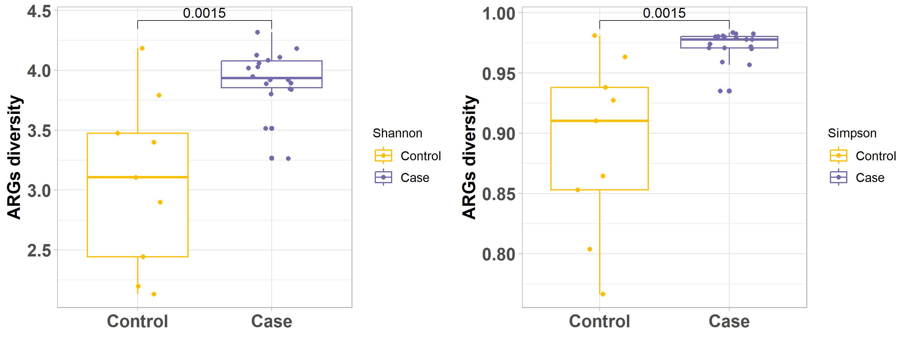
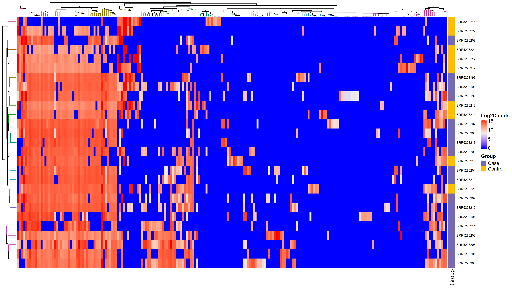

<script type="text/javascript"
  src="https://cdnjs.cloudflare.com/ajax/libs/mathjax/2.7.1/MathJax.js?config=TeX-AMS-MML_HTMLorMML">
</script>

### **MetaShiny app allows users to analyze and visualize metagenomic short-read sequencing data.**

- It takes a list containing the sample names and their respective groups (Control or Case). 

- The Fastq file must have a the same name as the sample name in the list.

- The app will perform end to end analysis using the sequencing data with appropriate tools.

# **Instructions**

Code can be found on [github](https://github.com/Nirmal2310/MetaShiny)

Please post [issues](https://github.com/Nirmal2310/MetaShiny) on github, and feel free to contribute by forking and submitting development branches.

To run this app locally on your machine, download R or RStudio in the local system.

You may now run the shiny app with just one command in R:

```
shiny::runGitHub("MetaShiny", "Nirmal2310")
```

If you are running the App for the first time please tick the checkbox "setup" in the Input Data tab to install the required tools, R packages and databases.

# **Input Data**

You can use this app by

1. Exploring the pre-loaded example data set. This is a pre-loaded metagenome DNA sequencing of ten samples example for exploring the app's features.
2. Upload your own data

<a name="dataformat"></a> 

## **Data Format** 

- Must be a .CSV *comma-separated-value* file.
- File must have a header row.
- First column must be named as `Sample_Id`.
- Second column must be named as `Group`.

<style>
  .sample_info {
    height: 200px;
    overflow-y: scroll;
    border: 1px solid #000000; 
    width: 53%;
    margin-left:5%;
    margin-right:5%
  }

  .sample_info th, .sample_info td {
      border: 1px solid #000000;
      border-spacing: 0;
      text-align: center;
      padding-top: 10px; padding-left:70px; padding-right: 70px; padding-bottom: 10px
    }
</style>

<div class="sample_info">

| Sample_Id         | Group    
|-------------------|--------
| SRR5298196        |   Case   
| SRR5298197        |   Case   
| SRR5298198        |   Case   
| SRR5298199        |   Case   
| SRR5298200        |   Case   
| SRR5298201        |   Case   
| SRR5298202        |   Case   
| SRR5298203        |   Case   
| SRR5298204        |   Case   
| SRR5298205        |   Case   
| SRR5298206        |   Case   
| SRR5298207        |   Case   
| SRR5298208        |   Case   
| SRR5298209        |   Case   
| SRR5298210        |   Case   
| SRR5298211        |   Case   
| SRR5298212        |   Case   
| SRR5298213        |   Case   
| SRR5298214        |   Control
| SRR5298215        |   Control
| SRR5298216        |   Control
| SRR5298217        |   Control
| SRR5298218        |   Control
| SRR5298219        |   Control
| SRR5298220        |   Control
| SRR5298221        |   Control
| SRR5298222        |   Control
</div>

<br>

Example Sample Information file: [Sample Information](Sample_information.csv)

# **Analysis** 

When the list is uploaded, the data is then analyzed by the app. The app first utilizes fastp and bbtools for data pre-processing (removing adapter sequences, low quality reads and host contamination). The preprocessed FASTQ reads are then assembled using SPADES in De Novo fashion. The assembled metagenome is then binned in MAGs (Metagenome Assembled Genomes) using metaWRAP. All the MAGs with % Completeness >= 55 and % Contamination <= 10 are retained for further analysis. Users can change the cutoff while starting the analysis in the Input Data tab. The binned MAGs are annotated using GTDBtk. Antimicrobial Resistance Genes (ARGs) from the binned MAGs are then identified using RGI with CARD database. The uniquely mapped read counts for each ARG are calculated using SAMtools. The final table from the unix pipeline contains the ARO term, Counts, Bacterial Classification and other information. The counts for each ARG terms are then normalized using GPCM method in R and then utilized for further analysis and visualization in R. To determine resistome Case-Control association, we calculated RPKM value (equation 2) of each ARG gene per sample. We then summed up the ARG RPKM abundance per sample and compared the abundance between the Case and Control Groups. To assess the statistical significance of this assosiation, we have used Wilcox rank-sum test. Graphical abstract of Metashiny is shown below:
<br>
$$GCPM(i) = \frac{\{Counts(i)/Gene\,Length(i)\}*10^6}{\sum (Counts/Gene Length)};\;GCPM(i) = GCPM\;Value\;of\;Gene\;i \quad(1)$$

$$RPKM(i) = \frac{Counts(i)*10^6}{(\sum Counts) * Gene\;Length\;(Kb)};\;
RPKM(i) = RPKM\;Value\;of\;Gene\;i \quad(2)$$

<br>


<a name="outputdata"></a> 

## **Analyzed Data Output**
<br>
<style>
  .output_data {
    height: 400px;
    overflow-y: scroll;
    border: 1px solid #cccccc;
  }
  .output_data th, .output_data td {
      border: 1px solid #000000;
      border-spacing: 0;
      text-align: center;
      padding: 8px;
      }
</style>
<div class="output_data">

|**ARO_term**|**ARG_length**|**Counts**|**Percentage_Identity**|**Drug_Class**|**Resistance_Mechanism**| **AMR_Gene_Family**|**Percentage_Coverage**|**Classification**|**Sample_Id**|**Normalized_counts**|**Family**|**Group**|
|:--------------------------------------------------------------------------------:|:----------------:|:------------:|:-------------------------:|:--------------------------------------------:|:------------------------------------:|:---------------------------------------------------------------------------------------:|:-------------------------:|:----------------------------------:|:---------------:|:-----------------------:|:---------------------------:|:-----------:|
| "ErmX"                                                                           | 855              | 160          | 90.14                     | "macrolide antibiotic"                       | "antibiotic target alteration"       | "Erm 23S ribosomal RNA methyltransferase"                                               | 100                       | "Rothia"                           | "SRR5298196"    | 1333.29                 | "Micrococcaceae"            | "Case"      |
| "AAC(3)-IIc"                                                                     | 801              | 23           | 96.24                     | "aminoglycoside antibiotic"                  | "antibiotic inactivation"            | "AAC(3)"                                                                                | 93.01                     | "Rothia"                           | "SRR5298196"    | 204.58                  | "Micrococcaceae"            | "Case"      |
| "tetM"                                                                           | 1920             | 8268         | 98.9                      | "tetracycline antibiotic"                    | "antibiotic target protection"       | "tetracycline-resistant ribosomal protection protein"                                   | 100                       | "Streptococcus sp000187445"        | "SRR5298196"    | 30680.97                | "Streptococcaceae"          | "Case"      |
| "msrE"                                                                           | 1476             | 5539         | 100                       | "macrolide antibiotic"                       | "antibiotic target protection"       | "ABC-F ATP-binding cassette ribosomal protection protein"                               | 100                       | "Streptococcus sp000187445"        | "SRR5298196"    | 26737.13                | "Streptococcaceae"          | "Case"      |
| "mphE"                                                                           | 885              | 3190         | 100                       | "macrolide antibiotic"                       | "antibiotic inactivation"            | "macrolide phosphotransferase (MPH)"                                                    | 100                       | "Streptococcus sp000187445"        | "SRR5298196"    | 25681.31                | "Streptococcaceae"          | "Case"      |
| "ugd"                                                                            | 1167             | 3127         | 99.23                     | "peptide antibiotic"                         | "antibiotic target alteration"       | "pmr phosphoethanolamine transferase"                                                   | 100                       | "unclassified"                     | "SRR5298196"    | 19090.92                | "unclassified"              | "Case"      |
| "gadW"                                                                           | 729              | 3585         | 99.59                     | "macrolide antibiotic"                       | "antibiotic efflux"                  | "resistance-nodulation-cell division (RND) antibiotic efflux pump"                      | 100                       | "unclassified"                     | "SRR5298196"    | 35037.36                | "unclassified"              | "Case"      |
| "mdtA"                                                                           | 1248             | 2529         | 99.04                     | "aminocoumarin antibiotic"                   | "antibiotic efflux"                  | "resistance-nodulation-cell division (RND) antibiotic efflux pump"                      | 100                       | "unclassified"                     | "SRR5298196"    | 14437.9                 | "unclassified"              | "Case"      |
| "mdtB"                                                                           | 3123             | 5630         | 99.81                     | "aminocoumarin antibiotic"                   | "antibiotic efflux"                  | "resistance-nodulation-cell division (RND) antibiotic efflux pump"                      | 100                       | "unclassified"                     | "SRR5298196"    | 12844.17                | "unclassified"              | "Case"      |
| "mdtC"                                                                           | 3060             | 5628         | 99.61                     | "aminocoumarin antibiotic"                   | "antibiotic efflux"                  | "resistance-nodulation-cell division (RND) antibiotic efflux pump"                      | 99.41                     | "unclassified"                     | "SRR5298196"    | 13103.96                | "unclassified"              | "Case"      |
| "baeS"                                                                           | 1404             | 2396         | 99.36                     | "aminoglycoside antibiotic"                  | "antibiotic efflux"                  | "resistance-nodulation-cell division (RND) antibiotic efflux pump"                      | 100                       | "unclassified"                     | "SRR5298196"    | 12158.77                | "unclassified"              | "Case"      |
| "baeR"                                                                           | 723              | 1523         | 98.75                     | "aminoglycoside antibiotic"                  | "antibiotic efflux"                  | "resistance-nodulation-cell division (RND) antibiotic efflux pump"                      | 100                       | "unclassified"                     | "SRR5298196"    | 15008.3                 | "unclassified"              | "Case"      |
| "acrB"                                                                           | 3150             | 8986         | 100                       | "fluoroquinolone antibiotic"                 | "antibiotic efflux"                  | "resistance-nodulation-cell division (RND) antibiotic efflux pump"                      | 100                       | "unclassified"                     | "SRR5298196"    | 20324.77                | "unclassified"              | "Case"      |
| "Escherichia coli acrA"                                                          | 1194             | 4109         | 99.75                     | "fluoroquinolone antibiotic"                 | "antibiotic efflux"                  | "resistance-nodulation-cell division (RND) antibiotic efflux pump"                      | 100                       | "unclassified"                     | "SRR5298196"    | 24518.93                | "unclassified"              | "Case"      |
| "evgS"                                                                           | 3594             | 2097         | 97.41                     | "macrolide antibiotic"                       | "antibiotic efflux"                  | "major facilitator superfamily (MFS) antibiotic efflux pump"                            | 100                       | "unclassified"                     | "SRR5298196"    | 4157.1                  | "unclassified"              | "Case"      |
| "mdtG"                                                                           | 1227             | 3028         | 99.75                     | "fosfomycin"                                 | "antibiotic efflux"                  | "major facilitator superfamily (MFS) antibiotic efflux pump"                            | 100                       | "unclassified"                     | "SRR5298196"    | 17582.52                | "unclassified"              | "Case"      |
| "mdtH"                                                                           | 1209             | 2645         | 99.75                     | "fluoroquinolone antibiotic"                 | "antibiotic efflux"                  | "major facilitator superfamily (MFS) antibiotic efflux pump"                            | 100                       | "unclassified"                     | "SRR5298196"    | 15587.24                | "unclassified"              | "Case"      |
| "PmrF"                                                                           | 969              | 1127         | 99.69                     | "peptide antibiotic"                         | "antibiotic target alteration"       | "pmr phosphoethanolamine transferase"                                                   | 100                       | "unclassified"                     | "SRR5298196"    | 8286.48                 | "unclassified"              | "Case"      |
| "Escherichia coli ampH beta-lactamase"                                           | 1158             | 3572         | 99.74                     | "cephalosporin"                              | "antibiotic inactivation"            | "ampC-type beta-lactamase"                                                              | 100                       | "unclassified"                     | "SRR5298196"    | 21977.22                | "unclassified"              | "Case"      |
| "emrB"                                                                           | 1539             | 522          | 99.8                      | "fluoroquinolone antibiotic"                 | "antibiotic efflux"                  | "major facilitator superfamily (MFS) antibiotic efflux pump"                            | 100                       | "unclassified"                     | "SRR5298196"    | 2416.58                 | "unclassified"              | "Case"      |
| "Escherichia coli ampC1 beta-lactamase"                                          | 1305             | 1870         | 100                       | "cephalosporin"                              | "antibiotic inactivation"            | "ampC-type beta-lactamase"                                                              | 100                       | "unclassified"                     | "SRR5298196"    | 10209.42                | "unclassified"              | "Case"      |
| "kdpE"                                                                           | 678              | 892          | 100                       | "aminoglycoside antibiotic"                  | "antibiotic efflux"                  | "kdpDE"                                                                                 | 100                       | "unclassified"                     | "SRR5298196"    | 9373.57                 | "unclassified"              | "Case"      |
| "mdtN"                                                                           | 1032             | 3330         | 98.83                     | "nucleoside antibiotic"                      | "antibiotic efflux"                  | "major facilitator superfamily (MFS) antibiotic efflux pump"                            | 100                       | "unclassified"                     | "SRR5298196"    | 22989.75                | "unclassified"              | "Case"      |
| "CRP"                                                                            | 633              | 2845         | 99.52                     | "macrolide antibiotic"                       | "antibiotic efflux"                  | "resistance-nodulation-cell division (RND) antibiotic efflux pump"                      | 100                       | "unclassified"                     | "SRR5298196"    | 32021.99                | "unclassified"              | "Case"      |
| "YojI"                                                                           | 1644             | 3309         | 99.63                     | "peptide antibiotic"                         | "antibiotic efflux"                  | "ATP-binding cassette (ABC) antibiotic efflux pump"                                     | 100                       | "unclassified"                     | "SRR5298196"    | 14340.51                | "unclassified"              | "Case"      |
| "eptA"                                                                           | 1644             | 4729         | 100                       | "peptide antibiotic"                         | "antibiotic target alteration"       | "pmr phosphoethanolamine transferase"                                                   | 100                       | "unclassified"                     | "SRR5298196"    | 20494.5                 | "unclassified"              | "Case"      |
| "marA"                                                                           | 384              | 907          | 99.21                     | "fluoroquinolone antibiotic"                 | "antibiotic efflux"                  | "resistance-nodulation-cell division (RND) antibiotic efflux pump"                      | 100                       | "unclassified"                     | "SRR5298196"    | 16828.52                | "unclassified"              | "Case"      |
| "bacA"                                                                           | 822              | 2541         | 99.63                     | "peptide antibiotic"                         | "antibiotic target alteration"       | "undecaprenyl pyrophosphate related proteins"                                           | 100                       | "unclassified"                     | "SRR5298196"    | 22024.33                | "unclassified"              | "Case"      |
| "gadX"                                                                           | 825              | 3287         | 97.45                     | "macrolide antibiotic"                       | "antibiotic efflux"                  | "resistance-nodulation-cell division (RND) antibiotic efflux pump"                      | 100                       | "unclassified"                     | "SRR5298196"    | 28386.74                | "unclassified"              | "Case"      |
| "eptB"                                                                           | 1692             | 1472         | 90.07                     | "peptide antibiotic"                         | "antibiotic target alteration"       | "pmr phosphoethanolamine transferase"                                                   | 98.08                     | "unclassified"                     | "SRR5298196"    | 6198.37                 | "unclassified"              | "Case"      |
| "QnrS1"                                                                          | 657              | 1648         | 100                       | "fluoroquinolone antibiotic"                 | "antibiotic target protection"       | "quinolone resistance protein (qnr)"                                                    | 100                       | "unclassified"                     | "SRR5298196"    | 17871.53                | "unclassified"              | "Case"      |
| "ArnT"                                                                           | 1656             | 277          | 89.29                     | "peptide antibiotic"                         | "antibiotic target alteration"       | "pmr phosphoethanolamine transferase"                                                   | 100                       | "unclassified"                     | "SRR5298196"    | 1191.76                 | "unclassified"              | "Case"      |
| "AcrF"                                                                           | 3105             | 11556        | 99.52                     | "fluoroquinolone antibiotic"                 | "antibiotic efflux"                  | "resistance-nodulation-cell division (RND) antibiotic efflux pump"                      | 100                       | "unclassified"                     | "SRR5298196"    | 26516.47                | "unclassified"              | "Case"      |
| "QnrB4"                                                                          | 648              | 1922         | 100                       | "fluoroquinolone antibiotic"                 | "antibiotic target protection"       | "quinolone resistance protein (qnr)"                                                    | 100                       | "unclassified"                     | "SRR5298196"    | 21132.37                | "unclassified"              | "Case"      |
| "DHA-1"                                                                          | 1140             | 3186         | 100                       | "cephalosporin"                              | "antibiotic inactivation"            | "DHA beta-lactamase"                                                                    | 100                       | "unclassified"                     | "SRR5298196"    | 19911.81                | "unclassified"              | "Case"      |
| "sul1"                                                                           | 840              | 1151         | 100                       | "sulfonamide antibiotic"                     | "antibiotic target replacement"      | "sulfonamide resistant sul"                                                             | 100                       | "unclassified"                     | "SRR5298196"    | 9762.61                 | "unclassified"              | "Case"      |
| "sul2"                                                                           | 816              | 1230         | 100                       | "sulfonamide antibiotic"                     | "antibiotic target replacement"      | "sulfonamide resistant sul"                                                             | 100                       | "unclassified"                     | "SRR5298196"    | 10739.52                | "unclassified"              | "Case"      |
| "APH(3'')-Ib"                                                                    | 804              | 1609         | 99.63                     | "aminoglycoside antibiotic"                  | "antibiotic inactivation"            | "APH(3'')"                                                                              | 100                       | "unclassified"                     | "SRR5298196"    | 14258.37                | "unclassified"              | "Case"      |
| "APH(6)-Id"                                                                      | 837              | 2039         | 99.64                     | "aminoglycoside antibiotic"                  | "antibiotic inactivation"            | "APH(6)"                                                                                | 100                       | "unclassified"                     | "SRR5298196"    | 17356.48                | "unclassified"              | "Case"      |
| "tet(59)"                                                                        | 1203             | 476          | 99.25                     | "tetracycline antibiotic"                    | "antibiotic efflux"                  | "major facilitator superfamily (MFS) antibiotic efflux pump"                            | 100                       | "unclassified"                     | "SRR5298196"    | 2819.1                  | "unclassified"              | "Case"      |
| "TolC"                                                                           | 1482             | 5186         | 99.8                      | "macrolide antibiotic"                       | "antibiotic efflux"                  | "ATP-binding cassette (ABC) antibiotic efflux pump"                                     | 99.6                      | "unclassified"                     | "SRR5298196"    | 24931.83                | "unclassified"              | "Case"      |
| "rsmA"                                                                           | 186              | 847          | 85.25                     | "fluoroquinolone antibiotic"                 | "antibiotic efflux"                  | "resistance-nodulation-cell division (RND) antibiotic efflux pump"                      | 100                       | "unclassified"                     | "SRR5298196"    | 32444.44                | "unclassified"              | "Case"      |
| "SHV-66"                                                                         | 861              | 92           | 99.65                     | "carbapenem"                                 | "antibiotic inactivation"            | "SHV beta-lactamase"                                                                    | 100                       | "unclassified"                     | "SRR5298196"    | 761.3                   | "unclassified"              | "Case"      |
| "msbA"                                                                           | 1749             | 126          | 91.92                     | "nitroimidazole antibiotic"                  | "antibiotic efflux"                  | "ATP-binding cassette (ABC) antibiotic efflux pump"                                     | 100                       | "unclassified"                     | "SRR5298196"    | 513.28                  | "unclassified"              | "Case"      |
| "CTX-M-15"                                                                       | 876              | 78           | 100                       | "cephalosporin"                              | "antibiotic inactivation"            | "CTX-M beta-lactamase"                                                                  | 100                       | "unclassified"                     | "SRR5298196"    | 634.4                   | "unclassified"              | "Case"      |
| "Klebsiella pneumoniae KpnH"                                                     | 1539             | 136          | 93.23                     | "macrolide antibiotic"                       | "antibiotic efflux"                  | "major facilitator superfamily (MFS) antibiotic efflux pump"                            | 100                       | "unclassified"                     | "SRR5298196"    | 629.61                  | "unclassified"              | "Case"      |
| "dfrA14"                                                                         | 459              | 971          | 100                       | "diaminopyrimidine antibiotic"               | "antibiotic target replacement"      | "trimethoprim resistant dihydrofolate reductase dfr"                                    | 96.82                     | "unclassified"                     | "SRR5298196"    | 15072.19                | "unclassified"              | "Case"      |
| "tet(A)"                                                                         | 1275             | 43           | 98.57                     | "tetracycline antibiotic"                    | "antibiotic efflux"                  | "major facilitator superfamily (MFS) antibiotic efflux pump"                            | 100                       | "unclassified"                     | "SRR5298196"    | 240.29                  | "unclassified"              | "Case"      |
| "H-NS"                                                                           | 414              | 1260         | 100                       | "macrolide antibiotic"                       | "antibiotic efflux"                  | "major facilitator superfamily (MFS) antibiotic efflux pump"                            | 100                       | "unclassified"                     | "SRR5298196"    | 21684.03                | "unclassified"              | "Case"      |
| "TEM-1"                                                                          | 861              | 4885         | 100                       | "monobactam"                                 | "antibiotic inactivation"            | "TEM beta-lactamase"                                                                    | 100                       | "unclassified"                     | "SRR5298196"    | 40423.25                | "unclassified"              | "Case"      |
| "emrR"                                                                           | 531              | 53           | 92.57                     | "fluoroquinolone antibiotic"                 | "antibiotic efflux"                  | "major facilitator superfamily (MFS) antibiotic efflux pump"                            | 100                       | "unclassified"                     | "SRR5298196"    | 711.13                  | "unclassified"              | "Case"      |
| "AAC(6')-Ig"                                                                     | 438              | 20           | 100                       | "aminoglycoside antibiotic"                  | "antibiotic inactivation"            | "AAC(6')"                                                                               | 100                       | "unclassified"                     | "SRR5298196"    | 325.33                  | "unclassified"              | "Case"      |
| "Enterobacter cloacae acrA"                                                      | 1194             | 121          | 96.22                     | "fluoroquinolone antibiotic"                 | "antibiotic efflux"                  | "resistance-nodulation-cell division (RND) antibiotic efflux pump"                      | 100                       | "unclassified"                     | "SRR5298196"    | 722.02                  | "unclassified"              | "Case"      |
| "ErmB"                                                                           | 738              | 2431         | 97.96                     | "macrolide antibiotic"                       | "antibiotic target alteration"       | "Erm 23S ribosomal RNA methyltransferase"                                               | 98.79                     | "unclassified"                     | "SRR5298196"    | 23469.2                 | "unclassified"              | "Case"      |
| "ramA"                                                                           | 357              | 27           | 99.16                     | "fluoroquinolone antibiotic"                 | "antibiotic efflux"                  | "resistance-nodulation-cell division (RND) antibiotic efflux pump"                      | 95.97                     | "unclassified"                     | "SRR5298196"    | 538.85                  | "unclassified"              | "Case"      |
| "Escherichia coli EF-Tu mutants conferring resistance to Pulvomycin"             | 1185             | 10119        | 99.75                     | "elfamycin antibiotic"                       | "antibiotic target alteration"       | "elfamycin resistant EF-Tu"                                                             | 96.33                     | "unclassified"                     | "SRR5298196"    | 60839.97                | "unclassified"              | "Case"      |
| "Escherichia coli UhpT with mutation conferring resistance to fosfomycin"        | 1392             | 4350         | 95.46                     | "fosfomycin"                                 | "antibiotic target alteration"       | "antibiotic-resistant UhpT"                                                             | 100                       | "unclassified"                     | "SRR5298196"    | 22264.85                | "unclassified"              | "Case"      |
| "Escherichia coli acrR with mutation conferring multidrug antibiotic resistance" | 648              | 2200         | 100                       | "fluoroquinolone antibiotic"                 | "antibiotic target alteration"       | "resistance-nodulation-cell division (RND) antibiotic efflux pump"                      | 100                       | "unclassified"                     | "SRR5298196"    | 24188.97                | "unclassified"              | "Case"      |
| "Escherichia coli marR mutant conferring antibiotic resistance"                  | 435              | 1112         | 98.61                     | "fluoroquinolone antibiotic"                 | "antibiotic target alteration"       | "resistance-nodulation-cell division (RND) antibiotic efflux pump"                      | 100                       | "unclassified"                     | "SRR5298196"    | 18213.16                | "unclassified"              | "Case"      |
| "Escherichia coli soxR with mutation conferring antibiotic resistance"           | 465              | 1719         | 98.7                      | "fluoroquinolone antibiotic"                 | "antibiotic target alteration"       | "ATP-binding cassette (ABC) antibiotic efflux pump"                                     | 100                       | "unclassified"                     | "SRR5298196"    | 26338.6                 | "unclassified"              | "Case"      |
| "Escherichia coli soxS with mutation conferring antibiotic resistance"           | 324              | 1083         | 100                       | "fluoroquinolone antibiotic"                 | "antibiotic target alteration"       | "ATP-binding cassette (ABC) antibiotic efflux pump"                                     | 100                       | "unclassified"                     | "SRR5298196"    | 23815.14                | "unclassified"              | "Case"      |
| "CRP"                                                                            | 633              | 363          | 95.24                     | "macrolide antibiotic"                       | "antibiotic efflux"                  | "resistance-nodulation-cell division (RND) antibiotic efflux pump"                      | 100                       | "Vibrio cholerae"                  | "SRR5298196"    | 4085.76                 | "Vibrionaceae"              | "Case"      |
| "Vibrio cholerae varG"                                                           | 1125             | 365          | 100                       | "carbapenem"                                 | "antibiotic inactivation"            | "subclass B1 Vibrio cholerae varG beta-lactamase"                                       | 95.9                      | "Vibrio cholerae"                  | "SRR5298196"    | 2311.59                 | "Vibrionaceae"              | "Case"      |
| "almG"                                                                           | 822              | 233          | 100                       | "peptide antibiotic"                         | "antibiotic target alteration"       | "lipid A acyltransferase"                                                               | 100                       | "Vibrio cholerae"                  | "SRR5298196"    | 2019.55                 | "Vibrionaceae"              | "Case"      |
| "dfrA1"                                                                          | 474              | 288          | 99.36                     | "diaminopyrimidine antibiotic"               | "antibiotic target replacement"      | "trimethoprim resistant dihydrofolate reductase dfr"                                    | 100                       | "Vibrio cholerae"                  | "SRR5298196"    | 4328.96                 | "Vibrionaceae"              | "Case"      |
| "catB9"                                                                          | 630              | 256          | 100                       | "phenicol antibiotic"                        | "antibiotic inactivation"            | "chloramphenicol acetyltransferase (CAT)"                                               | 100                       | "Vibrio cholerae"                  | "SRR5298196"    | 2895.14                 | "Vibrionaceae"              | "Case"      |
| "tetO"                                                                           | 1920             | 4564         | 99.22                     | "tetracycline antibiotic"                    | "antibiotic target protection"       | "tetracycline-resistant ribosomal protection protein"                                   | 100                       | "Bifidobacterium longum"           | "SRR5298197"    | 27107.66                | "Bifidobacteriaceae"        | "Case"      |
| "dfrA14"                                                                         | 474              | 1018         | 100                       | "diaminopyrimidine antibiotic"               | "antibiotic target replacement"      | "trimethoprim resistant dihydrofolate reductase dfr"                                    | 100                       | "Bifidobacterium longum"           | "SRR5298197"    | 24491.59                | "Bifidobacteriaceae"        | "Case"      |
| "sul2"                                                                           | 816              | 976          | 100                       | "sulfonamide antibiotic"                     | "antibiotic target replacement"      | "sulfonamide resistant sul"                                                             | 100                       | "Bifidobacterium longum"           | "SRR5298197"    | 13639.78                | "Bifidobacteriaceae"        | "Case"      |
| "APH(6)-Id"                                                                      | 837              | 1606         | 99.28                     | "aminoglycoside antibiotic"                  | "antibiotic inactivation"            | "APH(6)"                                                                                | 100                       | "Bifidobacterium longum"           | "SRR5298197"    | 21881.03                | "Bifidobacteriaceae"        | "Case"      |
| "TEM-1"                                                                          | 861              | 1800         | 100                       | "monobactam"                                 | "antibiotic inactivation"            | "TEM beta-lactamase"                                                                    | 100                       | "Bifidobacterium longum"           | "SRR5298197"    | 23840.59                | "Bifidobacteriaceae"        | "Case"      |
| "marA"                                                                           | 384              | 399          | 100                       | "fluoroquinolone antibiotic"                 | "antibiotic efflux"                  | "resistance-nodulation-cell division (RND) antibiotic efflux pump"                      | 100                       | "Escherichia flexneri"             | "SRR5298197"    | 11849.21                | "Enterobacteriaceae"        | "Case"      |
| "rsmA"                                                                           | 186              | 343          | 85.25                     | "fluoroquinolone antibiotic"                 | "antibiotic efflux"                  | "resistance-nodulation-cell division (RND) antibiotic efflux pump"                      | 100                       | "Escherichia flexneri"             | "SRR5298197"    | 21029.49                | "Enterobacteriaceae"        | "Case"      |
| "emrB"                                                                           | 1539             | 1546         | 100                       | "fluoroquinolone antibiotic"                 | "antibiotic efflux"                  | "major facilitator superfamily (MFS) antibiotic efflux pump"                            | 100                       | "Escherichia flexneri"             | "SRR5298197"    | 11455.62                | "Enterobacteriaceae"        | "Case"      |
| "emrA"                                                                           | 1173             | 1137         | 100                       | "fluoroquinolone antibiotic"                 | "antibiotic efflux"                  | "major facilitator superfamily (MFS) antibiotic efflux pump"                            | 100                       | "Escherichia flexneri"             | "SRR5298197"    | 11053.76                | "Enterobacteriaceae"        | "Case"      |
| "emrR"                                                                           | 531              | 592          | 99.43                     | "fluoroquinolone antibiotic"                 | "antibiotic efflux"                  | "major facilitator superfamily (MFS) antibiotic efflux pump"                            | 100                       | "Escherichia flexneri"             | "SRR5298197"    | 12713.78                | "Enterobacteriaceae"        | "Case"      |
| "bacA"                                                                           | 822              | 870          | 99.63                     | "peptide antibiotic"                         | "antibiotic target alteration"       | "undecaprenyl pyrophosphate related proteins"                                           | 100                       | "Escherichia flexneri"             | "SRR5298197"    | 12069.66                | "Enterobacteriaceae"        | "Case"      |
| "TolC"                                                                           | 1482             | 1893         | 100                       | "macrolide antibiotic"                       | "antibiotic efflux"                  | "ATP-binding cassette (ABC) antibiotic efflux pump"                                     | 99.6                      | "Escherichia flexneri"             | "SRR5298197"    | 14566.33                | "Enterobacteriaceae"        | "Case"      |
| "msbA"                                                                           | 1749             | 2080         | 100                       | "nitroimidazole antibiotic"                  | "antibiotic efflux"                  | "ATP-binding cassette (ABC) antibiotic efflux pump"                                     | 100                       | "Escherichia flexneri"             | "SRR5298197"    | 13561.92                | "Enterobacteriaceae"        | "Case"      |
| "Escherichia coli mdfA"                                                          | 1233             | 1061         | 97.07                     | "tetracycline antibiotic"                    | "antibiotic efflux"                  | "major facilitator superfamily (MFS) antibiotic efflux pump"                            | 100                       | "Escherichia flexneri"             | "SRR5298197"    | 9812.96                 | "Enterobacteriaceae"        | "Case"      |
| "acrD"                                                                           | 3114             | 3006         | 99.9                      | "aminoglycoside antibiotic"                  | "antibiotic efflux"                  | "resistance-nodulation-cell division (RND) antibiotic efflux pump"                      | 100                       | "Escherichia flexneri"             | "SRR5298197"    | 11008.24                | "Enterobacteriaceae"        | "Case"      |
| "Escherichia coli ampC1 beta-lactamase"                                          | 1305             | 1320         | 99.77                     | "cephalosporin"                              | "antibiotic inactivation"            | "ampC-type beta-lactamase"                                                              | 100                       | "Escherichia flexneri"             | "SRR5298197"    | 11534.83                | "Enterobacteriaceae"        | "Case"      |
| "Escherichia coli acrA"                                                          | 1194             | 1723         | 100                       | "fluoroquinolone antibiotic"                 | "antibiotic efflux"                  | "resistance-nodulation-cell division (RND) antibiotic efflux pump"                      | 100                       | "Escherichia flexneri"             | "SRR5298197"    | 16456.16                | "Enterobacteriaceae"        | "Case"      |
| "acrB"                                                                           | 3150             | 3429         | 100                       | "fluoroquinolone antibiotic"                 | "antibiotic efflux"                  | "resistance-nodulation-cell division (RND) antibiotic efflux pump"                      | 100                       | "Escherichia flexneri"             | "SRR5298197"    | 12413.79                | "Enterobacteriaceae"        | "Case"      |
| "Escherichia coli ampH beta-lactamase"                                           | 1158             | 1354         | 100                       | "cephalosporin"                              | "antibiotic inactivation"            | "ampC-type beta-lactamase"                                                              | 100                       | "Escherichia flexneri"             | "SRR5298197"    | 13333.92                | "Enterobacteriaceae"        | "Case"      |
| "CRP"                                                                            | 633              | 978          | 99.52                     | "macrolide antibiotic"                       | "antibiotic efflux"                  | "resistance-nodulation-cell division (RND) antibiotic efflux pump"                      | 100                       | "Escherichia flexneri"             | "SRR5298197"    | 17619.06                | "Enterobacteriaceae"        | "Case"      |
| "YojI"                                                                           | 1644             | 1355         | 100                       | "peptide antibiotic"                         | "antibiotic efflux"                  | "ATP-binding cassette (ABC) antibiotic efflux pump"                                     | 100                       | "Escherichia flexneri"             | "SRR5298197"    | 9399.07                 | "Enterobacteriaceae"        | "Case"      |
| "PmrF"                                                                           | 969              | 764          | 100                       | "peptide antibiotic"                         | "antibiotic target alteration"       | "pmr phosphoethanolamine transferase"                                                   | 100                       | "Escherichia flexneri"             | "SRR5298197"    | 8991.19                 | "Enterobacteriaceae"        | "Case"      |
| "emrY"                                                                           | 1539             | 1837         | 100                       | "tetracycline antibiotic"                    | "antibiotic efflux"                  | "major facilitator superfamily (MFS) antibiotic efflux pump"                            | 100                       | "Escherichia flexneri"             | "SRR5298197"    | 13611.88                | "Enterobacteriaceae"        | "Case"      |
| "evgA"                                                                           | 615              | 832          | 100                       | "macrolide antibiotic"                       | "antibiotic efflux"                  | "major facilitator superfamily (MFS) antibiotic efflux pump"                            | 100                       | "Escherichia flexneri"             | "SRR5298197"    | 15427.51                | "Enterobacteriaceae"        | "Case"      |
| "evgS"                                                                           | 3594             | 4916         | 100                       | "macrolide antibiotic"                       | "antibiotic efflux"                  | "major facilitator superfamily (MFS) antibiotic efflux pump"                            | 100                       | "Escherichia flexneri"             | "SRR5298197"    | 15598.45                | "Enterobacteriaceae"        | "Case"      |
| "kdpE"                                                                           | 678              | 510          | 100                       | "aminoglycoside antibiotic"                  | "antibiotic efflux"                  | "kdpDE"                                                                                 | 100                       | "Escherichia flexneri"             | "SRR5298197"    | 8578.04                 | "Enterobacteriaceae"        | "Case"      |
| "cpxA"                                                                           | 1374             | 1600         | 100                       | "aminoglycoside antibiotic"                  | "antibiotic efflux"                  | "resistance-nodulation-cell division (RND) antibiotic efflux pump"                      | 100                       | "Escherichia flexneri"             | "SRR5298197"    | 13279.47                | "Enterobacteriaceae"        | "Case"      |
| "H-NS"                                                                           | 414              | 499          | 100                       | "macrolide antibiotic"                       | "antibiotic efflux"                  | "major facilitator superfamily (MFS) antibiotic efflux pump"                            | 100                       | "Escherichia flexneri"             | "SRR5298197"    | 13745.1                 | "Enterobacteriaceae"        | "Case"      |
| "mdtG"                                                                           | 1227             | 1366         | 100                       | "fosfomycin"                                 | "antibiotic efflux"                  | "major facilitator superfamily (MFS) antibiotic efflux pump"                            | 100                       | "Escherichia flexneri"             | "SRR5298197"    | 12695.62                | "Enterobacteriaceae"        | "Case"      |
| "mdtH"                                                                           | 1209             | 1027         | 100                       | "fluoroquinolone antibiotic"                 | "antibiotic efflux"                  | "major facilitator superfamily (MFS) antibiotic efflux pump"                            | 100                       | "Escherichia flexneri"             | "SRR5298197"    | 9687.06                 | "Enterobacteriaceae"        | "Case"      |
| "mdtP"                                                                           | 1467             | 1629         | 100                       | "nucleoside antibiotic"                      | "antibiotic efflux"                  | "major facilitator superfamily (MFS) antibiotic efflux pump"                            | 100                       | "Escherichia flexneri"             | "SRR5298197"    | 12663.06                | "Enterobacteriaceae"        | "Case"      |
| "mdtO"                                                                           | 2052             | 2320         | 99.85                     | "nucleoside antibiotic"                      | "antibiotic efflux"                  | "major facilitator superfamily (MFS) antibiotic efflux pump"                            | 100                       | "Escherichia flexneri"             | "SRR5298197"    | 12893.13                | "Enterobacteriaceae"        | "Case"      |
| "mdtN"                                                                           | 1032             | 1075         | 100                       | "nucleoside antibiotic"                      | "antibiotic efflux"                  | "major facilitator superfamily (MFS) antibiotic efflux pump"                            | 100                       | "Escherichia flexneri"             | "SRR5298197"    | 11878.9                 | "Enterobacteriaceae"        | "Case"      |
| "eptA"                                                                           | 1644             | 2307         | 99.82                     | "peptide antibiotic"                         | "antibiotic target alteration"       | "pmr phosphoethanolamine transferase"                                                   | 100                       | "Escherichia flexneri"             | "SRR5298197"    | 16002.71                | "Enterobacteriaceae"        | "Case"      |
| "EC-15"                                                                          | 1134             | 1572         | 98.14                     | "cephalosporin"                              | "antibiotic inactivation"            | "EC beta-lactamase"                                                                     | 100                       | "Escherichia flexneri"             | "SRR5298197"    | 15808.37                | "Enterobacteriaceae"        | "Case"      |
| "AcrF"                                                                           | 3105             | 4095         | 100                       | "fluoroquinolone antibiotic"                 | "antibiotic efflux"                  | "resistance-nodulation-cell division (RND) antibiotic efflux pump"                      | 100                       | "Escherichia flexneri"             | "SRR5298197"    | 15039.73                | "Enterobacteriaceae"        | "Case"      |
| "AcrE"                                                                           | 1158             | 1368         | 100                       | "fluoroquinolone antibiotic"                 | "antibiotic efflux"                  | "resistance-nodulation-cell division (RND) antibiotic efflux pump"                      | 100                       | "Escherichia flexneri"             | "SRR5298197"    | 13471.79                | "Enterobacteriaceae"        | "Case"      |
| "AcrS"                                                                           | 663              | 783          | 100                       | "fluoroquinolone antibiotic"                 | "antibiotic efflux"                  | "resistance-nodulation-cell division (RND) antibiotic efflux pump"                      | 100                       | "Escherichia flexneri"             | "SRR5298197"    | 13467.78                | "Enterobacteriaceae"        | "Case"      |
| "mdtB"                                                                           | 3123             | 2434         | 99.52                     | "aminocoumarin antibiotic"                   | "antibiotic efflux"                  | "resistance-nodulation-cell division (RND) antibiotic efflux pump"                      | 100                       | "Escherichia flexneri"             | "SRR5298197"    | 8887.84                 | "Enterobacteriaceae"        | "Case"      |
| "mdtC"                                                                           | 3078             | 2146         | 99.41                     | "aminocoumarin antibiotic"                   | "antibiotic efflux"                  | "resistance-nodulation-cell division (RND) antibiotic efflux pump"                      | 100                       | "Escherichia flexneri"             | "SRR5298197"    | 7950.76                 | "Enterobacteriaceae"        | "Case"      |
| "baeS"                                                                           | 1404             | 1261         | 99.36                     | "aminoglycoside antibiotic"                  | "antibiotic efflux"                  | "resistance-nodulation-cell division (RND) antibiotic efflux pump"                      | 100                       | "Escherichia flexneri"             | "SRR5298197"    | 10242.26                | "Enterobacteriaceae"        | "Case"      |
| "baeR"                                                                           | 723              | 709          | 99.17                     | "aminoglycoside antibiotic"                  | "antibiotic efflux"                  | "resistance-nodulation-cell division (RND) antibiotic efflux pump"                      | 100                       | "Escherichia flexneri"             | "SRR5298197"    | 11182.93                | "Enterobacteriaceae"        | "Case"      |
| "gadX"                                                                           | 825              | 1314         | 100                       | "macrolide antibiotic"                       | "antibiotic efflux"                  | "resistance-nodulation-cell division (RND) antibiotic efflux pump"                      | 100                       | "Escherichia flexneri"             | "SRR5298197"    | 18163.06                | "Enterobacteriaceae"        | "Case"      |
| "gadW"                                                                           | 729              | 1244         | 94.63                     | "macrolide antibiotic"                       | "antibiotic efflux"                  | "resistance-nodulation-cell division (RND) antibiotic efflux pump"                      | 100                       | "Escherichia flexneri"             | "SRR5298197"    | 19459.89                | "Enterobacteriaceae"        | "Case"      |
| "mdtF"                                                                           | 3114             | 3559         | 100                       | "macrolide antibiotic"                       | "antibiotic efflux"                  | "resistance-nodulation-cell division (RND) antibiotic efflux pump"                      | 100                       | "Escherichia flexneri"             | "SRR5298197"    | 13033.38                | "Enterobacteriaceae"        | "Case"      |
| "mdtE"                                                                           | 1158             | 1489         | 100                       | "macrolide antibiotic"                       | "antibiotic efflux"                  | "resistance-nodulation-cell division (RND) antibiotic efflux pump"                      | 100                       | "Escherichia flexneri"             | "SRR5298197"    | 14663.37                | "Enterobacteriaceae"        | "Case"      |
| "Escherichia coli parC conferring resistance to fluoroquinolones"                | 2259             | 2555         | 99.87                     | "fluoroquinolone antibiotic"                 | "antibiotic target alteration"       | "fluoroquinolone resistant parC"                                                        | 100                       | "Escherichia flexneri"             | "SRR5298197"    | 12898                   | "Enterobacteriaceae"        | "Case"      |
| "Escherichia coli EF-Tu mutants conferring resistance to Pulvomycin"             | 1185             | 3103         | 99.75                     | "elfamycin antibiotic"                       | "antibiotic target alteration"       | "elfamycin resistant EF-Tu"                                                             | 96.33                     | "Escherichia flexneri"             | "SRR5298197"    | 29861.46                | "Enterobacteriaceae"        | "Case"      |
| "Escherichia coli gyrA conferring resistance to fluoroquinolones"                | 2628             | 2965         | 99.77                     | "fluoroquinolone antibiotic"                 | "antibiotic target alteration"       | "fluoroquinolone resistant gyrA"                                                        | 100                       | "Escherichia flexneri"             | "SRR5298197"    | 12866.1                 | "Enterobacteriaceae"        | "Case"      |
| "Escherichia coli marR mutant conferring antibiotic resistance"                  | 435              | 519          | 100                       | "fluoroquinolone antibiotic"                 | "antibiotic target alteration"       | "resistance-nodulation-cell division (RND) antibiotic efflux pump"                      | 100                       | "Escherichia flexneri"             | "SRR5298197"    | 13605.85                | "Enterobacteriaceae"        | "Case"      |
| "Escherichia coli acrR with mutation conferring multidrug antibiotic resistance" | 630              | 785          | 98.95                     | "fluoroquinolone antibiotic"                 | "antibiotic target alteration"       | "resistance-nodulation-cell division (RND) antibiotic efflux pump"                      | 97.21                     | "Escherichia flexneri"             | "SRR5298197"    | 14209.43                | "Enterobacteriaceae"        | "Case"      |
| "Escherichia coli soxS with mutation conferring antibiotic resistance"           | 324              | 433          | 100                       | "fluoroquinolone antibiotic"                 | "antibiotic target alteration"       | "ATP-binding cassette (ABC) antibiotic efflux pump"                                     | 100                       | "Escherichia flexneri"             | "SRR5298197"    | 15240.19                | "Enterobacteriaceae"        | "Case"      |
| "Escherichia coli soxR with mutation conferring antibiotic resistance"           | 465              | 577          | 100                       | "fluoroquinolone antibiotic"                 | "antibiotic target alteration"       | "ATP-binding cassette (ABC) antibiotic efflux pump"                                     | 100                       | "Escherichia flexneri"             | "SRR5298197"    | 14150.46                | "Enterobacteriaceae"        | "Case"      |
| "CfxA6"                                                                          | 936              | 271          | 98.72                     | "cephamycin"                                 | "antibiotic inactivation"            | "CfxA beta-lactamase"                                                                   | 94.26                     | "Prevotella sp000434515"           | "SRR5298197"    | 3301.73                 | "Bacteroidaceae"            | "Case"      |
| "QnrS1"                                                                          | 657              | 1579         | 99.54                     | "fluoroquinolone antibiotic"                 | "antibiotic target protection"       | "quinolone resistance protein (qnr)"                                                    | 100                       | "unclassified"                     | "SRR5298197"    | 27407.18                | "unclassified"              | "Case"      |
| "tet(A)"                                                                         | 1200             | 1737         | 98.23                     | "tetracycline antibiotic"                    | "antibiotic efflux"                  | "major facilitator superfamily (MFS) antibiotic efflux pump"                            | 94.1                      | "unclassified"                     | "SRR5298197"    | 16506.93                | "unclassified"              | "Case"      |
| "AAC(3)-IId"                                                                     | 861              | 459          | 100                       | "aminoglycoside antibiotic"                  | "antibiotic inactivation"            | "AAC(3)"                                                                                | 100                       | "unclassified"                     | "SRR5298197"    | 6079.35                 | "unclassified"              | "Case"      |
| "ErmF"                                                                           | 801              | 3419         | 99.25                     | "macrolide antibiotic"                       | "antibiotic target alteration"       | "Erm 23S ribosomal RNA methyltransferase"                                               | 100                       | "unclassified"                     | "SRR5298197"    | 48675.92                | "unclassified"              | "Case"      |
| "aadS"                                                                           | 864              | 2093         | 100                       | "aminoglycoside antibiotic"                  | "antibiotic inactivation"            | "ANT(6)"                                                                                | 100                       | "unclassified"                     | "SRR5298197"    | 27625.05                | "unclassified"              | "Case"      |
| "CfxA4"                                                                          | 966              | 364          | 100                       | "cephamycin"                                 | "antibiotic inactivation"            | "CfxA beta-lactamase"                                                                   | 100                       | "unclassified"                     | "SRR5298197"    | 4297.06                 | "unclassified"              | "Case"      |
| "catI"                                                                           | 660              | 148          | 100                       | "phenicol antibiotic"                        | "antibiotic inactivation"            | "chloramphenicol acetyltransferase (CAT)"                                               | 100                       | "unclassified"                     | "SRR5298197"    | 2557.2                  | "unclassified"              | "Case"      |
| "tetM"                                                                           | 1920             | 1444         | 94.52                     | "tetracycline antibiotic"                    | "antibiotic target protection"       | "tetracycline-resistant ribosomal protection protein"                                   | 100                       | "unclassified"                     | "SRR5298197"    | 8576.57                 | "unclassified"              | "Case"      |
| "QepA4"                                                                          | 1536             | 98           | 100                       | "fluoroquinolone antibiotic"                 | "antibiotic efflux"                  | "major facilitator superfamily (MFS) antibiotic efflux pump"                            | 100                       | "unclassified"                     | "SRR5298197"    | 727.58                  | "unclassified"              | "Case"      |
| "sul1"                                                                           | 840              | 69           | 100                       | "sulfonamide antibiotic"                     | "antibiotic target replacement"      | "sulfonamide resistant sul"                                                             | 100                       | "unclassified"                     | "SRR5298197"    | 936.74                  | "unclassified"              | "Case"      |
| "qacEdelta1"                                                                     | 348              | 69           | 100                       | "acridine dye"                               | "antibiotic efflux"                  | "major facilitator superfamily (MFS) antibiotic efflux pump"                            | 100                       | "unclassified"                     | "SRR5298197"    | 2261.09                 | "unclassified"              | "Case"      |
| "aadA2"                                                                          | 780              | 111          | 100                       | "aminoglycoside antibiotic"                  | "antibiotic inactivation"            | "ANT(3'')"                                                                              | 100                       | "unclassified"                     | "SRR5298197"    | 1622.84                 | "unclassified"              | "Case"      |
| "dfrA12"                                                                         | 498              | 76           | 100                       | "diaminopyrimidine antibiotic"               | "antibiotic target replacement"      | "trimethoprim resistant dihydrofolate reductase dfr"                                    | 100                       | "unclassified"                     | "SRR5298197"    | 1740.33                 | "unclassified"              | "Case"      |
| "patB"                                                                           | 1767             | 221          | 85.2                      | "fluoroquinolone antibiotic"                 | "antibiotic efflux"                  | "ATP-binding cassette (ABC) antibiotic efflux pump"                                     | 100                       | "unclassified"                     | "SRR5298197"    | 1426.28                 | "unclassified"              | "Case"      |
| "CTX-M-15"                                                                       | 876              | 32           | 100                       | "cephalosporin"                              | "antibiotic inactivation"            | "CTX-M beta-lactamase"                                                                  | 100                       | "unclassified"                     | "SRR5298197"    | 416.58                  | "unclassified"              | "Case"      |
| "ugd"                                                                            | 1167             | 294          | 99.48                     | "peptide antibiotic"                         | "antibiotic target alteration"       | "pmr phosphoethanolamine transferase"                                                   | 100                       | "unclassified"                     | "SRR5298197"    | 2872.92                 | "unclassified"              | "Case"      |
| "Campylobacter coli chloramphenicol acetyltransferase"                           | 624              | 28           | 98.55                     | "phenicol antibiotic"                        | "antibiotic inactivation"            | "chloramphenicol acetyltransferase (CAT)"                                               | 100                       | "unclassified"                     | "SRR5298197"    | 511.71                  | "unclassified"              | "Case"      |
| "ACI-1"                                                                          | 813              | 407          | 100                       | "cephalosporin"                              | "antibiotic inactivation"            | "ACI beta-lactamase"                                                                    | 95.07                     | "unclassified"                     | "SRR5298197"    | 5708.89                 | "unclassified"              | "Case"      |
| "tetQ"                                                                           | 1974             | 10239        | 96.35                     | "tetracycline antibiotic"                    | "antibiotic target protection"       | "tetracycline-resistant ribosomal protection protein"                                   | 100                       | "unclassified"                     | "SRR5298197"    | 59150.45                | "unclassified"              | "Case"      |
| "tet(W/N/W)"                                                                     | 1821             | 254          | 95.06                     | "tetracycline antibiotic"                    | "antibiotic target protection"       | "tetracycline-resistant ribosomal protection protein"                                   | 94.99                     | "unclassified"                     | "SRR5298197"    | 1590.64                 | "unclassified"              | "Case"      |
| "CfxA6"                                                                          | 960              | 1271         | 99.06                     | "cephamycin"                                 | "antibiotic inactivation"            | "CfxA beta-lactamase"                                                                   | 96.37                     | "unclassified"                     | "SRR5298197"    | 15098.09                | "unclassified"              | "Case"      |
| "dfrA1"                                                                          | 474              | 20           | 99.36                     | "diaminopyrimidine antibiotic"               | "antibiotic target replacement"      | "trimethoprim resistant dihydrofolate reductase dfr"                                    | 100                       | "unclassified"                     | "SRR5298197"    | 481.17                  | "unclassified"              | "Case"      |
| "marA"                                                                           | 375              | 11           | 92.68                     | "fluoroquinolone antibiotic"                 | "antibiotic efflux"                  | "resistance-nodulation-cell division (RND) antibiotic efflux pump"                      | 97.64                     | "unclassified"                     | "SRR5298197"    | 334.51                  | "unclassified"              | "Case"      |
| "Bifidobacterium adolescentis rpoB mutants conferring resistance to rifampicin"  | 3561             | 785          | 98.15                     | "rifamycin antibiotic"                       | "antibiotic target alteration"       | "rifamycin-resistant beta-subunit of RNA polymerase (rpoB)"                             | 100                       | "Bifidobacterium sp002742445"      | "SRR5298198"    | 1865.63                 | "Bifidobacteriaceae"        | "Case"      |
| "ErmX"                                                                           | 855              | 89           | 89.44                     | "macrolide antibiotic"                       | "antibiotic target alteration"       | "Erm 23S ribosomal RNA methyltransferase"                                               | 100                       | "Bifidobacterium sp002742445"      | "SRR5298198"    | 880.95                  | "Bifidobacteriaceae"        | "Case"      |
| "baeR"                                                                           | 723              | 868          | 100                       | "aminoglycoside antibiotic"                  | "antibiotic efflux"                  | "resistance-nodulation-cell division (RND) antibiotic efflux pump"                      | 100                       | "Escherichia flexneri"             | "SRR5298198"    | 10160.37                | "Enterobacteriaceae"        | "Case"      |
| "baeS"                                                                           | 1404             | 1678         | 100                       | "aminoglycoside antibiotic"                  | "antibiotic efflux"                  | "resistance-nodulation-cell division (RND) antibiotic efflux pump"                      | 100                       | "Escherichia flexneri"             | "SRR5298198"    | 10114.7                 | "Enterobacteriaceae"        | "Case"      |
| "mdtC"                                                                           | 3078             | 3158         | 99.71                     | "aminocoumarin antibiotic"                   | "antibiotic efflux"                  | "resistance-nodulation-cell division (RND) antibiotic efflux pump"                      | 100                       | "Escherichia flexneri"             | "SRR5298198"    | 8683.03                 | "Enterobacteriaceae"        | "Case"      |
| "mdtB"                                                                           | 3123             | 3465         | 99.62                     | "aminocoumarin antibiotic"                   | "antibiotic efflux"                  | "resistance-nodulation-cell division (RND) antibiotic efflux pump"                      | 100                       | "Escherichia flexneri"             | "SRR5298198"    | 9389.86                 | "Enterobacteriaceae"        | "Case"      |
| "Escherichia coli mdfA"                                                          | 1233             | 1509         | 97.07                     | "tetracycline antibiotic"                    | "antibiotic efflux"                  | "major facilitator superfamily (MFS) antibiotic efflux pump"                            | 100                       | "Escherichia flexneri"             | "SRR5298198"    | 10357.48                | "Enterobacteriaceae"        | "Case"      |
| "acrB"                                                                           | 3150             | 4667         | 100                       | "fluoroquinolone antibiotic"                 | "antibiotic efflux"                  | "resistance-nodulation-cell division (RND) antibiotic efflux pump"                      | 100                       | "Escherichia flexneri"             | "SRR5298198"    | 12538.78                | "Enterobacteriaceae"        | "Case"      |
| "Escherichia coli acrA"                                                          | 1194             | 2336         | 100                       | "fluoroquinolone antibiotic"                 | "antibiotic efflux"                  | "resistance-nodulation-cell division (RND) antibiotic efflux pump"                      | 100                       | "Escherichia flexneri"             | "SRR5298198"    | 16557.57                | "Enterobacteriaceae"        | "Case"      |
| "msbA"                                                                           | 1749             | 2757         | 100                       | "nitroimidazole antibiotic"                  | "antibiotic efflux"                  | "ATP-binding cassette (ABC) antibiotic efflux pump"                                     | 100                       | "Escherichia flexneri"             | "SRR5298198"    | 13340.59                | "Enterobacteriaceae"        | "Case"      |
| "eptA"                                                                           | 1644             | 3337         | 99.63                     | "peptide antibiotic"                         | "antibiotic target alteration"       | "pmr phosphoethanolamine transferase"                                                   | 100                       | "Escherichia flexneri"             | "SRR5298198"    | 17178.39                | "Enterobacteriaceae"        | "Case"      |
| "acrD"                                                                           | 3114             | 4370         | 99.9                      | "aminoglycoside antibiotic"                  | "antibiotic efflux"                  | "resistance-nodulation-cell division (RND) antibiotic efflux pump"                      | 100                       | "Escherichia flexneri"             | "SRR5298198"    | 11876.56                | "Enterobacteriaceae"        | "Case"      |
| "Escherichia coli ampC1 beta-lactamase"                                          | 1305             | 1728         | 99.08                     | "cephalosporin"                              | "antibiotic inactivation"            | "ampC-type beta-lactamase"                                                              | 100                       | "Escherichia flexneri"             | "SRR5298198"    | 11206.27                | "Enterobacteriaceae"        | "Case"      |
| "mdtH"                                                                           | 1209             | 1618         | 100                       | "fluoroquinolone antibiotic"                 | "antibiotic efflux"                  | "major facilitator superfamily (MFS) antibiotic efflux pump"                            | 100                       | "Escherichia flexneri"             | "SRR5298198"    | 11326.1                 | "Enterobacteriaceae"        | "Case"      |
| "mdtG"                                                                           | 1227             | 1741         | 100                       | "fosfomycin"                                 | "antibiotic efflux"                  | "major facilitator superfamily (MFS) antibiotic efflux pump"                            | 100                       | "Escherichia flexneri"             | "SRR5298198"    | 12008.32                | "Enterobacteriaceae"        | "Case"      |
| "kdpE"                                                                           | 678              | 740          | 99.56                     | "aminoglycoside antibiotic"                  | "antibiotic efflux"                  | "kdpDE"                                                                                 | 100                       | "Escherichia flexneri"             | "SRR5298198"    | 9236.98                 | "Enterobacteriaceae"        | "Case"      |
| "marA"                                                                           | 384              | 543          | 100                       | "fluoroquinolone antibiotic"                 | "antibiotic efflux"                  | "resistance-nodulation-cell division (RND) antibiotic efflux pump"                      | 100                       | "Escherichia flexneri"             | "SRR5298198"    | 11967.31                | "Enterobacteriaceae"        | "Case"      |
| "bacA"                                                                           | 822              | 1139         | 100                       | "peptide antibiotic"                         | "antibiotic target alteration"       | "undecaprenyl pyrophosphate related proteins"                                           | 100                       | "Escherichia flexneri"             | "SRR5298198"    | 11726.81                | "Enterobacteriaceae"        | "Case"      |
| "CRP"                                                                            | 633              | 1387         | 99.52                     | "macrolide antibiotic"                       | "antibiotic efflux"                  | "resistance-nodulation-cell division (RND) antibiotic efflux pump"                      | 100                       | "Escherichia flexneri"             | "SRR5298198"    | 18543.89                | "Enterobacteriaceae"        | "Case"      |
| "Escherichia coli ampH beta-lactamase"                                           | 1158             | 1786         | 99.74                     | "cephalosporin"                              | "antibiotic inactivation"            | "ampC-type beta-lactamase"                                                              | 100                       | "Escherichia flexneri"             | "SRR5298198"    | 13052.72                | "Enterobacteriaceae"        | "Case"      |
| "ugd"                                                                            | 1167             | 1874         | 98.97                     | "peptide antibiotic"                         | "antibiotic target alteration"       | "pmr phosphoethanolamine transferase"                                                   | 100                       | "Escherichia flexneri"             | "SRR5298198"    | 13590.23                | "Enterobacteriaceae"        | "Case"      |
| "mdtN"                                                                           | 1032             | 1350         | 100                       | "nucleoside antibiotic"                      | "antibiotic efflux"                  | "major facilitator superfamily (MFS) antibiotic efflux pump"                            | 100                       | "Escherichia flexneri"             | "SRR5298198"    | 11070.88                | "Enterobacteriaceae"        | "Case"      |
| "mdtO"                                                                           | 2052             | 3079         | 100                       | "nucleoside antibiotic"                      | "antibiotic efflux"                  | "major facilitator superfamily (MFS) antibiotic efflux pump"                            | 100                       | "Escherichia flexneri"             | "SRR5298198"    | 12698.73                | "Enterobacteriaceae"        | "Case"      |
| "mdtP"                                                                           | 1467             | 2140         | 100                       | "nucleoside antibiotic"                      | "antibiotic efflux"                  | "major facilitator superfamily (MFS) antibiotic efflux pump"                            | 100                       | "Escherichia flexneri"             | "SRR5298198"    | 12345.58                | "Enterobacteriaceae"        | "Case"      |
| "TolC"                                                                           | 1482             | 2636         | 99.8                      | "macrolide antibiotic"                       | "antibiotic efflux"                  | "ATP-binding cassette (ABC) antibiotic efflux pump"                                     | 99.6                      | "Escherichia flexneri"             | "SRR5298198"    | 15053.07                | "Enterobacteriaceae"        | "Case"      |
| "AcrS"                                                                           | 663              | 1231         | 100                       | "fluoroquinolone antibiotic"                 | "antibiotic efflux"                  | "resistance-nodulation-cell division (RND) antibiotic efflux pump"                      | 100                       | "Escherichia flexneri"             | "SRR5298198"    | 15713.49                | "Enterobacteriaceae"        | "Case"      |
| "AcrE"                                                                           | 1158             | 1872         | 100                       | "fluoroquinolone antibiotic"                 | "antibiotic efflux"                  | "resistance-nodulation-cell division (RND) antibiotic efflux pump"                      | 100                       | "Escherichia flexneri"             | "SRR5298198"    | 13681.23                | "Enterobacteriaceae"        | "Case"      |
| "AcrF"                                                                           | 3105             | 5447         | 99.9                      | "fluoroquinolone antibiotic"                 | "antibiotic efflux"                  | "resistance-nodulation-cell division (RND) antibiotic efflux pump"                      | 100                       | "Escherichia flexneri"             | "SRR5298198"    | 14846.49                | "Enterobacteriaceae"        | "Case"      |
| "rsmA"                                                                           | 186              | 499          | 85.25                     | "fluoroquinolone antibiotic"                 | "antibiotic efflux"                  | "resistance-nodulation-cell division (RND) antibiotic efflux pump"                      | 100                       | "Escherichia flexneri"             | "SRR5298198"    | 22704.69                | "Enterobacteriaceae"        | "Case"      |
| "PmrF"                                                                           | 969              | 1125         | 100                       | "peptide antibiotic"                         | "antibiotic target alteration"       | "pmr phosphoethanolamine transferase"                                                   | 100                       | "Escherichia flexneri"             | "SRR5298198"    | 9825.55                 | "Enterobacteriaceae"        | "Case"      |
| "YojI"                                                                           | 1644             | 1970         | 99.82                     | "peptide antibiotic"                         | "antibiotic efflux"                  | "ATP-binding cassette (ABC) antibiotic efflux pump"                                     | 100                       | "Escherichia flexneri"             | "SRR5298198"    | 10141.27                | "Enterobacteriaceae"        | "Case"      |
| "Escherichia coli ampC beta-lactamase"                                           | 1134             | 2134         | 97.88                     | "cephalosporin"                              | "antibiotic inactivation"            | "ampC-type beta-lactamase"                                                              | 100                       | "Escherichia flexneri"             | "SRR5298198"    | 15926.1                 | "Enterobacteriaceae"        | "Case"      |
| "H-NS"                                                                           | 414              | 749          | 100                       | "macrolide antibiotic"                       | "antibiotic efflux"                  | "major facilitator superfamily (MFS) antibiotic efflux pump"                            | 100                       | "Escherichia flexneri"             | "SRR5298198"    | 15311.21                | "Enterobacteriaceae"        | "Case"      |
| "QnrS1"                                                                          | 657              | 1071         | 100                       | "fluoroquinolone antibiotic"                 | "antibiotic target protection"       | "quinolone resistance protein (qnr)"                                                    | 100                       | "Escherichia flexneri"             | "SRR5298198"    | 13795.97                | "Enterobacteriaceae"        | "Case"      |
| "emrR"                                                                           | 531              | 692          | 100                       | "fluoroquinolone antibiotic"                 | "antibiotic efflux"                  | "major facilitator superfamily (MFS) antibiotic efflux pump"                            | 100                       | "Escherichia flexneri"             | "SRR5298198"    | 11029.09                | "Enterobacteriaceae"        | "Case"      |
| "emrA"                                                                           | 1173             | 1601         | 99.74                     | "fluoroquinolone antibiotic"                 | "antibiotic efflux"                  | "major facilitator superfamily (MFS) antibiotic efflux pump"                            | 100                       | "Escherichia flexneri"             | "SRR5298198"    | 11551.05                | "Enterobacteriaceae"        | "Case"      |
| "Klebsiella pneumoniae KpnH"                                                     | 1314             | 1904         | 100                       | "macrolide antibiotic"                       | "antibiotic efflux"                  | "major facilitator superfamily (MFS) antibiotic efflux pump"                            | 85.55                     | "Escherichia flexneri"             | "SRR5298198"    | 12263.08                | "Enterobacteriaceae"        | "Case"      |
| "cpxA"                                                                           | 1374             | 2140         | 100                       | "aminoglycoside antibiotic"                  | "antibiotic efflux"                  | "resistance-nodulation-cell division (RND) antibiotic efflux pump"                      | 100                       | "Escherichia flexneri"             | "SRR5298198"    | 13181.2                 | "Enterobacteriaceae"        | "Case"      |
| "CTX-M-15"                                                                       | 876              | 1292         | 100                       | "cephalosporin"                              | "antibiotic inactivation"            | "CTX-M beta-lactamase"                                                                  | 100                       | "Escherichia flexneri"             | "SRR5298198"    | 12482.06                | "Enterobacteriaceae"        | "Case"      |
| "Escherichia coli EF-Tu mutants conferring resistance to Pulvomycin"             | 1185             | 5097         | 99.75                     | "elfamycin antibiotic"                       | "antibiotic target alteration"       | "elfamycin resistant EF-Tu"                                                             | 96.33                     | "Escherichia flexneri"             | "SRR5298198"    | 36401.92                | "Enterobacteriaceae"        | "Case"      |
| "Escherichia coli GlpT with mutation conferring resistance to fosfomycin"        | 1359             | 1938         | 99.78                     | "fosfomycin"                                 | "antibiotic target alteration"       | "antibiotic-resistant GlpT"                                                             | 100                       | "Escherichia flexneri"             | "SRR5298198"    | 12068.75                | "Enterobacteriaceae"        | "Case"      |
| "Escherichia coli acrR with mutation conferring multidrug antibiotic resistance" | 648              | 1165         | 100                       | "fluoroquinolone antibiotic"                 | "antibiotic target alteration"       | "resistance-nodulation-cell division (RND) antibiotic efflux pump"                      | 100                       | "Escherichia flexneri"             | "SRR5298198"    | 15215.24                | "Enterobacteriaceae"        | "Case"      |
| "Escherichia coli soxR with mutation conferring antibiotic resistance"           | 465              | 883          | 100                       | "fluoroquinolone antibiotic"                 | "antibiotic target alteration"       | "ATP-binding cassette (ABC) antibiotic efflux pump"                                     | 100                       | "Escherichia flexneri"             | "SRR5298198"    | 16070.74                | "Enterobacteriaceae"        | "Case"      |
| "Escherichia coli soxS with mutation conferring antibiotic resistance"           | 324              | 532          | 100                       | "fluoroquinolone antibiotic"                 | "antibiotic target alteration"       | "ATP-binding cassette (ABC) antibiotic efflux pump"                                     | 100                       | "Escherichia flexneri"             | "SRR5298198"    | 13896.15                | "Enterobacteriaceae"        | "Case"      |
| "Escherichia coli marR mutant conferring antibiotic resistance"                  | 435              | 736          | 100                       | "fluoroquinolone antibiotic"                 | "antibiotic target alteration"       | "resistance-nodulation-cell division (RND) antibiotic efflux pump"                      | 100                       | "Escherichia flexneri"             | "SRR5298198"    | 14319.13                | "Enterobacteriaceae"        | "Case"      |
| "tetR"                                                                           | 627              | 99           | 100                       | "tetracycline antibiotic"                    | "antibiotic target alteration"       | "major facilitator superfamily (MFS) antibiotic efflux pump"                            | 100                       | "Haemophilus D parainfluenzae"     | "SRR5298198"    | 1336.27                 | "Pasteurellaceae"           | "Case"      |
| "tetM"                                                                           | 1920             | 815          | 99.22                     | "tetracycline antibiotic"                    | "antibiotic target protection"       | "tetracycline-resistant ribosomal protection protein"                                   | 100                       | "Succinivibrio sp000431835"        | "SRR5298198"    | 3592.4                  | "Succinivibrionaceae"       | "Case"      |
| "tetO"                                                                           | 1920             | 501          | 97.65                     | "tetracycline antibiotic"                    | "antibiotic target protection"       | "tetracycline-resistant ribosomal protection protein"                                   | 100                       | "unclassified"                     | "SRR5298198"    | 2208.33                 | "unclassified"              | "Case"      |
| "acrD"                                                                           | 3114             | 456          | 91.22                     | "aminoglycoside antibiotic"                  | "antibiotic efflux"                  | "resistance-nodulation-cell division (RND) antibiotic efflux pump"                      | 100                       | "unclassified"                     | "SRR5298198"    | 1239.29                 | "unclassified"              | "Case"      |
| "tet32"                                                                          | 1920             | 312          | 96.56                     | "tetracycline antibiotic"                    | "antibiotic target protection"       | "tetracycline-resistant ribosomal protection protein"                                   | 100                       | "unclassified"                     | "SRR5298198"    | 1375.25                 | "unclassified"              | "Case"      |
| "Escherichia coli mdfA"                                                          | 1233             | 198          | 86.98                     | "tetracycline antibiotic"                    | "antibiotic efflux"                  | "major facilitator superfamily (MFS) antibiotic efflux pump"                            | 100                       | "unclassified"                     | "SRR5298198"    | 1359.03                 | "unclassified"              | "Case"      |
| "emrY"                                                                           | 1539             | 2768         | 99.41                     | "tetracycline antibiotic"                    | "antibiotic efflux"                  | "major facilitator superfamily (MFS) antibiotic efflux pump"                            | 100                       | "unclassified"                     | "SRR5298198"    | 15221.43                | "unclassified"              | "Case"      |
| "evgA"                                                                           | 615              | 1150         | 100                       | "macrolide antibiotic"                       | "antibiotic efflux"                  | "major facilitator superfamily (MFS) antibiotic efflux pump"                            | 100                       | "unclassified"                     | "SRR5298198"    | 15825.26                | "unclassified"              | "Case"      |
| "evgS"                                                                           | 3594             | 7123         | 99.92                     | "macrolide antibiotic"                       | "antibiotic efflux"                  | "major facilitator superfamily (MFS) antibiotic efflux pump"                            | 100                       | "unclassified"                     | "SRR5298198"    | 16773.08                | "unclassified"              | "Case"      |
| "ramA"                                                                           | 375              | 57           | 99.19                     | "fluoroquinolone antibiotic"                 | "antibiotic efflux"                  | "resistance-nodulation-cell division (RND) antibiotic efflux pump"                      | 100                       | "unclassified"                     | "SRR5298198"    | 1286.39                 | "unclassified"              | "Case"      |
| "tetQ"                                                                           | 1926             | 18019        | 97.04                     | "tetracycline antibiotic"                    | "antibiotic target protection"       | "tetracycline-resistant ribosomal protection protein"                                   | 97.56                     | "unclassified"                     | "SRR5298198"    | 79177.61                | "unclassified"              | "Case"      |
| "CRP"                                                                            | 633              | 146          | 99.05                     | "macrolide antibiotic"                       | "antibiotic efflux"                  | "resistance-nodulation-cell division (RND) antibiotic efflux pump"                      | 100                       | "unclassified"                     | "SRR5298198"    | 1951.99                 | "unclassified"              | "Case"      |
| "mdtE"                                                                           | 1158             | 1818         | 100                       | "macrolide antibiotic"                       | "antibiotic efflux"                  | "resistance-nodulation-cell division (RND) antibiotic efflux pump"                      | 100                       | "unclassified"                     | "SRR5298198"    | 13286.58                | "unclassified"              | "Case"      |
| "mdtF"                                                                           | 3114             | 4947         | 100                       | "macrolide antibiotic"                       | "antibiotic efflux"                  | "resistance-nodulation-cell division (RND) antibiotic efflux pump"                      | 100                       | "unclassified"                     | "SRR5298198"    | 13444.71                | "unclassified"              | "Case"      |
| "gadW"                                                                           | 729              | 1612         | 94.63                     | "macrolide antibiotic"                       | "antibiotic efflux"                  | "resistance-nodulation-cell division (RND) antibiotic efflux pump"                      | 100                       | "unclassified"                     | "SRR5298198"    | 18713.95                | "unclassified"              | "Case"      |
| "gadX"                                                                           | 825              | 2021         | 98.18                     | "macrolide antibiotic"                       | "antibiotic efflux"                  | "resistance-nodulation-cell division (RND) antibiotic efflux pump"                      | 100                       | "unclassified"                     | "SRR5298198"    | 20731.96                | "unclassified"              | "Case"      |
| "acrB"                                                                           | 3147             | 600          | 93.14                     | "fluoroquinolone antibiotic"                 | "antibiotic efflux"                  | "resistance-nodulation-cell division (RND) antibiotic efflux pump"                      | 99.9                      | "unclassified"                     | "SRR5298198"    | 1613.55                 | "unclassified"              | "Case"      |
| "mdtB"                                                                           | 3123             | 364          | 89.62                     | "aminocoumarin antibiotic"                   | "antibiotic efflux"                  | "resistance-nodulation-cell division (RND) antibiotic efflux pump"                      | 100                       | "unclassified"                     | "SRR5298198"    | 986.41                  | "unclassified"              | "Case"      |
| "mdtC"                                                                           | 3078             | 322          | 91.89                     | "aminocoumarin antibiotic"                   | "antibiotic efflux"                  | "resistance-nodulation-cell division (RND) antibiotic efflux pump"                      | 100                       | "unclassified"                     | "SRR5298198"    | 885.35                  | "unclassified"              | "Case"      |
| "bacA"                                                                           | 822              | 145          | 95.24                     | "peptide antibiotic"                         | "antibiotic target alteration"       | "undecaprenyl pyrophosphate related proteins"                                           | 100                       | "unclassified"                     | "SRR5298198"    | 1492.88                 | "unclassified"              | "Case"      |
| "emrA"                                                                           | 1173             | 199          | 86.67                     | "fluoroquinolone antibiotic"                 | "antibiotic efflux"                  | "major facilitator superfamily (MFS) antibiotic efflux pump"                            | 100                       | "unclassified"                     | "SRR5298198"    | 1435.76                 | "unclassified"              | "Case"      |
| "aadS"                                                                           | 864              | 551          | 100                       | "aminoglycoside antibiotic"                  | "antibiotic inactivation"            | "ANT(6)"                                                                                | 100                       | "unclassified"                     | "SRR5298198"    | 5397.17                 | "unclassified"              | "Case"      |
| "marA"                                                                           | 381              | 64           | 93.55                     | "fluoroquinolone antibiotic"                 | "antibiotic efflux"                  | "resistance-nodulation-cell division (RND) antibiotic efflux pump"                      | 99.21                     | "unclassified"                     | "SRR5298198"    | 1421.62                 | "unclassified"              | "Case"      |
| "APH(6)-Id"                                                                      | 837              | 306          | 99.28                     | "aminoglycoside antibiotic"                  | "antibiotic inactivation"            | "APH(6)"                                                                                | 100                       | "unclassified"                     | "SRR5298198"    | 3094.03                 | "unclassified"              | "Case"      |
| "APH(3'')-Ib"                                                                    | 804              | 266          | 99.25                     | "aminoglycoside antibiotic"                  | "antibiotic inactivation"            | "APH(3'')"                                                                              | 100                       | "unclassified"                     | "SRR5298198"    | 2799.97                 | "unclassified"              | "Case"      |
| "sul2"                                                                           | 816              | 211          | 100                       | "sulfonamide antibiotic"                     | "antibiotic target replacement"      | "sulfonamide resistant sul"                                                             | 100                       | "unclassified"                     | "SRR5298198"    | 2188.37                 | "unclassified"              | "Case"      |
| "CMH-2"                                                                          | 1146             | 143          | 99.21                     | "cephalosporin"                              | "antibiotic inactivation"            | "CMH beta-lactamase"                                                                    | 100                       | "unclassified"                     | "SRR5298198"    | 1056.04                 | "unclassified"              | "Case"      |
| "tet(A)"                                                                         | 1200             | 315          | 98.48                     | "tetracycline antibiotic"                    | "antibiotic efflux"                  | "major facilitator superfamily (MFS) antibiotic efflux pump"                            | 94.1                      | "unclassified"                     | "SRR5298198"    | 2221.56                 | "unclassified"              | "Case"      |
| "emrR"                                                                           | 531              | 91           | 93.14                     | "fluoroquinolone antibiotic"                 | "antibiotic efflux"                  | "major facilitator superfamily (MFS) antibiotic efflux pump"                            | 100                       | "unclassified"                     | "SRR5298198"    | 1450.36                 | "unclassified"              | "Case"      |
| "baeR"                                                                           | 723              | 74           | 95.42                     | "aminoglycoside antibiotic"                  | "antibiotic efflux"                  | "resistance-nodulation-cell division (RND) antibiotic efflux pump"                      | 100                       | "unclassified"                     | "SRR5298198"    | 866.21                  | "unclassified"              | "Case"      |
| "mphA"                                                                           | 906              | 193          | 99.67                     | "macrolide antibiotic"                       | "antibiotic inactivation"            | "macrolide phosphotransferase (MPH)"                                                    | 100                       | "unclassified"                     | "SRR5298198"    | 1802.84                 | "unclassified"              | "Case"      |
| "oqxA"                                                                           | 1176             | 114          | 91.3                      | "fluoroquinolone antibiotic"                 | "antibiotic efflux"                  | "resistance-nodulation-cell division (RND) antibiotic efflux pump"                      | 100                       | "unclassified"                     | "SRR5298198"    | 820.4                   | "unclassified"              | "Case"      |
| "sul1"                                                                           | 840              | 51           | 100                       | "sulfonamide antibiotic"                     | "antibiotic target replacement"      | "sulfonamide resistant sul"                                                             | 100                       | "unclassified"                     | "SRR5298198"    | 513.83                  | "unclassified"              | "Case"      |
| "catI"                                                                           | 660              | 86           | 100                       | "phenicol antibiotic"                        | "antibiotic inactivation"            | "chloramphenicol acetyltransferase (CAT)"                                               | 100                       | "unclassified"                     | "SRR5298198"    | 1102.76                 | "unclassified"              | "Case"      |
| "tetW"                                                                           | 1920             | 264          | 99.22                     | "tetracycline antibiotic"                    | "antibiotic target protection"       | "tetracycline-resistant ribosomal protection protein"                                   | 100                       | "unclassified"                     | "SRR5298198"    | 1163.67                 | "unclassified"              | "Case"      |
| "CMY-141"                                                                        | 1146             | 90           | 100                       | "cephamycin"                                 | "antibiotic inactivation"            | "CMY beta-lactamase"                                                                    | 100                       | "unclassified"                     | "SRR5298198"    | 664.64                  | "unclassified"              | "Case"      |
| "eptB"                                                                           | 1692             | 533          | 90.07                     | "peptide antibiotic"                         | "antibiotic target alteration"       | "pmr phosphoethanolamine transferase"                                                   | 98.08                     | "unclassified"                     | "SRR5298198"    | 2665.97                 | "unclassified"              | "Case"      |
| "Klebsiella pneumoniae KpnF"                                                     | 330              | 42           | 89.91                     | "macrolide antibiotic"                       | "antibiotic efflux"                  | "major facilitator superfamily (MFS) antibiotic efflux pump"                            | 100                       | "unclassified"                     | "SRR5298198"    | 1077.12                 | "unclassified"              | "Case"      |
| "Klebsiella pneumoniae KpnE"                                                     | 363              | 18           | 85                        | "macrolide antibiotic"                       | "antibiotic efflux"                  | "major facilitator superfamily (MFS) antibiotic efflux pump"                            | 100                       | "unclassified"                     | "SRR5298198"    | 419.66                  | "unclassified"              | "Case"      |
| "aadA5"                                                                          | 789              | 72           | 100                       | "aminoglycoside antibiotic"                  | "antibiotic inactivation"            | "ANT(3'')"                                                                              | 100                       | "unclassified"                     | "SRR5298198"    | 772.3                   | "unclassified"              | "Case"      |
| "QnrB4"                                                                          | 648              | 78           | 100                       | "fluoroquinolone antibiotic"                 | "antibiotic target protection"       | "quinolone resistance protein (qnr)"                                                    | 100                       | "unclassified"                     | "SRR5298198"    | 1018.7                  | "unclassified"              | "Case"      |
| "OXA-1"                                                                          | 831              | 44           | 100                       | "carbapenem"                                 | "antibiotic inactivation"            | "OXA beta-lactamase"                                                                    | 100                       | "unclassified"                     | "SRR5298198"    | 448.1                   | "unclassified"              | "Case"      |
| "DHA-1"                                                                          | 1140             | 37           | 99.47                     | "cephalosporin"                              | "antibiotic inactivation"            | "DHA beta-lactamase"                                                                    | 100                       | "unclassified"                     | "SRR5298198"    | 274.68                  | "unclassified"              | "Case"      |
| "ErmF"                                                                           | 801              | 4375         | 99.25                     | "macrolide antibiotic"                       | "antibiotic target alteration"       | "Erm 23S ribosomal RNA methyltransferase"                                               | 100                       | "unclassified"                     | "SRR5298198"    | 46224.64                | "unclassified"              | "Case"      |
| "ErmB"                                                                           | 738              | 59           | 97.96                     | "macrolide antibiotic"                       | "antibiotic target alteration"       | "Erm 23S ribosomal RNA methyltransferase"                                               | 98.79                     | "unclassified"                     | "SRR5298198"    | 676.59                  | "unclassified"              | "Case"      |
| "CfxA6"                                                                          | 996              | 10693        | 98.79                     | "cephamycin"                                 | "antibiotic inactivation"            | "CfxA beta-lactamase"                                                                   | 100                       | "unclassified"                     | "SRR5298198"    | 90859.06                | "unclassified"              | "Case"      |
| "dfrA1"                                                                          | 474              | 24           | 99.36                     | "diaminopyrimidine antibiotic"               | "antibiotic target replacement"      | "trimethoprim resistant dihydrofolate reductase dfr"                                    | 100                       | "unclassified"                     | "SRR5298198"    | 428.51                  | "unclassified"              | "Case"      |
| "TEM-1"                                                                          | 861              | 614          | 100                       | "monobactam"                                 | "antibiotic inactivation"            | "TEM beta-lactamase"                                                                    | 100                       | "unclassified"                     | "SRR5298198"    | 6035.22                 | "unclassified"              | "Case"      |
| "dfrA14"                                                                         | 459              | 29           | 100                       | "diaminopyrimidine antibiotic"               | "antibiotic target replacement"      | "trimethoprim resistant dihydrofolate reductase dfr"                                    | 96.82                     | "unclassified"                     | "SRR5298198"    | 534.7                   | "unclassified"              | "Case"      |
| "FosA5"                                                                          | 396              | 13           | 100                       | "fosfomycin"                                 | "antibiotic inactivation"            | "fosfomycin thiol transferase"                                                          | 94.96                     | "unclassified"                     | "SRR5298198"    | 277.83                  | "unclassified"              | "Case"      |
| "Escherichia coli UhpT with mutation conferring resistance to fosfomycin"        | 1392             | 2043         | 95.46                     | "fosfomycin"                                 | "antibiotic target alteration"       | "antibiotic-resistant UhpT"                                                             | 100                       | "unclassified"                     | "SRR5298198"    | 12421.02                | "unclassified"              | "Case"      |
| "Escherichia coli EF-Tu mutants conferring resistance to Pulvomycin"             | 1185             | 926          | 92.62                     | "elfamycin antibiotic"                       | "antibiotic target alteration"       | "elfamycin resistant EF-Tu"                                                             | 96.33                     | "unclassified"                     | "SRR5298198"    | 6613.34                 | "unclassified"              | "Case"      |
| "Escherichia coli marR mutant conferring antibiotic resistance"                  | 435              | 80           | 86.11                     | "fluoroquinolone antibiotic"                 | "antibiotic target alteration"       | "resistance-nodulation-cell division (RND) antibiotic efflux pump"                      | 100                       | "unclassified"                     | "SRR5298198"    | 1556.43                 | "unclassified"              | "Case"      |
| "abeM"                                                                           | 1347             | 92           | 99.78                     | "fluoroquinolone antibiotic"                 | "antibiotic efflux"                  | "multidrug and toxic compound extrusion (MATE) transporter"                             | 100                       | "Acinetobacter baumannii"          | "SRR5298199"    | 191.11                  | "Moraxellaceae"             | "Case"      |
| "adeI"                                                                           | 1251             | 94           | 99.76                     | "macrolide antibiotic"                       | "antibiotic efflux"                  | "resistance-nodulation-cell division (RND) antibiotic efflux pump"                      | 100                       | "Acinetobacter baumannii"          | "SRR5298199"    | 210.25                  | "Moraxellaceae"             | "Case"      |
| "adeK"                                                                           | 1455             | 71           | 100                       | "macrolide antibiotic"                       | "antibiotic efflux"                  | "resistance-nodulation-cell division (RND) antibiotic efflux pump"                      | 100                       | "Acinetobacter baumannii"          | "SRR5298199"    | 136.54                  | "Moraxellaceae"             | "Case"      |
| "rsmA"                                                                           | 180              | 13           | 89.09                     | "fluoroquinolone antibiotic"                 | "antibiotic efflux"                  | "resistance-nodulation-cell division (RND) antibiotic efflux pump"                      | 98.36                     | "Acinetobacter baumannii"          | "SRR5298199"    | 202.09                  | "Moraxellaceae"             | "Case"      |
| "LpsB"                                                                           | 1101             | 104          | 98.36                     | "peptide antibiotic"                         | "reduced permeability to antibiotic" | "Intrinsic peptide antibiotic resistant Lps"                                            | 100                       | "Acinetobacter baumannii"          | "SRR5298199"    | 264.31                  | "Moraxellaceae"             | "Case"      |
| "Acinetobacter baumannii parC conferring resistance to fluoroquinolones"         | 2199             | 172          | 98.75                     | "fluoroquinolone antibiotic"                 | "antibiotic target alteration"       | "fluoroquinolone resistant parC"                                                        | 99.05                     | "Acinetobacter baumannii"          | "SRR5298199"    | 218.87                  | "Moraxellaceae"             | "Case"      |
| "tetW"                                                                           | 1920             | 4430         | 99.84                     | "tetracycline antibiotic"                    | "antibiotic target protection"       | "tetracycline-resistant ribosomal protection protein"                                   | 100                       | "Bifidobacterium longum"           | "SRR5298199"    | 6456.2                  | "Bifidobacteriaceae"        | "Case"      |
| "mphA"                                                                           | 906              | 25686        | 99.67                     | "macrolide antibiotic"                       | "antibiotic inactivation"            | "macrolide phosphotransferase (MPH)"                                                    | 100                       | "Bifidobacterium longum"           | "SRR5298199"    | 79330.98                | "Bifidobacteriaceae"        | "Case"      |
| "mdtB"                                                                           | 3123             | 9382         | 99.9                      | "aminocoumarin antibiotic"                   | "antibiotic efflux"                  | "resistance-nodulation-cell division (RND) antibiotic efflux pump"                      | 100                       | "Escherichia flexneri"             | "SRR5298199"    | 8406.17                 | "Enterobacteriaceae"        | "Case"      |
| "mdtC"                                                                           | 3078             | 8655         | 99.8                      | "aminocoumarin antibiotic"                   | "antibiotic efflux"                  | "resistance-nodulation-cell division (RND) antibiotic efflux pump"                      | 100                       | "Escherichia flexneri"             | "SRR5298199"    | 7868.16                 | "Enterobacteriaceae"        | "Case"      |
| "baeS"                                                                           | 1404             | 4370         | 100                       | "aminoglycoside antibiotic"                  | "antibiotic efflux"                  | "resistance-nodulation-cell division (RND) antibiotic efflux pump"                      | 100                       | "Escherichia flexneri"             | "SRR5298199"    | 8709.41                 | "Enterobacteriaceae"        | "Case"      |
| "baeR"                                                                           | 723              | 2397         | 99.58                     | "aminoglycoside antibiotic"                  | "antibiotic efflux"                  | "resistance-nodulation-cell division (RND) antibiotic efflux pump"                      | 100                       | "Escherichia flexneri"             | "SRR5298199"    | 9276.93                 | "Enterobacteriaceae"        | "Case"      |
| "PmrF"                                                                           | 969              | 3310         | 100                       | "peptide antibiotic"                         | "antibiotic target alteration"       | "pmr phosphoethanolamine transferase"                                                   | 100                       | "Escherichia flexneri"             | "SRR5298199"    | 9558.26                 | "Enterobacteriaceae"        | "Case"      |
| "mdtP"                                                                           | 1467             | 6010         | 100                       | "nucleoside antibiotic"                      | "antibiotic efflux"                  | "major facilitator superfamily (MFS) antibiotic efflux pump"                            | 100                       | "Escherichia flexneri"             | "SRR5298199"    | 11463.54                | "Enterobacteriaceae"        | "Case"      |
| "mdtO"                                                                           | 2052             | 8116         | 100                       | "nucleoside antibiotic"                      | "antibiotic efflux"                  | "major facilitator superfamily (MFS) antibiotic efflux pump"                            | 100                       | "Escherichia flexneri"             | "SRR5298199"    | 11067.24                | "Enterobacteriaceae"        | "Case"      |
| "mdtN"                                                                           | 1032             | 3924         | 100                       | "nucleoside antibiotic"                      | "antibiotic efflux"                  | "major facilitator superfamily (MFS) antibiotic efflux pump"                            | 100                       | "Escherichia flexneri"             | "SRR5298199"    | 10639.56                | "Enterobacteriaceae"        | "Case"      |
| "eptA"                                                                           | 1644             | 8494         | 100                       | "peptide antibiotic"                         | "antibiotic target alteration"       | "pmr phosphoethanolamine transferase"                                                   | 100                       | "Escherichia flexneri"             | "SRR5298199"    | 14457.23                | "Enterobacteriaceae"        | "Case"      |
| "Escherichia coli ampC beta-lactamase"                                           | 1134             | 5741         | 100                       | "cephalosporin"                              | "antibiotic inactivation"            | "ampC-type beta-lactamase"                                                              | 100                       | "Escherichia flexneri"             | "SRR5298199"    | 14166.06                | "Enterobacteriaceae"        | "Case"      |
| "bacA"                                                                           | 822              | 3202         | 100                       | "peptide antibiotic"                         | "antibiotic target alteration"       | "undecaprenyl pyrophosphate related proteins"                                           | 100                       | "Escherichia flexneri"             | "SRR5298199"    | 10899.94                | "Enterobacteriaceae"        | "Case"      |
| "TolC"                                                                           | 1482             | 7215         | 100                       | "macrolide antibiotic"                       | "antibiotic efflux"                  | "ATP-binding cassette (ABC) antibiotic efflux pump"                                     | 99.6                      | "Escherichia flexneri"             | "SRR5298199"    | 13622.68                | "Enterobacteriaceae"        | "Case"      |
| "msbA"                                                                           | 1749             | 7118         | 100                       | "nitroimidazole antibiotic"                  | "antibiotic efflux"                  | "ATP-binding cassette (ABC) antibiotic efflux pump"                                     | 100                       | "Escherichia flexneri"             | "SRR5298199"    | 11387.88                | "Enterobacteriaceae"        | "Case"      |
| "mdtG"                                                                           | 1227             | 4645         | 100                       | "fosfomycin"                                 | "antibiotic efflux"                  | "major facilitator superfamily (MFS) antibiotic efflux pump"                            | 100                       | "Escherichia flexneri"             | "SRR5298199"    | 10592.92                | "Enterobacteriaceae"        | "Case"      |
| "mdtH"                                                                           | 1209             | 3958         | 100                       | "fluoroquinolone antibiotic"                 | "antibiotic efflux"                  | "major facilitator superfamily (MFS) antibiotic efflux pump"                            | 100                       | "Escherichia flexneri"             | "SRR5298199"    | 9160.6                  | "Enterobacteriaceae"        | "Case"      |
| "Escherichia coli acrA"                                                          | 1194             | 6198         | 100                       | "fluoroquinolone antibiotic"                 | "antibiotic efflux"                  | "resistance-nodulation-cell division (RND) antibiotic efflux pump"                      | 100                       | "Escherichia flexneri"             | "SRR5298199"    | 14525.19                | "Enterobacteriaceae"        | "Case"      |
| "acrB"                                                                           | 3150             | 14048        | 100                       | "fluoroquinolone antibiotic"                 | "antibiotic efflux"                  | "resistance-nodulation-cell division (RND) antibiotic efflux pump"                      | 100                       | "Escherichia flexneri"             | "SRR5298199"    | 12478.96                | "Enterobacteriaceae"        | "Case"      |
| "Escherichia coli ampH beta-lactamase"                                           | 1158             | 5150         | 100                       | "cephalosporin"                              | "antibiotic inactivation"            | "ampC-type beta-lactamase"                                                              | 100                       | "Escherichia flexneri"             | "SRR5298199"    | 12444.38                | "Enterobacteriaceae"        | "Case"      |
| "CRP"                                                                            | 633              | 3807         | 99.52                     | "macrolide antibiotic"                       | "antibiotic efflux"                  | "resistance-nodulation-cell division (RND) antibiotic efflux pump"                      | 100                       | "Escherichia flexneri"             | "SRR5298199"    | 16828.82                | "Enterobacteriaceae"        | "Case"      |
| "kdpE"                                                                           | 678              | 2116         | 100                       | "aminoglycoside antibiotic"                  | "antibiotic efflux"                  | "kdpDE"                                                                                 | 100                       | "Escherichia flexneri"             | "SRR5298199"    | 8732.94                 | "Enterobacteriaceae"        | "Case"      |
| "ugd"                                                                            | 1167             | 5066         | 98.97                     | "peptide antibiotic"                         | "antibiotic target alteration"       | "pmr phosphoethanolamine transferase"                                                   | 100                       | "Escherichia flexneri"             | "SRR5298199"    | 12146.99                | "Enterobacteriaceae"        | "Case"      |
| "mdtE"                                                                           | 1158             | 5051         | 100                       | "macrolide antibiotic"                       | "antibiotic efflux"                  | "resistance-nodulation-cell division (RND) antibiotic efflux pump"                      | 100                       | "Escherichia flexneri"             | "SRR5298199"    | 12205.16                | "Enterobacteriaceae"        | "Case"      |
| "mdtF"                                                                           | 3114             | 12994        | 100                       | "macrolide antibiotic"                       | "antibiotic efflux"                  | "resistance-nodulation-cell division (RND) antibiotic efflux pump"                      | 100                       | "Escherichia flexneri"             | "SRR5298199"    | 11676.13                | "Enterobacteriaceae"        | "Case"      |
| "gadW"                                                                           | 729              | 4353         | 94.63                     | "macrolide antibiotic"                       | "antibiotic efflux"                  | "resistance-nodulation-cell division (RND) antibiotic efflux pump"                      | 100                       | "Escherichia flexneri"             | "SRR5298199"    | 16708.43                | "Enterobacteriaceae"        | "Case"      |
| "gadX"                                                                           | 825              | 5394         | 99.64                     | "macrolide antibiotic"                       | "antibiotic efflux"                  | "resistance-nodulation-cell division (RND) antibiotic efflux pump"                      | 100                       | "Escherichia flexneri"             | "SRR5298199"    | 18294.96                | "Enterobacteriaceae"        | "Case"      |
| "marA"                                                                           | 384              | 1528         | 100                       | "fluoroquinolone antibiotic"                 | "antibiotic efflux"                  | "resistance-nodulation-cell division (RND) antibiotic efflux pump"                      | 100                       | "Escherichia flexneri"             | "SRR5298199"    | 11134.4                 | "Enterobacteriaceae"        | "Case"      |
| "AcrF"                                                                           | 3105             | 14423        | 100                       | "fluoroquinolone antibiotic"                 | "antibiotic efflux"                  | "resistance-nodulation-cell division (RND) antibiotic efflux pump"                      | 100                       | "Escherichia flexneri"             | "SRR5298199"    | 12997.76                | "Enterobacteriaceae"        | "Case"      |
| "AcrE"                                                                           | 1158             | 5262         | 99.74                     | "fluoroquinolone antibiotic"                 | "antibiotic efflux"                  | "resistance-nodulation-cell division (RND) antibiotic efflux pump"                      | 100                       | "Escherichia flexneri"             | "SRR5298199"    | 12715.01                | "Enterobacteriaceae"        | "Case"      |
| "AcrS"                                                                           | 663              | 3202         | 100                       | "fluoroquinolone antibiotic"                 | "antibiotic efflux"                  | "resistance-nodulation-cell division (RND) antibiotic efflux pump"                      | 100                       | "Escherichia flexneri"             | "SRR5298199"    | 13513.95                | "Enterobacteriaceae"        | "Case"      |
| "rsmA"                                                                           | 186              | 1385         | 85.25                     | "fluoroquinolone antibiotic"                 | "antibiotic efflux"                  | "resistance-nodulation-cell division (RND) antibiotic efflux pump"                      | 100                       | "Escherichia flexneri"             | "SRR5298199"    | 20835.86                | "Enterobacteriaceae"        | "Case"      |
| "emrB"                                                                           | 1539             | 5868         | 100                       | "fluoroquinolone antibiotic"                 | "antibiotic efflux"                  | "major facilitator superfamily (MFS) antibiotic efflux pump"                            | 100                       | "Escherichia flexneri"             | "SRR5298199"    | 10669.06                | "Enterobacteriaceae"        | "Case"      |
| "emrA"                                                                           | 1173             | 4184         | 100                       | "fluoroquinolone antibiotic"                 | "antibiotic efflux"                  | "major facilitator superfamily (MFS) antibiotic efflux pump"                            | 100                       | "Escherichia flexneri"             | "SRR5298199"    | 9980.87                 | "Enterobacteriaceae"        | "Case"      |
| "emrR"                                                                           | 531              | 2169         | 100                       | "fluoroquinolone antibiotic"                 | "antibiotic efflux"                  | "major facilitator superfamily (MFS) antibiotic efflux pump"                            | 100                       | "Escherichia flexneri"             | "SRR5298199"    | 11429.82                | "Enterobacteriaceae"        | "Case"      |
| "Escherichia coli emrE"                                                          | 333              | 1717         | 98.18                     | "macrolide antibiotic"                       | "antibiotic efflux"                  | "small multidrug resistance (SMR) antibiotic efflux pump"                               | 100                       | "Escherichia flexneri"             | "SRR5298199"    | 14427.82                | "Enterobacteriaceae"        | "Case"      |
| "Escherichia coli mdfA"                                                          | 1233             | 3892         | 97.07                     | "tetracycline antibiotic"                    | "antibiotic efflux"                  | "major facilitator superfamily (MFS) antibiotic efflux pump"                            | 100                       | "Escherichia flexneri"             | "SRR5298199"    | 8832.51                 | "Enterobacteriaceae"        | "Case"      |
| "H-NS"                                                                           | 414              | 1806         | 100                       | "macrolide antibiotic"                       | "antibiotic efflux"                  | "major facilitator superfamily (MFS) antibiotic efflux pump"                            | 100                       | "Escherichia flexneri"             | "SRR5298199"    | 12206.52                | "Enterobacteriaceae"        | "Case"      |
| "cpxA"                                                                           | 1374             | 5404         | 100                       | "aminoglycoside antibiotic"                  | "antibiotic efflux"                  | "resistance-nodulation-cell division (RND) antibiotic efflux pump"                      | 100                       | "Escherichia flexneri"             | "SRR5298199"    | 11005.33                | "Enterobacteriaceae"        | "Case"      |
| "emrY"                                                                           | 1539             | 6888         | 100                       | "tetracycline antibiotic"                    | "antibiotic efflux"                  | "major facilitator superfamily (MFS) antibiotic efflux pump"                            | 100                       | "Escherichia flexneri"             | "SRR5298199"    | 12523.6                 | "Enterobacteriaceae"        | "Case"      |
| "evgA"                                                                           | 615              | 3101         | 100                       | "macrolide antibiotic"                       | "antibiotic efflux"                  | "major facilitator superfamily (MFS) antibiotic efflux pump"                            | 100                       | "Escherichia flexneri"             | "SRR5298199"    | 14109.16                | "Enterobacteriaceae"        | "Case"      |
| "evgS"                                                                           | 3594             | 17938        | 100                       | "macrolide antibiotic"                       | "antibiotic efflux"                  | "major facilitator superfamily (MFS) antibiotic efflux pump"                            | 100                       | "Escherichia flexneri"             | "SRR5298199"    | 13965.95                | "Enterobacteriaceae"        | "Case"      |
| "Escherichia coli ampC1 beta-lactamase"                                          | 1305             | 4388         | 100                       | "cephalosporin"                              | "antibiotic inactivation"            | "ampC-type beta-lactamase"                                                              | 100                       | "Escherichia flexneri"             | "SRR5298199"    | 9408.72                 | "Enterobacteriaceae"        | "Case"      |
| "acrD"                                                                           | 3114             | 11321        | 99.9                      | "aminoglycoside antibiotic"                  | "antibiotic efflux"                  | "resistance-nodulation-cell division (RND) antibiotic efflux pump"                      | 100                       | "Escherichia flexneri"             | "SRR5298199"    | 10172.8                 | "Enterobacteriaceae"        | "Case"      |
| "Escherichia coli EF-Tu mutants conferring resistance to Pulvomycin"             | 1185             | 9542         | 99.75                     | "elfamycin antibiotic"                       | "antibiotic target alteration"       | "elfamycin resistant EF-Tu"                                                             | 96.33                     | "Escherichia flexneri"             | "SRR5298199"    | 22531.78                | "Enterobacteriaceae"        | "Case"      |
| "Escherichia coli nfsA mutations conferring resistance to nitrofurantoin"        | 723              | 2434         | 99.58                     | "nitrofuran antibiotic"                      | "antibiotic target alteration"       | "antibiotic resistant nfsA"                                                             | 100                       | "Escherichia flexneri"             | "SRR5298199"    | 9420.13                 | "Enterobacteriaceae"        | "Case"      |
| "Escherichia coli soxS with mutation conferring antibiotic resistance"           | 324              | 1403         | 100                       | "fluoroquinolone antibiotic"                 | "antibiotic target alteration"       | "ATP-binding cassette (ABC) antibiotic efflux pump"                                     | 100                       | "Escherichia flexneri"             | "SRR5298199"    | 12116.78                | "Enterobacteriaceae"        | "Case"      |
| "Escherichia coli soxR with mutation conferring antibiotic resistance"           | 465              | 2225         | 100                       | "fluoroquinolone antibiotic"                 | "antibiotic target alteration"       | "ATP-binding cassette (ABC) antibiotic efflux pump"                                     | 100                       | "Escherichia flexneri"             | "SRR5298199"    | 13389.11                | "Enterobacteriaceae"        | "Case"      |
| "Escherichia coli acrR with mutation conferring multidrug antibiotic resistance" | 648              | 3215         | 100                       | "fluoroquinolone antibiotic"                 | "antibiotic target alteration"       | "resistance-nodulation-cell division (RND) antibiotic efflux pump"                      | 100                       | "Escherichia flexneri"             | "SRR5298199"    | 13882.91                | "Enterobacteriaceae"        | "Case"      |
| "Escherichia coli marR mutant conferring antibiotic resistance"                  | 435              | 2056         | 100                       | "fluoroquinolone antibiotic"                 | "antibiotic target alteration"       | "resistance-nodulation-cell division (RND) antibiotic efflux pump"                      | 100                       | "Escherichia flexneri"             | "SRR5298199"    | 13225.39                | "Enterobacteriaceae"        | "Case"      |
| "ACI-1"                                                                          | 855              | 132          | 100                       | "cephalosporin"                              | "antibiotic inactivation"            | "ACI beta-lactamase"                                                                    | 100                       | "Megasphaera sp000417505"          | "SRR5298199"    | 432                     | "Megasphaeraceae"           | "Case"      |
| "tetM"                                                                           | 1920             | 280          | 96.71                     | "tetracycline antibiotic"                    | "antibiotic target protection"       | "tetracycline-resistant ribosomal protection protein"                                   | 100                       | "unclassified"                     | "SRR5298199"    | 408.07                  | "unclassified"              | "Case"      |
| "tet(B)"                                                                         | 1206             | 15615        | 99.25                     | "tetracycline antibiotic"                    | "antibiotic efflux"                  | "major facilitator superfamily (MFS) antibiotic efflux pump"                            | 100                       | "unclassified"                     | "SRR5298199"    | 36230.07                | "unclassified"              | "Case"      |
| "ramA"                                                                           | 342              | 113          | 99.12                     | "fluoroquinolone antibiotic"                 | "antibiotic efflux"                  | "resistance-nodulation-cell division (RND) antibiotic efflux pump"                      | 91.13                     | "unclassified"                     | "SRR5298199"    | 924.54                  | "unclassified"              | "Case"      |
| "aadA"                                                                           | 792              | 299          | 100                       | "aminoglycoside antibiotic"                  | "antibiotic inactivation"            | "ANT(3'')"                                                                              | 100                       | "unclassified"                     | "SRR5298199"    | 1056.38                 | "unclassified"              | "Case"      |
| "SAT-2"                                                                          | 525              | 152          | 100                       | "nucleoside antibiotic"                      | "antibiotic inactivation"            | "streptothricin acetyltransferase (SAT)"                                                | 100                       | "unclassified"                     | "SRR5298199"    | 810.14                  | "unclassified"              | "Case"      |
| "dfrA1"                                                                          | 474              | 148          | 99.36                     | "diaminopyrimidine antibiotic"               | "antibiotic target replacement"      | "trimethoprim resistant dihydrofolate reductase dfr"                                    | 100                       | "unclassified"                     | "SRR5298199"    | 873.69                  | "unclassified"              | "Case"      |
| "CfxA2"                                                                          | 966              | 193          | 100                       | "cephamycin"                                 | "antibiotic inactivation"            | "CfxA beta-lactamase"                                                                   | 100                       | "unclassified"                     | "SRR5298199"    | 559.06                  | "unclassified"              | "Case"      |
| "CTX-M-15"                                                                       | 876              | 513          | 100                       | "cephalosporin"                              | "antibiotic inactivation"            | "CTX-M beta-lactamase"                                                                  | 100                       | "unclassified"                     | "SRR5298199"    | 1638.66                 | "unclassified"              | "Case"      |
| "QnrS1"                                                                          | 657              | 7311         | 99.54                     | "fluoroquinolone antibiotic"                 | "antibiotic target protection"       | "quinolone resistance protein (qnr)"                                                    | 100                       | "unclassified"                     | "SRR5298199"    | 31137.66                | "unclassified"              | "Case"      |
| "catI"                                                                           | 660              | 176          | 100                       | "phenicol antibiotic"                        | "antibiotic inactivation"            | "chloramphenicol acetyltransferase (CAT)"                                               | 100                       | "unclassified"                     | "SRR5298199"    | 746.18                  | "unclassified"              | "Case"      |
| "sul1"                                                                           | 840              | 2916         | 100                       | "sulfonamide antibiotic"                     | "antibiotic target replacement"      | "sulfonamide resistant sul"                                                             | 100                       | "unclassified"                     | "SRR5298199"    | 9713.66                 | "unclassified"              | "Case"      |
| "qacEdelta1"                                                                     | 348              | 2671         | 100                       | "acridine dye"                               | "antibiotic efflux"                  | "major facilitator superfamily (MFS) antibiotic efflux pump"                            | 100                       | "unclassified"                     | "SRR5298199"    | 21476.78                | "unclassified"              | "Case"      |
| "dfrA5"                                                                          | 474              | 4521         | 100                       | "diaminopyrimidine antibiotic"               | "antibiotic target replacement"      | "trimethoprim resistant dihydrofolate reductase dfr"                                    | 100                       | "unclassified"                     | "SRR5298199"    | 26688.9                 | "unclassified"              | "Case"      |
| "ErmB"                                                                           | 738              | 6100         | 97.96                     | "macrolide antibiotic"                       | "antibiotic target alteration"       | "Erm 23S ribosomal RNA methyltransferase"                                               | 98.79                     | "unclassified"                     | "SRR5298199"    | 23128.53                | "unclassified"              | "Case"      |
| "Escherichia coli emrE"                                                          | 333              | 170          | 97.27                     | "macrolide antibiotic"                       | "antibiotic efflux"                  | "small multidrug resistance (SMR) antibiotic efflux pump"                               | 100                       | "unclassified"                     | "SRR5298199"    | 1428.5                  | "unclassified"              | "Case"      |
| "tet(A)"                                                                         | 1200             | 173          | 98.48                     | "tetracycline antibiotic"                    | "antibiotic efflux"                  | "major facilitator superfamily (MFS) antibiotic efflux pump"                            | 94.1                      | "unclassified"                     | "SRR5298199"    | 403.4                   | "unclassified"              | "Case"      |
| "TEM-1"                                                                          | 861              | 30235        | 100                       | "monobactam"                                 | "antibiotic inactivation"            | "TEM beta-lactamase"                                                                    | 100                       | "unclassified"                     | "SRR5298199"    | 98261.04                | "unclassified"              | "Case"      |
| "msrE"                                                                           | 1476             | 388          | 100                       | "macrolide antibiotic"                       | "antibiotic target protection"       | "ABC-F ATP-binding cassette ribosomal protection protein"                               | 100                       | "unclassified"                     | "SRR5298199"    | 735.56                  | "unclassified"              | "Case"      |
| "mphE"                                                                           | 885              | 251          | 100                       | "macrolide antibiotic"                       | "antibiotic inactivation"            | "macrolide phosphotransferase (MPH)"                                                    | 100                       | "unclassified"                     | "SRR5298199"    | 793.61                  | "unclassified"              | "Case"      |
| "sul2"                                                                           | 816              | 61           | 100                       | "sulfonamide antibiotic"                     | "antibiotic target replacement"      | "sulfonamide resistant sul"                                                             | 100                       | "unclassified"                     | "SRR5298199"    | 209.18                  | "unclassified"              | "Case"      |
| "OXA-1"                                                                          | 831              | 65           | 100                       | "carbapenem"                                 | "antibiotic inactivation"            | "OXA beta-lactamase"                                                                    | 100                       | "unclassified"                     | "SRR5298199"    | 218.87                  | "unclassified"              | "Case"      |
| "tetQ"                                                                           | 1920             | 5901         | 96.56                     | "tetracycline antibiotic"                    | "antibiotic target protection"       | "tetracycline-resistant ribosomal protection protein"                                   | 97.41                     | "unclassified"                     | "SRR5298199"    | 8600.01                 | "unclassified"              | "Case"      |
| "ErmX"                                                                           | 855              | 1065         | 89.79                     | "macrolide antibiotic"                       | "antibiotic target alteration"       | "Erm 23S ribosomal RNA methyltransferase"                                               | 100                       | "unclassified"                     | "SRR5298199"    | 3485.44                 | "unclassified"              | "Case"      |
| "adeS"                                                                           | 1074             | 53           | 96.08                     | "glycylcycline"                              | "antibiotic efflux"                  | "resistance-nodulation-cell division (RND) antibiotic efflux pump"                      | 98.89                     | "unclassified"                     | "SRR5298199"    | 138.08                  | "unclassified"              | "Case"      |
| "abeS"                                                                           | 330              | 15           | 100                       | "macrolide antibiotic"                       | "antibiotic efflux"                  | "small multidrug resistance (SMR) antibiotic efflux pump"                               | 100                       | "unclassified"                     | "SRR5298199"    | 127.19                  | "unclassified"              | "Case"      |
| "QnrB17"                                                                         | 651              | 103          | 99.54                     | "fluoroquinolone antibiotic"                 | "antibiotic target protection"       | "quinolone resistance protein (qnr)"                                                    | 96.02                     | "unclassified"                     | "SRR5298199"    | 442.72                  | "unclassified"              | "Case"      |
| "APH(6)-Id"                                                                      | 837              | 39           | 99.64                     | "aminoglycoside antibiotic"                  | "antibiotic inactivation"            | "APH(6)"                                                                                | 100                       | "unclassified"                     | "SRR5298199"    | 130.38                  | "unclassified"              | "Case"      |
| "CfxA6"                                                                          | 984              | 4760         | 99.09                     | "cephamycin"                                 | "antibiotic inactivation"            | "CfxA beta-lactamase"                                                                   | 98.79                     | "unclassified"                     | "SRR5298199"    | 13535.88                | "unclassified"              | "Case"      |
| "CblA-1"                                                                         | 843              | 20           | 99.64                     | "cephalosporin"                              | "antibiotic inactivation"            | "CblA beta-lactamase"                                                                   | 94.59                     | "unclassified"                     | "SRR5298199"    | 66.39                   | "unclassified"              | "Case"      |
| "tetR"                                                                           | 624              | 8201         | 100                       | "tetracycline antibiotic"                    | "antibiotic target alteration"       | "major facilitator superfamily (MFS) antibiotic efflux pump"                            | 99.52                     | "unclassified"                     | "SRR5298199"    | 36775.34                | "unclassified"              | "Case"      |
| "Escherichia coli acrA"                                                          | 1194             | 785          | 100                       | "fluoroquinolone antibiotic"                 | "antibiotic efflux"                  | "resistance-nodulation-cell division (RND) antibiotic efflux pump"                      | 100                       | "Escherichia coli"                 | "SRR5298200"    | 16058.87                | "Enterobacteriaceae"        | "Case"      |
| "acrB"                                                                           | 2970             | 1979         | 99.8                      | "fluoroquinolone antibiotic"                 | "antibiotic efflux"                  | "resistance-nodulation-cell division (RND) antibiotic efflux pump"                      | 94.28                     | "Escherichia coli"                 | "SRR5298200"    | 16275.67                | "Enterobacteriaceae"        | "Case"      |
| "YojI"                                                                           | 1644             | 791          | 99.63                     | "peptide antibiotic"                         | "antibiotic efflux"                  | "ATP-binding cassette (ABC) antibiotic efflux pump"                                     | 100                       | "Escherichia coli"                 | "SRR5298200"    | 11752.34                | "Enterobacteriaceae"        | "Case"      |
| "bacA"                                                                           | 822              | 575          | 99.63                     | "peptide antibiotic"                         | "antibiotic target alteration"       | "undecaprenyl pyrophosphate related proteins"                                           | 100                       | "Escherichia coli"                 | "SRR5298200"    | 17086.21                | "Enterobacteriaceae"        | "Case"      |
| "mdtH"                                                                           | 1209             | 550          | 100                       | "fluoroquinolone antibiotic"                 | "antibiotic efflux"                  | "major facilitator superfamily (MFS) antibiotic efflux pump"                            | 100                       | "Escherichia coli"                 | "SRR5298200"    | 11111.84                | "Enterobacteriaceae"        | "Case"      |
| "mdtG"                                                                           | 1227             | 587          | 100                       | "fosfomycin"                                 | "antibiotic efflux"                  | "major facilitator superfamily (MFS) antibiotic efflux pump"                            | 100                       | "Escherichia coli"                 | "SRR5298200"    | 11685.39                | "Enterobacteriaceae"        | "Case"      |
| "Escherichia coli ampH beta-lactamase"                                           | 1158             | 701          | 100                       | "cephalosporin"                              | "antibiotic inactivation"            | "ampC-type beta-lactamase"                                                              | 100                       | "Escherichia coli"                 | "SRR5298200"    | 14786.29                | "Enterobacteriaceae"        | "Case"      |
| "acrD"                                                                           | 3114             | 1728         | 99.9                      | "aminoglycoside antibiotic"                  | "antibiotic efflux"                  | "resistance-nodulation-cell division (RND) antibiotic efflux pump"                      | 100                       | "Escherichia coli"                 | "SRR5298200"    | 13554.23                | "Enterobacteriaceae"        | "Case"      |
| "CRP"                                                                            | 633              | 566          | 99.52                     | "macrolide antibiotic"                       | "antibiotic efflux"                  | "resistance-nodulation-cell division (RND) antibiotic efflux pump"                      | 100                       | "Escherichia coli"                 | "SRR5298200"    | 21840.49                | "Enterobacteriaceae"        | "Case"      |
| "msbA"                                                                           | 1749             | 912          | 100                       | "nitroimidazole antibiotic"                  | "antibiotic efflux"                  | "ATP-binding cassette (ABC) antibiotic efflux pump"                                     | 100                       | "Escherichia coli"                 | "SRR5298200"    | 12736.63                | "Enterobacteriaceae"        | "Case"      |
| "EC-5"                                                                           | 1134             | 965          | 99.47                     | "cephalosporin"                              | "antibiotic inactivation"            | "EC beta-lactamase"                                                                     | 100                       | "Escherichia coli"                 | "SRR5298200"    | 20785.66                | "Enterobacteriaceae"        | "Case"      |
| "PmrF"                                                                           | 969              | 376          | 99.69                     | "peptide antibiotic"                         | "antibiotic target alteration"       | "pmr phosphoethanolamine transferase"                                                   | 100                       | "Escherichia coli"                 | "SRR5298200"    | 9477.93                 | "Enterobacteriaceae"        | "Case"      |
| "mdtM"                                                                           | 1233             | 294          | 99.51                     | "fluoroquinolone antibiotic"                 | "antibiotic efflux"                  | "major facilitator superfamily (MFS) antibiotic efflux pump"                            | 100                       | "Escherichia coli"                 | "SRR5298200"    | 5824.17                 | "Enterobacteriaceae"        | "Case"      |
| "AcrF"                                                                           | 3105             | 2221         | 99.71                     | "fluoroquinolone antibiotic"                 | "antibiotic efflux"                  | "resistance-nodulation-cell division (RND) antibiotic efflux pump"                      | 100                       | "Escherichia coli"                 | "SRR5298200"    | 17471.76                | "Enterobacteriaceae"        | "Case"      |
| "AcrE"                                                                           | 1158             | 758          | 99.74                     | "fluoroquinolone antibiotic"                 | "antibiotic efflux"                  | "resistance-nodulation-cell division (RND) antibiotic efflux pump"                      | 100                       | "Escherichia coli"                 | "SRR5298200"    | 15988.59                | "Enterobacteriaceae"        | "Case"      |
| "AcrS"                                                                           | 663              | 491          | 100                       | "fluoroquinolone antibiotic"                 | "antibiotic efflux"                  | "resistance-nodulation-cell division (RND) antibiotic efflux pump"                      | 100                       | "Escherichia coli"                 | "SRR5298200"    | 18089.13                | "Enterobacteriaceae"        | "Case"      |
| "eptA"                                                                           | 1644             | 1308         | 99.82                     | "peptide antibiotic"                         | "antibiotic target alteration"       | "pmr phosphoethanolamine transferase"                                                   | 100                       | "Escherichia coli"                 | "SRR5298200"    | 19433.7                 | "Enterobacteriaceae"        | "Case"      |
| "Escherichia coli mdfA"                                                          | 1233             | 619          | 97.07                     | "tetracycline antibiotic"                    | "antibiotic efflux"                  | "major facilitator superfamily (MFS) antibiotic efflux pump"                            | 100                       | "Escherichia coli"                 | "SRR5298200"    | 12262.45                | "Enterobacteriaceae"        | "Case"      |
| "emrR"                                                                           | 531              | 316          | 99.43                     | "fluoroquinolone antibiotic"                 | "antibiotic efflux"                  | "major facilitator superfamily (MFS) antibiotic efflux pump"                            | 100                       | "Escherichia coli"                 | "SRR5298200"    | 14535.91                | "Enterobacteriaceae"        | "Case"      |
| "emrA"                                                                           | 1173             | 677          | 99.74                     | "fluoroquinolone antibiotic"                 | "antibiotic efflux"                  | "major facilitator superfamily (MFS) antibiotic efflux pump"                            | 100                       | "Escherichia coli"                 | "SRR5298200"    | 14097.44                | "Enterobacteriaceae"        | "Case"      |
| "emrB"                                                                           | 1539             | 825          | 99.8                      | "fluoroquinolone antibiotic"                 | "antibiotic efflux"                  | "major facilitator superfamily (MFS) antibiotic efflux pump"                            | 100                       | "Escherichia coli"                 | "SRR5298200"    | 13093.78                | "Enterobacteriaceae"        | "Case"      |
| "TolC"                                                                           | 1482             | 1016         | 100                       | "macrolide antibiotic"                       | "antibiotic efflux"                  | "ATP-binding cassette (ABC) antibiotic efflux pump"                                     | 99.6                      | "Escherichia coli"                 | "SRR5298200"    | 16745.39                | "Enterobacteriaceae"        | "Case"      |
| "mdtE"                                                                           | 1158             | 832          | 100                       | "macrolide antibiotic"                       | "antibiotic efflux"                  | "resistance-nodulation-cell division (RND) antibiotic efflux pump"                      | 100                       | "Escherichia coli"                 | "SRR5298200"    | 17549.49                | "Enterobacteriaceae"        | "Case"      |
| "mdtF"                                                                           | 3114             | 2040         | 99.81                     | "macrolide antibiotic"                       | "antibiotic efflux"                  | "resistance-nodulation-cell division (RND) antibiotic efflux pump"                      | 100                       | "Escherichia coli"                 | "SRR5298200"    | 16001.52                | "Enterobacteriaceae"        | "Case"      |
| "gadW"                                                                           | 729              | 682          | 96.28                     | "macrolide antibiotic"                       | "antibiotic efflux"                  | "resistance-nodulation-cell division (RND) antibiotic efflux pump"                      | 100                       | "Escherichia coli"                 | "SRR5298200"    | 22851.07                | "Enterobacteriaceae"        | "Case"      |
| "rsmA"                                                                           | 186              | 208          | 85.25                     | "fluoroquinolone antibiotic"                 | "antibiotic efflux"                  | "resistance-nodulation-cell division (RND) antibiotic efflux pump"                      | 100                       | "Escherichia coli"                 | "SRR5298200"    | 27314.93                | "Enterobacteriaceae"        | "Case"      |
| "mdtN"                                                                           | 1032             | 662          | 100                       | "nucleoside antibiotic"                      | "antibiotic efflux"                  | "major facilitator superfamily (MFS) antibiotic efflux pump"                            | 100                       | "Escherichia coli"                 | "SRR5298200"    | 15668.52                | "Enterobacteriaceae"        | "Case"      |
| "mdtO"                                                                           | 2052             | 1277         | 98.83                     | "nucleoside antibiotic"                      | "antibiotic efflux"                  | "major facilitator superfamily (MFS) antibiotic efflux pump"                            | 100                       | "Escherichia coli"                 | "SRR5298200"    | 15200.69                | "Enterobacteriaceae"        | "Case"      |
| "mdtP"                                                                           | 1467             | 969          | 98.77                     | "nucleoside antibiotic"                      | "antibiotic efflux"                  | "major facilitator superfamily (MFS) antibiotic efflux pump"                            | 100                       | "Escherichia coli"                 | "SRR5298200"    | 16134.05                | "Enterobacteriaceae"        | "Case"      |
| "mphA"                                                                           | 792              | 142          | 100                       | "macrolide antibiotic"                       | "antibiotic inactivation"            | "macrolide phosphotransferase (MPH)"                                                    | 87.38                     | "Escherichia coli"                 | "SRR5298200"    | 4379.38                 | "Enterobacteriaceae"        | "Case"      |
| "Escherichia coli gyrA conferring resistance to fluoroquinolones"                | 2628             | 1548         | 99.54                     | "fluoroquinolone antibiotic"                 | "antibiotic target alteration"       | "fluoroquinolone resistant gyrA"                                                        | 100                       | "Escherichia coli"                 | "SRR5298200"    | 14387.83                | "Enterobacteriaceae"        | "Case"      |
| "Escherichia coli EF-Tu mutants conferring resistance to Pulvomycin"             | 1185             | 2152         | 99.75                     | "elfamycin antibiotic"                       | "antibiotic target alteration"       | "elfamycin resistant EF-Tu"                                                             | 96.33                     | "Escherichia coli"                 | "SRR5298200"    | 44358.16                | "Enterobacteriaceae"        | "Case"      |
| "Escherichia coli soxR with mutation conferring antibiotic resistance"           | 465              | 317          | 98.7                      | "fluoroquinolone antibiotic"                 | "antibiotic target alteration"       | "ATP-binding cassette (ABC) antibiotic efflux pump"                                     | 100                       | "Escherichia coli"                 | "SRR5298200"    | 16651.6                 | "Enterobacteriaceae"        | "Case"      |
| "Escherichia coli soxS with mutation conferring antibiotic resistance"           | 324              | 233          | 100                       | "fluoroquinolone antibiotic"                 | "antibiotic target alteration"       | "ATP-binding cassette (ABC) antibiotic efflux pump"                                     | 100                       | "Escherichia coli"                 | "SRR5298200"    | 17565.5                 | "Enterobacteriaceae"        | "Case"      |
| "CfxA6"                                                                          | 960              | 292          | 99.06                     | "cephamycin"                                 | "antibiotic inactivation"            | "CfxA beta-lactamase"                                                                   | 96.37                     | "Streptococcus sp000187445"        | "SRR5298200"    | 7429.53                 | "Streptococcaceae"          | "Case"      |
| "emrY"                                                                           | 1539             | 1033         | 100                       | "tetracycline antibiotic"                    | "antibiotic efflux"                  | "major facilitator superfamily (MFS) antibiotic efflux pump"                            | 100                       | "unclassified"                     | "SRR5298200"    | 16395                   | "unclassified"              | "Case"      |
| "evgA"                                                                           | 615              | 408          | 100                       | "macrolide antibiotic"                       | "antibiotic efflux"                  | "major facilitator superfamily (MFS) antibiotic efflux pump"                            | 100                       | "unclassified"                     | "SRR5298200"    | 16204.46                | "unclassified"              | "Case"      |
| "evgS"                                                                           | 3594             | 2560         | 96.83                     | "macrolide antibiotic"                       | "antibiotic efflux"                  | "major facilitator superfamily (MFS) antibiotic efflux pump"                            | 100                       | "unclassified"                     | "SRR5298200"    | 17398.49                | "unclassified"              | "Case"      |
| "marA"                                                                           | 384              | 165          | 100                       | "fluoroquinolone antibiotic"                 | "antibiotic efflux"                  | "resistance-nodulation-cell division (RND) antibiotic efflux pump"                      | 100                       | "unclassified"                     | "SRR5298200"    | 10495.48                | "unclassified"              | "Case"      |
| "Escherichia coli emrE"                                                          | 333              | 245          | 98.18                     | "macrolide antibiotic"                       | "antibiotic efflux"                  | "small multidrug resistance (SMR) antibiotic efflux pump"                               | 100                       | "unclassified"                     | "SRR5298200"    | 17970.97                | "unclassified"              | "Case"      |
| "H-NS"                                                                           | 414              | 193          | 100                       | "macrolide antibiotic"                       | "antibiotic efflux"                  | "major facilitator superfamily (MFS) antibiotic efflux pump"                            | 100                       | "unclassified"                     | "SRR5298200"    | 11386.93                | "unclassified"              | "Case"      |
| "QnrS1"                                                                          | 657              | 381          | 99.54                     | "fluoroquinolone antibiotic"                 | "antibiotic target protection"       | "quinolone resistance protein (qnr)"                                                    | 100                       | "unclassified"                     | "SRR5298200"    | 14164.76                | "unclassified"              | "Case"      |
| "tet(A)"                                                                         | 1200             | 219          | 98.48                     | "tetracycline antibiotic"                    | "antibiotic efflux"                  | "major facilitator superfamily (MFS) antibiotic efflux pump"                            | 94.1                      | "unclassified"                     | "SRR5298200"    | 4457.72                 | "unclassified"              | "Case"      |
| "eptB"                                                                           | 1674             | 402          | 99.28                     | "peptide antibiotic"                         | "antibiotic target alteration"       | "pmr phosphoethanolamine transferase"                                                   | 97.04                     | "unclassified"                     | "SRR5298200"    | 5865.71                 | "unclassified"              | "Case"      |
| "ErmB"                                                                           | 738              | 831          | 97.96                     | "macrolide antibiotic"                       | "antibiotic target alteration"       | "Erm 23S ribosomal RNA methyltransferase"                                               | 98.79                     | "unclassified"                     | "SRR5298200"    | 27503.9                 | "unclassified"              | "Case"      |
| "Escherichia coli ampC1 beta-lactamase"                                          | 1305             | 426          | 99.54                     | "cephalosporin"                              | "antibiotic inactivation"            | "ampC-type beta-lactamase"                                                              | 100                       | "unclassified"                     | "SRR5298200"    | 7973.5                  | "unclassified"              | "Case"      |
| "mphA"                                                                           | 906              | 620          | 99.67                     | "macrolide antibiotic"                       | "antibiotic inactivation"            | "macrolide phosphotransferase (MPH)"                                                    | 100                       | "unclassified"                     | "SRR5298200"    | 16715.26                | "unclassified"              | "Case"      |
| "mdtM"                                                                           | 1200             | 148          | 98                        | "fluoroquinolone antibiotic"                 | "antibiotic efflux"                  | "major facilitator superfamily (MFS) antibiotic efflux pump"                            | 97.56                     | "unclassified"                     | "SRR5298200"    | 3012.52                 | "unclassified"              | "Case"      |
| "tet(B)"                                                                         | 1206             | 782          | 99.25                     | "tetracycline antibiotic"                    | "antibiotic efflux"                  | "major facilitator superfamily (MFS) antibiotic efflux pump"                            | 100                       | "unclassified"                     | "SRR5298200"    | 15838.32                | "unclassified"              | "Case"      |
| "Escherichia coli mdfA"                                                          | 1233             | 75           | 85.37                     | "tetracycline antibiotic"                    | "antibiotic efflux"                  | "major facilitator superfamily (MFS) antibiotic efflux pump"                            | 100                       | "unclassified"                     | "SRR5298200"    | 1485.76                 | "unclassified"              | "Case"      |
| "CRP"                                                                            | 633              | 47           | 99.05                     | "macrolide antibiotic"                       | "antibiotic efflux"                  | "resistance-nodulation-cell division (RND) antibiotic efflux pump"                      | 100                       | "unclassified"                     | "SRR5298200"    | 1813.61                 | "unclassified"              | "Case"      |
| "tetW"                                                                           | 1920             | 232          | 99.84                     | "tetracycline antibiotic"                    | "antibiotic target protection"       | "tetracycline-resistant ribosomal protection protein"                                   | 100                       | "unclassified"                     | "SRR5298200"    | 2951.46                 | "unclassified"              | "Case"      |
| "AAC(3)-IIe"                                                                     | 861              | 318          | 98.95                     | "aminoglycoside antibiotic"                  | "antibiotic inactivation"            | "AAC(3)"                                                                                | 100                       | "unclassified"                     | "SRR5298200"    | 9021.39                 | "unclassified"              | "Case"      |
| "CTX-M-15"                                                                       | 876              | 528          | 100                       | "cephalosporin"                              | "antibiotic inactivation"            | "CTX-M beta-lactamase"                                                                  | 100                       | "unclassified"                     | "SRR5298200"    | 14722.43                | "unclassified"              | "Case"      |
| "OmpA"                                                                           | 1071             | 548          | 99.72                     | "monobactam"                                 | "reduced permeability to antibiotic" | "General Bacterial Porin with reduced permeability to beta-lactams"                     | 95.19                     | "unclassified"                     | "SRR5298200"    | 12498.01                | "unclassified"              | "Case"      |
| "mdtA"                                                                           | 1248             | 598          | 99.04                     | "aminocoumarin antibiotic"                   | "antibiotic efflux"                  | "resistance-nodulation-cell division (RND) antibiotic efflux pump"                      | 100                       | "unclassified"                     | "SRR5298200"    | 11704.05                | "unclassified"              | "Case"      |
| "SHV-66"                                                                         | 861              | 87           | 99.65                     | "carbapenem"                                 | "antibiotic inactivation"            | "SHV beta-lactamase"                                                                    | 100                       | "unclassified"                     | "SRR5298200"    | 2468.12                 | "unclassified"              | "Case"      |
| "OXA-1"                                                                          | 831              | 423          | 100                       | "carbapenem"                                 | "antibiotic inactivation"            | "OXA beta-lactamase"                                                                    | 100                       | "unclassified"                     | "SRR5298200"    | 12433.37                | "unclassified"              | "Case"      |
| "APH(3'')-Ib"                                                                    | 804              | 36           | 99.63                     | "aminoglycoside antibiotic"                  | "antibiotic inactivation"            | "APH(3'')"                                                                              | 100                       | "unclassified"                     | "SRR5298200"    | 1093.69                 | "unclassified"              | "Case"      |
| "APH(6)-Id"                                                                      | 837              | 29           | 99.64                     | "aminoglycoside antibiotic"                  | "antibiotic inactivation"            | "APH(6)"                                                                                | 100                       | "unclassified"                     | "SRR5298200"    | 846.3                   | "unclassified"              | "Case"      |
| "QnrB17"                                                                         | 681              | 63           | 99.12                     | "fluoroquinolone antibiotic"                 | "antibiotic target protection"       | "quinolone resistance protein (qnr)"                                                    | 100                       | "unclassified"                     | "SRR5298200"    | 2259.66                 | "unclassified"              | "Case"      |
| "Klebsiella pneumoniae KpnH"                                                     | 1539             | 143          | 94.02                     | "macrolide antibiotic"                       | "antibiotic efflux"                  | "major facilitator superfamily (MFS) antibiotic efflux pump"                            | 100                       | "unclassified"                     | "SRR5298200"    | 2269.59                 | "unclassified"              | "Case"      |
| "ErmX"                                                                           | 855              | 1388         | 90.14                     | "macrolide antibiotic"                       | "antibiotic target alteration"       | "Erm 23S ribosomal RNA methyltransferase"                                               | 100                       | "unclassified"                     | "SRR5298200"    | 39652.72                | "unclassified"              | "Case"      |
| "dfrA12"                                                                         | 498              | 159          | 100                       | "diaminopyrimidine antibiotic"               | "antibiotic target replacement"      | "trimethoprim resistant dihydrofolate reductase dfr"                                    | 100                       | "unclassified"                     | "SRR5298200"    | 7798.61                 | "unclassified"              | "Case"      |
| "catI"                                                                           | 660              | 39           | 100                       | "phenicol antibiotic"                        | "antibiotic inactivation"            | "chloramphenicol acetyltransferase (CAT)"                                               | 100                       | "unclassified"                     | "SRR5298200"    | 1443.35                 | "unclassified"              | "Case"      |
| "CMH-2"                                                                          | 1146             | 48           | 99.21                     | "cephalosporin"                              | "antibiotic inactivation"            | "CMH beta-lactamase"                                                                    | 100                       | "unclassified"                     | "SRR5298200"    | 1023.07                 | "unclassified"              | "Case"      |
| "Klebsiella pneumoniae KpnF"                                                     | 330              | 12           | 99.08                     | "macrolide antibiotic"                       | "antibiotic efflux"                  | "major facilitator superfamily (MFS) antibiotic efflux pump"                            | 100                       | "unclassified"                     | "SRR5298200"    | 888.21                  | "unclassified"              | "Case"      |
| "qacEdelta1"                                                                     | 348              | 293          | 100                       | "acridine dye"                               | "antibiotic efflux"                  | "major facilitator superfamily (MFS) antibiotic efflux pump"                            | 100                       | "unclassified"                     | "SRR5298200"    | 20565.44                | "unclassified"              | "Case"      |
| "sul1"                                                                           | 840              | 364          | 100                       | "sulfonamide antibiotic"                     | "antibiotic target replacement"      | "sulfonamide resistant sul"                                                             | 100                       | "unclassified"                     | "SRR5298200"    | 10584.53                | "unclassified"              | "Case"      |
| "emrR"                                                                           | 531              | 40           | 92.57                     | "fluoroquinolone antibiotic"                 | "antibiotic efflux"                  | "major facilitator superfamily (MFS) antibiotic efflux pump"                            | 100                       | "unclassified"                     | "SRR5298200"    | 1839.99                 | "unclassified"              | "Case"      |
| "TEM-1"                                                                          | 861              | 1483         | 100                       | "monobactam"                                 | "antibiotic inactivation"            | "TEM beta-lactamase"                                                                    | 100                       | "unclassified"                     | "SRR5298200"    | 42071.47                | "unclassified"              | "Case"      |
| "baeR"                                                                           | 675              | 376          | 100                       | "aminoglycoside antibiotic"                  | "antibiotic efflux"                  | "resistance-nodulation-cell division (RND) antibiotic efflux pump"                      | 93.75                     | "unclassified"                     | "SRR5298200"    | 13606.1                 | "unclassified"              | "Case"      |
| "dfrA5"                                                                          | 459              | 219          | 100                       | "diaminopyrimidine antibiotic"               | "antibiotic target replacement"      | "trimethoprim resistant dihydrofolate reductase dfr"                                    | 96.82                     | "unclassified"                     | "SRR5298200"    | 11654.16                | "unclassified"              | "Case"      |
| "dfrF"                                                                           | 495              | 10           | 100                       | "diaminopyrimidine antibiotic"               | "antibiotic target replacement"      | "trimethoprim resistant dihydrofolate reductase dfr"                                    | 100                       | "unclassified"                     | "SRR5298200"    | 493.45                  | "unclassified"              | "Case"      |
| "Escherichia coli marR mutant conferring antibiotic resistance"                  | 435              | 161          | 100                       | "fluoroquinolone antibiotic"                 | "antibiotic target alteration"       | "resistance-nodulation-cell division (RND) antibiotic efflux pump"                      | 100                       | "unclassified"                     | "SRR5298200"    | 9040.37                 | "unclassified"              | "Case"      |
| "tetR"                                                                           | 624              | 465          | 100                       | "tetracycline antibiotic"                    | "antibiotic target alteration"       | "major facilitator superfamily (MFS) antibiotic efflux pump"                            | 99.52                     | "unclassified"                     | "SRR5298200"    | 18201.95                | "unclassified"              | "Case"      |
| "AAC(6')-Ii"                                                                     | 549              | 144          | 98.9                      | "aminoglycoside antibiotic"                  | "antibiotic inactivation"            | "AAC(6')"                                                                               | 100                       | "Enterococcus B faecium"           | "SRR5298201"    | 1359.14                 | "Enterococcaceae"           | "Case"      |
| "dfrG"                                                                           | 498              | 283          | 100                       | "diaminopyrimidine antibiotic"               | "antibiotic target replacement"      | "trimethoprim resistant dihydrofolate reductase dfr"                                    | 100                       | "Enterococcus B faecium"           | "SRR5298201"    | 2944.63                 | "Enterococcaceae"           | "Case"      |
| "Enterococcus faecium liaS mutant conferring daptomycin resistance"              | 1068             | 279          | 97.18                     | "peptide antibiotic"                         | "antibiotic target alteration"       | "daptomycin resistant liaS"                                                             | 100                       | "Enterococcus B faecium"           | "SRR5298201"    | 1353.65                 | "Enterococcaceae"           | "Case"      |
| "Enterococcus faecium liaR mutant conferring daptomycin resistance"              | 633              | 125          | 98.1                      | "peptide antibiotic"                         | "antibiotic target alteration"       | "daptomycin resistant liaR"                                                             | 100                       | "Enterococcus B faecium"           | "SRR5298201"    | 1023.25                 | "Enterococcaceae"           | "Case"      |
| "marA"                                                                           | 384              | 918          | 100                       | "fluoroquinolone antibiotic"                 | "antibiotic efflux"                  | "resistance-nodulation-cell division (RND) antibiotic efflux pump"                      | 100                       | "Escherichia coli D"               | "SRR5298201"    | 12387.55                | "Enterobacteriaceae"        | "Case"      |
| "TolC"                                                                           | 1482             | 4914         | 100                       | "macrolide antibiotic"                       | "antibiotic efflux"                  | "ATP-binding cassette (ABC) antibiotic efflux pump"                                     | 99.6                      | "Escherichia coli D"               | "SRR5298201"    | 17181.49                | "Enterobacteriaceae"        | "Case"      |
| "bacA"                                                                           | 822              | 2279         | 99.27                     | "peptide antibiotic"                         | "antibiotic target alteration"       | "undecaprenyl pyrophosphate related proteins"                                           | 100                       | "Escherichia coli D"               | "SRR5298201"    | 14366.35                | "Enterobacteriaceae"        | "Case"      |
| "AcrS"                                                                           | 663              | 2766         | 98.18                     | "fluoroquinolone antibiotic"                 | "antibiotic efflux"                  | "resistance-nodulation-cell division (RND) antibiotic efflux pump"                      | 100                       | "Escherichia coli D"               | "SRR5298201"    | 21617.85                | "Enterobacteriaceae"        | "Case"      |
| "AcrE"                                                                           | 1158             | 3963         | 99.48                     | "fluoroquinolone antibiotic"                 | "antibiotic efflux"                  | "resistance-nodulation-cell division (RND) antibiotic efflux pump"                      | 100                       | "Escherichia coli D"               | "SRR5298201"    | 17733.3                 | "Enterobacteriaceae"        | "Case"      |
| "AcrF"                                                                           | 3105             | 10873        | 99.32                     | "fluoroquinolone antibiotic"                 | "antibiotic efflux"                  | "resistance-nodulation-cell division (RND) antibiotic efflux pump"                      | 100                       | "Escherichia coli D"               | "SRR5298201"    | 18145.2                 | "Enterobacteriaceae"        | "Case"      |
| "rsmA"                                                                           | 186              | 781          | 85.25                     | "fluoroquinolone antibiotic"                 | "antibiotic efflux"                  | "resistance-nodulation-cell division (RND) antibiotic efflux pump"                      | 100                       | "Escherichia coli D"               | "SRR5298201"    | 21757.65                | "Enterobacteriaceae"        | "Case"      |
| "emrB"                                                                           | 1539             | 3531         | 99.8                      | "fluoroquinolone antibiotic"                 | "antibiotic efflux"                  | "major facilitator superfamily (MFS) antibiotic efflux pump"                            | 100                       | "Escherichia coli D"               | "SRR5298201"    | 11888.66                | "Enterobacteriaceae"        | "Case"      |
| "emrA"                                                                           | 1173             | 2731         | 99.74                     | "fluoroquinolone antibiotic"                 | "antibiotic efflux"                  | "major facilitator superfamily (MFS) antibiotic efflux pump"                            | 100                       | "Escherichia coli D"               | "SRR5298201"    | 12064.17                | "Enterobacteriaceae"        | "Case"      |
| "emrR"                                                                           | 531              | 1319         | 100                       | "fluoroquinolone antibiotic"                 | "antibiotic efflux"                  | "major facilitator superfamily (MFS) antibiotic efflux pump"                            | 100                       | "Escherichia coli D"               | "SRR5298201"    | 12871.35                | "Enterobacteriaceae"        | "Case"      |
| "PmrF"                                                                           | 969              | 1750         | 100                       | "peptide antibiotic"                         | "antibiotic target alteration"       | "pmr phosphoethanolamine transferase"                                                   | 100                       | "Escherichia coli D"               | "SRR5298201"    | 9358.11                 | "Enterobacteriaceae"        | "Case"      |
| "YojI"                                                                           | 1644             | 2702         | 99.27                     | "peptide antibiotic"                         | "antibiotic efflux"                  | "ATP-binding cassette (ABC) antibiotic efflux pump"                                     | 100                       | "Escherichia coli D"               | "SRR5298201"    | 8516.43                 | "Enterobacteriaceae"        | "Case"      |
| "mdtE"                                                                           | 1158             | 3618         | 99.74                     | "macrolide antibiotic"                       | "antibiotic efflux"                  | "resistance-nodulation-cell division (RND) antibiotic efflux pump"                      | 100                       | "Escherichia coli D"               | "SRR5298201"    | 16189.52                | "Enterobacteriaceae"        | "Case"      |
| "mdtF"                                                                           | 3114             | 9396         | 99.9                      | "macrolide antibiotic"                       | "antibiotic efflux"                  | "resistance-nodulation-cell division (RND) antibiotic efflux pump"                      | 100                       | "Escherichia coli D"               | "SRR5298201"    | 15635.02                | "Enterobacteriaceae"        | "Case"      |
| "gadW"                                                                           | 729              | 4008         | 95.04                     | "macrolide antibiotic"                       | "antibiotic efflux"                  | "resistance-nodulation-cell division (RND) antibiotic efflux pump"                      | 100                       | "Escherichia coli D"               | "SRR5298201"    | 28488.8                 | "Enterobacteriaceae"        | "Case"      |
| "gadX"                                                                           | 825              | 5075         | 93.43                     | "macrolide antibiotic"                       | "antibiotic efflux"                  | "resistance-nodulation-cell division (RND) antibiotic efflux pump"                      | 100                       | "Escherichia coli D"               | "SRR5298201"    | 31875.43                | "Enterobacteriaceae"        | "Case"      |
| "Escherichia coli acrA"                                                          | 1194             | 3791         | 99.75                     | "fluoroquinolone antibiotic"                 | "antibiotic efflux"                  | "resistance-nodulation-cell division (RND) antibiotic efflux pump"                      | 100                       | "Escherichia coli D"               | "SRR5298201"    | 16452.18                | "Enterobacteriaceae"        | "Case"      |
| "acrB"                                                                           | 3150             | 8421         | 99.9                      | "fluoroquinolone antibiotic"                 | "antibiotic efflux"                  | "resistance-nodulation-cell division (RND) antibiotic efflux pump"                      | 100                       | "Escherichia coli D"               | "SRR5298201"    | 13852.46                | "Enterobacteriaceae"        | "Case"      |
| "Escherichia coli ampH beta-lactamase"                                           | 1158             | 3635         | 99.48                     | "cephalosporin"                              | "antibiotic inactivation"            | "ampC-type beta-lactamase"                                                              | 100                       | "Escherichia coli D"               | "SRR5298201"    | 16265.59                | "Enterobacteriaceae"        | "Case"      |
| "mdtM"                                                                           | 1233             | 3602         | 98.05                     | "fluoroquinolone antibiotic"                 | "antibiotic efflux"                  | "major facilitator superfamily (MFS) antibiotic efflux pump"                            | 100                       | "Escherichia coli D"               | "SRR5298201"    | 15137.51                | "Enterobacteriaceae"        | "Case"      |
| "Escherichia coli mdfA"                                                          | 1233             | 2406         | 96.1                      | "tetracycline antibiotic"                    | "antibiotic efflux"                  | "major facilitator superfamily (MFS) antibiotic efflux pump"                            | 100                       | "Escherichia coli D"               | "SRR5298201"    | 10111.29                | "Enterobacteriaceae"        | "Case"      |
| "mdtP"                                                                           | 1467             | 4009         | 98.57                     | "nucleoside antibiotic"                      | "antibiotic efflux"                  | "major facilitator superfamily (MFS) antibiotic efflux pump"                            | 100                       | "Escherichia coli D"               | "SRR5298201"    | 14160.54                | "Enterobacteriaceae"        | "Case"      |
| "mdtO"                                                                           | 2052             | 5949         | 97.66                     | "nucleoside antibiotic"                      | "antibiotic efflux"                  | "major facilitator superfamily (MFS) antibiotic efflux pump"                            | 100                       | "Escherichia coli D"               | "SRR5298201"    | 15022.44                | "Enterobacteriaceae"        | "Case"      |
| "mdtN"                                                                           | 1032             | 2765         | 99.71                     | "nucleoside antibiotic"                      | "antibiotic efflux"                  | "major facilitator superfamily (MFS) antibiotic efflux pump"                            | 100                       | "Escherichia coli D"               | "SRR5298201"    | 13883.19                | "Enterobacteriaceae"        | "Case"      |
| "eptA"                                                                           | 1644             | 6420         | 99.82                     | "peptide antibiotic"                         | "antibiotic target alteration"       | "pmr phosphoethanolamine transferase"                                                   | 100                       | "Escherichia coli D"               | "SRR5298201"    | 20235.18                | "Enterobacteriaceae"        | "Case"      |
| "CRP"                                                                            | 633              | 2555         | 99.52                     | "macrolide antibiotic"                       | "antibiotic efflux"                  | "resistance-nodulation-cell division (RND) antibiotic efflux pump"                      | 100                       | "Escherichia coli D"               | "SRR5298201"    | 20915.16                | "Enterobacteriaceae"        | "Case"      |
| "msbA"                                                                           | 1749             | 4551         | 99.83                     | "nitroimidazole antibiotic"                  | "antibiotic efflux"                  | "ATP-binding cassette (ABC) antibiotic efflux pump"                                     | 100                       | "Escherichia coli D"               | "SRR5298201"    | 13483.14                | "Enterobacteriaceae"        | "Case"      |
| "acrD"                                                                           | 3114             | 7131         | 99.9                      | "aminoglycoside antibiotic"                  | "antibiotic efflux"                  | "resistance-nodulation-cell division (RND) antibiotic efflux pump"                      | 100                       | "Escherichia coli D"               | "SRR5298201"    | 11866.04                | "Enterobacteriaceae"        | "Case"      |
| "cpxA"                                                                           | 1374             | 4216         | 100                       | "aminoglycoside antibiotic"                  | "antibiotic efflux"                  | "resistance-nodulation-cell division (RND) antibiotic efflux pump"                      | 100                       | "Escherichia coli D"               | "SRR5298201"    | 15899.66                | "Enterobacteriaceae"        | "Case"      |
| "kdpE"                                                                           | 678              | 832          | 98.67                     | "aminoglycoside antibiotic"                  | "antibiotic efflux"                  | "kdpDE"                                                                                 | 100                       | "Escherichia coli D"               | "SRR5298201"    | 6358.69                 | "Enterobacteriaceae"        | "Case"      |
| "ugd"                                                                            | 1167             | 3511         | 99.23                     | "peptide antibiotic"                         | "antibiotic target alteration"       | "pmr phosphoethanolamine transferase"                                                   | 100                       | "Escherichia coli D"               | "SRR5298201"    | 15589.56                | "Enterobacteriaceae"        | "Case"      |
| "mdtB"                                                                           | 3123             | 5100         | 99.71                     | "aminocoumarin antibiotic"                   | "antibiotic efflux"                  | "resistance-nodulation-cell division (RND) antibiotic efflux pump"                      | 100                       | "Escherichia coli D"               | "SRR5298201"    | 8461.98                 | "Enterobacteriaceae"        | "Case"      |
| "mdtC"                                                                           | 3078             | 4174         | 99.71                     | "aminocoumarin antibiotic"                   | "antibiotic efflux"                  | "resistance-nodulation-cell division (RND) antibiotic efflux pump"                      | 100                       | "Escherichia coli D"               | "SRR5298201"    | 7026.8                  | "Enterobacteriaceae"        | "Case"      |
| "baeS"                                                                           | 1404             | 2387         | 99.14                     | "aminoglycoside antibiotic"                  | "antibiotic efflux"                  | "resistance-nodulation-cell division (RND) antibiotic efflux pump"                      | 100                       | "Escherichia coli D"               | "SRR5298201"    | 8809.66                 | "Enterobacteriaceae"        | "Case"      |
| "baeR"                                                                           | 723              | 1312         | 99.17                     | "aminoglycoside antibiotic"                  | "antibiotic efflux"                  | "resistance-nodulation-cell division (RND) antibiotic efflux pump"                      | 100                       | "Escherichia coli D"               | "SRR5298201"    | 9403.07                 | "Enterobacteriaceae"        | "Case"      |
| "EC-8"                                                                           | 1134             | 4379         | 98.67                     | "cephalosporin"                              | "antibiotic inactivation"            | "EC beta-lactamase"                                                                     | 100                       | "Escherichia coli D"               | "SRR5298201"    | 20009.48                | "Enterobacteriaceae"        | "Case"      |
| "mdtH"                                                                           | 1209             | 2390         | 100                       | "fluoroquinolone antibiotic"                 | "antibiotic efflux"                  | "major facilitator superfamily (MFS) antibiotic efflux pump"                            | 100                       | "Escherichia coli D"               | "SRR5298201"    | 10243.43                | "Enterobacteriaceae"        | "Case"      |
| "H-NS"                                                                           | 414              | 1300         | 100                       | "macrolide antibiotic"                       | "antibiotic efflux"                  | "major facilitator superfamily (MFS) antibiotic efflux pump"                            | 100                       | "Escherichia coli D"               | "SRR5298201"    | 16271.1                 | "Enterobacteriaceae"        | "Case"      |
| "evgS"                                                                           | 3594             | 13011        | 97.74                     | "macrolide antibiotic"                       | "antibiotic efflux"                  | "major facilitator superfamily (MFS) antibiotic efflux pump"                            | 100                       | "Escherichia coli D"               | "SRR5298201"    | 18758.86                | "Enterobacteriaceae"        | "Case"      |
| "evgA"                                                                           | 615              | 2389         | 100                       | "macrolide antibiotic"                       | "antibiotic efflux"                  | "major facilitator superfamily (MFS) antibiotic efflux pump"                            | 100                       | "Escherichia coli D"               | "SRR5298201"    | 20128.67                | "Enterobacteriaceae"        | "Case"      |
| "emrY"                                                                           | 1539             | 5097         | 100                       | "tetracycline antibiotic"                    | "antibiotic efflux"                  | "major facilitator superfamily (MFS) antibiotic efflux pump"                            | 100                       | "Escherichia coli D"               | "SRR5298201"    | 17161.29                | "Enterobacteriaceae"        | "Case"      |
| "DHA-1"                                                                          | 1140             | 4836         | 100                       | "cephalosporin"                              | "antibiotic inactivation"            | "DHA beta-lactamase"                                                                    | 100                       | "Escherichia coli D"               | "SRR5298201"    | 21981.4                 | "Enterobacteriaceae"        | "Case"      |
| "QnrB4"                                                                          | 648              | 3137         | 100                       | "fluoroquinolone antibiotic"                 | "antibiotic target protection"       | "quinolone resistance protein (qnr)"                                                    | 100                       | "Escherichia coli D"               | "SRR5298201"    | 25084.96                | "Enterobacteriaceae"        | "Case"      |
| "mphE"                                                                           | 885              | 5932         | 100                       | "macrolide antibiotic"                       | "antibiotic inactivation"            | "macrolide phosphotransferase (MPH)"                                                    | 100                       | "Escherichia coli D"               | "SRR5298201"    | 34732.16                | "Enterobacteriaceae"        | "Case"      |
| "msrE"                                                                           | 1476             | 9939         | 100                       | "macrolide antibiotic"                       | "antibiotic target protection"       | "ABC-F ATP-binding cassette ribosomal protection protein"                               | 100                       | "Escherichia coli D"               | "SRR5298201"    | 34892.35                | "Enterobacteriaceae"        | "Case"      |
| "mdtG"                                                                           | 1227             | 2847         | 100                       | "fosfomycin"                                 | "antibiotic efflux"                  | "major facilitator superfamily (MFS) antibiotic efflux pump"                            | 100                       | "Escherichia coli D"               | "SRR5298201"    | 12023.11                | "Enterobacteriaceae"        | "Case"      |
| "ErmB"                                                                           | 738              | 4462         | 97.96                     | "macrolide antibiotic"                       | "antibiotic target alteration"       | "Erm 23S ribosomal RNA methyltransferase"                                               | 98.79                     | "Escherichia coli D"               | "SRR5298201"    | 31329.04                | "Enterobacteriaceae"        | "Case"      |
| "Escherichia coli parC conferring resistance to fluoroquinolones"                | 2259             | 5861         | 99.6                      | "fluoroquinolone antibiotic"                 | "antibiotic target alteration"       | "fluoroquinolone resistant parC"                                                        | 100                       | "Escherichia coli D"               | "SRR5298201"    | 13444.03                | "Enterobacteriaceae"        | "Case"      |
| "Escherichia coli GlpT with mutation conferring resistance to fosfomycin"        | 1359             | 2665         | 98.89                     | "fosfomycin"                                 | "antibiotic target alteration"       | "antibiotic-resistant GlpT"                                                             | 100                       | "Escherichia coli D"               | "SRR5298201"    | 10161.36                | "Enterobacteriaceae"        | "Case"      |
| "Escherichia coli gyrA conferring resistance to fluoroquinolones"                | 2628             | 5935         | 99.77                     | "fluoroquinolone antibiotic"                 | "antibiotic target alteration"       | "fluoroquinolone resistant gyrA"                                                        | 100                       | "Escherichia coli D"               | "SRR5298201"    | 11702.25                | "Enterobacteriaceae"        | "Case"      |
| "Escherichia coli EF-Tu mutants conferring resistance to Pulvomycin"             | 1185             | 8635         | 99.75                     | "elfamycin antibiotic"                       | "antibiotic target alteration"       | "elfamycin resistant EF-Tu"                                                             | 96.33                     | "Escherichia coli D"               | "SRR5298201"    | 37758.78                | "Enterobacteriaceae"        | "Case"      |
| "Escherichia coli cyaA with mutation conferring resistance to fosfomycin"        | 2547             | 10078        | 99.29                     | "fosfomycin"                                 | "antibiotic target alteration"       | "antibiotic-resistant cya adenylate cyclase"                                            | 100                       | "Escherichia coli D"               | "SRR5298201"    | 20503.09                | "Enterobacteriaceae"        | "Case"      |
| "Escherichia coli marR mutant conferring antibiotic resistance"                  | 435              | 1156         | 98.61                     | "fluoroquinolone antibiotic"                 | "antibiotic target alteration"       | "resistance-nodulation-cell division (RND) antibiotic efflux pump"                      | 100                       | "Escherichia coli D"               | "SRR5298201"    | 13770.27                | "Enterobacteriaceae"        | "Case"      |
| "Escherichia coli acrR with mutation conferring multidrug antibiotic resistance" | 648              | 2029         | 99.07                     | "fluoroquinolone antibiotic"                 | "antibiotic target alteration"       | "resistance-nodulation-cell division (RND) antibiotic efflux pump"                      | 100                       | "Escherichia coli D"               | "SRR5298201"    | 16224.86                | "Enterobacteriaceae"        | "Case"      |
| "Escherichia coli soxS with mutation conferring antibiotic resistance"           | 324              | 1159         | 100                       | "fluoroquinolone antibiotic"                 | "antibiotic target alteration"       | "ATP-binding cassette (ABC) antibiotic efflux pump"                                     | 100                       | "Escherichia coli D"               | "SRR5298201"    | 18535.84                | "Enterobacteriaceae"        | "Case"      |
| "Escherichia coli soxR with mutation conferring antibiotic resistance"           | 465              | 1670         | 98.7                      | "fluoroquinolone antibiotic"                 | "antibiotic target alteration"       | "ATP-binding cassette (ABC) antibiotic efflux pump"                                     | 100                       | "Escherichia coli D"               | "SRR5298201"    | 18609.62                | "Enterobacteriaceae"        | "Case"      |
| "AAC(6')-Ie-APH(2'')-Ia"                                                         | 1365             | 140          | 99.78                     | "aminoglycoside antibiotic"                  | "antibiotic inactivation"            | "APH(2'')"                                                                              | 94.99                     | "Megamonas funiformis"             | "SRR5298201"    | 531.46                  | "Selenomonadaceae"          | "Case"      |
| "QepA4"                                                                          | 1536             | 1790         | 100                       | "fluoroquinolone antibiotic"                 | "antibiotic efflux"                  | "major facilitator superfamily (MFS) antibiotic efflux pump"                            | 100                       | "unclassified"                     | "SRR5298201"    | 6038.59                 | "unclassified"              | "Case"      |
| "dfrA12"                                                                         | 498              | 1786         | 100                       | "diaminopyrimidine antibiotic"               | "antibiotic target replacement"      | "trimethoprim resistant dihydrofolate reductase dfr"                                    | 100                       | "unclassified"                     | "SRR5298201"    | 18583.44                | "unclassified"              | "Case"      |
| "ErmT"                                                                           | 735              | 52           | 99.18                     | "macrolide antibiotic"                       | "antibiotic target alteration"       | "Erm 23S ribosomal RNA methyltransferase"                                               | 100                       | "unclassified"                     | "SRR5298201"    | 366.6                   | "unclassified"              | "Case"      |
| "QnrS1"                                                                          | 657              | 71           | 100                       | "fluoroquinolone antibiotic"                 | "antibiotic target protection"       | "quinolone resistance protein (qnr)"                                                    | 100                       | "unclassified"                     | "SRR5298201"    | 559.97                  | "unclassified"              | "Case"      |
| "CTX-M-15"                                                                       | 876              | 194          | 100                       | "cephalosporin"                              | "antibiotic inactivation"            | "CTX-M beta-lactamase"                                                                  | 100                       | "unclassified"                     | "SRR5298201"    | 1147.55                 | "unclassified"              | "Case"      |
| "ACI-1"                                                                          | 855              | 36           | 98.24                     | "cephalosporin"                              | "antibiotic inactivation"            | "ACI beta-lactamase"                                                                    | 100                       | "unclassified"                     | "SRR5298201"    | 218.18                  | "unclassified"              | "Case"      |
| "FosA6"                                                                          | 420              | 16           | 98.56                     | "fosfomycin"                                 | "antibiotic inactivation"            | "fosfomycin thiol transferase"                                                          | 100                       | "unclassified"                     | "SRR5298201"    | 197.4                   | "unclassified"              | "Case"      |
| "msbA"                                                                           | 1707             | 77           | 92.62                     | "nitroimidazole antibiotic"                  | "antibiotic efflux"                  | "ATP-binding cassette (ABC) antibiotic efflux pump"                                     | 97.77                     | "unclassified"                     | "SRR5298201"    | 233.74                  | "unclassified"              | "Case"      |
| "AAC(3)-IIe"                                                                     | 861              | 97           | 98.95                     | "aminoglycoside antibiotic"                  | "antibiotic inactivation"            | "AAC(3)"                                                                                | 100                       | "unclassified"                     | "SRR5298201"    | 583.77                  | "unclassified"              | "Case"      |
| "eptB"                                                                           | 1674             | 1120         | 99.46                     | "peptide antibiotic"                         | "antibiotic target alteration"       | "pmr phosphoethanolamine transferase"                                                   | 97.04                     | "unclassified"                     | "SRR5298201"    | 3466.86                 | "unclassified"              | "Case"      |
| "Klebsiella pneumoniae KpnH"                                                     | 1539             | 52           | 94.02                     | "macrolide antibiotic"                       | "antibiotic efflux"                  | "major facilitator superfamily (MFS) antibiotic efflux pump"                            | 100                       | "unclassified"                     | "SRR5298201"    | 175.08                  | "unclassified"              | "Case"      |
| "OXA-1"                                                                          | 831              | 160          | 100                       | "carbapenem"                                 | "antibiotic inactivation"            | "OXA beta-lactamase"                                                                    | 100                       | "unclassified"                     | "SRR5298201"    | 997.68                  | "unclassified"              | "Case"      |
| "APH(6)-Id"                                                                      | 837              | 31           | 99.64                     | "aminoglycoside antibiotic"                  | "antibiotic inactivation"            | "APH(6)"                                                                                | 100                       | "unclassified"                     | "SRR5298201"    | 191.92                  | "unclassified"              | "Case"      |
| "Escherichia coli ampC1 beta-lactamase"                                          | 1302             | 540          | 98.15                     | "cephalosporin"                              | "antibiotic inactivation"            | "ampC-type beta-lactamase"                                                              | 99.77                     | "unclassified"                     | "SRR5298201"    | 2149.1                  | "unclassified"              | "Case"      |
| "ErmX"                                                                           | 855              | 31           | 88.73                     | "macrolide antibiotic"                       | "antibiotic target alteration"       | "Erm 23S ribosomal RNA methyltransferase"                                               | 100                       | "unclassified"                     | "SRR5298201"    | 187.88                  | "unclassified"              | "Case"      |
| "aadA5"                                                                          | 789              | 137          | 99.62                     | "aminoglycoside antibiotic"                  | "antibiotic inactivation"            | "ANT(3'')"                                                                              | 100                       | "unclassified"                     | "SRR5298201"    | 899.74                  | "unclassified"              | "Case"      |
| "emrR"                                                                           | 531              | 24           | 92                        | "fluoroquinolone antibiotic"                 | "antibiotic efflux"                  | "major facilitator superfamily (MFS) antibiotic efflux pump"                            | 100                       | "unclassified"                     | "SRR5298201"    | 234.2                   | "unclassified"              | "Case"      |
| "Klebsiella pneumoniae KpnE"                                                     | 363              | 13           | 99.17                     | "macrolide antibiotic"                       | "antibiotic efflux"                  | "major facilitator superfamily (MFS) antibiotic efflux pump"                            | 100                       | "unclassified"                     | "SRR5298201"    | 185.57                  | "unclassified"              | "Case"      |
| "marA"                                                                           | 375              | 16           | 92.74                     | "fluoroquinolone antibiotic"                 | "antibiotic efflux"                  | "resistance-nodulation-cell division (RND) antibiotic efflux pump"                      | 97.64                     | "unclassified"                     | "SRR5298201"    | 221.09                  | "unclassified"              | "Case"      |
| "Escherichia coli UhpT with mutation conferring resistance to fosfomycin"        | 1392             | 2636         | 95.03                     | "fosfomycin"                                 | "antibiotic target alteration"       | "antibiotic-resistant UhpT"                                                             | 100                       | "unclassified"                     | "SRR5298201"    | 9812.51                 | "unclassified"              | "Case"      |
| "CRP"                                                                            | 633              | 3320         | 99.52                     | "macrolide antibiotic"                       | "antibiotic efflux"                  | "resistance-nodulation-cell division (RND) antibiotic efflux pump"                      | 100                       | "Escherichia flexneri"             | "SRR5298202"    | 22327.31                | "Enterobacteriaceae"        | "Case"      |
| "Escherichia coli mdfA"                                                          | 1233             | 3602         | 97.07                     | "tetracycline antibiotic"                    | "antibiotic efflux"                  | "major facilitator superfamily (MFS) antibiotic efflux pump"                            | 100                       | "Escherichia flexneri"             | "SRR5298202"    | 12436.06                | "Enterobacteriaceae"        | "Case"      |
| "emrY"                                                                           | 1539             | 6273         | 99.22                     | "tetracycline antibiotic"                    | "antibiotic efflux"                  | "major facilitator superfamily (MFS) antibiotic efflux pump"                            | 100                       | "Escherichia flexneri"             | "SRR5298202"    | 17351.57                | "Enterobacteriaceae"        | "Case"      |
| "evgA"                                                                           | 615              | 2673         | 100                       | "macrolide antibiotic"                       | "antibiotic efflux"                  | "major facilitator superfamily (MFS) antibiotic efflux pump"                            | 100                       | "Escherichia flexneri"             | "SRR5298202"    | 18502.31                | "Enterobacteriaceae"        | "Case"      |
| "evgS"                                                                           | 3543             | 15593        | 99.66                     | "macrolide antibiotic"                       | "antibiotic efflux"                  | "major facilitator superfamily (MFS) antibiotic efflux pump"                            | 98.58                     | "Escherichia flexneri"             | "SRR5298202"    | 18735.3                 | "Enterobacteriaceae"        | "Case"      |
| "mdtH"                                                                           | 1209             | 3341         | 100                       | "fluoroquinolone antibiotic"                 | "antibiotic efflux"                  | "major facilitator superfamily (MFS) antibiotic efflux pump"                            | 100                       | "Escherichia flexneri"             | "SRR5298202"    | 11763.93                | "Enterobacteriaceae"        | "Case"      |
| "mdtG"                                                                           | 1227             | 3992         | 99.51                     | "fosfomycin"                                 | "antibiotic efflux"                  | "major facilitator superfamily (MFS) antibiotic efflux pump"                            | 100                       | "Escherichia flexneri"             | "SRR5298202"    | 13849.94                | "Enterobacteriaceae"        | "Case"      |
| "YojI"                                                                           | 1644             | 4329         | 100                       | "peptide antibiotic"                         | "antibiotic efflux"                  | "ATP-binding cassette (ABC) antibiotic efflux pump"                                     | 100                       | "Escherichia flexneri"             | "SRR5298202"    | 11209.54                | "Enterobacteriaceae"        | "Case"      |
| "PmrF"                                                                           | 969              | 2737         | 100                       | "peptide antibiotic"                         | "antibiotic target alteration"       | "pmr phosphoethanolamine transferase"                                                   | 100                       | "Escherichia flexneri"             | "SRR5298202"    | 12024.11                | "Enterobacteriaceae"        | "Case"      |
| "acrB"                                                                           | 3150             | 12207        | 100                       | "fluoroquinolone antibiotic"                 | "antibiotic efflux"                  | "resistance-nodulation-cell division (RND) antibiotic efflux pump"                      | 100                       | "Escherichia flexneri"             | "SRR5298202"    | 16496.83                | "Enterobacteriaceae"        | "Case"      |
| "Escherichia coli acrA"                                                          | 1194             | 5636         | 100                       | "fluoroquinolone antibiotic"                 | "antibiotic efflux"                  | "resistance-nodulation-cell division (RND) antibiotic efflux pump"                      | 100                       | "Escherichia flexneri"             | "SRR5298202"    | 20094.11                | "Enterobacteriaceae"        | "Case"      |
| "cpxA"                                                                           | 1374             | 5275         | 100                       | "aminoglycoside antibiotic"                  | "antibiotic efflux"                  | "resistance-nodulation-cell division (RND) antibiotic efflux pump"                      | 100                       | "Escherichia flexneri"             | "SRR5298202"    | 16343.23                | "Enterobacteriaceae"        | "Case"      |
| "ugd"                                                                            | 1167             | 2177         | 99.23                     | "peptide antibiotic"                         | "antibiotic target alteration"       | "pmr phosphoethanolamine transferase"                                                   | 100                       | "Escherichia flexneri"             | "SRR5298202"    | 7941.26                 | "Enterobacteriaceae"        | "Case"      |
| "msbA"                                                                           | 1749             | 5792         | 100                       | "nitroimidazole antibiotic"                  | "antibiotic efflux"                  | "ATP-binding cassette (ABC) antibiotic efflux pump"                                     | 100                       | "Escherichia flexneri"             | "SRR5298202"    | 14097.46                | "Enterobacteriaceae"        | "Case"      |
| "bacA"                                                                           | 822              | 3074         | 100                       | "peptide antibiotic"                         | "antibiotic target alteration"       | "undecaprenyl pyrophosphate related proteins"                                           | 100                       | "Escherichia flexneri"             | "SRR5298202"    | 15919.67                | "Enterobacteriaceae"        | "Case"      |
| "TolC"                                                                           | 1482             | 6592         | 100                       | "macrolide antibiotic"                       | "antibiotic efflux"                  | "ATP-binding cassette (ABC) antibiotic efflux pump"                                     | 99.6                      | "Escherichia flexneri"             | "SRR5298202"    | 18935.25                | "Enterobacteriaceae"        | "Case"      |
| "acrD"                                                                           | 3114             | 9941         | 99.81                     | "aminoglycoside antibiotic"                  | "antibiotic efflux"                  | "resistance-nodulation-cell division (RND) antibiotic efflux pump"                      | 100                       | "Escherichia flexneri"             | "SRR5298202"    | 13589.81                | "Enterobacteriaceae"        | "Case"      |
| "Escherichia coli ampH beta-lactamase"                                           | 1158             | 4524         | 99.74                     | "cephalosporin"                              | "antibiotic inactivation"            | "ampC-type beta-lactamase"                                                              | 100                       | "Escherichia flexneri"             | "SRR5298202"    | 16630.91                | "Enterobacteriaceae"        | "Case"      |
| "Escherichia coli emrE"                                                          | 333              | 1173         | 98.18                     | "macrolide antibiotic"                       | "antibiotic efflux"                  | "small multidrug resistance (SMR) antibiotic efflux pump"                               | 100                       | "Escherichia flexneri"             | "SRR5298202"    | 14995.32                | "Enterobacteriaceae"        | "Case"      |
| "EC-15"                                                                          | 1134             | 5663         | 97.88                     | "cephalosporin"                              | "antibiotic inactivation"            | "EC beta-lactamase"                                                                     | 100                       | "Escherichia flexneri"             | "SRR5298202"    | 21258.65                | "Enterobacteriaceae"        | "Case"      |
| "mdtN"                                                                           | 1032             | 4151         | 100                       | "nucleoside antibiotic"                      | "antibiotic efflux"                  | "major facilitator superfamily (MFS) antibiotic efflux pump"                            | 100                       | "Escherichia flexneri"             | "SRR5298202"    | 17122.81                | "Enterobacteriaceae"        | "Case"      |
| "mdtO"                                                                           | 2052             | 7950         | 99.41                     | "nucleoside antibiotic"                      | "antibiotic efflux"                  | "major facilitator superfamily (MFS) antibiotic efflux pump"                            | 100                       | "Escherichia flexneri"             | "SRR5298202"    | 16492.7                 | "Enterobacteriaceae"        | "Case"      |
| "mdtP"                                                                           | 1467             | 5911         | 100                       | "nucleoside antibiotic"                      | "antibiotic efflux"                  | "major facilitator superfamily (MFS) antibiotic efflux pump"                            | 100                       | "Escherichia flexneri"             | "SRR5298202"    | 17152.72                | "Enterobacteriaceae"        | "Case"      |
| "eptA"                                                                           | 1644             | 8208         | 99.63                     | "peptide antibiotic"                         | "antibiotic target alteration"       | "pmr phosphoethanolamine transferase"                                                   | 100                       | "Escherichia flexneri"             | "SRR5298202"    | 21253.85                | "Enterobacteriaceae"        | "Case"      |
| "rsmA"                                                                           | 186              | 1186         | 85.25                     | "fluoroquinolone antibiotic"                 | "antibiotic efflux"                  | "resistance-nodulation-cell division (RND) antibiotic efflux pump"                      | 100                       | "Escherichia flexneri"             | "SRR5298202"    | 27144                   | "Enterobacteriaceae"        | "Case"      |
| "kdpE"                                                                           | 678              | 1856         | 100                       | "aminoglycoside antibiotic"                  | "antibiotic efflux"                  | "kdpDE"                                                                                 | 100                       | "Escherichia flexneri"             | "SRR5298202"    | 11653.34                | "Enterobacteriaceae"        | "Case"      |
| "gadX"                                                                           | 825              | 5265         | 99.64                     | "macrolide antibiotic"                       | "antibiotic efflux"                  | "resistance-nodulation-cell division (RND) antibiotic efflux pump"                      | 100                       | "Escherichia flexneri"             | "SRR5298202"    | 27167.3                 | "Enterobacteriaceae"        | "Case"      |
| "gadW"                                                                           | 729              | 4455         | 94.63                     | "macrolide antibiotic"                       | "antibiotic efflux"                  | "resistance-nodulation-cell division (RND) antibiotic efflux pump"                      | 100                       | "Escherichia flexneri"             | "SRR5298202"    | 26014.91                | "Enterobacteriaceae"        | "Case"      |
| "mdtF"                                                                           | 3114             | 12768        | 99.81                     | "macrolide antibiotic"                       | "antibiotic efflux"                  | "resistance-nodulation-cell division (RND) antibiotic efflux pump"                      | 100                       | "Escherichia flexneri"             | "SRR5298202"    | 17454.46                | "Enterobacteriaceae"        | "Case"      |
| "mdtE"                                                                           | 1158             | 5012         | 100                       | "macrolide antibiotic"                       | "antibiotic efflux"                  | "resistance-nodulation-cell division (RND) antibiotic efflux pump"                      | 100                       | "Escherichia flexneri"             | "SRR5298202"    | 18424.88                | "Enterobacteriaceae"        | "Case"      |
| "mdtM"                                                                           | 1137             | 4117         | 97.35                     | "fluoroquinolone antibiotic"                 | "antibiotic efflux"                  | "major facilitator superfamily (MFS) antibiotic efflux pump"                            | 92.2                      | "Escherichia flexneri"             | "SRR5298202"    | 15414.25                | "Enterobacteriaceae"        | "Case"      |
| "dfrA1"                                                                          | 474              | 2214         | 99.36                     | "diaminopyrimidine antibiotic"               | "antibiotic target replacement"      | "trimethoprim resistant dihydrofolate reductase dfr"                                    | 100                       | "Escherichia flexneri"             | "SRR5298202"    | 19883.89                | "Enterobacteriaceae"        | "Case"      |
| "SAT-2"                                                                          | 525              | 2293         | 100                       | "nucleoside antibiotic"                      | "antibiotic inactivation"            | "streptothricin acetyltransferase (SAT)"                                                | 100                       | "Escherichia flexneri"             | "SRR5298202"    | 18592.89                | "Enterobacteriaceae"        | "Case"      |
| "emrR"                                                                           | 531              | 1870         | 100                       | "fluoroquinolone antibiotic"                 | "antibiotic efflux"                  | "major facilitator superfamily (MFS) antibiotic efflux pump"                            | 100                       | "Escherichia flexneri"             | "SRR5298202"    | 14991.64                | "Enterobacteriaceae"        | "Case"      |
| "emrA"                                                                           | 1173             | 4037         | 99.74                     | "fluoroquinolone antibiotic"                 | "antibiotic efflux"                  | "major facilitator superfamily (MFS) antibiotic efflux pump"                            | 100                       | "Escherichia flexneri"             | "SRR5298202"    | 14650.85                | "Enterobacteriaceae"        | "Case"      |
| "emrB"                                                                           | 1539             | 5495         | 100                       | "fluoroquinolone antibiotic"                 | "antibiotic efflux"                  | "major facilitator superfamily (MFS) antibiotic efflux pump"                            | 100                       | "Escherichia flexneri"             | "SRR5298202"    | 15199.56                | "Enterobacteriaceae"        | "Case"      |
| "baeR"                                                                           | 723              | 2010         | 100                       | "aminoglycoside antibiotic"                  | "antibiotic efflux"                  | "resistance-nodulation-cell division (RND) antibiotic efflux pump"                      | 100                       | "Escherichia flexneri"             | "SRR5298202"    | 11834.77                | "Enterobacteriaceae"        | "Case"      |
| "baeS"                                                                           | 1404             | 3888         | 99.79                     | "aminoglycoside antibiotic"                  | "antibiotic efflux"                  | "resistance-nodulation-cell division (RND) antibiotic efflux pump"                      | 100                       | "Escherichia flexneri"             | "SRR5298202"    | 11788.57                | "Enterobacteriaceae"        | "Case"      |
| "mdtC"                                                                           | 2823             | 6544         | 99.68                     | "aminocoumarin antibiotic"                   | "antibiotic efflux"                  | "resistance-nodulation-cell division (RND) antibiotic efflux pump"                      | 91.71                     | "Escherichia flexneri"             | "SRR5298202"    | 9868.12                 | "Enterobacteriaceae"        | "Case"      |
| "H-NS"                                                                           | 414              | 1666         | 100                       | "macrolide antibiotic"                       | "antibiotic efflux"                  | "major facilitator superfamily (MFS) antibiotic efflux pump"                            | 100                       | "Escherichia flexneri"             | "SRR5298202"    | 17130.76                | "Enterobacteriaceae"        | "Case"      |
| "tet(A)"                                                                         | 1200             | 3732         | 98.48                     | "tetracycline antibiotic"                    | "antibiotic efflux"                  | "major facilitator superfamily (MFS) antibiotic efflux pump"                            | 94.1                      | "Escherichia flexneri"             | "SRR5298202"    | 13239.22                | "Enterobacteriaceae"        | "Case"      |
| "APH(6)-Id"                                                                      | 837              | 3149         | 99.28                     | "aminoglycoside antibiotic"                  | "antibiotic inactivation"            | "APH(6)"                                                                                | 100                       | "Escherichia flexneri"             | "SRR5298202"    | 16015.82                | "Enterobacteriaceae"        | "Case"      |
| "APH(3'')-Ib"                                                                    | 804              | 2673         | 99.63                     | "aminoglycoside antibiotic"                  | "antibiotic inactivation"            | "APH(3'')"                                                                              | 100                       | "Escherichia flexneri"             | "SRR5298202"    | 14152.89                | "Enterobacteriaceae"        | "Case"      |
| "sul2"                                                                           | 816              | 1883         | 100                       | "sulfonamide antibiotic"                     | "antibiotic target replacement"      | "sulfonamide resistant sul"                                                             | 100                       | "Escherichia flexneri"             | "SRR5298202"    | 9823.41                 | "Enterobacteriaceae"        | "Case"      |
| "mdtB"                                                                           | 3123             | 7884         | 99.71                     | "aminocoumarin antibiotic"                   | "antibiotic efflux"                  | "resistance-nodulation-cell division (RND) antibiotic efflux pump"                      | 100                       | "Escherichia flexneri"             | "SRR5298202"    | 10746.74                | "Enterobacteriaceae"        | "Case"      |
| "mdtA"                                                                           | 1248             | 3389         | 100                       | "aminocoumarin antibiotic"                   | "antibiotic efflux"                  | "resistance-nodulation-cell division (RND) antibiotic efflux pump"                      | 100                       | "Escherichia flexneri"             | "SRR5298202"    | 11560.03                | "Enterobacteriaceae"        | "Case"      |
| "CTX-M-15"                                                                       | 876              | 2555         | 100                       | "cephalosporin"                              | "antibiotic inactivation"            | "CTX-M beta-lactamase"                                                                  | 100                       | "Escherichia flexneri"             | "SRR5298202"    | 12416.21                | "Enterobacteriaceae"        | "Case"      |
| "CTX-M-27"                                                                       | 876              | 2511         | 100                       | "carbapenem"                                 | "antibiotic inactivation"            | "CTX-M beta-lactamase"                                                                  | 100                       | "Escherichia flexneri"             | "SRR5298202"    | 12202.38                | "Enterobacteriaceae"        | "Case"      |
| "Escherichia coli EF-Tu mutants conferring resistance to Pulvomycin"             | 1185             | 5055         | 99.75                     | "elfamycin antibiotic"                       | "antibiotic target alteration"       | "elfamycin resistant EF-Tu"                                                             | 96.33                     | "Escherichia flexneri"             | "SRR5298202"    | 18159.54                | "Enterobacteriaceae"        | "Case"      |
| "Escherichia coli gyrA conferring resistance to fluoroquinolones"                | 2628             | 8737         | 99.89                     | "fluoroquinolone antibiotic"                 | "antibiotic target alteration"       | "fluoroquinolone resistant gyrA"                                                        | 100                       | "Escherichia flexneri"             | "SRR5298202"    | 14152.69                | "Enterobacteriaceae"        | "Case"      |
| "Escherichia coli acrR with mutation conferring multidrug antibiotic resistance" | 648              | 2744         | 100                       | "fluoroquinolone antibiotic"                 | "antibiotic target alteration"       | "resistance-nodulation-cell division (RND) antibiotic efflux pump"                      | 100                       | "Escherichia flexneri"             | "SRR5298202"    | 18026.49                | "Enterobacteriaceae"        | "Case"      |
| "Escherichia coli soxR with mutation conferring antibiotic resistance"           | 465              | 2086         | 100                       | "fluoroquinolone antibiotic"                 | "antibiotic target alteration"       | "ATP-binding cassette (ABC) antibiotic efflux pump"                                     | 100                       | "Escherichia flexneri"             | "SRR5298202"    | 19096.92                | "Enterobacteriaceae"        | "Case"      |
| "Escherichia coli soxS with mutation conferring antibiotic resistance"           | 324              | 1465         | 100                       | "fluoroquinolone antibiotic"                 | "antibiotic target alteration"       | "ATP-binding cassette (ABC) antibiotic efflux pump"                                     | 100                       | "Escherichia flexneri"             | "SRR5298202"    | 19248.4                 | "Enterobacteriaceae"        | "Case"      |
| "tetO"                                                                           | 1920             | 680          | 98.28                     | "tetracycline antibiotic"                    | "antibiotic target protection"       | "tetracycline-resistant ribosomal protection protein"                                   | 100                       | "Streptococcus"                    | "SRR5298202"    | 1507.68                 | "Streptococcaceae"          | "Case"      |
| "catQ"                                                                           | 660              | 238          | 94.06                     | "phenicol antibiotic"                        | "antibiotic inactivation"            | "chloramphenicol acetyltransferase (CAT)"                                               | 100                       | "Streptococcus"                    | "SRR5298202"    | 1535.09                 | "Streptococcaceae"          | "Case"      |
| "tetM"                                                                           | 1920             | 2439         | 99.06                     | "tetracycline antibiotic"                    | "antibiotic target protection"       | "tetracycline-resistant ribosomal protection protein"                                   | 100                       | "Streptococcus sp000187445"        | "SRR5298202"    | 5407.7                  | "Streptococcaceae"          | "Case"      |
| "baeR"                                                                           | 723              | 118          | 91.67                     | "aminoglycoside antibiotic"                  | "antibiotic efflux"                  | "resistance-nodulation-cell division (RND) antibiotic efflux pump"                      | 100                       | "unclassified"                     | "SRR5298202"    | 694.78                  | "unclassified"              | "Case"      |
| "mdtC"                                                                           | 3078             | 534          | 91.61                     | "aminocoumarin antibiotic"                   | "antibiotic efflux"                  | "resistance-nodulation-cell division (RND) antibiotic efflux pump"                      | 100                       | "unclassified"                     | "SRR5298202"    | 738.54                  | "unclassified"              | "Case"      |
| "mdtB"                                                                           | 3123             | 316          | 90.1                      | "aminocoumarin antibiotic"                   | "antibiotic efflux"                  | "resistance-nodulation-cell division (RND) antibiotic efflux pump"                      | 100                       | "unclassified"                     | "SRR5298202"    | 430.74                  | "unclassified"              | "Case"      |
| "acrD"                                                                           | 3114             | 534          | 91.03                     | "aminoglycoside antibiotic"                  | "antibiotic efflux"                  | "resistance-nodulation-cell division (RND) antibiotic efflux pump"                      | 100                       | "unclassified"                     | "SRR5298202"    | 730                     | "unclassified"              | "Case"      |
| "Klebsiella pneumoniae KpnF"                                                     | 330              | 38           | 99.08                     | "macrolide antibiotic"                       | "antibiotic efflux"                  | "major facilitator superfamily (MFS) antibiotic efflux pump"                            | 100                       | "unclassified"                     | "SRR5298202"    | 490.2                   | "unclassified"              | "Case"      |
| "Klebsiella pneumoniae KpnE"                                                     | 363              | 52           | 99.17                     | "macrolide antibiotic"                       | "antibiotic efflux"                  | "major facilitator superfamily (MFS) antibiotic efflux pump"                            | 100                       | "unclassified"                     | "SRR5298202"    | 609.82                  | "unclassified"              | "Case"      |
| "ugd"                                                                            | 1167             | 702          | 99.23                     | "peptide antibiotic"                         | "antibiotic target alteration"       | "pmr phosphoethanolamine transferase"                                                   | 100                       | "unclassified"                     | "SRR5298202"    | 2560.76                 | "unclassified"              | "Case"      |
| "SHV-168"                                                                        | 861              | 107          | 99.65                     | "carbapenem"                                 | "antibiotic inactivation"            | "SHV beta-lactamase"                                                                    | 100                       | "unclassified"                     | "SRR5298202"    | 529.03                  | "unclassified"              | "Case"      |
| "AcrS"                                                                           | 663              | 1072         | 100                       | "fluoroquinolone antibiotic"                 | "antibiotic efflux"                  | "resistance-nodulation-cell division (RND) antibiotic efflux pump"                      | 100                       | "unclassified"                     | "SRR5298202"    | 6883.09                 | "unclassified"              | "Case"      |
| "AcrE"                                                                           | 1158             | 1618         | 100                       | "fluoroquinolone antibiotic"                 | "antibiotic efflux"                  | "resistance-nodulation-cell division (RND) antibiotic efflux pump"                      | 100                       | "unclassified"                     | "SRR5298202"    | 5948.01                 | "unclassified"              | "Case"      |
| "AcrF"                                                                           | 3105             | 4463         | 99.71                     | "fluoroquinolone antibiotic"                 | "antibiotic efflux"                  | "resistance-nodulation-cell division (RND) antibiotic efflux pump"                      | 100                       | "unclassified"                     | "SRR5298202"    | 6118.82                 | "unclassified"              | "Case"      |
| "QnrB4"                                                                          | 648              | 418          | 100                       | "fluoroquinolone antibiotic"                 | "antibiotic target protection"       | "quinolone resistance protein (qnr)"                                                    | 100                       | "unclassified"                     | "SRR5298202"    | 2746.02                 | "unclassified"              | "Case"      |
| "DHA-1"                                                                          | 1140             | 638          | 100                       | "cephalosporin"                              | "antibiotic inactivation"            | "DHA beta-lactamase"                                                                    | 100                       | "unclassified"                     | "SRR5298202"    | 2382.42                 | "unclassified"              | "Case"      |
| "QnrS1"                                                                          | 657              | 180          | 100                       | "fluoroquinolone antibiotic"                 | "antibiotic target protection"       | "quinolone resistance protein (qnr)"                                                    | 100                       | "unclassified"                     | "SRR5298202"    | 1166.3                  | "unclassified"              | "Case"      |
| "qacL"                                                                           | 333              | 42           | 93.64                     | "disinfecting agents and intercalating dyes" | "antibiotic efflux"                  | "small multidrug resistance (SMR) antibiotic efflux pump"                               | 100                       | "unclassified"                     | "SRR5298202"    | 536.92                  | "unclassified"              | "Case"      |
| "sul3"                                                                           | 792              | 83           | 100                       | "sulfonamide antibiotic"                     | "antibiotic target replacement"      | "sulfonamide resistant sul"                                                             | 100                       | "unclassified"                     | "SRR5298202"    | 446.12                  | "unclassified"              | "Case"      |
| "ErmB"                                                                           | 738              | 1521         | 97.96                     | "macrolide antibiotic"                       | "antibiotic target alteration"       | "Erm 23S ribosomal RNA methyltransferase"                                               | 98.79                     | "unclassified"                     | "SRR5298202"    | 8773.54                 | "unclassified"              | "Case"      |
| "Escherichia coli emrE"                                                          | 333              | 58           | 98.18                     | "macrolide antibiotic"                       | "antibiotic efflux"                  | "small multidrug resistance (SMR) antibiotic efflux pump"                               | 100                       | "unclassified"                     | "SRR5298202"    | 741.46                  | "unclassified"              | "Case"      |
| "marA"                                                                           | 384              | 1322         | 99.21                     | "fluoroquinolone antibiotic"                 | "antibiotic efflux"                  | "resistance-nodulation-cell division (RND) antibiotic efflux pump"                      | 100                       | "unclassified"                     | "SRR5298202"    | 14655.56                | "unclassified"              | "Case"      |
| "CMH-3"                                                                          | 1146             | 47           | 99.21                     | "cephalosporin"                              | "antibiotic inactivation"            | "CMH beta-lactamase"                                                                    | 100                       | "unclassified"                     | "SRR5298202"    | 174.59                  | "unclassified"              | "Case"      |
| "cmlA1"                                                                          | 1260             | 114          | 99.76                     | "phenicol antibiotic"                        | "antibiotic efflux"                  | "major facilitator superfamily (MFS) antibiotic efflux pump"                            | 100                       | "unclassified"                     | "SRR5298202"    | 385.16                  | "unclassified"              | "Case"      |
| "aadA3"                                                                          | 792              | 63           | 98.48                     | "aminoglycoside antibiotic"                  | "antibiotic inactivation"            | "ANT(3'')"                                                                              | 100                       | "unclassified"                     | "SRR5298202"    | 338.62                  | "unclassified"              | "Case"      |
| "ramA"                                                                           | 375              | 14           | 99.19                     | "fluoroquinolone antibiotic"                 | "antibiotic efflux"                  | "resistance-nodulation-cell division (RND) antibiotic efflux pump"                      | 100                       | "unclassified"                     | "SRR5298202"    | 158.93                  | "unclassified"              | "Case"      |
| "sul1"                                                                           | 840              | 356          | 100                       | "sulfonamide antibiotic"                     | "antibiotic target replacement"      | "sulfonamide resistant sul"                                                             | 100                       | "unclassified"                     | "SRR5298202"    | 1804.15                 | "unclassified"              | "Case"      |
| "TEM-1"                                                                          | 861              | 7688         | 100                       | "monobactam"                                 | "antibiotic inactivation"            | "TEM beta-lactamase"                                                                    | 100                       | "unclassified"                     | "SRR5298202"    | 38011.26                | "unclassified"              | "Case"      |
| "APH(3')-Ia"                                                                     | 816              | 79           | 98.52                     | "aminoglycoside antibiotic"                  | "antibiotic inactivation"            | "APH(3')"                                                                               | 100                       | "unclassified"                     | "SRR5298202"    | 412.13                  | "unclassified"              | "Case"      |
| "catI"                                                                           | 660              | 23           | 100                       | "phenicol antibiotic"                        | "antibiotic inactivation"            | "chloramphenicol acetyltransferase (CAT)"                                               | 100                       | "unclassified"                     | "SRR5298202"    | 148.35                  | "unclassified"              | "Case"      |
| "tetR"                                                                           | 627              | 3724         | 100                       | "tetracycline antibiotic"                    | "antibiotic target alteration"       | "major facilitator superfamily (MFS) antibiotic efflux pump"                            | 100                       | "unclassified"                     | "SRR5298202"    | 25283.91                | "unclassified"              | "Case"      |
| "Escherichia coli marR mutant conferring antibiotic resistance"                  | 435              | 1540         | 98.61                     | "fluoroquinolone antibiotic"                 | "antibiotic target alteration"       | "resistance-nodulation-cell division (RND) antibiotic efflux pump"                      | 100                       | "unclassified"                     | "SRR5298202"    | 15070.7                 | "unclassified"              | "Case"      |
| "dfrG"                                                                           | 498              | 3464         | 100                       | "diaminopyrimidine antibiotic"               | "antibiotic target replacement"      | "trimethoprim resistant dihydrofolate reductase dfr"                                    | 100                       | "Enterococcus B faecium"           | "SRR5298203"    | 71020.35                | "Enterococcaceae"           | "Case"      |
| "AAC(6')-Ii"                                                                     | 549              | 2447         | 99.45                     | "aminoglycoside antibiotic"                  | "antibiotic inactivation"            | "AAC(6')"                                                                               | 100                       | "Enterococcus B faecium"           | "SRR5298203"    | 45508.86                | "Enterococcaceae"           | "Case"      |
| "tetM"                                                                           | 1920             | 22225        | 96.09                     | "tetracycline antibiotic"                    | "antibiotic target protection"       | "tetracycline-resistant ribosomal protection protein"                                   | 100                       | "Enterococcus B faecium"           | "SRR5298203"    | 118188.39               | "Enterococcaceae"           | "Case"      |
| "Enterococcus faecium liaS mutant conferring daptomycin resistance"              | 1068             | 5521         | 97.18                     | "peptide antibiotic"                         | "antibiotic target alteration"       | "daptomycin resistant liaS"                                                             | 100                       | "Enterococcus B faecium"           | "SRR5298203"    | 52781.39                | "Enterococcaceae"           | "Case"      |
| "Enterococcus faecium liaR mutant conferring daptomycin resistance"              | 633              | 3442         | 98.1                      | "peptide antibiotic"                         | "antibiotic target alteration"       | "daptomycin resistant liaR"                                                             | 100                       | "Enterococcus B faecium"           | "SRR5298203"    | 55518.98                | "Enterococcaceae"           | "Case"      |
| "YojI"                                                                           | 1644             | 579          | 100                       | "peptide antibiotic"                         | "antibiotic efflux"                  | "ATP-binding cassette (ABC) antibiotic efflux pump"                                     | 100                       | "Escherichia flexneri"             | "SRR5298203"    | 3595.93                 | "Enterobacteriaceae"        | "Case"      |
| "Escherichia coli mdfA"                                                          | 1233             | 385          | 97.07                     | "tetracycline antibiotic"                    | "antibiotic efflux"                  | "major facilitator superfamily (MFS) antibiotic efflux pump"                            | 100                       | "Escherichia flexneri"             | "SRR5298203"    | 3188.1                  | "Enterobacteriaceae"        | "Case"      |
| "Escherichia coli ampC beta-lactamase"                                           | 1134             | 550          | 97.88                     | "cephalosporin"                              | "antibiotic inactivation"            | "ampC-type beta-lactamase"                                                              | 100                       | "Escherichia flexneri"             | "SRR5298203"    | 4952.04                 | "Enterobacteriaceae"        | "Case"      |
| "emrR"                                                                           | 531              | 221          | 100                       | "fluoroquinolone antibiotic"                 | "antibiotic efflux"                  | "major facilitator superfamily (MFS) antibiotic efflux pump"                            | 100                       | "Escherichia flexneri"             | "SRR5298203"    | 4249.44                 | "Enterobacteriaceae"        | "Case"      |
| "emrA"                                                                           | 1173             | 343          | 99.74                     | "fluoroquinolone antibiotic"                 | "antibiotic efflux"                  | "major facilitator superfamily (MFS) antibiotic efflux pump"                            | 100                       | "Escherichia flexneri"             | "SRR5298203"    | 2985.59                 | "Enterobacteriaceae"        | "Case"      |
| "emrB"                                                                           | 1539             | 515          | 100                       | "fluoroquinolone antibiotic"                 | "antibiotic efflux"                  | "major facilitator superfamily (MFS) antibiotic efflux pump"                            | 100                       | "Escherichia flexneri"             | "SRR5298203"    | 3416.67                 | "Enterobacteriaceae"        | "Case"      |
| "rsmA"                                                                           | 186              | 80           | 85.25                     | "fluoroquinolone antibiotic"                 | "antibiotic efflux"                  | "resistance-nodulation-cell division (RND) antibiotic efflux pump"                      | 100                       | "Escherichia flexneri"             | "SRR5298203"    | 4391.48                 | "Enterobacteriaceae"        | "Case"      |
| "msbA"                                                                           | 1749             | 635          | 100                       | "nitroimidazole antibiotic"                  | "antibiotic efflux"                  | "ATP-binding cassette (ABC) antibiotic efflux pump"                                     | 100                       | "Escherichia flexneri"             | "SRR5298203"    | 3706.96                 | "Enterobacteriaceae"        | "Case"      |
| "Escherichia coli acrA"                                                          | 1194             | 865          | 100                       | "fluoroquinolone antibiotic"                 | "antibiotic efflux"                  | "resistance-nodulation-cell division (RND) antibiotic efflux pump"                      | 100                       | "Escherichia flexneri"             | "SRR5298203"    | 7396.84                 | "Enterobacteriaceae"        | "Case"      |
| "acrB"                                                                           | 3150             | 1304         | 100                       | "fluoroquinolone antibiotic"                 | "antibiotic efflux"                  | "resistance-nodulation-cell division (RND) antibiotic efflux pump"                      | 100                       | "Escherichia flexneri"             | "SRR5298203"    | 4226.7                  | "Enterobacteriaceae"        | "Case"      |
| "Escherichia coli ampH beta-lactamase"                                           | 1158             | 445          | 99.74                     | "cephalosporin"                              | "antibiotic inactivation"            | "ampC-type beta-lactamase"                                                              | 100                       | "Escherichia flexneri"             | "SRR5298203"    | 3923.61                 | "Enterobacteriaceae"        | "Case"      |
| "cpxA"                                                                           | 1374             | 1000         | 99.12                     | "aminoglycoside antibiotic"                  | "antibiotic efflux"                  | "resistance-nodulation-cell division (RND) antibiotic efflux pump"                      | 100                       | "Escherichia flexneri"             | "SRR5298203"    | 7431.01                 | "Enterobacteriaceae"        | "Case"      |
| "mdtP"                                                                           | 1467             | 473          | 98.36                     | "nucleoside antibiotic"                      | "antibiotic efflux"                  | "major facilitator superfamily (MFS) antibiotic efflux pump"                            | 100                       | "Escherichia flexneri"             | "SRR5298203"    | 3292.04                 | "Enterobacteriaceae"        | "Case"      |
| "mdtO"                                                                           | 2052             | 703          | 99.71                     | "nucleoside antibiotic"                      | "antibiotic efflux"                  | "major facilitator superfamily (MFS) antibiotic efflux pump"                            | 100                       | "Escherichia flexneri"             | "SRR5298203"    | 3497.94                 | "Enterobacteriaceae"        | "Case"      |
| "mdtN"                                                                           | 1032             | 410          | 100                       | "nucleoside antibiotic"                      | "antibiotic efflux"                  | "major facilitator superfamily (MFS) antibiotic efflux pump"                            | 100                       | "Escherichia flexneri"             | "SRR5298203"    | 4056.38                 | "Enterobacteriaceae"        | "Case"      |
| "eptA"                                                                           | 1644             | 882          | 99.63                     | "peptide antibiotic"                         | "antibiotic target alteration"       | "pmr phosphoethanolamine transferase"                                                   | 100                       | "Escherichia flexneri"             | "SRR5298203"    | 5477.74                 | "Enterobacteriaceae"        | "Case"      |
| "AcrS"                                                                           | 663              | 329          | 100                       | "fluoroquinolone antibiotic"                 | "antibiotic efflux"                  | "resistance-nodulation-cell division (RND) antibiotic efflux pump"                      | 100                       | "Escherichia flexneri"             | "SRR5298203"    | 5066.6                  | "Enterobacteriaceae"        | "Case"      |
| "AcrE"                                                                           | 1158             | 494          | 99.74                     | "fluoroquinolone antibiotic"                 | "antibiotic efflux"                  | "resistance-nodulation-cell division (RND) antibiotic efflux pump"                      | 100                       | "Escherichia flexneri"             | "SRR5298203"    | 4355.65                 | "Enterobacteriaceae"        | "Case"      |
| "AcrF"                                                                           | 3105             | 1460         | 99.71                     | "fluoroquinolone antibiotic"                 | "antibiotic efflux"                  | "resistance-nodulation-cell division (RND) antibiotic efflux pump"                      | 100                       | "Escherichia flexneri"             | "SRR5298203"    | 4800.93                 | "Enterobacteriaceae"        | "Case"      |
| "mdtH"                                                                           | 1209             | 421          | 100                       | "fluoroquinolone antibiotic"                 | "antibiotic efflux"                  | "major facilitator superfamily (MFS) antibiotic efflux pump"                            | 100                       | "Escherichia flexneri"             | "SRR5298203"    | 3555.41                 | "Enterobacteriaceae"        | "Case"      |
| "gadX"                                                                           | 825              | 521          | 100                       | "macrolide antibiotic"                       | "antibiotic efflux"                  | "resistance-nodulation-cell division (RND) antibiotic efflux pump"                      | 100                       | "Escherichia flexneri"             | "SRR5298203"    | 6447.9                  | "Enterobacteriaceae"        | "Case"      |
| "gadW"                                                                           | 729              | 456          | 94.63                     | "macrolide antibiotic"                       | "antibiotic efflux"                  | "resistance-nodulation-cell division (RND) antibiotic efflux pump"                      | 100                       | "Escherichia flexneri"             | "SRR5298203"    | 6386.63                 | "Enterobacteriaceae"        | "Case"      |
| "mdtF"                                                                           | 3114             | 1346         | 100                       | "macrolide antibiotic"                       | "antibiotic efflux"                  | "resistance-nodulation-cell division (RND) antibiotic efflux pump"                      | 100                       | "Escherichia flexneri"             | "SRR5298203"    | 4413.27                 | "Enterobacteriaceae"        | "Case"      |
| "mdtE"                                                                           | 1158             | 498          | 100                       | "macrolide antibiotic"                       | "antibiotic efflux"                  | "resistance-nodulation-cell division (RND) antibiotic efflux pump"                      | 100                       | "Escherichia flexneri"             | "SRR5298203"    | 4390.92                 | "Enterobacteriaceae"        | "Case"      |
| "emrY"                                                                           | 1539             | 673          | 99.61                     | "tetracycline antibiotic"                    | "antibiotic efflux"                  | "major facilitator superfamily (MFS) antibiotic efflux pump"                            | 100                       | "Escherichia flexneri"             | "SRR5298203"    | 4464.89                 | "Enterobacteriaceae"        | "Case"      |
| "evgA"                                                                           | 615              | 293          | 100                       | "macrolide antibiotic"                       | "antibiotic efflux"                  | "major facilitator superfamily (MFS) antibiotic efflux pump"                            | 100                       | "Escherichia flexneri"             | "SRR5298203"    | 4864.37                 | "Enterobacteriaceae"        | "Case"      |
| "evgS"                                                                           | 3543             | 1631         | 99.41                     | "macrolide antibiotic"                       | "antibiotic efflux"                  | "major facilitator superfamily (MFS) antibiotic efflux pump"                            | 98.58                     | "Escherichia flexneri"             | "SRR5298203"    | 4700.21                 | "Enterobacteriaceae"        | "Case"      |
| "acrD"                                                                           | 3114             | 1053         | 99.81                     | "aminoglycoside antibiotic"                  | "antibiotic efflux"                  | "resistance-nodulation-cell division (RND) antibiotic efflux pump"                      | 100                       | "Escherichia flexneri"             | "SRR5298203"    | 3452.58                 | "Enterobacteriaceae"        | "Case"      |
| "Escherichia coli ampC1 beta-lactamase"                                          | 1305             | 446          | 98.39                     | "cephalosporin"                              | "antibiotic inactivation"            | "ampC-type beta-lactamase"                                                              | 100                       | "Escherichia flexneri"             | "SRR5298203"    | 3489.46                 | "Enterobacteriaceae"        | "Case"      |
| "bacA"                                                                           | 822              | 494          | 100                       | "peptide antibiotic"                         | "antibiotic target alteration"       | "undecaprenyl pyrophosphate related proteins"                                           | 100                       | "Escherichia flexneri"             | "SRR5298203"    | 6136.06                 | "Enterobacteriaceae"        | "Case"      |
| "baeR"                                                                           | 723              | 228          | 99.17                     | "aminoglycoside antibiotic"                  | "antibiotic efflux"                  | "resistance-nodulation-cell division (RND) antibiotic efflux pump"                      | 100                       | "Escherichia flexneri"             | "SRR5298203"    | 3219.81                 | "Enterobacteriaceae"        | "Case"      |
| "baeS"                                                                           | 1404             | 414          | 99.57                     | "aminoglycoside antibiotic"                  | "antibiotic efflux"                  | "resistance-nodulation-cell division (RND) antibiotic efflux pump"                      | 100                       | "Escherichia flexneri"             | "SRR5298203"    | 3010.7                  | "Enterobacteriaceae"        | "Case"      |
| "mdtC"                                                                           | 3078             | 799          | 99.9                      | "aminocoumarin antibiotic"                   | "antibiotic efflux"                  | "resistance-nodulation-cell division (RND) antibiotic efflux pump"                      | 100                       | "Escherichia flexneri"             | "SRR5298203"    | 2650.41                 | "Enterobacteriaceae"        | "Case"      |
| "mdtB"                                                                           | 3123             | 808          | 99.71                     | "aminocoumarin antibiotic"                   | "antibiotic efflux"                  | "resistance-nodulation-cell division (RND) antibiotic efflux pump"                      | 100                       | "Escherichia flexneri"             | "SRR5298203"    | 2641.64                 | "Enterobacteriaceae"        | "Case"      |
| "marA"                                                                           | 384              | 125          | 100                       | "fluoroquinolone antibiotic"                 | "antibiotic efflux"                  | "resistance-nodulation-cell division (RND) antibiotic efflux pump"                      | 100                       | "Escherichia flexneri"             | "SRR5298203"    | 3323.63                 | "Enterobacteriaceae"        | "Case"      |
| "TolC"                                                                           | 1482             | 1161         | 99.8                      | "macrolide antibiotic"                       | "antibiotic efflux"                  | "ATP-binding cassette (ABC) antibiotic efflux pump"                                     | 99.6                      | "Escherichia flexneri"             | "SRR5298203"    | 7998.68                 | "Enterobacteriaceae"        | "Case"      |
| "ugd"                                                                            | 1167             | 632          | 99.23                     | "peptide antibiotic"                         | "antibiotic target alteration"       | "pmr phosphoethanolamine transferase"                                                   | 100                       | "Escherichia flexneri"             | "SRR5298203"    | 5529.43                 | "Enterobacteriaceae"        | "Case"      |
| "CRP"                                                                            | 633              | 298          | 99.52                     | "macrolide antibiotic"                       | "antibiotic efflux"                  | "resistance-nodulation-cell division (RND) antibiotic efflux pump"                      | 100                       | "Escherichia flexneri"             | "SRR5298203"    | 4806.7                  | "Enterobacteriaceae"        | "Case"      |
| "H-NS"                                                                           | 414              | 395          | 100                       | "macrolide antibiotic"                       | "antibiotic efflux"                  | "major facilitator superfamily (MFS) antibiotic efflux pump"                            | 100                       | "Escherichia flexneri"             | "SRR5298203"    | 9741.62                 | "Enterobacteriaceae"        | "Case"      |
| "mdtG"                                                                           | 1227             | 464          | 99.75                     | "fosfomycin"                                 | "antibiotic efflux"                  | "major facilitator superfamily (MFS) antibiotic efflux pump"                            | 100                       | "Escherichia flexneri"             | "SRR5298203"    | 3861.07                 | "Enterobacteriaceae"        | "Case"      |
| "PmrF"                                                                           | 969              | 297          | 100                       | "peptide antibiotic"                         | "antibiotic target alteration"       | "pmr phosphoethanolamine transferase"                                                   | 100                       | "Escherichia flexneri"             | "SRR5298203"    | 3129.44                 | "Enterobacteriaceae"        | "Case"      |
| "kdpE"                                                                           | 678              | 166          | 99.56                     | "aminoglycoside antibiotic"                  | "antibiotic efflux"                  | "kdpDE"                                                                                 | 100                       | "Escherichia flexneri"             | "SRR5298203"    | 2499.84                 | "Enterobacteriaceae"        | "Case"      |
| "QnrS1"                                                                          | 657              | 117          | 100                       | "fluoroquinolone antibiotic"                 | "antibiotic target protection"       | "quinolone resistance protein (qnr)"                                                    | 100                       | "Escherichia flexneri"             | "SRR5298203"    | 1818.25                 | "Enterobacteriaceae"        | "Case"      |
| "Escherichia coli GlpT with mutation conferring resistance to fosfomycin"        | 1359             | 741          | 99.78                     | "fosfomycin"                                 | "antibiotic target alteration"       | "antibiotic-resistant GlpT"                                                             | 100                       | "Escherichia flexneri"             | "SRR5298203"    | 5567.15                 | "Enterobacteriaceae"        | "Case"      |
| "Escherichia coli gyrA conferring resistance to fluoroquinolones"                | 2628             | 2428         | 99.77                     | "fluoroquinolone antibiotic"                 | "antibiotic target alteration"       | "fluoroquinolone resistant gyrA"                                                        | 100                       | "Escherichia flexneri"             | "SRR5298203"    | 9433.17                 | "Enterobacteriaceae"        | "Case"      |
| "Escherichia coli acrR with mutation conferring multidrug antibiotic resistance" | 648              | 380          | 100                       | "fluoroquinolone antibiotic"                 | "antibiotic target alteration"       | "resistance-nodulation-cell division (RND) antibiotic efflux pump"                      | 100                       | "Escherichia flexneri"             | "SRR5298203"    | 5987.46                 | "Enterobacteriaceae"        | "Case"      |
| "Escherichia coli marR mutant conferring antibiotic resistance"                  | 435              | 183          | 98.61                     | "fluoroquinolone antibiotic"                 | "antibiotic target alteration"       | "resistance-nodulation-cell division (RND) antibiotic efflux pump"                      | 100                       | "Escherichia flexneri"             | "SRR5298203"    | 4295.33                 | "Enterobacteriaceae"        | "Case"      |
| "Escherichia coli soxS with mutation conferring antibiotic resistance"           | 324              | 125          | 100                       | "fluoroquinolone antibiotic"                 | "antibiotic target alteration"       | "ATP-binding cassette (ABC) antibiotic efflux pump"                                     | 100                       | "Escherichia flexneri"             | "SRR5298203"    | 3939.12                 | "Enterobacteriaceae"        | "Case"      |
| "Escherichia coli soxR with mutation conferring antibiotic resistance"           | 465              | 192          | 100                       | "fluoroquinolone antibiotic"                 | "antibiotic target alteration"       | "ATP-binding cassette (ABC) antibiotic efflux pump"                                     | 100                       | "Escherichia flexneri"             | "SRR5298203"    | 4215.82                 | "Enterobacteriaceae"        | "Case"      |
| "Escherichia coli mdfA"                                                          | 1233             | 612          | 85.61                     | "tetracycline antibiotic"                    | "antibiotic efflux"                  | "major facilitator superfamily (MFS) antibiotic efflux pump"                            | 100                       | "Klebsiella pneumoniae"            | "SRR5298203"    | 5067.84                 | "Enterobacteriaceae"        | "Case"      |
| "msbA"                                                                           | 1749             | 1082         | 92.78                     | "nitroimidazole antibiotic"                  | "antibiotic efflux"                  | "ATP-binding cassette (ABC) antibiotic efflux pump"                                     | 100                       | "Klebsiella pneumoniae"            | "SRR5298203"    | 6316.43                 | "Enterobacteriaceae"        | "Case"      |
| "OmpA"                                                                           | 1071             | 1006         | 99.72                     | "monobactam"                                 | "reduced permeability to antibiotic" | "General Bacterial Porin with reduced permeability to beta-lactams"                     | 95.19                     | "Klebsiella pneumoniae"            | "SRR5298203"    | 9590.53                 | "Enterobacteriaceae"        | "Case"      |
| "acrB"                                                                           | 3147             | 2716         | 91.52                     | "fluoroquinolone antibiotic"                 | "antibiotic efflux"                  | "resistance-nodulation-cell division (RND) antibiotic efflux pump"                      | 99.9                      | "Klebsiella pneumoniae"            | "SRR5298203"    | 8811.85                 | "Enterobacteriaceae"        | "Case"      |
| "Klebsiella pneumoniae OmpK37"                                                   | 1125             | 1266         | 99.47                     | "monobactam"                                 | "reduced permeability to antibiotic" | "General Bacterial Porin with reduced permeability to beta-lactams"                     | 100                       | "Klebsiella pneumoniae"            | "SRR5298203"    | 11489.88                | "Enterobacteriaceae"        | "Case"      |
| "ArnT"                                                                           | 1656             | 1224         | 99.09                     | "peptide antibiotic"                         | "antibiotic target alteration"       | "pmr phosphoethanolamine transferase"                                                   | 100                       | "Klebsiella pneumoniae"            | "SRR5298203"    | 7546.67                 | "Enterobacteriaceae"        | "Case"      |
| "eptB"                                                                           | 1674             | 1702         | 99.46                     | "peptide antibiotic"                         | "antibiotic target alteration"       | "pmr phosphoethanolamine transferase"                                                   | 97.04                     | "Klebsiella pneumoniae"            | "SRR5298203"    | 10380.98                | "Enterobacteriaceae"        | "Case"      |
| "FosA6"                                                                          | 420              | 318          | 98.56                     | "fosfomycin"                                 | "antibiotic inactivation"            | "fosfomycin thiol transferase"                                                          | 100                       | "Klebsiella pneumoniae"            | "SRR5298203"    | 7730.58                 | "Enterobacteriaceae"        | "Case"      |
| "rsmA"                                                                           | 186              | 238          | 85.25                     | "fluoroquinolone antibiotic"                 | "antibiotic efflux"                  | "resistance-nodulation-cell division (RND) antibiotic efflux pump"                      | 100                       | "Klebsiella pneumoniae"            | "SRR5298203"    | 13064.67                | "Enterobacteriaceae"        | "Case"      |
| "Klebsiella pneumoniae KpnH"                                                     | 1536             | 1039         | 93.75                     | "macrolide antibiotic"                       | "antibiotic efflux"                  | "major facilitator superfamily (MFS) antibiotic efflux pump"                            | 99.8                      | "Klebsiella pneumoniae"            | "SRR5298203"    | 6906.51                 | "Enterobacteriaceae"        | "Case"      |
| "Klebsiella pneumoniae KpnG"                                                     | 1173             | 826          | 99.74                     | "macrolide antibiotic"                       | "antibiotic efflux"                  | "major facilitator superfamily (MFS) antibiotic efflux pump"                            | 100                       | "Klebsiella pneumoniae"            | "SRR5298203"    | 7189.79                 | "Enterobacteriaceae"        | "Case"      |
| "emrR"                                                                           | 531              | 395          | 92.57                     | "fluoroquinolone antibiotic"                 | "antibiotic efflux"                  | "major facilitator superfamily (MFS) antibiotic efflux pump"                            | 100                       | "Klebsiella pneumoniae"            | "SRR5298203"    | 7595.16                 | "Enterobacteriaceae"        | "Case"      |
| "oqxB"                                                                           | 3153             | 1799         | 99.71                     | "fluoroquinolone antibiotic"                 | "antibiotic efflux"                  | "resistance-nodulation-cell division (RND) antibiotic efflux pump"                      | 100                       | "Klebsiella pneumoniae"            | "SRR5298203"    | 5825.61                 | "Enterobacteriaceae"        | "Case"      |
| "oqxA"                                                                           | 1176             | 740          | 99.74                     | "fluoroquinolone antibiotic"                 | "antibiotic efflux"                  | "resistance-nodulation-cell division (RND) antibiotic efflux pump"                      | 100                       | "Klebsiella pneumoniae"            | "SRR5298203"    | 6424.79                 | "Enterobacteriaceae"        | "Case"      |
| "acrD"                                                                           | 3114             | 1916         | 90.94                     | "aminoglycoside antibiotic"                  | "antibiotic efflux"                  | "resistance-nodulation-cell division (RND) antibiotic efflux pump"                      | 100                       | "Klebsiella pneumoniae"            | "SRR5298203"    | 6282.19                 | "Enterobacteriaceae"        | "Case"      |
| "CRP"                                                                            | 633              | 621          | 99.05                     | "macrolide antibiotic"                       | "antibiotic efflux"                  | "resistance-nodulation-cell division (RND) antibiotic efflux pump"                      | 100                       | "Klebsiella pneumoniae"            | "SRR5298203"    | 10016.64                | "Enterobacteriaceae"        | "Case"      |
| "marA"                                                                           | 375              | 281          | 92.74                     | "fluoroquinolone antibiotic"                 | "antibiotic efflux"                  | "resistance-nodulation-cell division (RND) antibiotic efflux pump"                      | 97.64                     | "Klebsiella pneumoniae"            | "SRR5298203"    | 7650.84                 | "Enterobacteriaceae"        | "Case"      |
| "SHV-27"                                                                         | 861              | 368          | 100                       | "carbapenem"                                 | "antibiotic inactivation"            | "SHV beta-lactamase"                                                                    | 100                       | "Klebsiella pneumoniae"            | "SRR5298203"    | 4363.94                 | "Enterobacteriaceae"        | "Case"      |
| "Klebsiella pneumoniae KpnF"                                                     | 330              | 166          | 100                       | "macrolide antibiotic"                       | "antibiotic efflux"                  | "major facilitator superfamily (MFS) antibiotic efflux pump"                            | 100                       | "Klebsiella pneumoniae"            | "SRR5298203"    | 5136.04                 | "Enterobacteriaceae"        | "Case"      |
| "Klebsiella pneumoniae KpnE"                                                     | 363              | 214          | 99.17                     | "macrolide antibiotic"                       | "antibiotic efflux"                  | "major facilitator superfamily (MFS) antibiotic efflux pump"                            | 100                       | "Klebsiella pneumoniae"            | "SRR5298203"    | 6019.24                 | "Enterobacteriaceae"        | "Case"      |
| "mdtB"                                                                           | 3123             | 1426         | 90                        | "aminocoumarin antibiotic"                   | "antibiotic efflux"                  | "resistance-nodulation-cell division (RND) antibiotic efflux pump"                      | 100                       | "Klebsiella pneumoniae"            | "SRR5298203"    | 4662.1                  | "Enterobacteriaceae"        | "Case"      |
| "mdtC"                                                                           | 3078             | 1298         | 91.41                     | "aminocoumarin antibiotic"                   | "antibiotic efflux"                  | "resistance-nodulation-cell division (RND) antibiotic efflux pump"                      | 100                       | "Klebsiella pneumoniae"            | "SRR5298203"    | 4305.67                 | "Enterobacteriaceae"        | "Case"      |
| "baeR"                                                                           | 723              | 421          | 91.67                     | "aminoglycoside antibiotic"                  | "antibiotic efflux"                  | "resistance-nodulation-cell division (RND) antibiotic efflux pump"                      | 100                       | "Klebsiella pneumoniae"            | "SRR5298203"    | 5945.36                 | "Enterobacteriaceae"        | "Case"      |
| "LptD"                                                                           | 2349             | 2137         | 99.74                     | "carbapenem"                                 | "antibiotic efflux"                  | "ATP-binding cassette (ABC) antibiotic efflux pump"                                     | 100                       | "Klebsiella pneumoniae"            | "SRR5298203"    | 9288.72                 | "Enterobacteriaceae"        | "Case"      |
| "Escherichia coli EF-Tu mutants conferring resistance to Pulvomycin"             | 1185             | 4611         | 97.97                     | "elfamycin antibiotic"                       | "antibiotic target alteration"       | "elfamycin resistant EF-Tu"                                                             | 96.33                     | "Klebsiella pneumoniae"            | "SRR5298203"    | 39729.31                | "Enterobacteriaceae"        | "Case"      |
| "Escherichia coli UhpT with mutation conferring resistance to fosfomycin"        | 1392             | 1912         | 95.03                     | "fosfomycin"                                 | "antibiotic target alteration"       | "antibiotic-resistant UhpT"                                                             | 100                       | "Klebsiella pneumoniae"            | "SRR5298203"    | 14024.36                | "Enterobacteriaceae"        | "Case"      |
| "catQ"                                                                           | 660              | 64           | 94.06                     | "phenicol antibiotic"                        | "antibiotic inactivation"            | "chloramphenicol acetyltransferase (CAT)"                                               | 100                       | "Ligilactobacillus salivarius"     | "SRR5298203"    | 990.08                  | "Lactobacillaceae"          | "Case"      |
| "AAC(6')-Ib-cr6"                                                                 | 600              | 920          | 98.99                     | "fluoroquinolone antibiotic"                 | "antibiotic inactivation"            | "AAC(6')-Ib-cr"                                                                         | 100                       | "unclassified"                     | "SRR5298203"    | 15655.64                | "unclassified"              | "Case"      |
| "catB3"                                                                          | 633              | 985          | 100                       | "phenicol antibiotic"                        | "antibiotic inactivation"            | "chloramphenicol acetyltransferase (CAT)"                                               | 100                       | "unclassified"                     | "SRR5298203"    | 15887.91                | "unclassified"              | "Case"      |
| "arr-3"                                                                          | 453              | 738          | 100                       | "rifamycin antibiotic"                       | "antibiotic inactivation"            | "rifampin ADP-ribosyltransferase (Arr)"                                                 | 100                       | "unclassified"                     | "SRR5298203"    | 16633.84                | "unclassified"              | "Case"      |
| "qacEdelta1"                                                                     | 348              | 695          | 100                       | "acridine dye"                               | "antibiotic efflux"                  | "major facilitator superfamily (MFS) antibiotic efflux pump"                            | 100                       | "unclassified"                     | "SRR5298203"    | 20391.06                | "unclassified"              | "Case"      |
| "QnrB4"                                                                          | 648              | 855          | 100                       | "fluoroquinolone antibiotic"                 | "antibiotic target protection"       | "quinolone resistance protein (qnr)"                                                    | 100                       | "unclassified"                     | "SRR5298203"    | 13471.79                | "unclassified"              | "Case"      |
| "DHA-1"                                                                          | 1140             | 1391         | 100                       | "cephalosporin"                              | "antibiotic inactivation"            | "DHA beta-lactamase"                                                                    | 100                       | "unclassified"                     | "SRR5298203"    | 12458.24                | "unclassified"              | "Case"      |
| "tetW"                                                                           | 1920             | 239          | 99.84                     | "tetracycline antibiotic"                    | "antibiotic target protection"       | "tetracycline-resistant ribosomal protection protein"                                   | 100                       | "unclassified"                     | "SRR5298203"    | 1270.96                 | "unclassified"              | "Case"      |
| "tetO"                                                                           | 1920             | 190          | 98.28                     | "tetracycline antibiotic"                    | "antibiotic target protection"       | "tetracycline-resistant ribosomal protection protein"                                   | 100                       | "unclassified"                     | "SRR5298203"    | 1010.38                 | "unclassified"              | "Case"      |
| "CTX-M-15"                                                                       | 876              | 109          | 100                       | "cephalosporin"                              | "antibiotic inactivation"            | "CTX-M beta-lactamase"                                                                  | 100                       | "unclassified"                     | "SRR5298203"    | 1270.45                 | "unclassified"              | "Case"      |
| "sul2"                                                                           | 816              | 569          | 100                       | "sulfonamide antibiotic"                     | "antibiotic target replacement"      | "sulfonamide resistant sul"                                                             | 100                       | "unclassified"                     | "SRR5298203"    | 7119.61                 | "unclassified"              | "Case"      |
| "APH(6)-Id"                                                                      | 837              | 874          | 99.64                     | "aminoglycoside antibiotic"                  | "antibiotic inactivation"            | "APH(6)"                                                                                | 100                       | "unclassified"                     | "SRR5298203"    | 10661.55                | "unclassified"              | "Case"      |
| "ramA"                                                                           | 375              | 21           | 99.19                     | "fluoroquinolone antibiotic"                 | "antibiotic efflux"                  | "resistance-nodulation-cell division (RND) antibiotic efflux pump"                      | 100                       | "unclassified"                     | "SRR5298203"    | 571.77                  | "unclassified"              | "Case"      |
| "mphA"                                                                           | 906              | 1551         | 100                       | "macrolide antibiotic"                       | "antibiotic inactivation"            | "macrolide phosphotransferase (MPH)"                                                    | 100                       | "unclassified"                     | "SRR5298203"    | 17479.05                | "unclassified"              | "Case"      |
| "AAC(3)-IIe"                                                                     | 861              | 135          | 98.95                     | "aminoglycoside antibiotic"                  | "antibiotic inactivation"            | "AAC(3)"                                                                                | 100                       | "unclassified"                     | "SRR5298203"    | 1600.9                  | "unclassified"              | "Case"      |
| "tet(A)"                                                                         | 1200             | 48           | 98.48                     | "tetracycline antibiotic"                    | "antibiotic efflux"                  | "major facilitator superfamily (MFS) antibiotic efflux pump"                            | 94.1                      | "unclassified"                     | "SRR5298203"    | 408.41                  | "unclassified"              | "Case"      |
| "ErmX"                                                                           | 855              | 503          | 89.79                     | "macrolide antibiotic"                       | "antibiotic target alteration"       | "Erm 23S ribosomal RNA methyltransferase"                                               | 100                       | "unclassified"                     | "SRR5298203"    | 6006.7                  | "unclassified"              | "Case"      |
| "dfrA1"                                                                          | 474              | 23           | 99.36                     | "diaminopyrimidine antibiotic"               | "antibiotic target replacement"      | "trimethoprim resistant dihydrofolate reductase dfr"                                    | 100                       | "unclassified"                     | "SRR5298203"    | 495.43                  | "unclassified"              | "Case"      |
| "ErmT"                                                                           | 735              | 2687         | 99.18                     | "macrolide antibiotic"                       | "antibiotic target alteration"       | "Erm 23S ribosomal RNA methyltransferase"                                               | 100                       | "unclassified"                     | "SRR5298203"    | 37326.27                | "unclassified"              | "Case"      |
| "ErmB"                                                                           | 738              | 46           | 98.37                     | "macrolide antibiotic"                       | "antibiotic target alteration"       | "Erm 23S ribosomal RNA methyltransferase"                                               | 98.79                     | "unclassified"                     | "SRR5298203"    | 636.41                  | "unclassified"              | "Case"      |
| "emrR"                                                                           | 453              | 16           | 89.26                     | "fluoroquinolone antibiotic"                 | "antibiotic efflux"                  | "major facilitator superfamily (MFS) antibiotic efflux pump"                            | 85.23                     | "unclassified"                     | "SRR5298203"    | 360.63                  | "unclassified"              | "Case"      |
| "APH(3')-Ia"                                                                     | 816              | 1301         | 98.52                     | "aminoglycoside antibiotic"                  | "antibiotic inactivation"            | "APH(3')"                                                                               | 100                       | "unclassified"                     | "SRR5298203"    | 16278.76                | "unclassified"              | "Case"      |
| "Escherichia coli emrE"                                                          | 333              | 42           | 99.09                     | "macrolide antibiotic"                       | "antibiotic efflux"                  | "small multidrug resistance (SMR) antibiotic efflux pump"                               | 100                       | "unclassified"                     | "SRR5298203"    | 1287.77                 | "unclassified"              | "Case"      |
| "marA"                                                                           | 381              | 12           | 93.55                     | "fluoroquinolone antibiotic"                 | "antibiotic efflux"                  | "resistance-nodulation-cell division (RND) antibiotic efflux pump"                      | 99.21                     | "unclassified"                     | "SRR5298203"    | 321.58                  | "unclassified"              | "Case"      |
| "catI"                                                                           | 660              | 47           | 100                       | "phenicol antibiotic"                        | "antibiotic inactivation"            | "chloramphenicol acetyltransferase (CAT)"                                               | 100                       | "unclassified"                     | "SRR5298203"    | 727.09                  | "unclassified"              | "Case"      |
| "Klebsiella pneumoniae KpnE"                                                     | 327              | 29           | 89.9                      | "macrolide antibiotic"                       | "antibiotic efflux"                  | "major facilitator superfamily (MFS) antibiotic efflux pump"                            | 90.83                     | "unclassified"                     | "SRR5298203"    | 905.49                  | "unclassified"              | "Case"      |
| "Klebsiella pneumoniae KpnF"                                                     | 327              | 13           | 86.41                     | "macrolide antibiotic"                       | "antibiotic efflux"                  | "major facilitator superfamily (MFS) antibiotic efflux pump"                            | 99.08                     | "unclassified"                     | "SRR5298203"    | 405.91                  | "unclassified"              | "Case"      |
| "TolC"                                                                           | 1482             | 7798         | 100                       | "macrolide antibiotic"                       | "antibiotic efflux"                  | "ATP-binding cassette (ABC) antibiotic efflux pump"                                     | 99.6                      | "Escherichia flexneri"             | "SRR5298204"    | 21565.52                | "Enterobacteriaceae"        | "Case"      |
| "bacA"                                                                           | 822              | 3142         | 99.27                     | "peptide antibiotic"                         | "antibiotic target alteration"       | "undecaprenyl pyrophosphate related proteins"                                           | 100                       | "Escherichia flexneri"             | "SRR5298204"    | 15666.04                | "Enterobacteriaceae"        | "Case"      |
| "AcrS"                                                                           | 663              | 3607         | 99.09                     | "fluoroquinolone antibiotic"                 | "antibiotic efflux"                  | "resistance-nodulation-cell division (RND) antibiotic efflux pump"                      | 100                       | "Escherichia flexneri"             | "SRR5298204"    | 22297.57                | "Enterobacteriaceae"        | "Case"      |
| "AcrE"                                                                           | 1158             | 5722         | 100                       | "fluoroquinolone antibiotic"                 | "antibiotic efflux"                  | "resistance-nodulation-cell division (RND) antibiotic efflux pump"                      | 100                       | "Escherichia flexneri"             | "SRR5298204"    | 20251.83                | "Enterobacteriaceae"        | "Case"      |
| "AcrF"                                                                           | 3105             | 15273        | 99.61                     | "fluoroquinolone antibiotic"                 | "antibiotic efflux"                  | "resistance-nodulation-cell division (RND) antibiotic efflux pump"                      | 100                       | "Escherichia flexneri"             | "SRR5298204"    | 20159.87                | "Enterobacteriaceae"        | "Case"      |
| "acrD"                                                                           | 3114             | 12439        | 99.81                     | "aminoglycoside antibiotic"                  | "antibiotic efflux"                  | "resistance-nodulation-cell division (RND) antibiotic efflux pump"                      | 100                       | "Escherichia flexneri"             | "SRR5298204"    | 16371.63                | "Enterobacteriaceae"        | "Case"      |
| "Escherichia coli ampC1 beta-lactamase"                                          | 1305             | 4779         | 98.85                     | "cephalosporin"                              | "antibiotic inactivation"            | "ampC-type beta-lactamase"                                                              | 100                       | "Escherichia flexneri"             | "SRR5298204"    | 15008.99                | "Enterobacteriaceae"        | "Case"      |
| "evgS"                                                                           | 3594             | 21047        | 99.5                      | "macrolide antibiotic"                       | "antibiotic efflux"                  | "major facilitator superfamily (MFS) antibiotic efflux pump"                            | 100                       | "Escherichia flexneri"             | "SRR5298204"    | 24001.43                | "Enterobacteriaceae"        | "Case"      |
| "evgA"                                                                           | 615              | 3418         | 100                       | "macrolide antibiotic"                       | "antibiotic efflux"                  | "major facilitator superfamily (MFS) antibiotic efflux pump"                            | 100                       | "Escherichia flexneri"             | "SRR5298204"    | 22778.33                | "Enterobacteriaceae"        | "Case"      |
| "emrY"                                                                           | 1539             | 8104         | 99.8                      | "tetracycline antibiotic"                    | "antibiotic efflux"                  | "major facilitator superfamily (MFS) antibiotic efflux pump"                            | 100                       | "Escherichia flexneri"             | "SRR5298204"    | 21581.71                | "Enterobacteriaceae"        | "Case"      |
| "Escherichia coli mdfA"                                                          | 1233             | 4150         | 96.34                     | "tetracycline antibiotic"                    | "antibiotic efflux"                  | "major facilitator superfamily (MFS) antibiotic efflux pump"                            | 100                       | "Escherichia flexneri"             | "SRR5298204"    | 13794.63                | "Enterobacteriaceae"        | "Case"      |
| "msbA"                                                                           | 1749             | 7400         | 100                       | "nitroimidazole antibiotic"                  | "antibiotic efflux"                  | "ATP-binding cassette (ABC) antibiotic efflux pump"                                     | 100                       | "Escherichia flexneri"             | "SRR5298204"    | 17340.71                | "Enterobacteriaceae"        | "Case"      |
| "ugd"                                                                            | 1167             | 4869         | 98.97                     | "peptide antibiotic"                         | "antibiotic target alteration"       | "pmr phosphoethanolamine transferase"                                                   | 100                       | "Escherichia flexneri"             | "SRR5298204"    | 17099.91                | "Enterobacteriaceae"        | "Case"      |
| "mdtA"                                                                           | 1248             | 4131         | 99.52                     | "aminocoumarin antibiotic"                   | "antibiotic efflux"                  | "resistance-nodulation-cell division (RND) antibiotic efflux pump"                      | 100                       | "Escherichia flexneri"             | "SRR5298204"    | 13566.43                | "Enterobacteriaceae"        | "Case"      |
| "mdtB"                                                                           | 3123             | 7840         | 99.42                     | "aminocoumarin antibiotic"                   | "antibiotic efflux"                  | "resistance-nodulation-cell division (RND) antibiotic efflux pump"                      | 100                       | "Escherichia flexneri"             | "SRR5298204"    | 10288.9                 | "Enterobacteriaceae"        | "Case"      |
| "mdtC"                                                                           | 3078             | 8232         | 99.71                     | "aminocoumarin antibiotic"                   | "antibiotic efflux"                  | "resistance-nodulation-cell division (RND) antibiotic efflux pump"                      | 100                       | "Escherichia flexneri"             | "SRR5298204"    | 10961.29                | "Enterobacteriaceae"        | "Case"      |
| "baeS"                                                                           | 1404             | 4800         | 99.79                     | "aminoglycoside antibiotic"                  | "antibiotic efflux"                  | "resistance-nodulation-cell division (RND) antibiotic efflux pump"                      | 100                       | "Escherichia flexneri"             | "SRR5298204"    | 14011.97                | "Enterobacteriaceae"        | "Case"      |
| "baeR"                                                                           | 723              | 2452         | 99.17                     | "aminoglycoside antibiotic"                  | "antibiotic efflux"                  | "resistance-nodulation-cell division (RND) antibiotic efflux pump"                      | 100                       | "Escherichia flexneri"             | "SRR5298204"    | 13899.76                | "Enterobacteriaceae"        | "Case"      |
| "kdpE"                                                                           | 678              | 1879         | 99.11                     | "aminoglycoside antibiotic"                  | "antibiotic efflux"                  | "kdpDE"                                                                                 | 100                       | "Escherichia flexneri"             | "SRR5298204"    | 11358.53                | "Enterobacteriaceae"        | "Case"      |
| "mdtP"                                                                           | 1467             | 6705         | 98.16                     | "nucleoside antibiotic"                      | "antibiotic efflux"                  | "major facilitator superfamily (MFS) antibiotic efflux pump"                            | 100                       | "Escherichia flexneri"             | "SRR5298204"    | 18732.41                | "Enterobacteriaceae"        | "Case"      |
| "mdtN"                                                                           | 1032             | 4265         | 99.71                     | "nucleoside antibiotic"                      | "antibiotic efflux"                  | "major facilitator superfamily (MFS) antibiotic efflux pump"                            | 100                       | "Escherichia flexneri"             | "SRR5298204"    | 16938.09                | "Enterobacteriaceae"        | "Case"      |
| "eptA"                                                                           | 1644             | 9833         | 99.63                     | "peptide antibiotic"                         | "antibiotic target alteration"       | "pmr phosphoethanolamine transferase"                                                   | 100                       | "Escherichia flexneri"             | "SRR5298204"    | 24513.72                | "Enterobacteriaceae"        | "Case"      |
| "marA"                                                                           | 384              | 1770         | 100                       | "fluoroquinolone antibiotic"                 | "antibiotic efflux"                  | "resistance-nodulation-cell division (RND) antibiotic efflux pump"                      | 100                       | "Escherichia flexneri"             | "SRR5298204"    | 18891.53                | "Enterobacteriaceae"        | "Case"      |
| "CRP"                                                                            | 633              | 3691         | 99.52                     | "macrolide antibiotic"                       | "antibiotic efflux"                  | "resistance-nodulation-cell division (RND) antibiotic efflux pump"                      | 100                       | "Escherichia flexneri"             | "SRR5298204"    | 23898.21                | "Enterobacteriaceae"        | "Case"      |
| "Escherichia coli acrA"                                                          | 1194             | 6595         | 100                       | "fluoroquinolone antibiotic"                 | "antibiotic efflux"                  | "resistance-nodulation-cell division (RND) antibiotic efflux pump"                      | 100                       | "Escherichia flexneri"             | "SRR5298204"    | 22637.86                | "Enterobacteriaceae"        | "Case"      |
| "acrB"                                                                           | 3150             | 13848        | 100                       | "fluoroquinolone antibiotic"                 | "antibiotic efflux"                  | "resistance-nodulation-cell division (RND) antibiotic efflux pump"                      | 100                       | "Escherichia flexneri"             | "SRR5298204"    | 18017.79                | "Enterobacteriaceae"        | "Case"      |
| "Escherichia coli ampH beta-lactamase"                                           | 1158             | 5910         | 100                       | "cephalosporin"                              | "antibiotic inactivation"            | "ampC-type beta-lactamase"                                                              | 100                       | "Escherichia flexneri"             | "SRR5298204"    | 20917.22                | "Enterobacteriaceae"        | "Case"      |
| "mdtH"                                                                           | 1209             | 4503         | 99.75                     | "fluoroquinolone antibiotic"                 | "antibiotic efflux"                  | "major facilitator superfamily (MFS) antibiotic efflux pump"                            | 100                       | "Escherichia flexneri"             | "SRR5298204"    | 15265.13                | "Enterobacteriaceae"        | "Case"      |
| "rsmA"                                                                           | 186              | 1279         | 85.25                     | "fluoroquinolone antibiotic"                 | "antibiotic efflux"                  | "resistance-nodulation-cell division (RND) antibiotic efflux pump"                      | 100                       | "Escherichia flexneri"             | "SRR5298204"    | 28182.7                 | "Enterobacteriaceae"        | "Case"      |
| "emrB"                                                                           | 1539             | 6002         | 100                       | "fluoroquinolone antibiotic"                 | "antibiotic efflux"                  | "major facilitator superfamily (MFS) antibiotic efflux pump"                            | 100                       | "Escherichia flexneri"             | "SRR5298204"    | 15983.89                | "Enterobacteriaceae"        | "Case"      |
| "emrA"                                                                           | 1173             | 4721         | 99.74                     | "fluoroquinolone antibiotic"                 | "antibiotic efflux"                  | "major facilitator superfamily (MFS) antibiotic efflux pump"                            | 100                       | "Escherichia flexneri"             | "SRR5298204"    | 16495.33                | "Enterobacteriaceae"        | "Case"      |
| "emrR"                                                                           | 531              | 2138         | 100                       | "fluoroquinolone antibiotic"                 | "antibiotic efflux"                  | "major facilitator superfamily (MFS) antibiotic efflux pump"                            | 100                       | "Escherichia flexneri"             | "SRR5298204"    | 16502.06                | "Enterobacteriaceae"        | "Case"      |
| "PmrF"                                                                           | 969              | 3180         | 99.69                     | "peptide antibiotic"                         | "antibiotic target alteration"       | "pmr phosphoethanolamine transferase"                                                   | 100                       | "Escherichia flexneri"             | "SRR5298204"    | 13450.19                | "Enterobacteriaceae"        | "Case"      |
| "mdtM"                                                                           | 1233             | 5676         | 97.07                     | "fluoroquinolone antibiotic"                 | "antibiotic efflux"                  | "major facilitator superfamily (MFS) antibiotic efflux pump"                            | 100                       | "Escherichia flexneri"             | "SRR5298204"    | 18867.06                | "Enterobacteriaceae"        | "Case"      |
| "EC-14"                                                                          | 1134             | 7013         | 98.67                     | "cephalosporin"                              | "antibiotic inactivation"            | "EC beta-lactamase"                                                                     | 100                       | "Escherichia flexneri"             | "SRR5298204"    | 25346.37                | "Enterobacteriaceae"        | "Case"      |
| "cpxA"                                                                           | 1374             | 6255         | 99.78                     | "aminoglycoside antibiotic"                  | "antibiotic efflux"                  | "resistance-nodulation-cell division (RND) antibiotic efflux pump"                      | 100                       | "Escherichia flexneri"             | "SRR5298204"    | 18658.02                | "Enterobacteriaceae"        | "Case"      |
| "YojI"                                                                           | 1644             | 5004         | 99.82                     | "peptide antibiotic"                         | "antibiotic efflux"                  | "ATP-binding cassette (ABC) antibiotic efflux pump"                                     | 100                       | "Escherichia flexneri"             | "SRR5298204"    | 12475                   | "Enterobacteriaceae"        | "Case"      |
| "mdtE"                                                                           | 1158             | 5852         | 100                       | "macrolide antibiotic"                       | "antibiotic efflux"                  | "resistance-nodulation-cell division (RND) antibiotic efflux pump"                      | 100                       | "Escherichia flexneri"             | "SRR5298204"    | 20711.94                | "Enterobacteriaceae"        | "Case"      |
| "mdtF"                                                                           | 3114             | 14168        | 99.81                     | "macrolide antibiotic"                       | "antibiotic efflux"                  | "resistance-nodulation-cell division (RND) antibiotic efflux pump"                      | 100                       | "Escherichia flexneri"             | "SRR5298204"    | 18647.26                | "Enterobacteriaceae"        | "Case"      |
| "gadX"                                                                           | 825              | 6167         | 98.54                     | "macrolide antibiotic"                       | "antibiotic efflux"                  | "resistance-nodulation-cell division (RND) antibiotic efflux pump"                      | 100                       | "Escherichia flexneri"             | "SRR5298204"    | 30636.91                | "Enterobacteriaceae"        | "Case"      |
| "mdtG"                                                                           | 1227             | 5241         | 99.75                     | "fosfomycin"                                 | "antibiotic efflux"                  | "major facilitator superfamily (MFS) antibiotic efflux pump"                            | 100                       | "Escherichia flexneri"             | "SRR5298204"    | 17506.31                | "Enterobacteriaceae"        | "Case"      |
| "H-NS"                                                                           | 414              | 2167         | 100                       | "macrolide antibiotic"                       | "antibiotic efflux"                  | "major facilitator superfamily (MFS) antibiotic efflux pump"                            | 100                       | "Escherichia flexneri"             | "SRR5298204"    | 21452.78                | "Enterobacteriaceae"        | "Case"      |
| "Escherichia coli EF-Tu mutants conferring resistance to Pulvomycin"             | 1185             | 7452         | 99.75                     | "elfamycin antibiotic"                       | "antibiotic target alteration"       | "elfamycin resistant EF-Tu"                                                             | 96.33                     | "Escherichia flexneri"             | "SRR5298204"    | 25773.86                | "Enterobacteriaceae"        | "Case"      |
| "Escherichia coli gyrA conferring resistance to fluoroquinolones"                | 2628             | 10604        | 99.89                     | "fluoroquinolone antibiotic"                 | "antibiotic target alteration"       | "fluoroquinolone resistant gyrA"                                                        | 100                       | "Escherichia flexneri"             | "SRR5298204"    | 16537.48                | "Enterobacteriaceae"        | "Case"      |
| "Escherichia coli soxS with mutation conferring antibiotic resistance"           | 324              | 1664         | 100                       | "fluoroquinolone antibiotic"                 | "antibiotic target alteration"       | "ATP-binding cassette (ABC) antibiotic efflux pump"                                     | 100                       | "Escherichia flexneri"             | "SRR5298204"    | 21049.09                | "Enterobacteriaceae"        | "Case"      |
| "Escherichia coli soxR with mutation conferring antibiotic resistance"           | 465              | 2303         | 100                       | "fluoroquinolone antibiotic"                 | "antibiotic target alteration"       | "ATP-binding cassette (ABC) antibiotic efflux pump"                                     | 100                       | "Escherichia flexneri"             | "SRR5298204"    | 20298.59                | "Enterobacteriaceae"        | "Case"      |
| "Escherichia coli marR mutant conferring antibiotic resistance"                  | 435              | 2182         | 98.61                     | "fluoroquinolone antibiotic"                 | "antibiotic target alteration"       | "resistance-nodulation-cell division (RND) antibiotic efflux pump"                      | 100                       | "Escherichia flexneri"             | "SRR5298204"    | 20558.45                | "Enterobacteriaceae"        | "Case"      |
| "Escherichia coli acrR with mutation conferring multidrug antibiotic resistance" | 648              | 3364         | 100                       | "fluoroquinolone antibiotic"                 | "antibiotic target alteration"       | "resistance-nodulation-cell division (RND) antibiotic efflux pump"                      | 100                       | "Escherichia flexneri"             | "SRR5298204"    | 21276.78                | "Enterobacteriaceae"        | "Case"      |
| "pmrA"                                                                           | 1200             | 143          | 98.25                     | "fluoroquinolone antibiotic"                 | "antibiotic efflux"                  | "major facilitator superfamily (MFS) antibiotic efflux pump"                            | 100                       | "unclassified"                     | "SRR5298204"    | 488.4                   | "unclassified"              | "Case"      |
| "tetM"                                                                           | 1920             | 488          | 96.87                     | "tetracycline antibiotic"                    | "antibiotic target protection"       | "tetracycline-resistant ribosomal protection protein"                                   | 100                       | "unclassified"                     | "SRR5298204"    | 1041.7                  | "unclassified"              | "Case"      |
| "ErmB"                                                                           | 738              | 272          | 98.37                     | "macrolide antibiotic"                       | "antibiotic target alteration"       | "Erm 23S ribosomal RNA methyltransferase"                                               | 98.79                     | "unclassified"                     | "SRR5298204"    | 1510.56                 | "unclassified"              | "Case"      |
| "patB"                                                                           | 1767             | 539          | 96.94                     | "fluoroquinolone antibiotic"                 | "antibiotic efflux"                  | "ATP-binding cassette (ABC) antibiotic efflux pump"                                     | 100                       | "unclassified"                     | "SRR5298204"    | 1250.19                 | "unclassified"              | "Case"      |
| "TEM-1"                                                                          | 861              | 10986        | 100                       | "monobactam"                                 | "antibiotic inactivation"            | "TEM beta-lactamase"                                                                    | 100                       | "unclassified"                     | "SRR5298204"    | 52295.15                | "unclassified"              | "Case"      |
| "mphA"                                                                           | 906              | 7891         | 99.67                     | "macrolide antibiotic"                       | "antibiotic inactivation"            | "macrolide phosphotransferase (MPH)"                                                    | 100                       | "unclassified"                     | "SRR5298204"    | 35696.76                | "unclassified"              | "Case"      |
| "QnrS1"                                                                          | 657              | 110          | 100                       | "fluoroquinolone antibiotic"                 | "antibiotic target protection"       | "quinolone resistance protein (qnr)"                                                    | 100                       | "unclassified"                     | "SRR5298204"    | 686.2                   | "unclassified"              | "Case"      |
| "tet(A)"                                                                         | 1200             | 54           | 98.48                     | "tetracycline antibiotic"                    | "antibiotic efflux"                  | "major facilitator superfamily (MFS) antibiotic efflux pump"                            | 94.1                      | "unclassified"                     | "SRR5298204"    | 184.43                  | "unclassified"              | "Case"      |
| "ErmX"                                                                           | 855              | 75           | 89.79                     | "macrolide antibiotic"                       | "antibiotic target alteration"       | "Erm 23S ribosomal RNA methyltransferase"                                               | 100                       | "unclassified"                     | "SRR5298204"    | 359.52                  | "unclassified"              | "Case"      |
| "Escherichia coli emrE"                                                          | 333              | 22           | 98.18                     | "macrolide antibiotic"                       | "antibiotic efflux"                  | "small multidrug resistance (SMR) antibiotic efflux pump"                               | 100                       | "unclassified"                     | "SRR5298204"    | 270.77                  | "unclassified"              | "Case"      |
| "dfrA1"                                                                          | 474              | 60           | 100                       | "diaminopyrimidine antibiotic"               | "antibiotic target replacement"      | "trimethoprim resistant dihydrofolate reductase dfr"                                    | 100                       | "unclassified"                     | "SRR5298204"    | 518.8                   | "unclassified"              | "Case"      |
| "CTX-M-15"                                                                       | 876              | 82           | 100                       | "cephalosporin"                              | "antibiotic inactivation"            | "CTX-M beta-lactamase"                                                                  | 100                       | "unclassified"                     | "SRR5298204"    | 383.65                  | "unclassified"              | "Case"      |
| "sul2"                                                                           | 816              | 57           | 100                       | "sulfonamide antibiotic"                     | "antibiotic target replacement"      | "sulfonamide resistant sul"                                                             | 100                       | "unclassified"                     | "SRR5298204"    | 286.29                  | "unclassified"              | "Case"      |
| "qacEdelta1"                                                                     | 348              | 66           | 100                       | "acridine dye"                               | "antibiotic efflux"                  | "major facilitator superfamily (MFS) antibiotic efflux pump"                            | 100                       | "unclassified"                     | "SRR5298204"    | 777.3                   | "unclassified"              | "Case"      |
| "dfrA5"                                                                          | 459              | 44           | 100                       | "diaminopyrimidine antibiotic"               | "antibiotic target replacement"      | "trimethoprim resistant dihydrofolate reductase dfr"                                    | 96.82                     | "unclassified"                     | "SRR5298204"    | 392.88                  | "unclassified"              | "Case"      |
| "Streptococcus pneumoniae parC conferring resistance to fluoroquinolones"        | 2436             | 969          | 96.42                     | "fluoroquinolone antibiotic"                 | "antibiotic target alteration"       | "fluoroquinolone resistant parC"                                                        | 98.18                     | "unclassified"                     | "SRR5298204"    | 1630.31                 | "unclassified"              | "Case"      |
| "evgS"                                                                           | 3594             | 2173         | 99.42                     | "macrolide antibiotic"                       | "antibiotic efflux"                  | "major facilitator superfamily (MFS) antibiotic efflux pump"                            | 100                       | "Escherichia flexneri"             | "SRR5298205"    | 7971.12                 | "Enterobacteriaceae"        | "Case"      |
| "evgA"                                                                           | 615              | 427          | 100                       | "macrolide antibiotic"                       | "antibiotic efflux"                  | "major facilitator superfamily (MFS) antibiotic efflux pump"                            | 100                       | "Escherichia flexneri"             | "SRR5298205"    | 9153.57                 | "Enterobacteriaceae"        | "Case"      |
| "emrY"                                                                           | 1539             | 771          | 99.61                     | "tetracycline antibiotic"                    | "antibiotic efflux"                  | "major facilitator superfamily (MFS) antibiotic efflux pump"                            | 100                       | "Escherichia flexneri"             | "SRR5298205"    | 6604.71                 | "Enterobacteriaceae"        | "Case"      |
| "PmrF"                                                                           | 969              | 269          | 99.69                     | "peptide antibiotic"                         | "antibiotic target alteration"       | "pmr phosphoethanolamine transferase"                                                   | 100                       | "Escherichia flexneri"             | "SRR5298205"    | 3659.87                 | "Enterobacteriaceae"        | "Case"      |
| "YojI"                                                                           | 1644             | 690          | 99.63                     | "peptide antibiotic"                         | "antibiotic efflux"                  | "ATP-binding cassette (ABC) antibiotic efflux pump"                                     | 100                       | "Escherichia flexneri"             | "SRR5298205"    | 5533.31                 | "Enterobacteriaceae"        | "Case"      |
| "baeR"                                                                           | 723              | 226          | 98.75                     | "aminoglycoside antibiotic"                  | "antibiotic efflux"                  | "resistance-nodulation-cell division (RND) antibiotic efflux pump"                      | 100                       | "Escherichia flexneri"             | "SRR5298205"    | 4121.05                 | "Enterobacteriaceae"        | "Case"      |
| "baeS"                                                                           | 1404             | 433          | 96.57                     | "aminoglycoside antibiotic"                  | "antibiotic efflux"                  | "resistance-nodulation-cell division (RND) antibiotic efflux pump"                      | 100                       | "Escherichia flexneri"             | "SRR5298205"    | 4065.92                 | "Enterobacteriaceae"        | "Case"      |
| "mdtC"                                                                           | 3078             | 581          | 99.22                     | "aminocoumarin antibiotic"                   | "antibiotic efflux"                  | "resistance-nodulation-cell division (RND) antibiotic efflux pump"                      | 100                       | "Escherichia flexneri"             | "SRR5298205"    | 2488.54                 | "Enterobacteriaceae"        | "Case"      |
| "mdtB"                                                                           | 3123             | 771          | 99.62                     | "aminocoumarin antibiotic"                   | "antibiotic efflux"                  | "resistance-nodulation-cell division (RND) antibiotic efflux pump"                      | 100                       | "Escherichia flexneri"             | "SRR5298205"    | 3254.77                 | "Enterobacteriaceae"        | "Case"      |
| "Escherichia coli ampC1 beta-lactamase"                                          | 1305             | 435          | 99.08                     | "cephalosporin"                              | "antibiotic inactivation"            | "ampC-type beta-lactamase"                                                              | 100                       | "Escherichia flexneri"             | "SRR5298205"    | 4394.57                 | "Enterobacteriaceae"        | "Case"      |
| "acrD"                                                                           | 3114             | 1016         | 99.81                     | "aminoglycoside antibiotic"                  | "antibiotic efflux"                  | "resistance-nodulation-cell division (RND) antibiotic efflux pump"                      | 100                       | "Escherichia flexneri"             | "SRR5298205"    | 4301.43                 | "Enterobacteriaceae"        | "Case"      |
| "CRP"                                                                            | 633              | 376          | 99.52                     | "macrolide antibiotic"                       | "antibiotic efflux"                  | "resistance-nodulation-cell division (RND) antibiotic efflux pump"                      | 100                       | "Escherichia flexneri"             | "SRR5298205"    | 7831.08                 | "Enterobacteriaceae"        | "Case"      |
| "AcrF"                                                                           | 3105             | 1351         | 99.61                     | "fluoroquinolone antibiotic"                 | "antibiotic efflux"                  | "resistance-nodulation-cell division (RND) antibiotic efflux pump"                      | 100                       | "Escherichia flexneri"             | "SRR5298205"    | 5736.3                  | "Enterobacteriaceae"        | "Case"      |
| "AcrE"                                                                           | 1158             | 557          | 100                       | "fluoroquinolone antibiotic"                 | "antibiotic efflux"                  | "resistance-nodulation-cell division (RND) antibiotic efflux pump"                      | 100                       | "Escherichia flexneri"             | "SRR5298205"    | 6341.39                 | "Enterobacteriaceae"        | "Case"      |
| "AcrS"                                                                           | 663              | 383          | 99.09                     | "fluoroquinolone antibiotic"                 | "antibiotic efflux"                  | "resistance-nodulation-cell division (RND) antibiotic efflux pump"                      | 100                       | "Escherichia flexneri"             | "SRR5298205"    | 7615.93                 | "Enterobacteriaceae"        | "Case"      |
| "Escherichia coli acrA"                                                          | 1194             | 1049         | 100                       | "fluoroquinolone antibiotic"                 | "antibiotic efflux"                  | "resistance-nodulation-cell division (RND) antibiotic efflux pump"                      | 100                       | "Escherichia flexneri"             | "SRR5298205"    | 11582.68                | "Enterobacteriaceae"        | "Case"      |
| "acrB"                                                                           | 3150             | 1342         | 100                       | "fluoroquinolone antibiotic"                 | "antibiotic efflux"                  | "resistance-nodulation-cell division (RND) antibiotic efflux pump"                      | 100                       | "Escherichia flexneri"             | "SRR5298205"    | 5616.68                 | "Enterobacteriaceae"        | "Case"      |
| "Escherichia coli ampH beta-lactamase"                                           | 1158             | 478          | 100                       | "cephalosporin"                              | "antibiotic inactivation"            | "ampC-type beta-lactamase"                                                              | 100                       | "Escherichia flexneri"             | "SRR5298205"    | 5441.98                 | "Enterobacteriaceae"        | "Case"      |
| "bacA"                                                                           | 822              | 580          | 99.63                     | "peptide antibiotic"                         | "antibiotic target alteration"       | "undecaprenyl pyrophosphate related proteins"                                           | 100                       | "Escherichia flexneri"             | "SRR5298205"    | 9302.38                 | "Enterobacteriaceae"        | "Case"      |
| "TolC"                                                                           | 1482             | 1240         | 100                       | "macrolide antibiotic"                       | "antibiotic efflux"                  | "ATP-binding cassette (ABC) antibiotic efflux pump"                                     | 99.6                      | "Escherichia flexneri"             | "SRR5298205"    | 11030.91                | "Enterobacteriaceae"        | "Case"      |
| "Escherichia coli mdfA"                                                          | 1233             | 438          | 96.83                     | "tetracycline antibiotic"                    | "antibiotic efflux"                  | "major facilitator superfamily (MFS) antibiotic efflux pump"                            | 100                       | "Escherichia flexneri"             | "SRR5298205"    | 4683.27                 | "Enterobacteriaceae"        | "Case"      |
| "mdtG"                                                                           | 1227             | 625          | 100                       | "fosfomycin"                                 | "antibiotic efflux"                  | "major facilitator superfamily (MFS) antibiotic efflux pump"                            | 100                       | "Escherichia flexneri"             | "SRR5298205"    | 6715.42                 | "Enterobacteriaceae"        | "Case"      |
| "mdtH"                                                                           | 1209             | 557          | 99.75                     | "fluoroquinolone antibiotic"                 | "antibiotic efflux"                  | "major facilitator superfamily (MFS) antibiotic efflux pump"                            | 100                       | "Escherichia flexneri"             | "SRR5298205"    | 6073.89                 | "Enterobacteriaceae"        | "Case"      |
| "rsmA"                                                                           | 186              | 575          | 85.25                     | "fluoroquinolone antibiotic"                 | "antibiotic efflux"                  | "resistance-nodulation-cell division (RND) antibiotic efflux pump"                      | 100                       | "Escherichia flexneri"             | "SRR5298205"    | 40756.1                 | "Enterobacteriaceae"        | "Case"      |
| "mdtE"                                                                           | 1158             | 499          | 100                       | "macrolide antibiotic"                       | "antibiotic efflux"                  | "resistance-nodulation-cell division (RND) antibiotic efflux pump"                      | 100                       | "Escherichia flexneri"             | "SRR5298205"    | 5681.06                 | "Enterobacteriaceae"        | "Case"      |
| "mdtF"                                                                           | 3114             | 1387         | 99.81                     | "macrolide antibiotic"                       | "antibiotic efflux"                  | "resistance-nodulation-cell division (RND) antibiotic efflux pump"                      | 100                       | "Escherichia flexneri"             | "SRR5298205"    | 5872.13                 | "Enterobacteriaceae"        | "Case"      |
| "gadX"                                                                           | 825              | 798          | 98.54                     | "macrolide antibiotic"                       | "antibiotic efflux"                  | "resistance-nodulation-cell division (RND) antibiotic efflux pump"                      | 100                       | "Escherichia flexneri"             | "SRR5298205"    | 12752.25                | "Enterobacteriaceae"        | "Case"      |
| "msbA"                                                                           | 1749             | 743          | 100                       | "nitroimidazole antibiotic"                  | "antibiotic efflux"                  | "ATP-binding cassette (ABC) antibiotic efflux pump"                                     | 100                       | "Escherichia flexneri"             | "SRR5298205"    | 5600.63                 | "Enterobacteriaceae"        | "Case"      |
| "eptA"                                                                           | 1644             | 1090         | 99.63                     | "peptide antibiotic"                         | "antibiotic target alteration"       | "pmr phosphoethanolamine transferase"                                                   | 100                       | "Escherichia flexneri"             | "SRR5298205"    | 8741.03                 | "Enterobacteriaceae"        | "Case"      |
| "mdtN"                                                                           | 1032             | 362          | 99.71                     | "nucleoside antibiotic"                      | "antibiotic efflux"                  | "major facilitator superfamily (MFS) antibiotic efflux pump"                            | 100                       | "Escherichia flexneri"             | "SRR5298205"    | 4624.52                 | "Enterobacteriaceae"        | "Case"      |
| "mdtO"                                                                           | 2052             | 853          | 98.68                     | "nucleoside antibiotic"                      | "antibiotic efflux"                  | "major facilitator superfamily (MFS) antibiotic efflux pump"                            | 100                       | "Escherichia flexneri"             | "SRR5298205"    | 5480.36                 | "Enterobacteriaceae"        | "Case"      |
| "mdtP"                                                                           | 1467             | 665          | 97.95                     | "nucleoside antibiotic"                      | "antibiotic efflux"                  | "major facilitator superfamily (MFS) antibiotic efflux pump"                            | 100                       | "Escherichia flexneri"             | "SRR5298205"    | 5976.26                 | "Enterobacteriaceae"        | "Case"      |
| "marA"                                                                           | 384              | 162          | 100                       | "fluoroquinolone antibiotic"                 | "antibiotic efflux"                  | "resistance-nodulation-cell division (RND) antibiotic efflux pump"                      | 100                       | "Escherichia flexneri"             | "SRR5298205"    | 5561.88                 | "Enterobacteriaceae"        | "Case"      |
| "mdtM"                                                                           | 1233             | 518          | 98.05                     | "fluoroquinolone antibiotic"                 | "antibiotic efflux"                  | "major facilitator superfamily (MFS) antibiotic efflux pump"                            | 100                       | "Escherichia flexneri"             | "SRR5298205"    | 5538.66                 | "Enterobacteriaceae"        | "Case"      |
| "kdpE"                                                                           | 678              | 179          | 99.11                     | "aminoglycoside antibiotic"                  | "antibiotic efflux"                  | "kdpDE"                                                                                 | 100                       | "Escherichia flexneri"             | "SRR5298205"    | 3480.66                 | "Enterobacteriaceae"        | "Case"      |
| "emrB"                                                                           | 1539             | 488          | 100                       | "fluoroquinolone antibiotic"                 | "antibiotic efflux"                  | "major facilitator superfamily (MFS) antibiotic efflux pump"                            | 100                       | "Escherichia flexneri"             | "SRR5298205"    | 4180.41                 | "Enterobacteriaceae"        | "Case"      |
| "emrA"                                                                           | 1173             | 466          | 99.74                     | "fluoroquinolone antibiotic"                 | "antibiotic efflux"                  | "major facilitator superfamily (MFS) antibiotic efflux pump"                            | 100                       | "Escherichia flexneri"             | "SRR5298205"    | 5237.52                 | "Enterobacteriaceae"        | "Case"      |
| "emrR"                                                                           | 531              | 198          | 100                       | "fluoroquinolone antibiotic"                 | "antibiotic efflux"                  | "major facilitator superfamily (MFS) antibiotic efflux pump"                            | 100                       | "Escherichia flexneri"             | "SRR5298205"    | 4915.96                 | "Enterobacteriaceae"        | "Case"      |
| "H-NS"                                                                           | 414              | 501          | 100                       | "macrolide antibiotic"                       | "antibiotic efflux"                  | "major facilitator superfamily (MFS) antibiotic efflux pump"                            | 100                       | "Escherichia flexneri"             | "SRR5298205"    | 15954.2                 | "Enterobacteriaceae"        | "Case"      |
| "EC-18"                                                                          | 1134             | 766          | 99.73                     | "cephalosporin"                              | "antibiotic inactivation"            | "EC beta-lactamase"                                                                     | 100                       | "Escherichia flexneri"             | "SRR5298205"    | 8905.4                  | "Enterobacteriaceae"        | "Case"      |
| "cpxA"                                                                           | 1374             | 1189         | 100                       | "aminoglycoside antibiotic"                  | "antibiotic efflux"                  | "resistance-nodulation-cell division (RND) antibiotic efflux pump"                      | 100                       | "Escherichia flexneri"             | "SRR5298205"    | 11408.61                | "Enterobacteriaceae"        | "Case"      |
| "Escherichia coli GlpT with mutation conferring resistance to fosfomycin"        | 1359             | 824          | 99.56                     | "fosfomycin"                                 | "antibiotic target alteration"       | "antibiotic-resistant GlpT"                                                             | 100                       | "Escherichia flexneri"             | "SRR5298205"    | 7993.66                 | "Enterobacteriaceae"        | "Case"      |
| "Escherichia coli gyrA conferring resistance to fluoroquinolones"                | 2628             | 3009         | 99.66                     | "fluoroquinolone antibiotic"                 | "antibiotic target alteration"       | "fluoroquinolone resistant gyrA"                                                        | 100                       | "Escherichia flexneri"             | "SRR5298205"    | 15095.05                | "Enterobacteriaceae"        | "Case"      |
| "Escherichia coli parC conferring resistance to fluoroquinolones"                | 2259             | 2523         | 99.87                     | "fluoroquinolone antibiotic"                 | "antibiotic target alteration"       | "fluoroquinolone resistant parC"                                                        | 100                       | "Escherichia flexneri"             | "SRR5298205"    | 14724.44                | "Enterobacteriaceae"        | "Case"      |
| "Escherichia coli EF-Tu mutants conferring resistance to Pulvomycin"             | 1185             | 134          | 97.96                     | "elfamycin antibiotic"                       | "antibiotic target alteration"       | "elfamycin resistant EF-Tu"                                                             | 96.33                     | "Escherichia flexneri"             | "SRR5298205"    | 1490.82                 | "Enterobacteriaceae"        | "Case"      |
| "Escherichia coli acrR with mutation conferring multidrug antibiotic resistance" | 648              | 363          | 100                       | "fluoroquinolone antibiotic"                 | "antibiotic target alteration"       | "resistance-nodulation-cell division (RND) antibiotic efflux pump"                      | 100                       | "Escherichia flexneri"             | "SRR5298205"    | 7385.32                 | "Enterobacteriaceae"        | "Case"      |
| "Escherichia coli soxR with mutation conferring antibiotic resistance"           | 465              | 195          | 100                       | "fluoroquinolone antibiotic"                 | "antibiotic target alteration"       | "ATP-binding cassette (ABC) antibiotic efflux pump"                                     | 100                       | "Escherichia flexneri"             | "SRR5298205"    | 5528.65                 | "Enterobacteriaceae"        | "Case"      |
| "Escherichia coli soxS with mutation conferring antibiotic resistance"           | 324              | 135          | 100                       | "fluoroquinolone antibiotic"                 | "antibiotic target alteration"       | "ATP-binding cassette (ABC) antibiotic efflux pump"                                     | 100                       | "Escherichia flexneri"             | "SRR5298205"    | 5493.21                 | "Enterobacteriaceae"        | "Case"      |
| "Escherichia coli marR mutant conferring antibiotic resistance"                  | 435              | 181          | 98.61                     | "fluoroquinolone antibiotic"                 | "antibiotic target alteration"       | "resistance-nodulation-cell division (RND) antibiotic efflux pump"                      | 100                       | "Escherichia flexneri"             | "SRR5298205"    | 5485.64                 | "Enterobacteriaceae"        | "Case"      |
| "baeR"                                                                           | 723              | 648          | 91.67                     | "aminoglycoside antibiotic"                  | "antibiotic efflux"                  | "resistance-nodulation-cell division (RND) antibiotic efflux pump"                      | 100                       | "Klebsiella pneumoniae"            | "SRR5298205"    | 11816.11                | "Enterobacteriaceae"        | "Case"      |
| "mdtC"                                                                           | 3078             | 2313         | 91.51                     | "aminocoumarin antibiotic"                   | "antibiotic efflux"                  | "resistance-nodulation-cell division (RND) antibiotic efflux pump"                      | 100                       | "Klebsiella pneumoniae"            | "SRR5298205"    | 9907.06                 | "Enterobacteriaceae"        | "Case"      |
| "mdtB"                                                                           | 3123             | 2339         | 90.1                      | "aminocoumarin antibiotic"                   | "antibiotic efflux"                  | "resistance-nodulation-cell division (RND) antibiotic efflux pump"                      | 100                       | "Klebsiella pneumoniae"            | "SRR5298205"    | 9874.07                 | "Enterobacteriaceae"        | "Case"      |
| "acrB"                                                                           | 3147             | 3860         | 91.52                     | "fluoroquinolone antibiotic"                 | "antibiotic efflux"                  | "resistance-nodulation-cell division (RND) antibiotic efflux pump"                      | 99.9                      | "Klebsiella pneumoniae"            | "SRR5298205"    | 16170.68                | "Enterobacteriaceae"        | "Case"      |
| "CRP"                                                                            | 633              | 1022         | 99.05                     | "macrolide antibiotic"                       | "antibiotic efflux"                  | "resistance-nodulation-cell division (RND) antibiotic efflux pump"                      | 100                       | "Klebsiella pneumoniae"            | "SRR5298205"    | 21285.55                | "Enterobacteriaceae"        | "Case"      |
| "ArnT"                                                                           | 1656             | 1879         | 99.09                     | "peptide antibiotic"                         | "antibiotic target alteration"       | "pmr phosphoethanolamine transferase"                                                   | 100                       | "Klebsiella pneumoniae"            | "SRR5298205"    | 14959.06                | "Enterobacteriaceae"        | "Case"      |
| "eptB"                                                                           | 1674             | 2765         | 99.46                     | "peptide antibiotic"                         | "antibiotic target alteration"       | "pmr phosphoethanolamine transferase"                                                   | 97.04                     | "Klebsiella pneumoniae"            | "SRR5298205"    | 21775.97                | "Enterobacteriaceae"        | "Case"      |
| "marA"                                                                           | 375              | 540          | 92.74                     | "fluoroquinolone antibiotic"                 | "antibiotic efflux"                  | "resistance-nodulation-cell division (RND) antibiotic efflux pump"                      | 97.64                     | "Klebsiella pneumoniae"            | "SRR5298205"    | 18984.55                | "Enterobacteriaceae"        | "Case"      |
| "SHV-1"                                                                          | 861              | 635          | 100                       | "carbapenem"                                 | "antibiotic inactivation"            | "SHV beta-lactamase"                                                                    | 100                       | "Klebsiella pneumoniae"            | "SRR5298205"    | 9723.18                 | "Enterobacteriaceae"        | "Case"      |
| "FosA6"                                                                          | 420              | 435          | 99.28                     | "fosfomycin"                                 | "antibiotic inactivation"            | "fosfomycin thiol transferase"                                                          | 100                       | "Klebsiella pneumoniae"            | "SRR5298205"    | 13654.56                | "Enterobacteriaceae"        | "Case"      |
| "LptD"                                                                           | 2349             | 3301         | 100                       | "carbapenem"                                 | "antibiotic efflux"                  | "ATP-binding cassette (ABC) antibiotic efflux pump"                                     | 100                       | "Klebsiella pneumoniae"            | "SRR5298205"    | 18526.79                | "Enterobacteriaceae"        | "Case"      |
| "Escherichia coli mdfA"                                                          | 1233             | 1093         | 85.37                     | "tetracycline antibiotic"                    | "antibiotic efflux"                  | "major facilitator superfamily (MFS) antibiotic efflux pump"                            | 100                       | "Klebsiella pneumoniae"            | "SRR5298205"    | 11686.78                | "Enterobacteriaceae"        | "Case"      |
| "msbA"                                                                           | 1749             | 1851         | 92.78                     | "nitroimidazole antibiotic"                  | "antibiotic efflux"                  | "ATP-binding cassette (ABC) antibiotic efflux pump"                                     | 100                       | "Klebsiella pneumoniae"            | "SRR5298205"    | 13952.57                | "Enterobacteriaceae"        | "Case"      |
| "OmpA"                                                                           | 1071             | 1546         | 99.72                     | "monobactam"                                 | "reduced permeability to antibiotic" | "General Bacterial Porin with reduced permeability to beta-lactams"                     | 95.19                     | "Klebsiella pneumoniae"            | "SRR5298205"    | 19030.83                | "Enterobacteriaceae"        | "Case"      |
| "CrcB"                                                                           | 414              | 866          | 100                       | "aminoglycoside antibiotic"                  | "antibiotic efflux"                  | "multidrug and toxic compound extrusion (MATE) transporter"                             | 100                       | "Klebsiella pneumoniae"            | "SRR5298205"    | 27577.53                | "Enterobacteriaceae"        | "Case"      |
| "Klebsiella pneumoniae OmpK37"                                                   | 1125             | 2049         | 99.47                     | "monobactam"                                 | "reduced permeability to antibiotic" | "General Bacterial Porin with reduced permeability to beta-lactams"                     | 100                       | "Klebsiella pneumoniae"            | "SRR5298205"    | 24011.94                | "Enterobacteriaceae"        | "Case"      |
| "Klebsiella pneumoniae KpnE"                                                     | 363              | 471          | 99.17                     | "macrolide antibiotic"                       | "antibiotic efflux"                  | "major facilitator superfamily (MFS) antibiotic efflux pump"                            | 100                       | "Klebsiella pneumoniae"            | "SRR5298205"    | 17106.14                | "Enterobacteriaceae"        | "Case"      |
| "Klebsiella pneumoniae KpnF"                                                     | 330              | 292          | 100                       | "macrolide antibiotic"                       | "antibiotic efflux"                  | "major facilitator superfamily (MFS) antibiotic efflux pump"                            | 100                       | "Klebsiella pneumoniae"            | "SRR5298205"    | 11665.59                | "Enterobacteriaceae"        | "Case"      |
| "acrD"                                                                           | 3114             | 2865         | 91.13                     | "aminoglycoside antibiotic"                  | "antibiotic efflux"                  | "resistance-nodulation-cell division (RND) antibiotic efflux pump"                      | 100                       | "Klebsiella pneumoniae"            | "SRR5298205"    | 12129.52                | "Enterobacteriaceae"        | "Case"      |
| "oqxA"                                                                           | 1176             | 1288         | 100                       | "fluoroquinolone antibiotic"                 | "antibiotic efflux"                  | "resistance-nodulation-cell division (RND) antibiotic efflux pump"                      | 100                       | "Klebsiella pneumoniae"            | "SRR5298205"    | 14439.3                 | "Enterobacteriaceae"        | "Case"      |
| "oqxB"                                                                           | 3153             | 2927         | 99.71                     | "fluoroquinolone antibiotic"                 | "antibiotic efflux"                  | "resistance-nodulation-cell division (RND) antibiotic efflux pump"                      | 100                       | "Klebsiella pneumoniae"            | "SRR5298205"    | 12238.73                | "Enterobacteriaceae"        | "Case"      |
| "emrR"                                                                           | 531              | 628          | 92.57                     | "fluoroquinolone antibiotic"                 | "antibiotic efflux"                  | "major facilitator superfamily (MFS) antibiotic efflux pump"                            | 100                       | "Klebsiella pneumoniae"            | "SRR5298205"    | 15592.04                | "Enterobacteriaceae"        | "Case"      |
| "Klebsiella pneumoniae KpnG"                                                     | 1173             | 1259         | 99.74                     | "macrolide antibiotic"                       | "antibiotic efflux"                  | "major facilitator superfamily (MFS) antibiotic efflux pump"                            | 100                       | "Klebsiella pneumoniae"            | "SRR5298205"    | 14150.29                | "Enterobacteriaceae"        | "Case"      |
| "Klebsiella pneumoniae KpnH"                                                     | 1539             | 1632         | 94.02                     | "macrolide antibiotic"                       | "antibiotic efflux"                  | "major facilitator superfamily (MFS) antibiotic efflux pump"                            | 100                       | "Klebsiella pneumoniae"            | "SRR5298205"    | 13980.39                | "Enterobacteriaceae"        | "Case"      |
| "tet(A)"                                                                         | 1200             | 1109         | 98.48                     | "tetracycline antibiotic"                    | "antibiotic efflux"                  | "major facilitator superfamily (MFS) antibiotic efflux pump"                            | 94.1                      | "Klebsiella pneumoniae"            | "SRR5298205"    | 12183.95                | "Enterobacteriaceae"        | "Case"      |
| "dfrA1"                                                                          | 474              | 1090         | 99.36                     | "diaminopyrimidine antibiotic"               | "antibiotic target replacement"      | "trimethoprim resistant dihydrofolate reductase dfr"                                    | 100                       | "Klebsiella pneumoniae"            | "SRR5298205"    | 30316.98                | "Enterobacteriaceae"        | "Case"      |
| "qacEdelta1"                                                                     | 348              | 731          | 100                       | "acridine dye"                               | "antibiotic efflux"                  | "major facilitator superfamily (MFS) antibiotic efflux pump"                            | 100                       | "Klebsiella pneumoniae"            | "SRR5298205"    | 27693.37                | "Enterobacteriaceae"        | "Case"      |
| "sul1"                                                                           | 840              | 757          | 100                       | "sulfonamide antibiotic"                     | "antibiotic target replacement"      | "sulfonamide resistant sul"                                                             | 100                       | "Klebsiella pneumoniae"            | "SRR5298205"    | 11881.04                | "Enterobacteriaceae"        | "Case"      |
| "mphA"                                                                           | 906              | 527          | 100                       | "macrolide antibiotic"                       | "antibiotic inactivation"            | "macrolide phosphotransferase (MPH)"                                                    | 100                       | "Klebsiella pneumoniae"            | "SRR5298205"    | 7668.67                 | "Enterobacteriaceae"        | "Case"      |
| "Escherichia coli EF-Tu mutants conferring resistance to Pulvomycin"             | 1185             | 1794         | 97.97                     | "elfamycin antibiotic"                       | "antibiotic target alteration"       | "elfamycin resistant EF-Tu"                                                             | 96.33                     | "Klebsiella pneumoniae"            | "SRR5298205"    | 19959.14                | "Enterobacteriaceae"        | "Case"      |
| "Escherichia coli UhpT with mutation conferring resistance to fosfomycin"        | 1392             | 2334         | 95.03                     | "fosfomycin"                                 | "antibiotic target alteration"       | "antibiotic-resistant UhpT"                                                             | 100                       | "Klebsiella pneumoniae"            | "SRR5298205"    | 22105.45                | "Enterobacteriaceae"        | "Case"      |
| "tet(B)"                                                                         | 1206             | 1217         | 99.25                     | "tetracycline antibiotic"                    | "antibiotic efflux"                  | "major facilitator superfamily (MFS) antibiotic efflux pump"                            | 100                       | "unclassified"                     | "SRR5298205"    | 13303.96                | "unclassified"              | "Case"      |
| "QepA4"                                                                          | 1536             | 447          | 100                       | "fluoroquinolone antibiotic"                 | "antibiotic efflux"                  | "major facilitator superfamily (MFS) antibiotic efflux pump"                            | 100                       | "unclassified"                     | "SRR5298205"    | 3836.67                 | "unclassified"              | "Case"      |
| "CTX-M-15"                                                                       | 876              | 1490         | 100                       | "cephalosporin"                              | "antibiotic inactivation"            | "CTX-M beta-lactamase"                                                                  | 100                       | "unclassified"                     | "SRR5298205"    | 22424.35                | "unclassified"              | "Case"      |
| "TEM-1"                                                                          | 861              | 1688         | 100                       | "monobactam"                                 | "antibiotic inactivation"            | "TEM beta-lactamase"                                                                    | 100                       | "unclassified"                     | "SRR5298205"    | 25846.82                | "unclassified"              | "Case"      |
| "QnrS1"                                                                          | 657              | 1568         | 100                       | "fluoroquinolone antibiotic"                 | "antibiotic target protection"       | "quinolone resistance protein (qnr)"                                                    | 100                       | "unclassified"                     | "SRR5298205"    | 31464.33                | "unclassified"              | "Case"      |
| "tetM"                                                                           | 1920             | 1573         | 97.03                     | "tetracycline antibiotic"                    | "antibiotic target protection"       | "tetracycline-resistant ribosomal protection protein"                                   | 100                       | "unclassified"                     | "SRR5298205"    | 10801.03                | "unclassified"              | "Case"      |
| "ErmB"                                                                           | 738              | 87           | 97.96                     | "macrolide antibiotic"                       | "antibiotic target alteration"       | "Erm 23S ribosomal RNA methyltransferase"                                               | 98.79                     | "unclassified"                     | "SRR5298205"    | 1554.18                 | "unclassified"              | "Case"      |
| "APH(6)-Id"                                                                      | 837              | 108          | 99.64                     | "aminoglycoside antibiotic"                  | "antibiotic inactivation"            | "APH(6)"                                                                                | 100                       | "unclassified"                     | "SRR5298205"    | 1701.12                 | "unclassified"              | "Case"      |
| "tetR"                                                                           | 624              | 740          | 100                       | "tetracycline antibiotic"                    | "antibiotic target alteration"       | "major facilitator superfamily (MFS) antibiotic efflux pump"                            | 99.52                     | "unclassified"                     | "SRR5298205"    | 15634.53                | "unclassified"              | "Case"      |
| "tetW"                                                                           | 1920             | 1069         | 99.69                     | "tetracycline antibiotic"                    | "antibiotic target protection"       | "tetracycline-resistant ribosomal protection protein"                                   | 100                       | "Bifidobacterium infantis"         | "SRR5298206"    | 5823.76                 | "Bifidobacteriaceae"        | "Case"      |
| "SHV-11"                                                                         | 861              | 255          | 100                       | "carbapenem"                                 | "antibiotic inactivation"            | "SHV beta-lactamase"                                                                    | 100                       | "unclassified"                     | "SRR5298206"    | 3097.88                 | "unclassified"              | "Case"      |
| "LptD"                                                                           | 2349             | 5502         | 100                       | "carbapenem"                                 | "antibiotic efflux"                  | "ATP-binding cassette (ABC) antibiotic efflux pump"                                     | 100                       | "unclassified"                     | "SRR5298206"    | 24499.92                | "unclassified"              | "Case"      |
| "eptB"                                                                           | 1674             | 2729         | 99.46                     | "peptide antibiotic"                         | "antibiotic target alteration"       | "pmr phosphoethanolamine transferase"                                                   | 97.04                     | "unclassified"                     | "SRR5298206"    | 17051.99                | "unclassified"              | "Case"      |
| "ArnT"                                                                           | 1656             | 1946         | 99.27                     | "peptide antibiotic"                         | "antibiotic target alteration"       | "pmr phosphoethanolamine transferase"                                                   | 100                       | "unclassified"                     | "SRR5298206"    | 12291.63                | "unclassified"              | "Case"      |
| "OmpA"                                                                           | 1071             | 3062         | 99.72                     | "monobactam"                                 | "reduced permeability to antibiotic" | "General Bacterial Porin with reduced permeability to beta-lactams"                     | 95.19                     | "unclassified"                     | "SRR5298206"    | 29904.93                | "unclassified"              | "Case"      |
| "CMH-2"                                                                          | 1146             | 4143         | 99.21                     | "cephalosporin"                              | "antibiotic inactivation"            | "CMH beta-lactamase"                                                                    | 100                       | "unclassified"                     | "SRR5298206"    | 37814.42                | "unclassified"              | "Case"      |
| "Klebsiella pneumoniae KpnE"                                                     | 363              | 202          | 99.17                     | "macrolide antibiotic"                       | "antibiotic efflux"                  | "major facilitator superfamily (MFS) antibiotic efflux pump"                            | 100                       | "unclassified"                     | "SRR5298206"    | 5820.65                 | "unclassified"              | "Case"      |
| "Klebsiella pneumoniae KpnF"                                                     | 330              | 122          | 100                       | "macrolide antibiotic"                       | "antibiotic efflux"                  | "major facilitator superfamily (MFS) antibiotic efflux pump"                            | 100                       | "unclassified"                     | "SRR5298206"    | 3866.99                 | "unclassified"              | "Case"      |
| "baeR"                                                                           | 723              | 892          | 91.67                     | "aminoglycoside antibiotic"                  | "antibiotic efflux"                  | "resistance-nodulation-cell division (RND) antibiotic efflux pump"                      | 100                       | "unclassified"                     | "SRR5298206"    | 12904.87                | "unclassified"              | "Case"      |
| "Klebsiella pneumoniae KpnH"                                                     | 1539             | 2336         | 94.02                     | "macrolide antibiotic"                       | "antibiotic efflux"                  | "major facilitator superfamily (MFS) antibiotic efflux pump"                            | 100                       | "unclassified"                     | "SRR5298206"    | 15876.74                | "unclassified"              | "Case"      |
| "Klebsiella pneumoniae KpnG"                                                     | 1173             | 1922         | 99.74                     | "macrolide antibiotic"                       | "antibiotic efflux"                  | "major facilitator superfamily (MFS) antibiotic efflux pump"                            | 100                       | "unclassified"                     | "SRR5298206"    | 17138.88                | "unclassified"              | "Case"      |
| "acrB"                                                                           | 3150             | 12555        | 100                       | "fluoroquinolone antibiotic"                 | "antibiotic efflux"                  | "resistance-nodulation-cell division (RND) antibiotic efflux pump"                      | 100                       | "unclassified"                     | "SRR5298206"    | 41690.13                | "unclassified"              | "Case"      |
| "Escherichia coli acrA"                                                          | 1194             | 1592         | 100                       | "fluoroquinolone antibiotic"                 | "antibiotic efflux"                  | "resistance-nodulation-cell division (RND) antibiotic efflux pump"                      | 100                       | "unclassified"                     | "SRR5298206"    | 13946.52                | "unclassified"              | "Case"      |
| "mdtM"                                                                           | 1233             | 182          | 100                       | "fluoroquinolone antibiotic"                 | "antibiotic efflux"                  | "major facilitator superfamily (MFS) antibiotic efflux pump"                            | 100                       | "unclassified"                     | "SRR5298206"    | 1543.96                 | "unclassified"              | "Case"      |
| "mdtC"                                                                           | 3078             | 4531         | 91.61                     | "aminocoumarin antibiotic"                   | "antibiotic efflux"                  | "resistance-nodulation-cell division (RND) antibiotic efflux pump"                      | 100                       | "unclassified"                     | "SRR5298206"    | 15397.58                | "unclassified"              | "Case"      |
| "Escherichia coli emrE"                                                          | 333              | 52           | 98.18                     | "macrolide antibiotic"                       | "antibiotic efflux"                  | "small multidrug resistance (SMR) antibiotic efflux pump"                               | 100                       | "unclassified"                     | "SRR5298206"    | 1633.38                 | "unclassified"              | "Case"      |
| "tetM"                                                                           | 1920             | 160          | 98.59                     | "tetracycline antibiotic"                    | "antibiotic target protection"       | "tetracycline-resistant ribosomal protection protein"                                   | 100                       | "unclassified"                     | "SRR5298206"    | 871.66                  | "unclassified"              | "Case"      |
| "oqxA"                                                                           | 1176             | 1249         | 99.74                     | "fluoroquinolone antibiotic"                 | "antibiotic efflux"                  | "resistance-nodulation-cell division (RND) antibiotic efflux pump"                      | 100                       | "unclassified"                     | "SRR5298206"    | 11109.19                | "unclassified"              | "Case"      |
| "oqxB"                                                                           | 3153             | 3524         | 99.71                     | "fluoroquinolone antibiotic"                 | "antibiotic efflux"                  | "resistance-nodulation-cell division (RND) antibiotic efflux pump"                      | 100                       | "unclassified"                     | "SRR5298206"    | 11690.66                | "unclassified"              | "Case"      |
| "mdtH"                                                                           | 1209             | 590          | 99.75                     | "fluoroquinolone antibiotic"                 | "antibiotic efflux"                  | "major facilitator superfamily (MFS) antibiotic efflux pump"                            | 100                       | "unclassified"                     | "SRR5298206"    | 5104.5                  | "unclassified"              | "Case"      |
| "Escherichia coli ampH beta-lactamase"                                           | 1158             | 333          | 100                       | "cephalosporin"                              | "antibiotic inactivation"            | "ampC-type beta-lactamase"                                                              | 100                       | "unclassified"                     | "SRR5298206"    | 3007.9                  | "unclassified"              | "Case"      |
| "QnrS1"                                                                          | 657              | 4726         | 100                       | "fluoroquinolone antibiotic"                 | "antibiotic target protection"       | "quinolone resistance protein (qnr)"                                                    | 100                       | "unclassified"                     | "SRR5298206"    | 75241.15                | "unclassified"              | "Case"      |
| "CRP"                                                                            | 633              | 3532         | 99.52                     | "macrolide antibiotic"                       | "antibiotic efflux"                  | "resistance-nodulation-cell division (RND) antibiotic efflux pump"                      | 100                       | "unclassified"                     | "SRR5298206"    | 58363.87                | "unclassified"              | "Case"      |
| "acrD"                                                                           | 3114             | 6368         | 99.9                      | "aminoglycoside antibiotic"                  | "antibiotic efflux"                  | "resistance-nodulation-cell division (RND) antibiotic efflux pump"                      | 100                       | "unclassified"                     | "SRR5298206"    | 21390.04                | "unclassified"              | "Case"      |
| "FosA2"                                                                          | 426              | 91           | 96.38                     | "fosfomycin"                                 | "antibiotic inactivation"            | "fosfomycin thiol transferase"                                                          | 100                       | "unclassified"                     | "SRR5298206"    | 2234.39                 | "unclassified"              | "Case"      |
| "eptA"                                                                           | 1644             | 670          | 99.45                     | "peptide antibiotic"                         | "antibiotic target alteration"       | "pmr phosphoethanolamine transferase"                                                   | 100                       | "unclassified"                     | "SRR5298206"    | 4262.85                 | "unclassified"              | "Case"      |
| "evgS"                                                                           | 3594             | 793          | 97.49                     | "macrolide antibiotic"                       | "antibiotic efflux"                  | "major facilitator superfamily (MFS) antibiotic efflux pump"                            | 100                       | "unclassified"                     | "SRR5298206"    | 2307.93                 | "unclassified"              | "Case"      |
| "evgA"                                                                           | 615              | 170          | 100                       | "macrolide antibiotic"                       | "antibiotic efflux"                  | "major facilitator superfamily (MFS) antibiotic efflux pump"                            | 100                       | "unclassified"                     | "SRR5298206"    | 2891.35                 | "unclassified"              | "Case"      |
| "Escherichia coli mdfA"                                                          | 1233             | 2571         | 96.83                     | "tetracycline antibiotic"                    | "antibiotic efflux"                  | "major facilitator superfamily (MFS) antibiotic efflux pump"                            | 100                       | "unclassified"                     | "SRR5298206"    | 21810.52                | "unclassified"              | "Case"      |
| "marA"                                                                           | 384              | 495          | 100                       | "fluoroquinolone antibiotic"                 | "antibiotic efflux"                  | "resistance-nodulation-cell division (RND) antibiotic efflux pump"                      | 100                       | "unclassified"                     | "SRR5298206"    | 13483.45                | "unclassified"              | "Case"      |
| "kdpE"                                                                           | 678              | 119          | 100                       | "aminoglycoside antibiotic"                  | "antibiotic efflux"                  | "kdpDE"                                                                                 | 100                       | "unclassified"                     | "SRR5298206"    | 1835.88                 | "unclassified"              | "Case"      |
| "EC-19"                                                                          | 1134             | 352          | 99.73                     | "cephalosporin"                              | "antibiotic inactivation"            | "EC beta-lactamase"                                                                     | 100                       | "unclassified"                     | "SRR5298206"    | 3246.81                 | "unclassified"              | "Case"      |
| "AcrS"                                                                           | 663              | 210          | 100                       | "fluoroquinolone antibiotic"                 | "antibiotic efflux"                  | "resistance-nodulation-cell division (RND) antibiotic efflux pump"                      | 100                       | "unclassified"                     | "SRR5298206"    | 3313.09                 | "unclassified"              | "Case"      |
| "AcrE"                                                                           | 1158             | 465          | 99.22                     | "fluoroquinolone antibiotic"                 | "antibiotic efflux"                  | "resistance-nodulation-cell division (RND) antibiotic efflux pump"                      | 100                       | "unclassified"                     | "SRR5298206"    | 4200.21                 | "unclassified"              | "Case"      |
| "AcrF"                                                                           | 3105             | 1197         | 99.52                     | "fluoroquinolone antibiotic"                 | "antibiotic efflux"                  | "resistance-nodulation-cell division (RND) antibiotic efflux pump"                      | 100                       | "unclassified"                     | "SRR5298206"    | 4032.36                 | "unclassified"              | "Case"      |
| "mdtG"                                                                           | 1227             | 379          | 100                       | "fosfomycin"                                 | "antibiotic efflux"                  | "major facilitator superfamily (MFS) antibiotic efflux pump"                            | 100                       | "unclassified"                     | "SRR5298206"    | 3230.89                 | "unclassified"              | "Case"      |
| "CTX-M-15"                                                                       | 876              | 4379         | 100                       | "cephalosporin"                              | "antibiotic inactivation"            | "CTX-M beta-lactamase"                                                                  | 100                       | "unclassified"                     | "SRR5298206"    | 52287.51                | "unclassified"              | "Case"      |
| "TolC"                                                                           | 1482             | 2595         | 100                       | "macrolide antibiotic"                       | "antibiotic efflux"                  | "ATP-binding cassette (ABC) antibiotic efflux pump"                                     | 99.6                      | "unclassified"                     | "SRR5298206"    | 18315.39                | "unclassified"              | "Case"      |
| "FosA5"                                                                          | 420              | 269          | 99.28                     | "fosfomycin"                                 | "antibiotic inactivation"            | "fosfomycin thiol transferase"                                                          | 100                       | "unclassified"                     | "SRR5298206"    | 6699.31                 | "unclassified"              | "Case"      |
| "ugd"                                                                            | 1167             | 240          | 99.48                     | "peptide antibiotic"                         | "antibiotic target alteration"       | "pmr phosphoethanolamine transferase"                                                   | 100                       | "unclassified"                     | "SRR5298206"    | 2151.13                 | "unclassified"              | "Case"      |
| "gadW"                                                                           | 729              | 291          | 96.28                     | "macrolide antibiotic"                       | "antibiotic efflux"                  | "resistance-nodulation-cell division (RND) antibiotic efflux pump"                      | 100                       | "unclassified"                     | "SRR5298206"    | 4175.35                 | "unclassified"              | "Case"      |
| "mdtF"                                                                           | 3114             | 795          | 99.71                     | "macrolide antibiotic"                       | "antibiotic efflux"                  | "resistance-nodulation-cell division (RND) antibiotic efflux pump"                      | 100                       | "unclassified"                     | "SRR5298206"    | 2670.4                  | "unclassified"              | "Case"      |
| "mdtE"                                                                           | 1158             | 357          | 100                       | "macrolide antibiotic"                       | "antibiotic efflux"                  | "resistance-nodulation-cell division (RND) antibiotic efflux pump"                      | 100                       | "unclassified"                     | "SRR5298206"    | 3224.68                 | "unclassified"              | "Case"      |
| "cpxA"                                                                           | 1374             | 2875         | 100                       | "aminoglycoside antibiotic"                  | "antibiotic efflux"                  | "resistance-nodulation-cell division (RND) antibiotic efflux pump"                      | 100                       | "unclassified"                     | "SRR5298206"    | 21886.6                 | "unclassified"              | "Case"      |
| "msbA"                                                                           | 1749             | 4569         | 100                       | "nitroimidazole antibiotic"                  | "antibiotic efflux"                  | "ATP-binding cassette (ABC) antibiotic efflux pump"                                     | 100                       | "unclassified"                     | "SRR5298206"    | 27324.89                | "unclassified"              | "Case"      |
| "mdtP"                                                                           | 1467             | 329          | 98.16                     | "nucleoside antibiotic"                      | "antibiotic efflux"                  | "major facilitator superfamily (MFS) antibiotic efflux pump"                            | 100                       | "unclassified"                     | "SRR5298206"    | 2345.81                 | "unclassified"              | "Case"      |
| "emrB"                                                                           | 1539             | 1686         | 99.8                      | "fluoroquinolone antibiotic"                 | "antibiotic efflux"                  | "major facilitator superfamily (MFS) antibiotic efflux pump"                            | 100                       | "unclassified"                     | "SRR5298206"    | 11458.98                | "unclassified"              | "Case"      |
| "YojI"                                                                           | 1644             | 499          | 99.63                     | "peptide antibiotic"                         | "antibiotic efflux"                  | "ATP-binding cassette (ABC) antibiotic efflux pump"                                     | 100                       | "unclassified"                     | "SRR5298206"    | 3174.87                 | "unclassified"              | "Case"      |
| "DHA-1"                                                                          | 1140             | 45           | 100                       | "cephalosporin"                              | "antibiotic inactivation"            | "DHA beta-lactamase"                                                                    | 100                       | "unclassified"                     | "SRR5298206"    | 412.89                  | "unclassified"              | "Case"      |
| "mphA"                                                                           | 906              | 299          | 100                       | "macrolide antibiotic"                       | "antibiotic inactivation"            | "macrolide phosphotransferase (MPH)"                                                    | 100                       | "unclassified"                     | "SRR5298206"    | 3451.99                 | "unclassified"              | "Case"      |
| "tet(A)"                                                                         | 1200             | 218          | 98.48                     | "tetracycline antibiotic"                    | "antibiotic efflux"                  | "major facilitator superfamily (MFS) antibiotic efflux pump"                            | 94.1                      | "unclassified"                     | "SRR5298206"    | 1900.21                 | "unclassified"              | "Case"      |
| "ErmB"                                                                           | 738              | 120          | 97.96                     | "macrolide antibiotic"                       | "antibiotic target alteration"       | "Erm 23S ribosomal RNA methyltransferase"                                               | 98.79                     | "unclassified"                     | "SRR5298206"    | 1700.8                  | "unclassified"              | "Case"      |
| "mphE"                                                                           | 885              | 37           | 100                       | "macrolide antibiotic"                       | "antibiotic inactivation"            | "macrolide phosphotransferase (MPH)"                                                    | 100                       | "unclassified"                     | "SRR5298206"    | 437.31                  | "unclassified"              | "Case"      |
| "msrE"                                                                           | 1476             | 69           | 100                       | "macrolide antibiotic"                       | "antibiotic target protection"       | "ABC-F ATP-binding cassette ribosomal protection protein"                               | 100                       | "unclassified"                     | "SRR5298206"    | 488.98                  | "unclassified"              | "Case"      |
| "mdtB"                                                                           | 3123             | 4750         | 99.62                     | "aminocoumarin antibiotic"                   | "antibiotic efflux"                  | "resistance-nodulation-cell division (RND) antibiotic efflux pump"                      | 100                       | "unclassified"                     | "SRR5298206"    | 15909.21                | "unclassified"              | "Case"      |
| "PmrF"                                                                           | 969              | 119          | 99.38                     | "peptide antibiotic"                         | "antibiotic target alteration"       | "pmr phosphoethanolamine transferase"                                                   | 100                       | "unclassified"                     | "SRR5298206"    | 1284.55                 | "unclassified"              | "Case"      |
| "ErmX"                                                                           | 855              | 681          | 90.14                     | "macrolide antibiotic"                       | "antibiotic target alteration"       | "Erm 23S ribosomal RNA methyltransferase"                                               | 100                       | "unclassified"                     | "SRR5298206"    | 8331.21                 | "unclassified"              | "Case"      |
| "H-NS"                                                                           | 405              | 888          | 100                       | "macrolide antibiotic"                       | "antibiotic efflux"                  | "major facilitator superfamily (MFS) antibiotic efflux pump"                            | 97.81                     | "unclassified"                     | "SRR5298206"    | 22934.28                | "unclassified"              | "Case"      |
| "emrR"                                                                           | 531              | 1457         | 99.43                     | "fluoroquinolone antibiotic"                 | "antibiotic efflux"                  | "major facilitator superfamily (MFS) antibiotic efflux pump"                            | 100                       | "unclassified"                     | "SRR5298206"    | 28700.68                | "unclassified"              | "Case"      |
| "AAC(3)-IIe"                                                                     | 861              | 119          | 98.95                     | "aminoglycoside antibiotic"                  | "antibiotic inactivation"            | "AAC(3)"                                                                                | 100                       | "unclassified"                     | "SRR5298206"    | 1445.68                 | "unclassified"              | "Case"      |
| "APH(6)-Id"                                                                      | 837              | 128          | 99.64                     | "aminoglycoside antibiotic"                  | "antibiotic inactivation"            | "APH(6)"                                                                                | 100                       | "unclassified"                     | "SRR5298206"    | 1599.6                  | "unclassified"              | "Case"      |
| "OXA-1"                                                                          | 831              | 229          | 100                       | "carbapenem"                                 | "antibiotic inactivation"            | "OXA beta-lactamase"                                                                    | 100                       | "unclassified"                     | "SRR5298206"    | 2882.45                 | "unclassified"              | "Case"      |
| "mdtN"                                                                           | 1032             | 247          | 99.71                     | "nucleoside antibiotic"                      | "antibiotic efflux"                  | "major facilitator superfamily (MFS) antibiotic efflux pump"                            | 100                       | "unclassified"                     | "SRR5298206"    | 2503.48                 | "unclassified"              | "Case"      |
| "aadA5"                                                                          | 789              | 106          | 100                       | "aminoglycoside antibiotic"                  | "antibiotic inactivation"            | "ANT(3'')"                                                                              | 100                       | "unclassified"                     | "SRR5298206"    | 1405.26                 | "unclassified"              | "Case"      |
| "Escherichia coli ampC1 beta-lactamase"                                          | 1302             | 249          | 98.15                     | "cephalosporin"                              | "antibiotic inactivation"            | "ampC-type beta-lactamase"                                                              | 99.77                     | "unclassified"                     | "SRR5298206"    | 2000.39                 | "unclassified"              | "Case"      |
| "dfrA15"                                                                         | 474              | 40           | 100                       | "diaminopyrimidine antibiotic"               | "antibiotic target replacement"      | "trimethoprim resistant dihydrofolate reductase dfr"                                    | 100                       | "unclassified"                     | "SRR5298206"    | 882.69                  | "unclassified"              | "Case"      |
| "aadA"                                                                           | 792              | 67           | 100                       | "aminoglycoside antibiotic"                  | "antibiotic inactivation"            | "ANT(3'')"                                                                              | 100                       | "unclassified"                     | "SRR5298206"    | 884.86                  | "unclassified"              | "Case"      |
| "dfrA1"                                                                          | 474              | 78           | 99.36                     | "diaminopyrimidine antibiotic"               | "antibiotic target replacement"      | "trimethoprim resistant dihydrofolate reductase dfr"                                    | 100                       | "unclassified"                     | "SRR5298206"    | 1721.25                 | "unclassified"              | "Case"      |
| "QnrB4"                                                                          | 648              | 35           | 100                       | "fluoroquinolone antibiotic"                 | "antibiotic target protection"       | "quinolone resistance protein (qnr)"                                                    | 100                       | "unclassified"                     | "SRR5298206"    | 564.96                  | "unclassified"              | "Case"      |
| "APH(3')-Ia"                                                                     | 816              | 55           | 98.52                     | "aminoglycoside antibiotic"                  | "antibiotic inactivation"            | "APH(3')"                                                                               | 100                       | "unclassified"                     | "SRR5298206"    | 705.02                  | "unclassified"              | "Case"      |
| "sul1"                                                                           | 840              | 216          | 100                       | "sulfonamide antibiotic"                     | "antibiotic target replacement"      | "sulfonamide resistant sul"                                                             | 100                       | "unclassified"                     | "SRR5298206"    | 2689.69                 | "unclassified"              | "Case"      |
| "catI"                                                                           | 660              | 174          | 100                       | "phenicol antibiotic"                        | "antibiotic inactivation"            | "chloramphenicol acetyltransferase (CAT)"                                               | 100                       | "unclassified"                     | "SRR5298206"    | 2757.61                 | "unclassified"              | "Case"      |
| "dfrA14"                                                                         | 459              | 31           | 100                       | "diaminopyrimidine antibiotic"               | "antibiotic target replacement"      | "trimethoprim resistant dihydrofolate reductase dfr"                                    | 96.82                     | "unclassified"                     | "SRR5298206"    | 706.44                  | "unclassified"              | "Case"      |
| "arr-3"                                                                          | 453              | 38           | 100                       | "rifamycin antibiotic"                       | "antibiotic inactivation"            | "rifampin ADP-ribosyltransferase (Arr)"                                                 | 100                       | "unclassified"                     | "SRR5298206"    | 877.43                  | "unclassified"              | "Case"      |
| "TEM-243"                                                                        | 798              | 1491         | 100                       | "monobactam"                                 | "antibiotic inactivation"            | "TEM beta-lactamase"                                                                    | 92.66                     | "unclassified"                     | "SRR5298206"    | 19543.48                | "unclassified"              | "Case"      |
| "Escherichia coli EF-Tu mutants conferring resistance to Pulvomycin"             | 1185             | 5319         | 97.97                     | "elfamycin antibiotic"                       | "antibiotic target alteration"       | "elfamycin resistant EF-Tu"                                                             | 96.33                     | "unclassified"                     | "SRR5298206"    | 46950.34                | "unclassified"              | "Case"      |
| "Escherichia coli UhpT with mutation conferring resistance to fosfomycin"        | 1392             | 7605         | 95.03                     | "fosfomycin"                                 | "antibiotic target alteration"       | "antibiotic-resistant UhpT"                                                             | 100                       | "unclassified"                     | "SRR5298206"    | 57146.16                | "unclassified"              | "Case"      |
| "Escherichia coli parC conferring resistance to fluoroquinolones"                | 2259             | 5417         | 99.87                     | "fluoroquinolone antibiotic"                 | "antibiotic target alteration"       | "fluoroquinolone resistant parC"                                                        | 100                       | "unclassified"                     | "SRR5298206"    | 25082.44                | "unclassified"              | "Case"      |
| "Escherichia coli GlpT with mutation conferring resistance to fosfomycin"        | 1359             | 2550         | 99.34                     | "fosfomycin"                                 | "antibiotic target alteration"       | "antibiotic-resistant GlpT"                                                             | 100                       | "unclassified"                     | "SRR5298206"    | 19626.72                | "unclassified"              | "Case"      |
| "Escherichia coli gyrA conferring resistance to fluoroquinolones"                | 2436             | 5569         | 99.51                     | "fluoroquinolone antibiotic"                 | "antibiotic target alteration"       | "fluoroquinolone resistant gyrA"                                                        | 92.69                     | "unclassified"                     | "SRR5298206"    | 23912.61                | "unclassified"              | "Case"      |
| "Escherichia coli acrR with mutation conferring multidrug antibiotic resistance" | 648              | 1000         | 100                       | "fluoroquinolone antibiotic"                 | "antibiotic target alteration"       | "resistance-nodulation-cell division (RND) antibiotic efflux pump"                      | 100                       | "unclassified"                     | "SRR5298206"    | 16141.8                 | "unclassified"              | "Case"      |
| "Escherichia coli marR mutant conferring antibiotic resistance"                  | 435              | 71           | 98.61                     | "fluoroquinolone antibiotic"                 | "antibiotic target alteration"       | "resistance-nodulation-cell division (RND) antibiotic efflux pump"                      | 100                       | "unclassified"                     | "SRR5298206"    | 1707.25                 | "unclassified"              | "Case"      |
| "Escherichia coli soxR with mutation conferring antibiotic resistance"           | 465              | 321          | 98.7                      | "fluoroquinolone antibiotic"                 | "antibiotic target alteration"       | "ATP-binding cassette (ABC) antibiotic efflux pump"                                     | 100                       | "unclassified"                     | "SRR5298206"    | 7220.7                  | "unclassified"              | "Case"      |
| "Escherichia coli soxS with mutation conferring antibiotic resistance"           | 324              | 119          | 100                       | "fluoroquinolone antibiotic"                 | "antibiotic target alteration"       | "ATP-binding cassette (ABC) antibiotic efflux pump"                                     | 100                       | "unclassified"                     | "SRR5298206"    | 3841.75                 | "unclassified"              | "Case"      |
| "ErmB"                                                                           | 738              | 7322         | 99.18                     | "macrolide antibiotic"                       | "antibiotic target alteration"       | "Erm 23S ribosomal RNA methyltransferase"                                               | 98.79                     | "Streptococcus sp000187445"        | "SRR5298207"    | 75050.77                | "Streptococcaceae"          | "Case"      |
| "tetM"                                                                           | 1920             | 24102        | 98.9                      | "tetracycline antibiotic"                    | "antibiotic target protection"       | "tetracycline-resistant ribosomal protection protein"                                   | 100                       | "Streptococcus sp000187445"        | "SRR5298207"    | 94958.45                | "Streptococcaceae"          | "Case"      |
| "PmrF"                                                                           | 969              | 943          | 99.38                     | "peptide antibiotic"                         | "antibiotic target alteration"       | "pmr phosphoethanolamine transferase"                                                   | 100                       | "unclassified"                     | "SRR5298207"    | 7361.56                 | "unclassified"              | "Case"      |
| "YojI"                                                                           | 1644             | 1272         | 99.63                     | "peptide antibiotic"                         | "antibiotic efflux"                  | "ATP-binding cassette (ABC) antibiotic efflux pump"                                     | 100                       | "unclassified"                     | "SRR5298207"    | 5852.85                 | "unclassified"              | "Case"      |
| "baeR"                                                                           | 723              | 670          | 100                       | "aminoglycoside antibiotic"                  | "antibiotic efflux"                  | "resistance-nodulation-cell division (RND) antibiotic efflux pump"                      | 100                       | "unclassified"                     | "SRR5298207"    | 7010                    | "unclassified"              | "Case"      |
| "baeS"                                                                           | 1404             | 1272         | 97.64                     | "aminoglycoside antibiotic"                  | "antibiotic efflux"                  | "resistance-nodulation-cell division (RND) antibiotic efflux pump"                      | 100                       | "unclassified"                     | "SRR5298207"    | 6853.33                 | "unclassified"              | "Case"      |
| "mdtC"                                                                           | 3078             | 2383         | 99.32                     | "aminocoumarin antibiotic"                   | "antibiotic efflux"                  | "resistance-nodulation-cell division (RND) antibiotic efflux pump"                      | 100                       | "unclassified"                     | "SRR5298207"    | 5856.49                 | "unclassified"              | "Case"      |
| "mdtB"                                                                           | 3123             | 2426         | 99.71                     | "aminocoumarin antibiotic"                   | "antibiotic efflux"                  | "resistance-nodulation-cell division (RND) antibiotic efflux pump"                      | 100                       | "unclassified"                     | "SRR5298207"    | 5876.25                 | "unclassified"              | "Case"      |
| "rsmA"                                                                           | 186              | 432          | 85.25                     | "fluoroquinolone antibiotic"                 | "antibiotic efflux"                  | "resistance-nodulation-cell division (RND) antibiotic efflux pump"                      | 100                       | "unclassified"                     | "SRR5298207"    | 17569.22                | "unclassified"              | "Case"      |
| "mdtM"                                                                           | 1233             | 2066         | 100                       | "fluoroquinolone antibiotic"                 | "antibiotic efflux"                  | "major facilitator superfamily (MFS) antibiotic efflux pump"                            | 100                       | "unclassified"                     | "SRR5298207"    | 12675.03                | "unclassified"              | "Case"      |
| "kdpE"                                                                           | 678              | 752          | 100                       | "aminoglycoside antibiotic"                  | "antibiotic efflux"                  | "kdpDE"                                                                                 | 100                       | "unclassified"                     | "SRR5298207"    | 8390.15                 | "unclassified"              | "Case"      |
| "Escherichia coli ampH beta-lactamase"                                           | 1158             | 1887         | 100                       | "cephalosporin"                              | "antibiotic inactivation"            | "ampC-type beta-lactamase"                                                              | 100                       | "unclassified"                     | "SRR5298207"    | 12326.65                | "unclassified"              | "Case"      |
| "acrB"                                                                           | 3150             | 5163         | 100                       | "fluoroquinolone antibiotic"                 | "antibiotic efflux"                  | "resistance-nodulation-cell division (RND) antibiotic efflux pump"                      | 100                       | "unclassified"                     | "SRR5298207"    | 12398.62                | "unclassified"              | "Case"      |
| "Escherichia coli acrA"                                                          | 1194             | 2216         | 99.75                     | "fluoroquinolone antibiotic"                 | "antibiotic efflux"                  | "resistance-nodulation-cell division (RND) antibiotic efflux pump"                      | 100                       | "unclassified"                     | "SRR5298207"    | 14039.36                | "unclassified"              | "Case"      |
| "mdtG"                                                                           | 1227             | 1330         | 100                       | "fosfomycin"                                 | "antibiotic efflux"                  | "major facilitator superfamily (MFS) antibiotic efflux pump"                            | 100                       | "unclassified"                     | "SRR5298207"    | 8199.53                 | "unclassified"              | "Case"      |
| "mdtH"                                                                           | 1209             | 1135         | 99.5                      | "fluoroquinolone antibiotic"                 | "antibiotic efflux"                  | "major facilitator superfamily (MFS) antibiotic efflux pump"                            | 100                       | "unclassified"                     | "SRR5298207"    | 7101.52                 | "unclassified"              | "Case"      |
| "EC-19"                                                                          | 1134             | 2658         | 99.73                     | "cephalosporin"                              | "antibiotic inactivation"            | "EC beta-lactamase"                                                                     | 100                       | "unclassified"                     | "SRR5298207"    | 17730.61                | "unclassified"              | "Case"      |
| "AcrS"                                                                           | 663              | 1387         | 98.18                     | "fluoroquinolone antibiotic"                 | "antibiotic efflux"                  | "resistance-nodulation-cell division (RND) antibiotic efflux pump"                      | 100                       | "unclassified"                     | "SRR5298207"    | 15825.04                | "unclassified"              | "Case"      |
| "AcrE"                                                                           | 1158             | 2213         | 99.22                     | "fluoroquinolone antibiotic"                 | "antibiotic efflux"                  | "resistance-nodulation-cell division (RND) antibiotic efflux pump"                      | 100                       | "unclassified"                     | "SRR5298207"    | 14456.22                | "unclassified"              | "Case"      |
| "AcrF"                                                                           | 3105             | 5850         | 99.32                     | "fluoroquinolone antibiotic"                 | "antibiotic efflux"                  | "resistance-nodulation-cell division (RND) antibiotic efflux pump"                      | 100                       | "unclassified"                     | "SRR5298207"    | 14252.01                | "unclassified"              | "Case"      |
| "msbA"                                                                           | 1749             | 2258         | 100                       | "nitroimidazole antibiotic"                  | "antibiotic efflux"                  | "ATP-binding cassette (ABC) antibiotic efflux pump"                                     | 100                       | "unclassified"                     | "SRR5298207"    | 9765.98                 | "unclassified"              | "Case"      |
| "Escherichia coli mdfA"                                                          | 1233             | 1247         | 96.83                     | "tetracycline antibiotic"                    | "antibiotic efflux"                  | "major facilitator superfamily (MFS) antibiotic efflux pump"                            | 100                       | "unclassified"                     | "SRR5298207"    | 7650.42                 | "unclassified"              | "Case"      |
| "CRP"                                                                            | 633              | 1637         | 99.52                     | "macrolide antibiotic"                       | "antibiotic efflux"                  | "resistance-nodulation-cell division (RND) antibiotic efflux pump"                      | 100                       | "unclassified"                     | "SRR5298207"    | 19562.61                | "unclassified"              | "Case"      |
| "bacA"                                                                           | 822              | 1569         | 99.63                     | "peptide antibiotic"                         | "antibiotic target alteration"       | "undecaprenyl pyrophosphate related proteins"                                           | 100                       | "unclassified"                     | "SRR5298207"    | 14438.86                | "unclassified"              | "Case"      |
| "ugd"                                                                            | 1167             | 1249         | 99.48                     | "peptide antibiotic"                         | "antibiotic target alteration"       | "pmr phosphoethanolamine transferase"                                                   | 100                       | "unclassified"                     | "SRR5298207"    | 8096.05                 | "unclassified"              | "Case"      |
| "eptA"                                                                           | 1644             | 3766         | 99.27                     | "peptide antibiotic"                         | "antibiotic target alteration"       | "pmr phosphoethanolamine transferase"                                                   | 100                       | "unclassified"                     | "SRR5298207"    | 17328.47                | "unclassified"              | "Case"      |
| "mdtN"                                                                           | 1032             | 1824         | 99.42                     | "nucleoside antibiotic"                      | "antibiotic efflux"                  | "major facilitator superfamily (MFS) antibiotic efflux pump"                            | 100                       | "unclassified"                     | "SRR5298207"    | 13369.86                | "unclassified"              | "Case"      |
| "mdtO"                                                                           | 2052             | 3696         | 98.39                     | "nucleoside antibiotic"                      | "antibiotic efflux"                  | "major facilitator superfamily (MFS) antibiotic efflux pump"                            | 100                       | "unclassified"                     | "SRR5298207"    | 13625                   | "unclassified"              | "Case"      |
| "mdtP"                                                                           | 1467             | 2624         | 97.95                     | "nucleoside antibiotic"                      | "antibiotic efflux"                  | "major facilitator superfamily (MFS) antibiotic efflux pump"                            | 100                       | "unclassified"                     | "SRR5298207"    | 13530.55                | "unclassified"              | "Case"      |
| "evgS"                                                                           | 3594             | 5636         | 96.83                     | "macrolide antibiotic"                       | "antibiotic efflux"                  | "major facilitator superfamily (MFS) antibiotic efflux pump"                            | 100                       | "unclassified"                     | "SRR5298207"    | 11862.46                | "unclassified"              | "Case"      |
| "evgA"                                                                           | 615              | 1040         | 100                       | "macrolide antibiotic"                       | "antibiotic efflux"                  | "major facilitator superfamily (MFS) antibiotic efflux pump"                            | 100                       | "unclassified"                     | "SRR5298207"    | 12792.05                | "unclassified"              | "Case"      |
| "emrY"                                                                           | 1539             | 2268         | 100                       | "tetracycline antibiotic"                    | "antibiotic efflux"                  | "major facilitator superfamily (MFS) antibiotic efflux pump"                            | 100                       | "unclassified"                     | "SRR5298207"    | 11147.72                | "unclassified"              | "Case"      |
| "acrD"                                                                           | 3114             | 3747         | 99.9                      | "aminoglycoside antibiotic"                  | "antibiotic efflux"                  | "resistance-nodulation-cell division (RND) antibiotic efflux pump"                      | 100                       | "unclassified"                     | "SRR5298207"    | 9102.21                 | "unclassified"              | "Case"      |
| "H-NS"                                                                           | 414              | 543          | 100                       | "macrolide antibiotic"                       | "antibiotic efflux"                  | "major facilitator superfamily (MFS) antibiotic efflux pump"                            | 100                       | "unclassified"                     | "SRR5298207"    | 9921.59                 | "unclassified"              | "Case"      |
| "marA"                                                                           | 384              | 413          | 100                       | "fluoroquinolone antibiotic"                 | "antibiotic efflux"                  | "resistance-nodulation-cell division (RND) antibiotic efflux pump"                      | 100                       | "unclassified"                     | "SRR5298207"    | 8135.81                 | "unclassified"              | "Case"      |
| "mdtE"                                                                           | 1158             | 2322         | 99.74                     | "macrolide antibiotic"                       | "antibiotic efflux"                  | "resistance-nodulation-cell division (RND) antibiotic efflux pump"                      | 100                       | "unclassified"                     | "SRR5298207"    | 15168.25                | "unclassified"              | "Case"      |
| "mdtF"                                                                           | 3114             | 5800         | 99.71                     | "macrolide antibiotic"                       | "antibiotic efflux"                  | "resistance-nodulation-cell division (RND) antibiotic efflux pump"                      | 100                       | "unclassified"                     | "SRR5298207"    | 14089.36                | "unclassified"              | "Case"      |
| "gadW"                                                                           | 729              | 2044         | 96.28                     | "macrolide antibiotic"                       | "antibiotic efflux"                  | "resistance-nodulation-cell division (RND) antibiotic efflux pump"                      | 100                       | "unclassified"                     | "SRR5298207"    | 21209.73                | "unclassified"              | "Case"      |
| "gadX"                                                                           | 825              | 2445         | 93.43                     | "macrolide antibiotic"                       | "antibiotic efflux"                  | "resistance-nodulation-cell division (RND) antibiotic efflux pump"                      | 100                       | "unclassified"                     | "SRR5298207"    | 22418.51                | "unclassified"              | "Case"      |
| "TolC"                                                                           | 1482             | 2903         | 100                       | "macrolide antibiotic"                       | "antibiotic efflux"                  | "ATP-binding cassette (ABC) antibiotic efflux pump"                                     | 99.6                      | "unclassified"                     | "SRR5298207"    | 14817.69                | "unclassified"              | "Case"      |
| "emrB"                                                                           | 1539             | 2056         | 99.8                      | "fluoroquinolone antibiotic"                 | "antibiotic efflux"                  | "major facilitator superfamily (MFS) antibiotic efflux pump"                            | 100                       | "unclassified"                     | "SRR5298207"    | 10105.7                 | "unclassified"              | "Case"      |
| "emrA"                                                                           | 1173             | 1550         | 99.49                     | "fluoroquinolone antibiotic"                 | "antibiotic efflux"                  | "major facilitator superfamily (MFS) antibiotic efflux pump"                            | 100                       | "unclassified"                     | "SRR5298207"    | 9995.75                 | "unclassified"              | "Case"      |
| "emrR"                                                                           | 531              | 768          | 99.43                     | "fluoroquinolone antibiotic"                 | "antibiotic efflux"                  | "major facilitator superfamily (MFS) antibiotic efflux pump"                            | 100                       | "unclassified"                     | "SRR5298207"    | 10940.78                | "unclassified"              | "Case"      |
| "cpxA"                                                                           | 1374             | 2798         | 100                       | "aminoglycoside antibiotic"                  | "antibiotic efflux"                  | "resistance-nodulation-cell division (RND) antibiotic efflux pump"                      | 100                       | "unclassified"                     | "SRR5298207"    | 15404.33                | "unclassified"              | "Case"      |
| "Escherichia coli ampC1 beta-lactamase"                                          | 1302             | 1541         | 98.15                     | "cephalosporin"                              | "antibiotic inactivation"            | "ampC-type beta-lactamase"                                                              | 99.77                     | "unclassified"                     | "SRR5298207"    | 8953.1                  | "unclassified"              | "Case"      |
| "Escherichia coli emrE"                                                          | 333              | 187          | 98.18                     | "macrolide antibiotic"                       | "antibiotic efflux"                  | "small multidrug resistance (SMR) antibiotic efflux pump"                               | 100                       | "unclassified"                     | "SRR5298207"    | 4247.95                 | "unclassified"              | "Case"      |
| "TEM-1"                                                                          | 861              | 3503         | 100                       | "monobactam"                                 | "antibiotic inactivation"            | "TEM beta-lactamase"                                                                    | 100                       | "unclassified"                     | "SRR5298207"    | 30776.47                | "unclassified"              | "Case"      |
| "QnrB4"                                                                          | 648              | 29           | 100                       | "fluoroquinolone antibiotic"                 | "antibiotic target protection"       | "quinolone resistance protein (qnr)"                                                    | 100                       | "unclassified"                     | "SRR5298207"    | 338.54                  | "unclassified"              | "Case"      |
| "eptB"                                                                           | 1674             | 702          | 99.46                     | "peptide antibiotic"                         | "antibiotic target alteration"       | "pmr phosphoethanolamine transferase"                                                   | 97.04                     | "unclassified"                     | "SRR5298207"    | 3172.22                 | "unclassified"              | "Case"      |
| "oqxB"                                                                           | 3003             | 143          | 99.3                      | "fluoroquinolone antibiotic"                 | "antibiotic efflux"                  | "resistance-nodulation-cell division (RND) antibiotic efflux pump"                      | 95.24                     | "unclassified"                     | "SRR5298207"    | 360.22                  | "unclassified"              | "Case"      |
| "sul1"                                                                           | 840              | 366          | 100                       | "sulfonamide antibiotic"                     | "antibiotic target replacement"      | "sulfonamide resistant sul"                                                             | 100                       | "unclassified"                     | "SRR5298207"    | 3295.97                 | "unclassified"              | "Case"      |
| "qacEdelta1"                                                                     | 348              | 277          | 100                       | "acridine dye"                               | "antibiotic efflux"                  | "major facilitator superfamily (MFS) antibiotic efflux pump"                            | 100                       | "unclassified"                     | "SRR5298207"    | 6021.19                 | "unclassified"              | "Case"      |
| "aadA5"                                                                          | 789              | 575          | 100                       | "aminoglycoside antibiotic"                  | "antibiotic inactivation"            | "ANT(3'')"                                                                              | 100                       | "unclassified"                     | "SRR5298207"    | 5512.8                  | "unclassified"              | "Case"      |
| "tet(B)"                                                                         | 1206             | 3388         | 99.25                     | "tetracycline antibiotic"                    | "antibiotic efflux"                  | "major facilitator superfamily (MFS) antibiotic efflux pump"                            | 100                       | "unclassified"                     | "SRR5298207"    | 21250.93                | "unclassified"              | "Case"      |
| "CTX-M-15"                                                                       | 876              | 2107         | 100                       | "cephalosporin"                              | "antibiotic inactivation"            | "CTX-M beta-lactamase"                                                                  | 100                       | "unclassified"                     | "SRR5298207"    | 18194.59                | "unclassified"              | "Case"      |
| "Klebsiella pneumoniae KpnH"                                                     | 1539             | 111          | 93.82                     | "macrolide antibiotic"                       | "antibiotic efflux"                  | "major facilitator superfamily (MFS) antibiotic efflux pump"                            | 100                       | "unclassified"                     | "SRR5298207"    | 545.59                  | "unclassified"              | "Case"      |
| "DHA-1"                                                                          | 1140             | 67           | 100                       | "cephalosporin"                              | "antibiotic inactivation"            | "DHA beta-lactamase"                                                                    | 100                       | "unclassified"                     | "SRR5298207"    | 444.58                  | "unclassified"              | "Case"      |
| "catB3"                                                                          | 633              | 54           | 100                       | "phenicol antibiotic"                        | "antibiotic inactivation"            | "chloramphenicol acetyltransferase (CAT)"                                               | 100                       | "unclassified"                     | "SRR5298207"    | 645.32                  | "unclassified"              | "Case"      |
| "OXA-1"                                                                          | 831              | 70           | 100                       | "carbapenem"                                 | "antibiotic inactivation"            | "OXA beta-lactamase"                                                                    | 100                       | "unclassified"                     | "SRR5298207"    | 637.2                   | "unclassified"              | "Case"      |
| "AAC(3)-IIe"                                                                     | 861              | 335          | 98.95                     | "aminoglycoside antibiotic"                  | "antibiotic inactivation"            | "AAC(3)"                                                                                | 100                       | "unclassified"                     | "SRR5298207"    | 2943.22                 | "unclassified"              | "Case"      |
| "APH(3'')-Ib"                                                                    | 804              | 72           | 99.63                     | "aminoglycoside antibiotic"                  | "antibiotic inactivation"            | "APH(3'')"                                                                              | 100                       | "unclassified"                     | "SRR5298207"    | 677.42                  | "unclassified"              | "Case"      |
| "APH(6)-Id"                                                                      | 837              | 65           | 99.64                     | "aminoglycoside antibiotic"                  | "antibiotic inactivation"            | "APH(6)"                                                                                | 100                       | "unclassified"                     | "SRR5298207"    | 587.45                  | "unclassified"              | "Case"      |
| "tet(A)"                                                                         | 1275             | 59           | 98.81                     | "tetracycline antibiotic"                    | "antibiotic efflux"                  | "major facilitator superfamily (MFS) antibiotic efflux pump"                            | 100                       | "unclassified"                     | "SRR5298207"    | 350.04                  | "unclassified"              | "Case"      |
| "QnrS1"                                                                          | 657              | 90           | 100                       | "fluoroquinolone antibiotic"                 | "antibiotic target protection"       | "quinolone resistance protein (qnr)"                                                    | 100                       | "unclassified"                     | "SRR5298207"    | 1036.24                 | "unclassified"              | "Case"      |
| "QnrB17"                                                                         | 681              | 27           | 99.12                     | "fluoroquinolone antibiotic"                 | "antibiotic target protection"       | "quinolone resistance protein (qnr)"                                                    | 100                       | "unclassified"                     | "SRR5298207"    | 299.92                  | "unclassified"              | "Case"      |
| "mphA"                                                                           | 906              | 6182         | 100                       | "macrolide antibiotic"                       | "antibiotic inactivation"            | "macrolide phosphotransferase (MPH)"                                                    | 100                       | "unclassified"                     | "SRR5298207"    | 51615.79                | "unclassified"              | "Case"      |
| "dfrA1"                                                                          | 474              | 25           | 99.36                     | "diaminopyrimidine antibiotic"               | "antibiotic target replacement"      | "trimethoprim resistant dihydrofolate reductase dfr"                                    | 100                       | "unclassified"                     | "SRR5298207"    | 398.97                  | "unclassified"              | "Case"      |
| "ramA"                                                                           | 375              | 14           | 99.19                     | "fluoroquinolone antibiotic"                 | "antibiotic efflux"                  | "resistance-nodulation-cell division (RND) antibiotic efflux pump"                      | 100                       | "unclassified"                     | "SRR5298207"    | 282.41                  | "unclassified"              | "Case"      |
| "FosA6"                                                                          | 420              | 27           | 99.28                     | "fosfomycin"                                 | "antibiotic inactivation"            | "fosfomycin thiol transferase"                                                          | 100                       | "unclassified"                     | "SRR5298207"    | 486.29                  | "unclassified"              | "Case"      |
| "mphE"                                                                           | 774              | 25           | 99.61                     | "macrolide antibiotic"                       | "antibiotic inactivation"            | "macrolide phosphotransferase (MPH)"                                                    | 87.41                     | "unclassified"                     | "SRR5298207"    | 244.33                  | "unclassified"              | "Case"      |
| "AAC(6')-Ii"                                                                     | 549              | 16           | 98.9                      | "aminoglycoside antibiotic"                  | "antibiotic inactivation"            | "AAC(6')"                                                                               | 100                       | "unclassified"                     | "SRR5298207"    | 220.46                  | "unclassified"              | "Case"      |
| "Klebsiella pneumoniae KpnF"                                                     | 291              | 14           | 87.37                     | "macrolide antibiotic"                       | "antibiotic efflux"                  | "major facilitator superfamily (MFS) antibiotic efflux pump"                            | 88.07                     | "unclassified"                     | "SRR5298207"    | 363.93                  | "unclassified"              | "Case"      |
| "Escherichia coli GlpT with mutation conferring resistance to fosfomycin"        | 1359             | 1421         | 99.12                     | "fosfomycin"                                 | "antibiotic target alteration"       | "antibiotic-resistant GlpT"                                                             | 100                       | "unclassified"                     | "SRR5298207"    | 7909.63                 | "unclassified"              | "Case"      |
| "Escherichia coli gyrA conferring resistance to fluoroquinolones"                | 2628             | 3016         | 99.54                     | "fluoroquinolone antibiotic"                 | "antibiotic target alteration"       | "fluoroquinolone resistant gyrA"                                                        | 100                       | "unclassified"                     | "SRR5298207"    | 8681.36                 | "unclassified"              | "Case"      |
| "Escherichia coli cyaA with mutation conferring resistance to fosfomycin"        | 2547             | 6384         | 99.29                     | "fosfomycin"                                 | "antibiotic target alteration"       | "antibiotic-resistant cya adenylate cyclase"                                            | 100                       | "unclassified"                     | "SRR5298207"    | 18960.32                | "unclassified"              | "Case"      |
| "Escherichia coli EF-Tu mutants conferring resistance to Pulvomycin"             | 1185             | 3575         | 99.75                     | "elfamycin antibiotic"                       | "antibiotic target alteration"       | "elfamycin resistant EF-Tu"                                                             | 96.33                     | "unclassified"                     | "SRR5298207"    | 22821.25                | "unclassified"              | "Case"      |
| "Escherichia coli parC conferring resistance to fluoroquinolones"                | 2259             | 3568         | 99.73                     | "fluoroquinolone antibiotic"                 | "antibiotic target alteration"       | "fluoroquinolone resistant parC"                                                        | 100                       | "unclassified"                     | "SRR5298207"    | 11947.87                | "unclassified"              | "Case"      |
| "Escherichia coli UhpT with mutation conferring resistance to fosfomycin"        | 1392             | 1841         | 95.03                     | "fosfomycin"                                 | "antibiotic target alteration"       | "antibiotic-resistant UhpT"                                                             | 100                       | "unclassified"                     | "SRR5298207"    | 10004.52                | "unclassified"              | "Case"      |
| "Escherichia coli acrR with mutation conferring multidrug antibiotic resistance" | 648              | 1151         | 99.53                     | "fluoroquinolone antibiotic"                 | "antibiotic target alteration"       | "resistance-nodulation-cell division (RND) antibiotic efflux pump"                      | 100                       | "unclassified"                     | "SRR5298207"    | 13436.37                | "unclassified"              | "Case"      |
| "Escherichia coli marR mutant conferring antibiotic resistance"                  | 435              | 468          | 97.92                     | "fluoroquinolone antibiotic"                 | "antibiotic target alteration"       | "resistance-nodulation-cell division (RND) antibiotic efflux pump"                      | 100                       | "unclassified"                     | "SRR5298207"    | 8138.39                 | "unclassified"              | "Case"      |
| "Escherichia coli soxS with mutation conferring antibiotic resistance"           | 324              | 736          | 100                       | "fluoroquinolone antibiotic"                 | "antibiotic target alteration"       | "ATP-binding cassette (ABC) antibiotic efflux pump"                                     | 100                       | "unclassified"                     | "SRR5298207"    | 17183.62                | "unclassified"              | "Case"      |
| "Escherichia coli soxR with mutation conferring antibiotic resistance"           | 465              | 1028         | 98.7                      | "fluoroquinolone antibiotic"                 | "antibiotic target alteration"       | "ATP-binding cassette (ABC) antibiotic efflux pump"                                     | 100                       | "unclassified"                     | "SRR5298207"    | 16723.3                 | "unclassified"              | "Case"      |
| "tetR"                                                                           | 624              | 1817         | 100                       | "tetracycline antibiotic"                    | "antibiotic target alteration"       | "major facilitator superfamily (MFS) antibiotic efflux pump"                            | 99.52                     | "unclassified"                     | "SRR5298207"    | 22026.84                | "unclassified"              | "Case"      |
| "evgS"                                                                           | 3594             | 5788         | 99.42                     | "macrolide antibiotic"                       | "antibiotic efflux"                  | "major facilitator superfamily (MFS) antibiotic efflux pump"                            | 100                       | "Escherichia flexneri"             | "SRR5298208"    | 7409.34                 | "Enterobacteriaceae"        | "Case"      |
| "evgA"                                                                           | 615              | 960          | 100                       | "macrolide antibiotic"                       | "antibiotic efflux"                  | "major facilitator superfamily (MFS) antibiotic efflux pump"                            | 100                       | "Escherichia flexneri"             | "SRR5298208"    | 7181.66                 | "Enterobacteriaceae"        | "Case"      |
| "emrY"                                                                           | 1539             | 2183         | 99.61                     | "tetracycline antibiotic"                    | "antibiotic efflux"                  | "major facilitator superfamily (MFS) antibiotic efflux pump"                            | 100                       | "Escherichia flexneri"             | "SRR5298208"    | 6525.95                 | "Enterobacteriaceae"        | "Case"      |
| "PmrF"                                                                           | 969              | 964          | 99.69                     | "peptide antibiotic"                         | "antibiotic target alteration"       | "pmr phosphoethanolamine transferase"                                                   | 100                       | "Escherichia flexneri"             | "SRR5298208"    | 4577.01                 | "Enterobacteriaceae"        | "Case"      |
| "YojI"                                                                           | 1644             | 2556         | 99.63                     | "peptide antibiotic"                         | "antibiotic efflux"                  | "ATP-binding cassette (ABC) antibiotic efflux pump"                                     | 100                       | "Escherichia flexneri"             | "SRR5298208"    | 7152.99                 | "Enterobacteriaceae"        | "Case"      |
| "baeR"                                                                           | 723              | 786          | 98.75                     | "aminoglycoside antibiotic"                  | "antibiotic efflux"                  | "resistance-nodulation-cell division (RND) antibiotic efflux pump"                      | 100                       | "Escherichia flexneri"             | "SRR5298208"    | 5001.65                 | "Enterobacteriaceae"        | "Case"      |
| "baeS"                                                                           | 1404             | 1738         | 96.57                     | "aminoglycoside antibiotic"                  | "antibiotic efflux"                  | "resistance-nodulation-cell division (RND) antibiotic efflux pump"                      | 100                       | "Escherichia flexneri"             | "SRR5298208"    | 5695.23                 | "Enterobacteriaceae"        | "Case"      |
| "mdtC"                                                                           | 3078             | 2532         | 99.22                     | "aminocoumarin antibiotic"                   | "antibiotic efflux"                  | "resistance-nodulation-cell division (RND) antibiotic efflux pump"                      | 100                       | "Escherichia flexneri"             | "SRR5298208"    | 3784.63                 | "Enterobacteriaceae"        | "Case"      |
| "mdtB"                                                                           | 3123             | 2714         | 99.62                     | "aminocoumarin antibiotic"                   | "antibiotic efflux"                  | "resistance-nodulation-cell division (RND) antibiotic efflux pump"                      | 100                       | "Escherichia flexneri"             | "SRR5298208"    | 3998.22                 | "Enterobacteriaceae"        | "Case"      |
| "Escherichia coli ampH beta-lactamase"                                           | 1158             | 1877         | 100                       | "cephalosporin"                              | "antibiotic inactivation"            | "ampC-type beta-lactamase"                                                              | 100                       | "Escherichia flexneri"             | "SRR5298208"    | 7457.35                 | "Enterobacteriaceae"        | "Case"      |
| "acrB"                                                                           | 3150             | 4772         | 100                       | "fluoroquinolone antibiotic"                 | "antibiotic efflux"                  | "resistance-nodulation-cell division (RND) antibiotic efflux pump"                      | 100                       | "Escherichia flexneri"             | "SRR5298208"    | 6969.77                 | "Enterobacteriaceae"        | "Case"      |
| "Escherichia coli acrA"                                                          | 1194             | 2817         | 100                       | "fluoroquinolone antibiotic"                 | "antibiotic efflux"                  | "resistance-nodulation-cell division (RND) antibiotic efflux pump"                      | 100                       | "Escherichia flexneri"             | "SRR5298208"    | 10854.54                | "Enterobacteriaceae"        | "Case"      |
| "Escherichia coli ampC1 beta-lactamase"                                          | 1305             | 1502         | 99.08                     | "cephalosporin"                              | "antibiotic inactivation"            | "ampC-type beta-lactamase"                                                              | 100                       | "Escherichia flexneri"             | "SRR5298208"    | 5295.27                 | "Enterobacteriaceae"        | "Case"      |
| "acrD"                                                                           | 3114             | 3983         | 99.81                     | "aminoglycoside antibiotic"                  | "antibiotic efflux"                  | "resistance-nodulation-cell division (RND) antibiotic efflux pump"                      | 100                       | "Escherichia flexneri"             | "SRR5298208"    | 5884.65                 | "Enterobacteriaceae"        | "Case"      |
| "Escherichia coli mdfA"                                                          | 1233             | 1334         | 96.83                     | "tetracycline antibiotic"                    | "antibiotic efflux"                  | "major facilitator superfamily (MFS) antibiotic efflux pump"                            | 100                       | "Escherichia flexneri"             | "SRR5298208"    | 4977.62                 | "Enterobacteriaceae"        | "Case"      |
| "msbA"                                                                           | 1749             | 2295         | 100                       | "nitroimidazole antibiotic"                  | "antibiotic efflux"                  | "ATP-binding cassette (ABC) antibiotic efflux pump"                                     | 100                       | "Escherichia flexneri"             | "SRR5298208"    | 6037.01                 | "Enterobacteriaceae"        | "Case"      |
| "CRP"                                                                            | 633              | 1276         | 99.52                     | "macrolide antibiotic"                       | "antibiotic efflux"                  | "resistance-nodulation-cell division (RND) antibiotic efflux pump"                      | 100                       | "Escherichia flexneri"             | "SRR5298208"    | 9274.19                 | "Enterobacteriaceae"        | "Case"      |
| "eptA"                                                                           | 1644             | 3847         | 99.63                     | "peptide antibiotic"                         | "antibiotic target alteration"       | "pmr phosphoethanolamine transferase"                                                   | 100                       | "Escherichia flexneri"             | "SRR5298208"    | 10765.87                | "Enterobacteriaceae"        | "Case"      |
| "mdtN"                                                                           | 1032             | 1559         | 99.71                     | "nucleoside antibiotic"                      | "antibiotic efflux"                  | "major facilitator superfamily (MFS) antibiotic efflux pump"                            | 100                       | "Escherichia flexneri"             | "SRR5298208"    | 6950.17                 | "Enterobacteriaceae"        | "Case"      |
| "mdtO"                                                                           | 2052             | 3198         | 98.68                     | "nucleoside antibiotic"                      | "antibiotic efflux"                  | "major facilitator superfamily (MFS) antibiotic efflux pump"                            | 100                       | "Escherichia flexneri"             | "SRR5298208"    | 7170.18                 | "Enterobacteriaceae"        | "Case"      |
| "mdtP"                                                                           | 1467             | 2285         | 97.95                     | "nucleoside antibiotic"                      | "antibiotic efflux"                  | "major facilitator superfamily (MFS) antibiotic efflux pump"                            | 100                       | "Escherichia flexneri"             | "SRR5298208"    | 7166.13                 | "Enterobacteriaceae"        | "Case"      |
| "rsmA"                                                                           | 186              | 52           | 85.25                     | "fluoroquinolone antibiotic"                 | "antibiotic efflux"                  | "resistance-nodulation-cell division (RND) antibiotic efflux pump"                      | 100                       | "Escherichia flexneri"             | "SRR5298208"    | 1286.23                 | "Enterobacteriaceae"        | "Case"      |
| "gadX"                                                                           | 825              | 1826         | 98.54                     | "macrolide antibiotic"                       | "antibiotic efflux"                  | "resistance-nodulation-cell division (RND) antibiotic efflux pump"                      | 100                       | "Escherichia flexneri"             | "SRR5298208"    | 10183                   | "Enterobacteriaceae"        | "Case"      |
| "mdtF"                                                                           | 3114             | 5200         | 99.81                     | "macrolide antibiotic"                       | "antibiotic efflux"                  | "resistance-nodulation-cell division (RND) antibiotic efflux pump"                      | 100                       | "Escherichia flexneri"             | "SRR5298208"    | 7682.69                 | "Enterobacteriaceae"        | "Case"      |
| "mdtE"                                                                           | 1158             | 2068         | 100                       | "macrolide antibiotic"                       | "antibiotic efflux"                  | "resistance-nodulation-cell division (RND) antibiotic efflux pump"                      | 100                       | "Escherichia flexneri"             | "SRR5298208"    | 8216.2                  | "Enterobacteriaceae"        | "Case"      |
| "bacA"                                                                           | 822              | 1157         | 99.63                     | "peptide antibiotic"                         | "antibiotic target alteration"       | "undecaprenyl pyrophosphate related proteins"                                           | 100                       | "Escherichia flexneri"             | "SRR5298208"    | 6475.75                 | "Enterobacteriaceae"        | "Case"      |
| "kdpE"                                                                           | 678              | 641          | 99.11                     | "aminoglycoside antibiotic"                  | "antibiotic efflux"                  | "kdpDE"                                                                                 | 100                       | "Escherichia flexneri"             | "SRR5298208"    | 4349.68                 | "Enterobacteriaceae"        | "Case"      |
| "emrB"                                                                           | 1539             | 2058         | 100                       | "fluoroquinolone antibiotic"                 | "antibiotic efflux"                  | "major facilitator superfamily (MFS) antibiotic efflux pump"                            | 100                       | "Escherichia flexneri"             | "SRR5298208"    | 6152.27                 | "Enterobacteriaceae"        | "Case"      |
| "emrA"                                                                           | 1173             | 1518         | 99.74                     | "fluoroquinolone antibiotic"                 | "antibiotic efflux"                  | "major facilitator superfamily (MFS) antibiotic efflux pump"                            | 100                       | "Escherichia flexneri"             | "SRR5298208"    | 5953.91                 | "Enterobacteriaceae"        | "Case"      |
| "emrR"                                                                           | 531              | 769          | 100                       | "fluoroquinolone antibiotic"                 | "antibiotic efflux"                  | "major facilitator superfamily (MFS) antibiotic efflux pump"                            | 100                       | "Escherichia flexneri"             | "SRR5298208"    | 6662.86                 | "Enterobacteriaceae"        | "Case"      |
| "EC-18"                                                                          | 1134             | 2493         | 99.73                     | "cephalosporin"                              | "antibiotic inactivation"            | "EC beta-lactamase"                                                                     | 100                       | "Escherichia flexneri"             | "SRR5298208"    | 10114.35                | "Enterobacteriaceae"        | "Case"      |
| "AcrS"                                                                           | 663              | 1125         | 99.09                     | "fluoroquinolone antibiotic"                 | "antibiotic efflux"                  | "resistance-nodulation-cell division (RND) antibiotic efflux pump"                      | 100                       | "Escherichia flexneri"             | "SRR5298208"    | 7806.71                 | "Enterobacteriaceae"        | "Case"      |
| "AcrE"                                                                           | 1158             | 2125         | 100                       | "fluoroquinolone antibiotic"                 | "antibiotic efflux"                  | "resistance-nodulation-cell division (RND) antibiotic efflux pump"                      | 100                       | "Escherichia flexneri"             | "SRR5298208"    | 8442.66                 | "Enterobacteriaceae"        | "Case"      |
| "AcrF"                                                                           | 3105             | 5404         | 99.61                     | "fluoroquinolone antibiotic"                 | "antibiotic efflux"                  | "resistance-nodulation-cell division (RND) antibiotic efflux pump"                      | 100                       | "Escherichia flexneri"             | "SRR5298208"    | 8007.23                 | "Enterobacteriaceae"        | "Case"      |
| "cpxA"                                                                           | 1374             | 4255         | 100                       | "aminoglycoside antibiotic"                  | "antibiotic efflux"                  | "resistance-nodulation-cell division (RND) antibiotic efflux pump"                      | 100                       | "Escherichia flexneri"             | "SRR5298208"    | 14247.6                 | "Enterobacteriaceae"        | "Case"      |
| "Escherichia coli GlpT with mutation conferring resistance to fosfomycin"        | 1359             | 2874         | 99.56                     | "fosfomycin"                                 | "antibiotic target alteration"       | "antibiotic-resistant GlpT"                                                             | 100                       | "Escherichia flexneri"             | "SRR5298208"    | 9729.63                 | "Enterobacteriaceae"        | "Case"      |
| "Escherichia coli gyrA conferring resistance to fluoroquinolones"                | 2628             | 9426         | 99.77                     | "fluoroquinolone antibiotic"                 | "antibiotic target alteration"       | "fluoroquinolone resistant gyrA"                                                        | 100                       | "Escherichia flexneri"             | "SRR5298208"    | 16501.78                | "Enterobacteriaceae"        | "Case"      |
| "Escherichia coli parC conferring resistance to fluoroquinolones"                | 2259             | 8875         | 99.87                     | "fluoroquinolone antibiotic"                 | "antibiotic target alteration"       | "fluoroquinolone resistant parC"                                                        | 100                       | "Escherichia flexneri"             | "SRR5298208"    | 18075.11                | "Enterobacteriaceae"        | "Case"      |
| "Escherichia coli acrR with mutation conferring multidrug antibiotic resistance" | 648              | 1460         | 100                       | "fluoroquinolone antibiotic"                 | "antibiotic target alteration"       | "resistance-nodulation-cell division (RND) antibiotic efflux pump"                      | 100                       | "Escherichia flexneri"             | "SRR5298208"    | 10365.89                | "Enterobacteriaceae"        | "Case"      |
| "Escherichia coli soxR with mutation conferring antibiotic resistance"           | 465              | 872          | 100                       | "fluoroquinolone antibiotic"                 | "antibiotic target alteration"       | "ATP-binding cassette (ABC) antibiotic efflux pump"                                     | 100                       | "Escherichia flexneri"             | "SRR5298208"    | 8627.65                 | "Enterobacteriaceae"        | "Case"      |
| "Escherichia coli soxS with mutation conferring antibiotic resistance"           | 324              | 570          | 100                       | "fluoroquinolone antibiotic"                 | "antibiotic target alteration"       | "ATP-binding cassette (ABC) antibiotic efflux pump"                                     | 100                       | "Escherichia flexneri"             | "SRR5298208"    | 8093.92                 | "Enterobacteriaceae"        | "Case"      |
| "CRP"                                                                            | 633              | 2536         | 99.05                     | "macrolide antibiotic"                       | "antibiotic efflux"                  | "resistance-nodulation-cell division (RND) antibiotic efflux pump"                      | 100                       | "Klebsiella pneumoniae"            | "SRR5298208"    | 18432.08                | "Enterobacteriaceae"        | "Case"      |
| "LptD"                                                                           | 2349             | 8617         | 100                       | "carbapenem"                                 | "antibiotic efflux"                  | "ATP-binding cassette (ABC) antibiotic efflux pump"                                     | 100                       | "Klebsiella pneumoniae"            | "SRR5298208"    | 16877.26                | "Enterobacteriaceae"        | "Case"      |
| "ArnT"                                                                           | 1656             | 5402         | 98.91                     | "peptide antibiotic"                         | "antibiotic target alteration"       | "pmr phosphoethanolamine transferase"                                                   | 100                       | "Klebsiella pneumoniae"            | "SRR5298208"    | 15008.01                | "Enterobacteriaceae"        | "Case"      |
| "msbA"                                                                           | 1749             | 4191         | 92.78                     | "nitroimidazole antibiotic"                  | "antibiotic efflux"                  | "ATP-binding cassette (ABC) antibiotic efflux pump"                                     | 100                       | "Klebsiella pneumoniae"            | "SRR5298208"    | 11024.44                | "Enterobacteriaceae"        | "Case"      |
| "acrD"                                                                           | 3114             | 7828         | 91.13                     | "aminoglycoside antibiotic"                  | "antibiotic efflux"                  | "resistance-nodulation-cell division (RND) antibiotic efflux pump"                      | 100                       | "Klebsiella pneumoniae"            | "SRR5298208"    | 11565.41                | "Enterobacteriaceae"        | "Case"      |
| "marA"                                                                           | 375              | 888          | 92.74                     | "fluoroquinolone antibiotic"                 | "antibiotic efflux"                  | "resistance-nodulation-cell division (RND) antibiotic efflux pump"                      | 97.64                     | "Klebsiella pneumoniae"            | "SRR5298208"    | 10894.58                | "Enterobacteriaceae"        | "Case"      |
| "oqxA"                                                                           | 1176             | 2929         | 99.74                     | "fluoroquinolone antibiotic"                 | "antibiotic efflux"                  | "resistance-nodulation-cell division (RND) antibiotic efflux pump"                      | 100                       | "Klebsiella pneumoniae"            | "SRR5298208"    | 11458.85                | "Enterobacteriaceae"        | "Case"      |
| "oqxB"                                                                           | 3153             | 7448         | 99.81                     | "fluoroquinolone antibiotic"                 | "antibiotic efflux"                  | "resistance-nodulation-cell division (RND) antibiotic efflux pump"                      | 100                       | "Klebsiella pneumoniae"            | "SRR5298208"    | 10867.87                | "Enterobacteriaceae"        | "Case"      |
| "acrB"                                                                           | 3147             | 9546         | 91.42                     | "fluoroquinolone antibiotic"                 | "antibiotic efflux"                  | "resistance-nodulation-cell division (RND) antibiotic efflux pump"                      | 99.9                      | "Klebsiella pneumoniae"            | "SRR5298208"    | 13955.76                | "Enterobacteriaceae"        | "Case"      |
| "Klebsiella pneumoniae KpnE"                                                     | 363              | 759          | 99.17                     | "macrolide antibiotic"                       | "antibiotic efflux"                  | "major facilitator superfamily (MFS) antibiotic efflux pump"                            | 100                       | "Klebsiella pneumoniae"            | "SRR5298208"    | 9619.75                 | "Enterobacteriaceae"        | "Case"      |
| "Klebsiella pneumoniae KpnF"                                                     | 330              | 554          | 100                       | "macrolide antibiotic"                       | "antibiotic efflux"                  | "major facilitator superfamily (MFS) antibiotic efflux pump"                            | 100                       | "Klebsiella pneumoniae"            | "SRR5298208"    | 7723.69                 | "Enterobacteriaceae"        | "Case"      |
| "emrR"                                                                           | 531              | 1649         | 92.57                     | "fluoroquinolone antibiotic"                 | "antibiotic efflux"                  | "major facilitator superfamily (MFS) antibiotic efflux pump"                            | 100                       | "Klebsiella pneumoniae"            | "SRR5298208"    | 14287.46                | "Enterobacteriaceae"        | "Case"      |
| "Klebsiella pneumoniae KpnG"                                                     | 1173             | 3417         | 99.74                     | "macrolide antibiotic"                       | "antibiotic efflux"                  | "major facilitator superfamily (MFS) antibiotic efflux pump"                            | 100                       | "Klebsiella pneumoniae"            | "SRR5298208"    | 13402.19                | "Enterobacteriaceae"        | "Case"      |
| "Klebsiella pneumoniae KpnH"                                                     | 1539             | 4394         | 94.02                     | "macrolide antibiotic"                       | "antibiotic efflux"                  | "major facilitator superfamily (MFS) antibiotic efflux pump"                            | 100                       | "Klebsiella pneumoniae"            | "SRR5298208"    | 13135.61                | "Enterobacteriaceae"        | "Case"      |
| "eptB"                                                                           | 1674             | 7308         | 99.28                     | "peptide antibiotic"                         | "antibiotic target alteration"       | "pmr phosphoethanolamine transferase"                                                   | 97.04                     | "Klebsiella pneumoniae"            | "SRR5298208"    | 20085                   | "Enterobacteriaceae"        | "Case"      |
| "baeR"                                                                           | 723              | 1554         | 91.67                     | "aminoglycoside antibiotic"                  | "antibiotic efflux"                  | "resistance-nodulation-cell division (RND) antibiotic efflux pump"                      | 100                       | "Klebsiella pneumoniae"            | "SRR5298208"    | 9888.75                 | "Enterobacteriaceae"        | "Case"      |
| "mdtC"                                                                           | 3078             | 5097         | 91.61                     | "aminocoumarin antibiotic"                   | "antibiotic efflux"                  | "resistance-nodulation-cell division (RND) antibiotic efflux pump"                      | 100                       | "Klebsiella pneumoniae"            | "SRR5298208"    | 7618.59                 | "Enterobacteriaceae"        | "Case"      |
| "mdtB"                                                                           | 3123             | 5838         | 90.1                      | "aminocoumarin antibiotic"                   | "antibiotic efflux"                  | "resistance-nodulation-cell division (RND) antibiotic efflux pump"                      | 100                       | "Klebsiella pneumoniae"            | "SRR5298208"    | 8600.45                 | "Enterobacteriaceae"        | "Case"      |
| "Escherichia coli mdfA"                                                          | 1233             | 2568         | 85.37                     | "tetracycline antibiotic"                    | "antibiotic efflux"                  | "major facilitator superfamily (MFS) antibiotic efflux pump"                            | 100                       | "Klebsiella pneumoniae"            | "SRR5298208"    | 9582.1                  | "Enterobacteriaceae"        | "Case"      |
| "OmpA"                                                                           | 1071             | 4292         | 99.72                     | "monobactam"                                 | "reduced permeability to antibiotic" | "General Bacterial Porin with reduced permeability to beta-lactams"                     | 95.19                     | "Klebsiella pneumoniae"            | "SRR5298208"    | 18437.37                | "Enterobacteriaceae"        | "Case"      |
| "Klebsiella pneumoniae OmpK37"                                                   | 1101             | 4894         | 99.46                     | "monobactam"                                 | "reduced permeability to antibiotic" | "General Bacterial Porin with reduced permeability to beta-lactams"                     | 98.13                     | "Klebsiella pneumoniae"            | "SRR5298208"    | 20450.57                | "Enterobacteriaceae"        | "Case"      |
| "FosA5"                                                                          | 381              | 784          | 98.43                     | "fosfomycin"                                 | "antibiotic inactivation"            | "fosfomycin thiol transferase"                                                          | 91.37                     | "Klebsiella pneumoniae"            | "SRR5298208"    | 9467.16                 | "Enterobacteriaceae"        | "Case"      |
| "rsmA"                                                                           | 186              | 852          | 85.25                     | "fluoroquinolone antibiotic"                 | "antibiotic efflux"                  | "resistance-nodulation-cell division (RND) antibiotic efflux pump"                      | 100                       | "Klebsiella pneumoniae"            | "SRR5298208"    | 21074.41                | "Enterobacteriaceae"        | "Case"      |
| "SHV-66"                                                                         | 861              | 3987         | 99.65                     | "carbapenem"                                 | "antibiotic inactivation"            | "SHV beta-lactamase"                                                                    | 100                       | "Klebsiella pneumoniae"            | "SRR5298208"    | 21304.53                | "Enterobacteriaceae"        | "Case"      |
| "Escherichia coli UhpT with mutation conferring resistance to fosfomycin"        | 1392             | 7138         | 95.03                     | "fosfomycin"                                 | "antibiotic target alteration"       | "antibiotic-resistant UhpT"                                                             | 100                       | "Klebsiella pneumoniae"            | "SRR5298208"    | 23592.07                | "Enterobacteriaceae"        | "Case"      |
| "tetM"                                                                           | 1920             | 422          | 98.9                      | "tetracycline antibiotic"                    | "antibiotic target protection"       | "tetracycline-resistant ribosomal protection protein"                                   | 100                       | "Streptococcus sp000187445"        | "SRR5298208"    | 1011.21                 | "Streptococcaceae"          | "Case"      |
| "mdtG"                                                                           | 1227             | 1925         | 100                       | "fosfomycin"                                 | "antibiotic efflux"                  | "major facilitator superfamily (MFS) antibiotic efflux pump"                            | 100                       | "unclassified"                     | "SRR5298208"    | 7217.97                 | "unclassified"              | "Case"      |
| "mdtH"                                                                           | 1209             | 1706         | 99.75                     | "fluoroquinolone antibiotic"                 | "antibiotic efflux"                  | "major facilitator superfamily (MFS) antibiotic efflux pump"                            | 100                       | "unclassified"                     | "SRR5298208"    | 6492.05                 | "unclassified"              | "Case"      |
| "marA"                                                                           | 384              | 579          | 100                       | "fluoroquinolone antibiotic"                 | "antibiotic efflux"                  | "resistance-nodulation-cell division (RND) antibiotic efflux pump"                      | 100                       | "unclassified"                     | "SRR5298208"    | 6937.07                 | "unclassified"              | "Case"      |
| "H-NS"                                                                           | 414              | 1442         | 100                       | "macrolide antibiotic"                       | "antibiotic efflux"                  | "major facilitator superfamily (MFS) antibiotic efflux pump"                            | 100                       | "unclassified"                     | "SRR5298208"    | 16024.84                | "unclassified"              | "Case"      |
| "mdtM"                                                                           | 1233             | 1922         | 98.05                     | "fluoroquinolone antibiotic"                 | "antibiotic efflux"                  | "major facilitator superfamily (MFS) antibiotic efflux pump"                            | 100                       | "unclassified"                     | "SRR5298208"    | 7171.65                 | "unclassified"              | "Case"      |
| "TolC"                                                                           | 1482             | 4354         | 100                       | "macrolide antibiotic"                       | "antibiotic efflux"                  | "ATP-binding cassette (ABC) antibiotic efflux pump"                                     | 99.6                      | "unclassified"                     | "SRR5298208"    | 13516.65                | "unclassified"              | "Case"      |
| "CRP"                                                                            | 633              | 386          | 99.05                     | "macrolide antibiotic"                       | "antibiotic efflux"                  | "resistance-nodulation-cell division (RND) antibiotic efflux pump"                      | 100                       | "unclassified"                     | "SRR5298208"    | 2805.51                 | "unclassified"              | "Case"      |
| "acrB"                                                                           | 3147             | 2470         | 93.14                     | "fluoroquinolone antibiotic"                 | "antibiotic efflux"                  | "resistance-nodulation-cell division (RND) antibiotic efflux pump"                      | 99.9                      | "unclassified"                     | "SRR5298208"    | 3611.01                 | "unclassified"              | "Case"      |
| "MIR-10"                                                                         | 1146             | 269          | 99.74                     | "monobactam"                                 | "antibiotic inactivation"            | "MIR beta-lactamase"                                                                    | 100                       | "unclassified"                     | "SRR5298208"    | 1079.93                 | "unclassified"              | "Case"      |
| "Enterobacter cloacae acrA"                                                      | 1194             | 2077         | 99.24                     | "fluoroquinolone antibiotic"                 | "antibiotic efflux"                  | "resistance-nodulation-cell division (RND) antibiotic efflux pump"                      | 100                       | "unclassified"                     | "SRR5298208"    | 8003.15                 | "unclassified"              | "Case"      |
| "emrA"                                                                           | 1173             | 544          | 86.41                     | "fluoroquinolone antibiotic"                 | "antibiotic efflux"                  | "major facilitator superfamily (MFS) antibiotic efflux pump"                            | 100                       | "unclassified"                     | "SRR5298208"    | 2133.68                 | "unclassified"              | "Case"      |
| "mdtB"                                                                           | 3123             | 1094         | 89.71                     | "aminocoumarin antibiotic"                   | "antibiotic efflux"                  | "resistance-nodulation-cell division (RND) antibiotic efflux pump"                      | 100                       | "unclassified"                     | "SRR5298208"    | 1611.66                 | "unclassified"              | "Case"      |
| "acrD"                                                                           | 3114             | 1485         | 91.32                     | "aminoglycoside antibiotic"                  | "antibiotic efflux"                  | "resistance-nodulation-cell division (RND) antibiotic efflux pump"                      | 100                       | "unclassified"                     | "SRR5298208"    | 2194                    | "unclassified"              | "Case"      |
| "bacA"                                                                           | 822              | 2303         | 95.24                     | "peptide antibiotic"                         | "antibiotic target alteration"       | "undecaprenyl pyrophosphate related proteins"                                           | 100                       | "unclassified"                     | "SRR5298208"    | 12889.94                | "unclassified"              | "Case"      |
| "DHA-1"                                                                          | 1140             | 428          | 100                       | "cephalosporin"                              | "antibiotic inactivation"            | "DHA beta-lactamase"                                                                    | 100                       | "unclassified"                     | "SRR5298208"    | 1727.3                  | "unclassified"              | "Case"      |
| "QnrB4"                                                                          | 648              | 246          | 100                       | "fluoroquinolone antibiotic"                 | "antibiotic target protection"       | "quinolone resistance protein (qnr)"                                                    | 100                       | "unclassified"                     | "SRR5298208"    | 1746.58                 | "unclassified"              | "Case"      |
| "msbA"                                                                           | 1749             | 1065         | 95.19                     | "nitroimidazole antibiotic"                  | "antibiotic efflux"                  | "ATP-binding cassette (ABC) antibiotic efflux pump"                                     | 100                       | "unclassified"                     | "SRR5298208"    | 2801.49                 | "unclassified"              | "Case"      |
| "mdtC"                                                                           | 3078             | 957          | 92.29                     | "aminocoumarin antibiotic"                   | "antibiotic efflux"                  | "resistance-nodulation-cell division (RND) antibiotic efflux pump"                      | 100                       | "unclassified"                     | "SRR5298208"    | 1430.45                 | "unclassified"              | "Case"      |
| "FosA5"                                                                          | 402              | 198          | 97.69                     | "fosfomycin"                                 | "antibiotic inactivation"            | "fosfomycin thiol transferase"                                                          | 95.68                     | "unclassified"                     | "SRR5298208"    | 2266.04                 | "unclassified"              | "Case"      |
| "QepA4"                                                                          | 1536             | 1628         | 100                       | "fluoroquinolone antibiotic"                 | "antibiotic efflux"                  | "major facilitator superfamily (MFS) antibiotic efflux pump"                            | 100                       | "unclassified"                     | "SRR5298208"    | 4876.32                 | "unclassified"              | "Case"      |
| "dfrA12"                                                                         | 498              | 1206         | 100                       | "diaminopyrimidine antibiotic"               | "antibiotic target replacement"      | "trimethoprim resistant dihydrofolate reductase dfr"                                    | 100                       | "unclassified"                     | "SRR5298208"    | 11141.58                | "unclassified"              | "Case"      |
| "emrR"                                                                           | 531              | 304          | 93.14                     | "fluoroquinolone antibiotic"                 | "antibiotic efflux"                  | "major facilitator superfamily (MFS) antibiotic efflux pump"                            | 100                       | "unclassified"                     | "SRR5298208"    | 2633.95                 | "unclassified"              | "Case"      |
| "tet(B)"                                                                         | 1206             | 3243         | 99.25                     | "tetracycline antibiotic"                    | "antibiotic efflux"                  | "major facilitator superfamily (MFS) antibiotic efflux pump"                            | 100                       | "unclassified"                     | "SRR5298208"    | 12371.67                | "unclassified"              | "Case"      |
| "ramA"                                                                           | 375              | 240          | 99.19                     | "fluoroquinolone antibiotic"                 | "antibiotic efflux"                  | "resistance-nodulation-cell division (RND) antibiotic efflux pump"                      | 100                       | "unclassified"                     | "SRR5298208"    | 2944.48                 | "unclassified"              | "Case"      |
| "Klebsiella pneumoniae KpnF"                                                     | 330              | 158          | 99.08                     | "macrolide antibiotic"                       | "antibiotic efflux"                  | "major facilitator superfamily (MFS) antibiotic efflux pump"                            | 100                       | "unclassified"                     | "SRR5298208"    | 2202.78                 | "unclassified"              | "Case"      |
| "Klebsiella pneumoniae KpnE"                                                     | 363              | 96           | 95.83                     | "macrolide antibiotic"                       | "antibiotic efflux"                  | "major facilitator superfamily (MFS) antibiotic efflux pump"                            | 100                       | "unclassified"                     | "SRR5298208"    | 1216.73                 | "unclassified"              | "Case"      |
| "msrE"                                                                           | 1476             | 117          | 100                       | "macrolide antibiotic"                       | "antibiotic target protection"       | "ABC-F ATP-binding cassette ribosomal protection protein"                               | 100                       | "unclassified"                     | "SRR5298208"    | 364.69                  | "unclassified"              | "Case"      |
| "mphE"                                                                           | 885              | 70           | 100                       | "macrolide antibiotic"                       | "antibiotic inactivation"            | "macrolide phosphotransferase (MPH)"                                                    | 100                       | "unclassified"                     | "SRR5298208"    | 363.9                   | "unclassified"              | "Case"      |
| "Escherichia coli mdfA"                                                          | 1233             | 589          | 86.98                     | "tetracycline antibiotic"                    | "antibiotic efflux"                  | "major facilitator superfamily (MFS) antibiotic efflux pump"                            | 100                       | "unclassified"                     | "SRR5298208"    | 2197.76                 | "unclassified"              | "Case"      |
| "baeR"                                                                           | 723              | 360          | 95.83                     | "aminoglycoside antibiotic"                  | "antibiotic efflux"                  | "resistance-nodulation-cell division (RND) antibiotic efflux pump"                      | 100                       | "unclassified"                     | "SRR5298208"    | 2290.83                 | "unclassified"              | "Case"      |
| "mphA"                                                                           | 906              | 1854         | 100                       | "macrolide antibiotic"                       | "antibiotic inactivation"            | "macrolide phosphotransferase (MPH)"                                                    | 100                       | "unclassified"                     | "SRR5298208"    | 9414.78                 | "unclassified"              | "Case"      |
| "Klebsiella pneumoniae KpnH"                                                     | 1521             | 97           | 93.49                     | "macrolide antibiotic"                       | "antibiotic efflux"                  | "major facilitator superfamily (MFS) antibiotic efflux pump"                            | 98.83                     | "unclassified"                     | "SRR5298208"    | 293.41                  | "unclassified"              | "Case"      |
| "CMH-3"                                                                          | 1146             | 281          | 99.74                     | "cephalosporin"                              | "antibiotic inactivation"            | "CMH beta-lactamase"                                                                    | 100                       | "unclassified"                     | "SRR5298208"    | 1128.11                 | "unclassified"              | "Case"      |
| "CTX-M-15"                                                                       | 876              | 2384         | 100                       | "cephalosporin"                              | "antibiotic inactivation"            | "CTX-M beta-lactamase"                                                                  | 100                       | "unclassified"                     | "SRR5298208"    | 12520.77                | "unclassified"              | "Case"      |
| "rsmA"                                                                           | 186              | 31           | 85.25                     | "fluoroquinolone antibiotic"                 | "antibiotic efflux"                  | "resistance-nodulation-cell division (RND) antibiotic efflux pump"                      | 100                       | "unclassified"                     | "SRR5298208"    | 766.79                  | "unclassified"              | "Case"      |
| "Escherichia coli emrE"                                                          | 333              | 36           | 98.18                     | "macrolide antibiotic"                       | "antibiotic efflux"                  | "small multidrug resistance (SMR) antibiotic efflux pump"                               | 100                       | "unclassified"                     | "SRR5298208"    | 497.38                  | "unclassified"              | "Case"      |
| "ArnT"                                                                           | 1656             | 251          | 89.47                     | "peptide antibiotic"                         | "antibiotic target alteration"       | "pmr phosphoethanolamine transferase"                                                   | 100                       | "unclassified"                     | "SRR5298208"    | 697.34                  | "unclassified"              | "Case"      |
| "QnrS1"                                                                          | 657              | 1151         | 100                       | "fluoroquinolone antibiotic"                 | "antibiotic target protection"       | "quinolone resistance protein (qnr)"                                                    | 100                       | "unclassified"                     | "SRR5298208"    | 8060.07                 | "unclassified"              | "Case"      |
| "OXA-1"                                                                          | 831              | 661          | 100                       | "carbapenem"                                 | "antibiotic inactivation"            | "OXA beta-lactamase"                                                                    | 100                       | "unclassified"                     | "SRR5298208"    | 3659.56                 | "unclassified"              | "Case"      |
| "OXY-1-2"                                                                        | 876              | 44           | 98.97                     | "monobactam"                                 | "antibiotic inactivation"            | "OXY beta-lactamase"                                                                    | 100                       | "unclassified"                     | "SRR5298208"    | 231.09                  | "unclassified"              | "Case"      |
| "APH(6)-Id"                                                                      | 831              | 3577         | 99.64                     | "aminoglycoside antibiotic"                  | "antibiotic inactivation"            | "APH(6)"                                                                                | 99.28                     | "unclassified"                     | "SRR5298208"    | 19803.72                | "unclassified"              | "Case"      |
| "ErmT"                                                                           | 735              | 56           | 99.18                     | "macrolide antibiotic"                       | "antibiotic target alteration"       | "Erm 23S ribosomal RNA methyltransferase"                                               | 100                       | "unclassified"                     | "SRR5298208"    | 350.53                  | "unclassified"              | "Case"      |
| "FosA2"                                                                          | 426              | 116          | 96.45                     | "fosfomycin"                                 | "antibiotic inactivation"            | "fosfomycin thiol transferase"                                                          | 100                       | "unclassified"                     | "SRR5298208"    | 1252.79                 | "unclassified"              | "Case"      |
| "aadA5"                                                                          | 789              | 53           | 98.47                     | "aminoglycoside antibiotic"                  | "antibiotic inactivation"            | "ANT(3'')"                                                                              | 100                       | "unclassified"                     | "SRR5298208"    | 309.05                  | "unclassified"              | "Case"      |
| "dfrA15"                                                                         | 474              | 140          | 100                       | "diaminopyrimidine antibiotic"               | "antibiotic target replacement"      | "trimethoprim resistant dihydrofolate reductase dfr"                                    | 100                       | "unclassified"                     | "SRR5298208"    | 1358.87                 | "unclassified"              | "Case"      |
| "aadA"                                                                           | 792              | 330          | 100                       | "aminoglycoside antibiotic"                  | "antibiotic inactivation"            | "ANT(3'')"                                                                              | 100                       | "unclassified"                     | "SRR5298208"    | 1916.98                 | "unclassified"              | "Case"      |
| "AAC(3)-IIe"                                                                     | 861              | 482          | 98.95                     | "aminoglycoside antibiotic"                  | "antibiotic inactivation"            | "AAC(3)"                                                                                | 100                       | "unclassified"                     | "SRR5298208"    | 2575.57                 | "unclassified"              | "Case"      |
| "sul1"                                                                           | 840              | 1594         | 100                       | "sulfonamide antibiotic"                     | "antibiotic target replacement"      | "sulfonamide resistant sul"                                                             | 100                       | "unclassified"                     | "SRR5298208"    | 8730.47                 | "unclassified"              | "Case"      |
| "sul2"                                                                           | 816              | 246          | 100                       | "sulfonamide antibiotic"                     | "antibiotic target replacement"      | "sulfonamide resistant sul"                                                             | 100                       | "unclassified"                     | "SRR5298208"    | 1386.99                 | "unclassified"              | "Case"      |
| "dfrA1"                                                                          | 459              | 235          | 99.34                     | "diaminopyrimidine antibiotic"               | "antibiotic target replacement"      | "trimethoprim resistant dihydrofolate reductase dfr"                                    | 96.82                     | "unclassified"                     | "SRR5298208"    | 2355.5                  | "unclassified"              | "Case"      |
| "OKP-B-5"                                                                        | 861              | 83           | 98.25                     | "cephalosporin"                              | "antibiotic inactivation"            | "OKP beta-lactamase"                                                                    | 100                       | "unclassified"                     | "SRR5298208"    | 443.51                  | "unclassified"              | "Case"      |
| "APH(3')-Ia"                                                                     | 816              | 244          | 98.52                     | "aminoglycoside antibiotic"                  | "antibiotic inactivation"            | "APH(3')"                                                                               | 100                       | "unclassified"                     | "SRR5298208"    | 1375.72                 | "unclassified"              | "Case"      |
| "QnrB17"                                                                         | 645              | 162          | 99.07                     | "fluoroquinolone antibiotic"                 | "antibiotic target protection"       | "quinolone resistance protein (qnr)"                                                    | 94.69                     | "unclassified"                     | "SRR5298208"    | 1155.54                 | "unclassified"              | "Case"      |
| "dfrA14"                                                                         | 459              | 112          | 100                       | "diaminopyrimidine antibiotic"               | "antibiotic target replacement"      | "trimethoprim resistant dihydrofolate reductase dfr"                                    | 96.82                     | "unclassified"                     | "SRR5298208"    | 1122.62                 | "unclassified"              | "Case"      |
| "catI"                                                                           | 660              | 2384         | 100                       | "phenicol antibiotic"                        | "antibiotic inactivation"            | "chloramphenicol acetyltransferase (CAT)"                                               | 100                       | "unclassified"                     | "SRR5298208"    | 16618.47                | "unclassified"              | "Case"      |
| "TEM-243"                                                                        | 798              | 1463         | 100                       | "monobactam"                                 | "antibiotic inactivation"            | "TEM beta-lactamase"                                                                    | 92.66                     | "unclassified"                     | "SRR5298208"    | 8434.71                 | "unclassified"              | "Case"      |
| "arr-3"                                                                          | 453              | 247          | 100                       | "rifamycin antibiotic"                       | "antibiotic inactivation"            | "rifampin ADP-ribosyltransferase (Arr)"                                                 | 100                       | "unclassified"                     | "SRR5298208"    | 2508.58                 | "unclassified"              | "Case"      |
| "Escherichia coli EF-Tu mutants conferring resistance to Pulvomycin"             | 1185             | 15326        | 98.22                     | "elfamycin antibiotic"                       | "antibiotic target alteration"       | "elfamycin resistant EF-Tu"                                                             | 96.33                     | "unclassified"                     | "SRR5298208"    | 59503.06                | "unclassified"              | "Case"      |
| "Escherichia coli marR mutant conferring antibiotic resistance"                  | 435              | 693          | 98.61                     | "fluoroquinolone antibiotic"                 | "antibiotic target alteration"       | "resistance-nodulation-cell division (RND) antibiotic efflux pump"                      | 100                       | "unclassified"                     | "SRR5298208"    | 7329.47                 | "unclassified"              | "Case"      |
| "tetR"                                                                           | 624              | 1826         | 100                       | "tetracycline antibiotic"                    | "antibiotic target alteration"       | "major facilitator superfamily (MFS) antibiotic efflux pump"                            | 99.52                     | "unclassified"                     | "SRR5298208"    | 13463.1                 | "unclassified"              | "Case"      |
| "tetW"                                                                           | 1920             | 5257         | 99.84                     | "tetracycline antibiotic"                    | "antibiotic target protection"       | "tetracycline-resistant ribosomal protection protein"                                   | 100                       | "Bifidobacterium infantis"         | "SRR5298209"    | 16595.26                | "Bifidobacteriaceae"        | "Case"      |
| "mphA"                                                                           | 906              | 17986        | 100                       | "macrolide antibiotic"                       | "antibiotic inactivation"            | "macrolide phosphotransferase (MPH)"                                                    | 100                       | "Bifidobacterium infantis"         | "SRR5298209"    | 120324.4                | "Bifidobacteriaceae"        | "Case"      |
| "TEM-1"                                                                          | 861              | 28139        | 100                       | "monobactam"                                 | "antibiotic inactivation"            | "TEM beta-lactamase"                                                                    | 100                       | "Bifidobacterium infantis"         | "SRR5298209"    | 198085.56               | "Bifidobacteriaceae"        | "Case"      |
| "ErmX"                                                                           | 855              | 8011         | 90.14                     | "macrolide antibiotic"                       | "antibiotic target alteration"       | "Erm 23S ribosomal RNA methyltransferase"                                               | 100                       | "Bifidobacterium infantis"         | "SRR5298209"    | 56789.48                | "Bifidobacteriaceae"        | "Case"      |
| "tet(A)"                                                                         | 1200             | 4675         | 98.48                     | "tetracycline antibiotic"                    | "antibiotic efflux"                  | "major facilitator superfamily (MFS) antibiotic efflux pump"                            | 94.1                      | "Bifidobacterium infantis"         | "SRR5298209"    | 23612.81                | "Bifidobacteriaceae"        | "Case"      |
| "tetM"                                                                           | 1920             | 3631         | 98.9                      | "tetracycline antibiotic"                    | "antibiotic target protection"       | "tetracycline-resistant ribosomal protection protein"                                   | 100                       | "Streptococcus sp000187445"        | "SRR5298209"    | 11462.31                | "Streptococcaceae"          | "Case"      |
| "gadX"                                                                           | 825              | 4802         | 95.99                     | "macrolide antibiotic"                       | "antibiotic efflux"                  | "resistance-nodulation-cell division (RND) antibiotic efflux pump"                      | 100                       | "unclassified"                     | "SRR5298209"    | 35278.94                | "unclassified"              | "Case"      |
| "gadW"                                                                           | 729              | 3263         | 95.45                     | "macrolide antibiotic"                       | "antibiotic efflux"                  | "resistance-nodulation-cell division (RND) antibiotic efflux pump"                      | 100                       | "unclassified"                     | "SRR5298209"    | 27129.19                | "unclassified"              | "Case"      |
| "mdtF"                                                                           | 3114             | 8899         | 99.9                      | "macrolide antibiotic"                       | "antibiotic efflux"                  | "resistance-nodulation-cell division (RND) antibiotic efflux pump"                      | 100                       | "unclassified"                     | "SRR5298209"    | 17320.88                | "unclassified"              | "Case"      |
| "mdtE"                                                                           | 1158             | 3558         | 99.74                     | "macrolide antibiotic"                       | "antibiotic efflux"                  | "resistance-nodulation-cell division (RND) antibiotic efflux pump"                      | 100                       | "unclassified"                     | "SRR5298209"    | 18622.79                | "unclassified"              | "Case"      |
| "mdtM"                                                                           | 1233             | 278          | 97.8                      | "fluoroquinolone antibiotic"                 | "antibiotic efflux"                  | "major facilitator superfamily (MFS) antibiotic efflux pump"                            | 100                       | "unclassified"                     | "SRR5298209"    | 1366.56                 | "unclassified"              | "Case"      |
| "ugd"                                                                            | 1167             | 2226         | 99.23                     | "peptide antibiotic"                         | "antibiotic target alteration"       | "pmr phosphoethanolamine transferase"                                                   | 100                       | "unclassified"                     | "SRR5298209"    | 11561.17                | "unclassified"              | "Case"      |
| "emrY"                                                                           | 1539             | 3342         | 100                       | "tetracycline antibiotic"                    | "antibiotic efflux"                  | "major facilitator superfamily (MFS) antibiotic efflux pump"                            | 100                       | "unclassified"                     | "SRR5298209"    | 13161.8                 | "unclassified"              | "Case"      |
| "Escherichia coli ampH beta-lactamase"                                           | 1158             | 3832         | 99.48                     | "cephalosporin"                              | "antibiotic inactivation"            | "ampC-type beta-lactamase"                                                              | 100                       | "unclassified"                     | "SRR5298209"    | 20056.92                | "unclassified"              | "Case"      |
| "baeR"                                                                           | 723              | 381          | 100                       | "aminoglycoside antibiotic"                  | "antibiotic efflux"                  | "resistance-nodulation-cell division (RND) antibiotic efflux pump"                      | 100                       | "unclassified"                     | "SRR5298209"    | 3193.99                 | "unclassified"              | "Case"      |
| "mdtC"                                                                           | 3078             | 2619         | 99.8                      | "aminocoumarin antibiotic"                   | "antibiotic efflux"                  | "resistance-nodulation-cell division (RND) antibiotic efflux pump"                      | 100                       | "unclassified"                     | "SRR5298209"    | 5157.2                  | "unclassified"              | "Case"      |
| "mdtB"                                                                           | 3123             | 3070         | 99.71                     | "aminocoumarin antibiotic"                   | "antibiotic efflux"                  | "resistance-nodulation-cell division (RND) antibiotic efflux pump"                      | 100                       | "unclassified"                     | "SRR5298209"    | 5958.18                 | "unclassified"              | "Case"      |
| "mdtO"                                                                           | 2052             | 1690         | 98.1                      | "nucleoside antibiotic"                      | "antibiotic efflux"                  | "major facilitator superfamily (MFS) antibiotic efflux pump"                            | 100                       | "unclassified"                     | "SRR5298209"    | 4991.79                 | "unclassified"              | "Case"      |
| "mdtP"                                                                           | 1467             | 3969         | 99.18                     | "nucleoside antibiotic"                      | "antibiotic efflux"                  | "major facilitator superfamily (MFS) antibiotic efflux pump"                            | 100                       | "unclassified"                     | "SRR5298209"    | 16398.28                | "unclassified"              | "Case"      |
| "eptA"                                                                           | 1644             | 6088         | 99.63                     | "peptide antibiotic"                         | "antibiotic target alteration"       | "pmr phosphoethanolamine transferase"                                                   | 100                       | "unclassified"                     | "SRR5298209"    | 22445.03                | "unclassified"              | "Case"      |
| "Escherichia coli emrE"                                                          | 333              | 732          | 98.18                     | "macrolide antibiotic"                       | "antibiotic efflux"                  | "small multidrug resistance (SMR) antibiotic efflux pump"                               | 100                       | "unclassified"                     | "SRR5298209"    | 13323.37                | "unclassified"              | "Case"      |
| "Escherichia coli ampC1 beta-lactamase"                                          | 1302             | 2725         | 98.61                     | "cephalosporin"                              | "antibiotic inactivation"            | "ampC-type beta-lactamase"                                                              | 99.77                     | "unclassified"                     | "SRR5298209"    | 12685.36                | "unclassified"              | "Case"      |
| "acrB"                                                                           | 3150             | 8630         | 99.9                      | "fluoroquinolone antibiotic"                 | "antibiotic efflux"                  | "resistance-nodulation-cell division (RND) antibiotic efflux pump"                      | 100                       | "unclassified"                     | "SRR5298209"    | 16605.33                | "unclassified"              | "Case"      |
| "Escherichia coli acrA"                                                          | 1194             | 3831         | 99.5                      | "fluoroquinolone antibiotic"                 | "antibiotic efflux"                  | "resistance-nodulation-cell division (RND) antibiotic efflux pump"                      | 100                       | "unclassified"                     | "SRR5298209"    | 19447.11                | "unclassified"              | "Case"      |
| "EC-8"                                                                           | 1134             | 3926         | 98.41                     | "cephalosporin"                              | "antibiotic inactivation"            | "EC beta-lactamase"                                                                     | 100                       | "unclassified"                     | "SRR5298209"    | 20983.82                | "unclassified"              | "Case"      |
| "cpxA"                                                                           | 1374             | 3871         | 99.78                     | "aminoglycoside antibiotic"                  | "antibiotic efflux"                  | "resistance-nodulation-cell division (RND) antibiotic efflux pump"                      | 100                       | "unclassified"                     | "SRR5298209"    | 17075.91                | "unclassified"              | "Case"      |
| "AcrF"                                                                           | 3105             | 9834         | 99.42                     | "fluoroquinolone antibiotic"                 | "antibiotic efflux"                  | "resistance-nodulation-cell division (RND) antibiotic efflux pump"                      | 100                       | "unclassified"                     | "SRR5298209"    | 19196.23                | "unclassified"              | "Case"      |
| "AcrE"                                                                           | 1158             | 3533         | 99.48                     | "fluoroquinolone antibiotic"                 | "antibiotic efflux"                  | "resistance-nodulation-cell division (RND) antibiotic efflux pump"                      | 100                       | "unclassified"                     | "SRR5298209"    | 18491.94                | "unclassified"              | "Case"      |
| "AcrS"                                                                           | 663              | 2356         | 97.73                     | "fluoroquinolone antibiotic"                 | "antibiotic efflux"                  | "resistance-nodulation-cell division (RND) antibiotic efflux pump"                      | 100                       | "unclassified"                     | "SRR5298209"    | 21538.18                | "unclassified"              | "Case"      |
| "evgS"                                                                           | 3594             | 2300         | 97.66                     | "macrolide antibiotic"                       | "antibiotic efflux"                  | "major facilitator superfamily (MFS) antibiotic efflux pump"                            | 100                       | "unclassified"                     | "SRR5298209"    | 3878.8                  | "unclassified"              | "Case"      |
| "kdpE"                                                                           | 678              | 1029         | 99.56                     | "aminoglycoside antibiotic"                  | "antibiotic efflux"                  | "kdpDE"                                                                                 | 100                       | "unclassified"                     | "SRR5298209"    | 9198.84                 | "unclassified"              | "Case"      |
| "bacA"                                                                           | 822              | 2142         | 99.63                     | "peptide antibiotic"                         | "antibiotic target alteration"       | "undecaprenyl pyrophosphate related proteins"                                           | 100                       | "unclassified"                     | "SRR5298209"    | 15794.1                 | "unclassified"              | "Case"      |
| "mdtH"                                                                           | 1209             | 2668         | 100                       | "fluoroquinolone antibiotic"                 | "antibiotic efflux"                  | "major facilitator superfamily (MFS) antibiotic efflux pump"                            | 100                       | "unclassified"                     | "SRR5298209"    | 13375.4                 | "unclassified"              | "Case"      |
| "mdtG"                                                                           | 1227             | 2767         | 99.75                     | "fosfomycin"                                 | "antibiotic efflux"                  | "major facilitator superfamily (MFS) antibiotic efflux pump"                            | 100                       | "unclassified"                     | "SRR5298209"    | 13668.22                | "unclassified"              | "Case"      |
| "rsmA"                                                                           | 186              | 773          | 85.25                     | "fluoroquinolone antibiotic"                 | "antibiotic efflux"                  | "resistance-nodulation-cell division (RND) antibiotic efflux pump"                      | 100                       | "unclassified"                     | "SRR5298209"    | 25189.17                | "unclassified"              | "Case"      |
| "PmrF"                                                                           | 969              | 2031         | 99.69                     | "peptide antibiotic"                         | "antibiotic target alteration"       | "pmr phosphoethanolamine transferase"                                                   | 100                       | "unclassified"                     | "SRR5298209"    | 12703.79                | "unclassified"              | "Case"      |
| "H-NS"                                                                           | 414              | 1051         | 100                       | "macrolide antibiotic"                       | "antibiotic efflux"                  | "major facilitator superfamily (MFS) antibiotic efflux pump"                            | 100                       | "unclassified"                     | "SRR5298209"    | 15386.85                | "unclassified"              | "Case"      |
| "ErmB"                                                                           | 738              | 6043         | 97.96                     | "macrolide antibiotic"                       | "antibiotic target alteration"       | "Erm 23S ribosomal RNA methyltransferase"                                               | 98.79                     | "unclassified"                     | "SRR5298209"    | 49629.92                | "unclassified"              | "Case"      |
| "QnrS1"                                                                          | 597              | 35           | 99.5                      | "fluoroquinolone antibiotic"                 | "antibiotic target protection"       | "quinolone resistance protein (qnr)"                                                    | 91.28                     | "unclassified"                     | "SRR5298209"    | 355.34                  | "unclassified"              | "Case"      |
| "ANT(9)-Ia"                                                                      | 765              | 27           | 99.61                     | "aminoglycoside antibiotic"                  | "antibiotic inactivation"            | "ANT(9)"                                                                                | 97.69                     | "unclassified"                     | "SRR5298209"    | 213.92                  | "unclassified"              | "Case"      |
| "AAC(3)-IIe"                                                                     | 861              | 32           | 98.6                      | "aminoglycoside antibiotic"                  | "antibiotic inactivation"            | "AAC(3)"                                                                                | 100                       | "unclassified"                     | "SRR5298209"    | 225.27                  | "unclassified"              | "Case"      |
| "dfrA1"                                                                          | 459              | 28           | 99.34                     | "diaminopyrimidine antibiotic"               | "antibiotic target replacement"      | "trimethoprim resistant dihydrofolate reductase dfr"                                    | 96.82                     | "unclassified"                     | "SRR5298209"    | 369.74                  | "unclassified"              | "Case"      |
| "qacEdelta1"                                                                     | 348              | 19           | 100                       | "acridine dye"                               | "antibiotic efflux"                  | "major facilitator superfamily (MFS) antibiotic efflux pump"                            | 100                       | "unclassified"                     | "SRR5298209"    | 330.92                  | "unclassified"              | "Case"      |
| "Escherichia coli cyaA with mutation conferring resistance to fosfomycin"        | 2547             | 7994         | 99.29                     | "fosfomycin"                                 | "antibiotic target alteration"       | "antibiotic-resistant cya adenylate cyclase"                                            | 100                       | "unclassified"                     | "SRR5298209"    | 19023.15                | "unclassified"              | "Case"      |
| "Escherichia coli GlpT with mutation conferring resistance to fosfomycin"        | 1359             | 1136         | 99.34                     | "fosfomycin"                                 | "antibiotic target alteration"       | "antibiotic-resistant GlpT"                                                             | 100                       | "unclassified"                     | "SRR5298209"    | 5066.48                 | "unclassified"              | "Case"      |
| "Escherichia coli soxR with mutation conferring antibiotic resistance"           | 465              | 589          | 98.7                      | "fluoroquinolone antibiotic"                 | "antibiotic target alteration"       | "ATP-binding cassette (ABC) antibiotic efflux pump"                                     | 100                       | "unclassified"                     | "SRR5298209"    | 7677.32                 | "unclassified"              | "Case"      |
| "Escherichia coli acrR with mutation conferring multidrug antibiotic resistance" | 648              | 2037         | 99.07                     | "fluoroquinolone antibiotic"                 | "antibiotic target alteration"       | "resistance-nodulation-cell division (RND) antibiotic efflux pump"                      | 100                       | "unclassified"                     | "SRR5298209"    | 19053                   | "unclassified"              | "Case"      |
| "ramA"                                                                           | 375              | 101          | 99.19                     | "fluoroquinolone antibiotic"                 | "antibiotic efflux"                  | "resistance-nodulation-cell division (RND) antibiotic efflux pump"                      | 100                       | "Enterobacter cloacae"             | "SRR5298210"    | 1594.05                 | "Enterobacteriaceae"        | "Case"      |
| "acrB"                                                                           | 3147             | 1334         | 93.14                     | "fluoroquinolone antibiotic"                 | "antibiotic efflux"                  | "resistance-nodulation-cell division (RND) antibiotic efflux pump"                      | 99.9                      | "Enterobacter cloacae"             | "SRR5298210"    | 2508.82                 | "Enterobacteriaceae"        | "Case"      |
| "CMH-2"                                                                          | 1146             | 415          | 99.21                     | "cephalosporin"                              | "antibiotic inactivation"            | "CMH beta-lactamase"                                                                    | 100                       | "Enterobacter cloacae"             | "SRR5298210"    | 2143.26                 | "Enterobacteriaceae"        | "Case"      |
| "baeR"                                                                           | 723              | 202          | 95.42                     | "aminoglycoside antibiotic"                  | "antibiotic efflux"                  | "resistance-nodulation-cell division (RND) antibiotic efflux pump"                      | 100                       | "Enterobacter cloacae"             | "SRR5298210"    | 1653.57                 | "Enterobacteriaceae"        | "Case"      |
| "mdtC"                                                                           | 3078             | 642          | 91.89                     | "aminocoumarin antibiotic"                   | "antibiotic efflux"                  | "resistance-nodulation-cell division (RND) antibiotic efflux pump"                      | 100                       | "Enterobacter cloacae"             | "SRR5298210"    | 1234.46                 | "Enterobacteriaceae"        | "Case"      |
| "mdtB"                                                                           | 3123             | 700          | 89.62                     | "aminocoumarin antibiotic"                   | "antibiotic efflux"                  | "resistance-nodulation-cell division (RND) antibiotic efflux pump"                      | 100                       | "Enterobacter cloacae"             | "SRR5298210"    | 1326.59                 | "Enterobacteriaceae"        | "Case"      |
| "CRP"                                                                            | 633              | 298          | 99.05                     | "macrolide antibiotic"                       | "antibiotic efflux"                  | "resistance-nodulation-cell division (RND) antibiotic efflux pump"                      | 100                       | "Enterobacter cloacae"             | "SRR5298210"    | 2786.27                 | "Enterobacteriaceae"        | "Case"      |
| "msbA"                                                                           | 1749             | 567          | 94.16                     | "nitroimidazole antibiotic"                  | "antibiotic efflux"                  | "ATP-binding cassette (ABC) antibiotic efflux pump"                                     | 100                       | "Enterobacter cloacae"             | "SRR5298210"    | 1918.69                 | "Enterobacteriaceae"        | "Case"      |
| "bacA"                                                                           | 822              | 359          | 95.24                     | "peptide antibiotic"                         | "antibiotic target alteration"       | "undecaprenyl pyrophosphate related proteins"                                           | 100                       | "Enterobacter cloacae"             | "SRR5298210"    | 2584.84                 | "Enterobacteriaceae"        | "Case"      |
| "emrR"                                                                           | 531              | 238          | 91.43                     | "fluoroquinolone antibiotic"                 | "antibiotic efflux"                  | "major facilitator superfamily (MFS) antibiotic efflux pump"                            | 100                       | "Enterobacter cloacae"             | "SRR5298210"    | 2652.73                 | "Enterobacteriaceae"        | "Case"      |
| "emrA"                                                                           | 1173             | 356          | 86.41                     | "fluoroquinolone antibiotic"                 | "antibiotic efflux"                  | "major facilitator superfamily (MFS) antibiotic efflux pump"                            | 100                       | "Enterobacter cloacae"             | "SRR5298210"    | 1796.23                 | "Enterobacteriaceae"        | "Case"      |
| "acrD"                                                                           | 3114             | 1080         | 91.13                     | "aminoglycoside antibiotic"                  | "antibiotic efflux"                  | "resistance-nodulation-cell division (RND) antibiotic efflux pump"                      | 100                       | "Enterobacter cloacae"             | "SRR5298210"    | 2052.65                 | "Enterobacteriaceae"        | "Case"      |
| "Escherichia coli EF-Tu mutants conferring resistance to Pulvomycin"             | 1185             | 1795         | 99.49                     | "elfamycin antibiotic"                       | "antibiotic target alteration"       | "elfamycin resistant EF-Tu"                                                             | 96.33                     | "Enterobacter cloacae"             | "SRR5298210"    | 8965.13                 | "Enterobacteriaceae"        | "Case"      |
| "Escherichia coli UhpT with mutation conferring resistance to fosfomycin"        | 1392             | 3155         | 93.74                     | "fosfomycin"                                 | "antibiotic target alteration"       | "antibiotic-resistant UhpT"                                                             | 100                       | "Enterobacter cloacae"             | "SRR5298210"    | 13414.38                | "Enterobacteriaceae"        | "Case"      |
| "msbA"                                                                           | 1749             | 3380         | 100                       | "nitroimidazole antibiotic"                  | "antibiotic efflux"                  | "ATP-binding cassette (ABC) antibiotic efflux pump"                                     | 100                       | "Escherichia coli D"               | "SRR5298210"    | 11437.67                | "Enterobacteriaceae"        | "Case"      |
| "mdtG"                                                                           | 1227             | 2322         | 100                       | "fosfomycin"                                 | "antibiotic efflux"                  | "major facilitator superfamily (MFS) antibiotic efflux pump"                            | 100                       | "Escherichia coli D"               | "SRR5298210"    | 11200.26                | "Enterobacteriaceae"        | "Case"      |
| "mdtH"                                                                           | 1209             | 1790         | 99.5                      | "fluoroquinolone antibiotic"                 | "antibiotic efflux"                  | "major facilitator superfamily (MFS) antibiotic efflux pump"                            | 100                       | "Escherichia coli D"               | "SRR5298210"    | 8762.69                 | "Enterobacteriaceae"        | "Case"      |
| "Escherichia coli ampH beta-lactamase"                                           | 1158             | 2897         | 100                       | "cephalosporin"                              | "antibiotic inactivation"            | "ampC-type beta-lactamase"                                                              | 100                       | "Escherichia coli D"               | "SRR5298210"    | 14806.43                | "Enterobacteriaceae"        | "Case"      |
| "acrB"                                                                           | 3150             | 7834         | 100                       | "fluoroquinolone antibiotic"                 | "antibiotic efflux"                  | "resistance-nodulation-cell division (RND) antibiotic efflux pump"                      | 100                       | "Escherichia coli D"               | "SRR5298210"    | 14719.18                | "Enterobacteriaceae"        | "Case"      |
| "Escherichia coli acrA"                                                          | 1194             | 3462         | 99.75                     | "fluoroquinolone antibiotic"                 | "antibiotic efflux"                  | "resistance-nodulation-cell division (RND) antibiotic efflux pump"                      | 100                       | "Escherichia coli D"               | "SRR5298210"    | 17160.63                | "Enterobacteriaceae"        | "Case"      |
| "Escherichia coli emrE"                                                          | 333              | 1138         | 98.18                     | "macrolide antibiotic"                       | "antibiotic efflux"                  | "small multidrug resistance (SMR) antibiotic efflux pump"                               | 100                       | "Escherichia coli D"               | "SRR5298210"    | 20225.93                | "Enterobacteriaceae"        | "Case"      |
| "YojI"                                                                           | 1644             | 2479         | 99.63                     | "peptide antibiotic"                         | "antibiotic efflux"                  | "ATP-binding cassette (ABC) antibiotic efflux pump"                                     | 100                       | "Escherichia coli D"               | "SRR5298210"    | 8924.53                 | "Enterobacteriaceae"        | "Case"      |
| "PmrF"                                                                           | 969              | 1559         | 99.38                     | "peptide antibiotic"                         | "antibiotic target alteration"       | "pmr phosphoethanolamine transferase"                                                   | 100                       | "Escherichia coli D"               | "SRR5298210"    | 9522.1                  | "Enterobacteriaceae"        | "Case"      |
| "emrY"                                                                           | 1539             | 3866         | 100                       | "tetracycline antibiotic"                    | "antibiotic efflux"                  | "major facilitator superfamily (MFS) antibiotic efflux pump"                            | 100                       | "Escherichia coli D"               | "SRR5298210"    | 14867.36                | "Enterobacteriaceae"        | "Case"      |
| "evgA"                                                                           | 615              | 1732         | 100                       | "macrolide antibiotic"                       | "antibiotic efflux"                  | "major facilitator superfamily (MFS) antibiotic efflux pump"                            | 100                       | "Escherichia coli D"               | "SRR5298210"    | 16667.99                | "Enterobacteriaceae"        | "Case"      |
| "Escherichia coli mdfA"                                                          | 1233             | 1922         | 96.83                     | "tetracycline antibiotic"                    | "antibiotic efflux"                  | "major facilitator superfamily (MFS) antibiotic efflux pump"                            | 100                       | "Escherichia coli D"               | "SRR5298210"    | 9225.73                 | "Enterobacteriaceae"        | "Case"      |
| "CRP"                                                                            | 633              | 2207         | 99.52                     | "macrolide antibiotic"                       | "antibiotic efflux"                  | "resistance-nodulation-cell division (RND) antibiotic efflux pump"                      | 100                       | "Escherichia coli D"               | "SRR5298210"    | 20635.22                | "Enterobacteriaceae"        | "Case"      |
| "mdtE"                                                                           | 1158             | 3164         | 99.74                     | "macrolide antibiotic"                       | "antibiotic efflux"                  | "resistance-nodulation-cell division (RND) antibiotic efflux pump"                      | 100                       | "Escherichia coli D"               | "SRR5298210"    | 16171.06                | "Enterobacteriaceae"        | "Case"      |
| "mdtF"                                                                           | 3114             | 7978         | 99.71                     | "macrolide antibiotic"                       | "antibiotic efflux"                  | "resistance-nodulation-cell division (RND) antibiotic efflux pump"                      | 100                       | "Escherichia coli D"               | "SRR5298210"    | 15163.03                | "Enterobacteriaceae"        | "Case"      |
| "gadW"                                                                           | 729              | 2866         | 96.28                     | "macrolide antibiotic"                       | "antibiotic efflux"                  | "resistance-nodulation-cell division (RND) antibiotic efflux pump"                      | 100                       | "Escherichia coli D"               | "SRR5298210"    | 23268.01                | "Enterobacteriaceae"        | "Case"      |
| "gadX"                                                                           | 825              | 4050         | 93.43                     | "macrolide antibiotic"                       | "antibiotic efflux"                  | "resistance-nodulation-cell division (RND) antibiotic efflux pump"                      | 100                       | "Escherichia coli D"               | "SRR5298210"    | 29054.38                | "Enterobacteriaceae"        | "Case"      |
| "emrR"                                                                           | 531              | 1181         | 99.43                     | "fluoroquinolone antibiotic"                 | "antibiotic efflux"                  | "major facilitator superfamily (MFS) antibiotic efflux pump"                            | 100                       | "Escherichia coli D"               | "SRR5298210"    | 13163.33                | "Enterobacteriaceae"        | "Case"      |
| "emrA"                                                                           | 1173             | 2345         | 99.49                     | "fluoroquinolone antibiotic"                 | "antibiotic efflux"                  | "major facilitator superfamily (MFS) antibiotic efflux pump"                            | 100                       | "Escherichia coli D"               | "SRR5298210"    | 11831.92                | "Enterobacteriaceae"        | "Case"      |
| "emrB"                                                                           | 1539             | 2849         | 99.8                      | "fluoroquinolone antibiotic"                 | "antibiotic efflux"                  | "major facilitator superfamily (MFS) antibiotic efflux pump"                            | 100                       | "Escherichia coli D"               | "SRR5298210"    | 10956.31                | "Enterobacteriaceae"        | "Case"      |
| "rsmA"                                                                           | 186              | 892          | 85.25                     | "fluoroquinolone antibiotic"                 | "antibiotic efflux"                  | "resistance-nodulation-cell division (RND) antibiotic efflux pump"                      | 100                       | "Escherichia coli D"               | "SRR5298210"    | 28383.27                | "Enterobacteriaceae"        | "Case"      |
| "eptA"                                                                           | 1644             | 5132         | 99.45                     | "peptide antibiotic"                         | "antibiotic target alteration"       | "pmr phosphoethanolamine transferase"                                                   | 100                       | "Escherichia coli D"               | "SRR5298210"    | 18475.46                | "Enterobacteriaceae"        | "Case"      |
| "mdtN"                                                                           | 1032             | 2053         | 99.42                     | "nucleoside antibiotic"                      | "antibiotic efflux"                  | "major facilitator superfamily (MFS) antibiotic efflux pump"                            | 100                       | "Escherichia coli D"               | "SRR5298210"    | 11773.88                | "Enterobacteriaceae"        | "Case"      |
| "mdtO"                                                                           | 2052             | 4737         | 98.39                     | "nucleoside antibiotic"                      | "antibiotic efflux"                  | "major facilitator superfamily (MFS) antibiotic efflux pump"                            | 100                       | "Escherichia coli D"               | "SRR5298210"    | 13662.7                 | "Enterobacteriaceae"        | "Case"      |
| "mdtP"                                                                           | 1467             | 3577         | 97.95                     | "nucleoside antibiotic"                      | "antibiotic efflux"                  | "major facilitator superfamily (MFS) antibiotic efflux pump"                            | 100                       | "Escherichia coli D"               | "SRR5298210"    | 14431.1                 | "Enterobacteriaceae"        | "Case"      |
| "mdtM"                                                                           | 1233             | 2655         | 100                       | "fluoroquinolone antibiotic"                 | "antibiotic efflux"                  | "major facilitator superfamily (MFS) antibiotic efflux pump"                            | 100                       | "Escherichia coli D"               | "SRR5298210"    | 12744.18                | "Enterobacteriaceae"        | "Case"      |
| "CTX-M-15"                                                                       | 876              | 2667         | 100                       | "cephalosporin"                              | "antibiotic inactivation"            | "CTX-M beta-lactamase"                                                                  | 100                       | "Escherichia coli D"               | "SRR5298210"    | 18018.95                | "Enterobacteriaceae"        | "Case"      |
| "bacA"                                                                           | 822              | 1991         | 99.63                     | "peptide antibiotic"                         | "antibiotic target alteration"       | "undecaprenyl pyrophosphate related proteins"                                           | 100                       | "Escherichia coli D"               | "SRR5298210"    | 14335.4                 | "Enterobacteriaceae"        | "Case"      |
| "TolC"                                                                           | 1482             | 4544         | 100                       | "macrolide antibiotic"                       | "antibiotic efflux"                  | "ATP-binding cassette (ABC) antibiotic efflux pump"                                     | 99.6                      | "Escherichia coli D"               | "SRR5298210"    | 18146.82                | "Enterobacteriaceae"        | "Case"      |
| "AcrF"                                                                           | 3105             | 8503         | 99.32                     | "fluoroquinolone antibiotic"                 | "antibiotic efflux"                  | "resistance-nodulation-cell division (RND) antibiotic efflux pump"                      | 100                       | "Escherichia coli D"               | "SRR5298210"    | 16207.69                | "Enterobacteriaceae"        | "Case"      |
| "AcrE"                                                                           | 1158             | 3241         | 99.22                     | "fluoroquinolone antibiotic"                 | "antibiotic efflux"                  | "resistance-nodulation-cell division (RND) antibiotic efflux pump"                      | 100                       | "Escherichia coli D"               | "SRR5298210"    | 16564.6                 | "Enterobacteriaceae"        | "Case"      |
| "AcrS"                                                                           | 663              | 2117         | 98.18                     | "fluoroquinolone antibiotic"                 | "antibiotic efflux"                  | "resistance-nodulation-cell division (RND) antibiotic efflux pump"                      | 100                       | "Escherichia coli D"               | "SRR5298210"    | 18898.09                | "Enterobacteriaceae"        | "Case"      |
| "ugd"                                                                            | 1167             | 2463         | 99.48                     | "peptide antibiotic"                         | "antibiotic target alteration"       | "pmr phosphoethanolamine transferase"                                                   | 100                       | "Escherichia coli D"               | "SRR5298210"    | 12491.2                 | "Enterobacteriaceae"        | "Case"      |
| "mdtB"                                                                           | 3123             | 4463         | 99.71                     | "aminocoumarin antibiotic"                   | "antibiotic efflux"                  | "resistance-nodulation-cell division (RND) antibiotic efflux pump"                      | 100                       | "Escherichia coli D"               | "SRR5298210"    | 8457.96                 | "Enterobacteriaceae"        | "Case"      |
| "mdtC"                                                                           | 3078             | 3942         | 99.32                     | "aminocoumarin antibiotic"                   | "antibiotic efflux"                  | "resistance-nodulation-cell division (RND) antibiotic efflux pump"                      | 100                       | "Escherichia coli D"               | "SRR5298210"    | 7579.81                 | "Enterobacteriaceae"        | "Case"      |
| "baeS"                                                                           | 1404             | 1975         | 97.64                     | "aminoglycoside antibiotic"                  | "antibiotic efflux"                  | "resistance-nodulation-cell division (RND) antibiotic efflux pump"                      | 100                       | "Escherichia coli D"               | "SRR5298210"    | 8325.5                  | "Enterobacteriaceae"        | "Case"      |
| "baeR"                                                                           | 723              | 1088         | 100                       | "aminoglycoside antibiotic"                  | "antibiotic efflux"                  | "resistance-nodulation-cell division (RND) antibiotic efflux pump"                      | 100                       | "Escherichia coli D"               | "SRR5298210"    | 8906.38                 | "Enterobacteriaceae"        | "Case"      |
| "kdpE"                                                                           | 678              | 1300         | 100                       | "aminoglycoside antibiotic"                  | "antibiotic efflux"                  | "kdpDE"                                                                                 | 100                       | "Escherichia coli D"               | "SRR5298210"    | 11348.13                | "Enterobacteriaceae"        | "Case"      |
| "marA"                                                                           | 384              | 675          | 100                       | "fluoroquinolone antibiotic"                 | "antibiotic efflux"                  | "resistance-nodulation-cell division (RND) antibiotic efflux pump"                      | 100                       | "Escherichia coli D"               | "SRR5298210"    | 10403.59                | "Enterobacteriaceae"        | "Case"      |
| "H-NS"                                                                           | 414              | 1021         | 100                       | "macrolide antibiotic"                       | "antibiotic efflux"                  | "major facilitator superfamily (MFS) antibiotic efflux pump"                            | 100                       | "Escherichia coli D"               | "SRR5298210"    | 14596.07                | "Enterobacteriaceae"        | "Case"      |
| "EC-19"                                                                          | 1134             | 3936         | 99.73                     | "cephalosporin"                              | "antibiotic inactivation"            | "EC beta-lactamase"                                                                     | 100                       | "Escherichia coli D"               | "SRR5298210"    | 20542.46                | "Enterobacteriaceae"        | "Case"      |
| "cpxA"                                                                           | 1374             | 3643         | 100                       | "aminoglycoside antibiotic"                  | "antibiotic efflux"                  | "resistance-nodulation-cell division (RND) antibiotic efflux pump"                      | 100                       | "Escherichia coli D"               | "SRR5298210"    | 15692.17                | "Enterobacteriaceae"        | "Case"      |
| "Escherichia coli gyrA conferring resistance to fluoroquinolones"                | 2628             | 5967         | 99.54                     | "fluoroquinolone antibiotic"                 | "antibiotic target alteration"       | "fluoroquinolone resistant gyrA"                                                        | 100                       | "Escherichia coli D"               | "SRR5298210"    | 13438.2                 | "Enterobacteriaceae"        | "Case"      |
| "Escherichia coli GlpT with mutation conferring resistance to fosfomycin"        | 1359             | 2632         | 99.12                     | "fosfomycin"                                 | "antibiotic target alteration"       | "antibiotic-resistant GlpT"                                                             | 100                       | "Escherichia coli D"               | "SRR5298210"    | 11462.44                | "Enterobacteriaceae"        | "Case"      |
| "Escherichia coli parC conferring resistance to fluoroquinolones"                | 2259             | 5597         | 99.73                     | "fluoroquinolone antibiotic"                 | "antibiotic target alteration"       | "fluoroquinolone resistant parC"                                                        | 100                       | "Escherichia coli D"               | "SRR5298210"    | 14663.9                 | "Enterobacteriaceae"        | "Case"      |
| "Escherichia coli cyaA with mutation conferring resistance to fosfomycin"        | 2547             | 8165         | 99.29                     | "fosfomycin"                                 | "antibiotic target alteration"       | "antibiotic-resistant cya adenylate cyclase"                                            | 100                       | "Escherichia coli D"               | "SRR5298210"    | 18973.08                | "Enterobacteriaceae"        | "Case"      |
| "Escherichia coli EF-Tu mutants conferring resistance to Pulvomycin"             | 1185             | 3844         | 99.75                     | "elfamycin antibiotic"                       | "antibiotic target alteration"       | "elfamycin resistant EF-Tu"                                                             | 96.33                     | "Escherichia coli D"               | "SRR5298210"    | 19198.86                | "Enterobacteriaceae"        | "Case"      |
| "Escherichia coli acrR with mutation conferring multidrug antibiotic resistance" | 648              | 1697         | 99.53                     | "fluoroquinolone antibiotic"                 | "antibiotic target alteration"       | "resistance-nodulation-cell division (RND) antibiotic efflux pump"                      | 100                       | "Escherichia coli D"               | "SRR5298210"    | 15499.49                | "Enterobacteriaceae"        | "Case"      |
| "Escherichia coli soxR with mutation conferring antibiotic resistance"           | 465              | 1417         | 98.7                      | "fluoroquinolone antibiotic"                 | "antibiotic target alteration"       | "ATP-binding cassette (ABC) antibiotic efflux pump"                                     | 100                       | "Escherichia coli D"               | "SRR5298210"    | 18035.47                | "Enterobacteriaceae"        | "Case"      |
| "Escherichia coli soxS with mutation conferring antibiotic resistance"           | 324              | 920          | 100                       | "fluoroquinolone antibiotic"                 | "antibiotic target alteration"       | "ATP-binding cassette (ABC) antibiotic efflux pump"                                     | 100                       | "Escherichia coli D"               | "SRR5298210"    | 16805.57                | "Enterobacteriaceae"        | "Case"      |
| "Escherichia coli marR mutant conferring antibiotic resistance"                  | 435              | 786          | 97.92                     | "fluoroquinolone antibiotic"                 | "antibiotic target alteration"       | "resistance-nodulation-cell division (RND) antibiotic efflux pump"                      | 100                       | "Escherichia coli D"               | "SRR5298210"    | 10694.09                | "Enterobacteriaceae"        | "Case"      |
| "patB"                                                                           | 1767             | 162          | 86.05                     | "fluoroquinolone antibiotic"                 | "antibiotic efflux"                  | "ATP-binding cassette (ABC) antibiotic efflux pump"                                     | 100                       | "Streptococcus"                    | "SRR5298210"    | 542.61                  | "Streptococcaceae"          | "Case"      |
| "acrD"                                                                           | 3114             | 6313         | 99.9                      | "aminoglycoside antibiotic"                  | "antibiotic efflux"                  | "resistance-nodulation-cell division (RND) antibiotic efflux pump"                      | 100                       | "unclassified"                     | "SRR5298210"    | 11998.52                | "unclassified"              | "Case"      |
| "Escherichia coli ampC1 beta-lactamase"                                          | 1302             | 2436         | 98.15                     | "cephalosporin"                              | "antibiotic inactivation"            | "ampC-type beta-lactamase"                                                              | 99.77                     | "unclassified"                     | "SRR5298210"    | 11073.29                | "unclassified"              | "Case"      |
| "marA"                                                                           | 381              | 125          | 93.55                     | "fluoroquinolone antibiotic"                 | "antibiotic efflux"                  | "resistance-nodulation-cell division (RND) antibiotic efflux pump"                      | 99.21                     | "unclassified"                     | "SRR5298210"    | 1941.76                 | "unclassified"              | "Case"      |
| "oqxA"                                                                           | 1176             | 164          | 91.3                      | "fluoroquinolone antibiotic"                 | "antibiotic efflux"                  | "resistance-nodulation-cell division (RND) antibiotic efflux pump"                      | 100                       | "unclassified"                     | "SRR5298210"    | 825.37                  | "unclassified"              | "Case"      |
| "Klebsiella pneumoniae KpnF"                                                     | 327              | 57           | 86.41                     | "macrolide antibiotic"                       | "antibiotic efflux"                  | "major facilitator superfamily (MFS) antibiotic efflux pump"                            | 99.08                     | "unclassified"                     | "SRR5298210"    | 1031.66                 | "unclassified"              | "Case"      |
| "Escherichia coli mdfA"                                                          | 1233             | 402          | 86.98                     | "tetracycline antibiotic"                    | "antibiotic efflux"                  | "major facilitator superfamily (MFS) antibiotic efflux pump"                            | 100                       | "unclassified"                     | "SRR5298210"    | 1929.63                 | "unclassified"              | "Case"      |
| "QnrS1"                                                                          | 657              | 953          | 100                       | "fluoroquinolone antibiotic"                 | "antibiotic target protection"       | "quinolone resistance protein (qnr)"                                                    | 100                       | "unclassified"                     | "SRR5298210"    | 8584.96                 | "unclassified"              | "Case"      |
| "FosA5"                                                                          | 420              | 37           | 100                       | "fosfomycin"                                 | "antibiotic inactivation"            | "fosfomycin thiol transferase"                                                          | 100                       | "unclassified"                     | "SRR5298210"    | 521.39                  | "unclassified"              | "Case"      |
| "aadS"                                                                           | 837              | 61           | 96.86                     | "aminoglycoside antibiotic"                  | "antibiotic inactivation"            | "ANT(6)"                                                                                | 96.86                     | "unclassified"                     | "SRR5298210"    | 431.34                  | "unclassified"              | "Case"      |
| "tet(A)"                                                                         | 1200             | 2359         | 98.48                     | "tetracycline antibiotic"                    | "antibiotic efflux"                  | "major facilitator superfamily (MFS) antibiotic efflux pump"                            | 94.1                      | "unclassified"                     | "SRR5298210"    | 11634.75                | "unclassified"              | "Case"      |
| "SHV-66"                                                                         | 861              | 79           | 99.65                     | "carbapenem"                                 | "antibiotic inactivation"            | "SHV beta-lactamase"                                                                    | 100                       | "unclassified"                     | "SRR5298210"    | 543.04                  | "unclassified"              | "Case"      |
| "tetM"                                                                           | 1920             | 2804         | 95.93                     | "tetracycline antibiotic"                    | "antibiotic target protection"       | "tetracycline-resistant ribosomal protection protein"                                   | 100                       | "unclassified"                     | "SRR5298210"    | 8643.45                 | "unclassified"              | "Case"      |
| "qacEdelta1"                                                                     | 348              | 98           | 100                       | "acridine dye"                               | "antibiotic efflux"                  | "major facilitator superfamily (MFS) antibiotic efflux pump"                            | 100                       | "unclassified"                     | "SRR5298210"    | 1666.7                  | "unclassified"              | "Case"      |
| "sul1"                                                                           | 840              | 85           | 99.64                     | "sulfonamide antibiotic"                     | "antibiotic target replacement"      | "sulfonamide resistant sul"                                                             | 100                       | "unclassified"                     | "SRR5298210"    | 598.89                  | "unclassified"              | "Case"      |
| "Escherichia coli emrE"                                                          | 333              | 92           | 97.27                     | "macrolide antibiotic"                       | "antibiotic efflux"                  | "small multidrug resistance (SMR) antibiotic efflux pump"                               | 100                       | "unclassified"                     | "SRR5298210"    | 1635.14                 | "unclassified"              | "Case"      |
| "tet(39)"                                                                        | 1188             | 115          | 100                       | "tetracycline antibiotic"                    | "antibiotic efflux"                  | "major facilitator superfamily (MFS) antibiotic efflux pump"                            | 100                       | "unclassified"                     | "SRR5298210"    | 572.92                  | "unclassified"              | "Case"      |
| "AAC(3)-IIe"                                                                     | 861              | 1975         | 98.95                     | "aminoglycoside antibiotic"                  | "antibiotic inactivation"            | "AAC(3)"                                                                                | 100                       | "unclassified"                     | "SRR5298210"    | 13576.08                | "unclassified"              | "Case"      |
| "ErmT"                                                                           | 735              | 43           | 99.18                     | "macrolide antibiotic"                       | "antibiotic target alteration"       | "Erm 23S ribosomal RNA methyltransferase"                                               | 100                       | "unclassified"                     | "SRR5298210"    | 346.25                  | "unclassified"              | "Case"      |
| "mphE"                                                                           | 885              | 89           | 100                       | "macrolide antibiotic"                       | "antibiotic inactivation"            | "macrolide phosphotransferase (MPH)"                                                    | 100                       | "unclassified"                     | "SRR5298210"    | 595.19                  | "unclassified"              | "Case"      |
| "OXA-1"                                                                          | 831              | 2484         | 100                       | "carbapenem"                                 | "antibiotic inactivation"            | "OXA beta-lactamase"                                                                    | 100                       | "unclassified"                     | "SRR5298210"    | 17691.35                | "unclassified"              | "Case"      |
| "Streptococcus suis chloramphenicol acetyltransferase"                           | 612              | 39           | 94.58                     | "phenicol antibiotic"                        | "antibiotic inactivation"            | "chloramphenicol acetyltransferase (CAT)"                                               | 93.98                     | "unclassified"                     | "SRR5298210"    | 377.16                  | "unclassified"              | "Case"      |
| "ErmX"                                                                           | 855              | 1772         | 90.14                     | "macrolide antibiotic"                       | "antibiotic target alteration"       | "Erm 23S ribosomal RNA methyltransferase"                                               | 100                       | "unclassified"                     | "SRR5298210"    | 12266.15                | "unclassified"              | "Case"      |
| "aadA5"                                                                          | 789              | 94           | 100                       | "aminoglycoside antibiotic"                  | "antibiotic inactivation"            | "ANT(3'')"                                                                              | 100                       | "unclassified"                     | "SRR5298210"    | 705.12                  | "unclassified"              | "Case"      |
| "ErmF"                                                                           | 801              | 112          | 99.25                     | "macrolide antibiotic"                       | "antibiotic target alteration"       | "Erm 23S ribosomal RNA methyltransferase"                                               | 100                       | "unclassified"                     | "SRR5298210"    | 827.55                  | "unclassified"              | "Case"      |
| "TEM-243"                                                                        | 798              | 505          | 100                       | "monobactam"                                 | "antibiotic inactivation"            | "TEM beta-lactamase"                                                                    | 92.66                     | "unclassified"                     | "SRR5298210"    | 3745.41                 | "unclassified"              | "Case"      |
| "dfrA1"                                                                          | 474              | 171          | 100                       | "diaminopyrimidine antibiotic"               | "antibiotic target replacement"      | "trimethoprim resistant dihydrofolate reductase dfr"                                    | 100                       | "unclassified"                     | "SRR5298210"    | 2135.15                 | "unclassified"              | "Case"      |
| "catI"                                                                           | 660              | 68           | 100                       | "phenicol antibiotic"                        | "antibiotic inactivation"            | "chloramphenicol acetyltransferase (CAT)"                                               | 100                       | "unclassified"                     | "SRR5298210"    | 609.78                  | "unclassified"              | "Case"      |
| "QnrB7"                                                                          | 645              | 114          | 100                       | "fluoroquinolone antibiotic"                 | "antibiotic target protection"       | "quinolone resistance protein (qnr)"                                                    | 100                       | "unclassified"                     | "SRR5298210"    | 1046.06                 | "unclassified"              | "Case"      |
| "ErmB"                                                                           | 738              | 8591         | 97.96                     | "macrolide antibiotic"                       | "antibiotic target alteration"       | "Erm 23S ribosomal RNA methyltransferase"                                               | 98.79                     | "unclassified"                     | "SRR5298210"    | 68896.61                | "unclassified"              | "Case"      |
| "CfxA6"                                                                          | 987              | 326          | 99.09                     | "cephamycin"                                 | "antibiotic inactivation"            | "CfxA beta-lactamase"                                                                   | 99.09                     | "unclassified"                     | "SRR5298210"    | 1954.84                 | "unclassified"              | "Case"      |
| "dfrA14"                                                                         | 459              | 56           | 100                       | "diaminopyrimidine antibiotic"               | "antibiotic target replacement"      | "trimethoprim resistant dihydrofolate reductase dfr"                                    | 96.82                     | "unclassified"                     | "SRR5298210"    | 722.08                  | "unclassified"              | "Case"      |
| "Escherichia coli EF-Tu mutants conferring resistance to Pulvomycin"             | 1200             | 1105         | 99.75                     | "elfamycin antibiotic"                       | "antibiotic target alteration"       | "elfamycin resistant EF-Tu"                                                             | 97.56                     | "unclassified"                     | "SRR5298210"    | 5449.94                 | "unclassified"              | "Case"      |
| "Escherichia coli marR mutant conferring antibiotic resistance"                  | 435              | 127          | 86.11                     | "fluoroquinolone antibiotic"                 | "antibiotic target alteration"       | "resistance-nodulation-cell division (RND) antibiotic efflux pump"                      | 100                       | "unclassified"                     | "SRR5298210"    | 1727.93                 | "unclassified"              | "Case"      |
| "CRP"                                                                            | 633              | 4612         | 99.05                     | "macrolide antibiotic"                       | "antibiotic efflux"                  | "resistance-nodulation-cell division (RND) antibiotic efflux pump"                      | 100                       | "Enterobacter cloacae"             | "SRR5298211"    | 45204.38                | "Enterobacteriaceae"        | "Case"      |
| "marA"                                                                           | 381              | 975          | 93.55                     | "fluoroquinolone antibiotic"                 | "antibiotic efflux"                  | "resistance-nodulation-cell division (RND) antibiotic efflux pump"                      | 99.21                     | "Enterobacter cloacae"             | "SRR5298211"    | 15877.22                | "Enterobacteriaceae"        | "Case"      |
| "msbA"                                                                           | 1749             | 1021         | 94.16                     | "nitroimidazole antibiotic"                  | "antibiotic efflux"                  | "ATP-binding cassette (ABC) antibiotic efflux pump"                                     | 100                       | "Enterobacter cloacae"             | "SRR5298211"    | 3621.85                 | "Enterobacteriaceae"        | "Case"      |
| "acrD"                                                                           | 3114             | 6364         | 91.13                     | "aminoglycoside antibiotic"                  | "antibiotic efflux"                  | "resistance-nodulation-cell division (RND) antibiotic efflux pump"                      | 100                       | "Enterobacter cloacae"             | "SRR5298211"    | 12679.63                | "Enterobacteriaceae"        | "Case"      |
| "bacA"                                                                           | 822              | 2779         | 95.24                     | "peptide antibiotic"                         | "antibiotic target alteration"       | "undecaprenyl pyrophosphate related proteins"                                           | 100                       | "Enterobacter cloacae"             | "SRR5298211"    | 20975.47                | "Enterobacteriaceae"        | "Case"      |
| "acrB"                                                                           | 3147             | 16763        | 93.14                     | "fluoroquinolone antibiotic"                 | "antibiotic efflux"                  | "resistance-nodulation-cell division (RND) antibiotic efflux pump"                      | 99.9                      | "Enterobacter cloacae"             | "SRR5298211"    | 33048.36                | "Enterobacteriaceae"        | "Case"      |
| "ramA"                                                                           | 342              | 207          | 99.12                     | "fluoroquinolone antibiotic"                 | "antibiotic efflux"                  | "resistance-nodulation-cell division (RND) antibiotic efflux pump"                      | 91.13                     | "Enterobacter cloacae"             | "SRR5298211"    | 3755.25                 | "Enterobacteriaceae"        | "Case"      |
| "CMH-2"                                                                          | 1146             | 755          | 99.21                     | "cephalosporin"                              | "antibiotic inactivation"            | "CMH beta-lactamase"                                                                    | 100                       | "Enterobacter cloacae"             | "SRR5298211"    | 4087.5                  | "Enterobacteriaceae"        | "Case"      |
| "mdtC"                                                                           | 3078             | 1506         | 91.89                     | "aminocoumarin antibiotic"                   | "antibiotic efflux"                  | "resistance-nodulation-cell division (RND) antibiotic efflux pump"                      | 100                       | "Enterobacter cloacae"             | "SRR5298211"    | 3035.65                 | "Enterobacteriaceae"        | "Case"      |
| "baeR"                                                                           | 723              | 347          | 95.42                     | "aminoglycoside antibiotic"                  | "antibiotic efflux"                  | "resistance-nodulation-cell division (RND) antibiotic efflux pump"                      | 100                       | "Enterobacter cloacae"             | "SRR5298211"    | 2977.74                 | "Enterobacteriaceae"        | "Case"      |
| "oqxB"                                                                           | 3153             | 1655         | 97.52                     | "fluoroquinolone antibiotic"                 | "antibiotic efflux"                  | "resistance-nodulation-cell division (RND) antibiotic efflux pump"                      | 100                       | "Enterobacter cloacae"             | "SRR5298211"    | 3256.63                 | "Enterobacteriaceae"        | "Case"      |
| "oqxA"                                                                           | 1176             | 687          | 91.3                      | "fluoroquinolone antibiotic"                 | "antibiotic efflux"                  | "resistance-nodulation-cell division (RND) antibiotic efflux pump"                      | 100                       | "Enterobacter cloacae"             | "SRR5298211"    | 3624.47                 | "Enterobacteriaceae"        | "Case"      |
| "rsmA"                                                                           | 186              | 71           | 85.25                     | "fluoroquinolone antibiotic"                 | "antibiotic efflux"                  | "resistance-nodulation-cell division (RND) antibiotic efflux pump"                      | 100                       | "Enterobacter cloacae"             | "SRR5298211"    | 2368.32                 | "Enterobacteriaceae"        | "Case"      |
| "emrR"                                                                           | 531              | 1320         | 91.43                     | "fluoroquinolone antibiotic"                 | "antibiotic efflux"                  | "major facilitator superfamily (MFS) antibiotic efflux pump"                            | 100                       | "Enterobacter cloacae"             | "SRR5298211"    | 15423.2                 | "Enterobacteriaceae"        | "Case"      |
| "emrA"                                                                           | 1173             | 1305         | 86.41                     | "fluoroquinolone antibiotic"                 | "antibiotic efflux"                  | "major facilitator superfamily (MFS) antibiotic efflux pump"                            | 100                       | "Enterobacter cloacae"             | "SRR5298211"    | 6902.52                 | "Enterobacteriaceae"        | "Case"      |
| "Escherichia coli mdfA"                                                          | 1233             | 1225         | 86.98                     | "tetracycline antibiotic"                    | "antibiotic efflux"                  | "major facilitator superfamily (MFS) antibiotic efflux pump"                            | 100                       | "Enterobacter cloacae"             | "SRR5298211"    | 6164.08                 | "Enterobacteriaceae"        | "Case"      |
| "Escherichia coli UhpT with mutation conferring resistance to fosfomycin"        | 1392             | 7543         | 93.74                     | "fosfomycin"                                 | "antibiotic target alteration"       | "antibiotic-resistant UhpT"                                                             | 100                       | "Enterobacter cloacae"             | "SRR5298211"    | 33620.16                | "Enterobacteriaceae"        | "Case"      |
| "Escherichia coli marR mutant conferring antibiotic resistance"                  | 435              | 213          | 86.11                     | "fluoroquinolone antibiotic"                 | "antibiotic target alteration"       | "resistance-nodulation-cell division (RND) antibiotic efflux pump"                      | 100                       | "Enterobacter cloacae"             | "SRR5298211"    | 3037.98                 | "Enterobacteriaceae"        | "Case"      |
| "PmrF"                                                                           | 969              | 3450         | 99.69                     | "peptide antibiotic"                         | "antibiotic target alteration"       | "pmr phosphoethanolamine transferase"                                                   | 100                       | "unclassified"                     | "SRR5298211"    | 22089.72                | "unclassified"              | "Case"      |
| "YojI"                                                                           | 1644             | 5571         | 98.9                      | "peptide antibiotic"                         | "antibiotic efflux"                  | "ATP-binding cassette (ABC) antibiotic efflux pump"                                     | 100                       | "unclassified"                     | "SRR5298211"    | 21024.53                | "unclassified"              | "Case"      |
| "H-NS"                                                                           | 414              | 2144         | 100                       | "macrolide antibiotic"                       | "antibiotic efflux"                  | "major facilitator superfamily (MFS) antibiotic efflux pump"                            | 100                       | "unclassified"                     | "SRR5298211"    | 32130.64                | "unclassified"              | "Case"      |
| "TEM-1"                                                                          | 861              | 7315         | 100                       | "monobactam"                                 | "antibiotic inactivation"            | "TEM beta-lactamase"                                                                    | 100                       | "unclassified"                     | "SRR5298211"    | 52711.59                | "unclassified"              | "Case"      |
| "TolC"                                                                           | 1482             | 9039         | 100                       | "macrolide antibiotic"                       | "antibiotic efflux"                  | "ATP-binding cassette (ABC) antibiotic efflux pump"                                     | 99.6                      | "unclassified"                     | "SRR5298211"    | 37841.39                | "unclassified"              | "Case"      |
| "baeR"                                                                           | 723              | 849          | 99.58                     | "aminoglycoside antibiotic"                  | "antibiotic efflux"                  | "resistance-nodulation-cell division (RND) antibiotic efflux pump"                      | 100                       | "unclassified"                     | "SRR5298211"    | 7285.58                 | "unclassified"              | "Case"      |
| "baeS"                                                                           | 1404             | 1798         | 100                       | "aminoglycoside antibiotic"                  | "antibiotic efflux"                  | "resistance-nodulation-cell division (RND) antibiotic efflux pump"                      | 100                       | "unclassified"                     | "SRR5298211"    | 7945.43                 | "unclassified"              | "Case"      |
| "mdtC"                                                                           | 3078             | 1761         | 99.71                     | "aminocoumarin antibiotic"                   | "antibiotic efflux"                  | "resistance-nodulation-cell division (RND) antibiotic efflux pump"                      | 100                       | "unclassified"                     | "SRR5298211"    | 3549.65                 | "unclassified"              | "Case"      |
| "mdtB"                                                                           | 3123             | 2638         | 99.52                     | "aminocoumarin antibiotic"                   | "antibiotic efflux"                  | "resistance-nodulation-cell division (RND) antibiotic efflux pump"                      | 100                       | "unclassified"                     | "SRR5298211"    | 5240.8                  | "unclassified"              | "Case"      |
| "Escherichia coli ampC1 beta-lactamase"                                          | 1305             | 2937         | 99.08                     | "cephalosporin"                              | "antibiotic inactivation"            | "ampC-type beta-lactamase"                                                              | 100                       | "unclassified"                     | "SRR5298211"    | 13963.31                | "unclassified"              | "Case"      |
| "EC-14"                                                                          | 1134             | 7745         | 98.67                     | "cephalosporin"                              | "antibiotic inactivation"            | "EC beta-lactamase"                                                                     | 100                       | "unclassified"                     | "SRR5298211"    | 42374.38                | "unclassified"              | "Case"      |
| "Escherichia coli emrE"                                                          | 333              | 874          | 97.27                     | "macrolide antibiotic"                       | "antibiotic efflux"                  | "small multidrug resistance (SMR) antibiotic efflux pump"                               | 100                       | "unclassified"                     | "SRR5298211"    | 16284.04                | "unclassified"              | "Case"      |
| "Klebsiella pneumoniae KpnH"                                                     | 1536             | 3873         | 93.55                     | "macrolide antibiotic"                       | "antibiotic efflux"                  | "major facilitator superfamily (MFS) antibiotic efflux pump"                            | 99.8                      | "unclassified"                     | "SRR5298211"    | 15644.12                | "unclassified"              | "Case"      |
| "Klebsiella pneumoniae KpnG"                                                     | 1173             | 2370         | 96.15                     | "macrolide antibiotic"                       | "antibiotic efflux"                  | "major facilitator superfamily (MFS) antibiotic efflux pump"                            | 100                       | "unclassified"                     | "SRR5298211"    | 12535.6                 | "unclassified"              | "Case"      |
| "emrR"                                                                           | 531              | 480          | 92.57                     | "fluoroquinolone antibiotic"                 | "antibiotic efflux"                  | "major facilitator superfamily (MFS) antibiotic efflux pump"                            | 100                       | "unclassified"                     | "SRR5298211"    | 5608.43                 | "unclassified"              | "Case"      |
| "QnrB4"                                                                          | 648              | 218          | 100                       | "fluoroquinolone antibiotic"                 | "antibiotic target protection"       | "quinolone resistance protein (qnr)"                                                    | 100                       | "unclassified"                     | "SRR5298211"    | 2087.26                 | "unclassified"              | "Case"      |
| "DHA-1"                                                                          | 1140             | 344          | 100                       | "cephalosporin"                              | "antibiotic inactivation"            | "DHA beta-lactamase"                                                                    | 100                       | "unclassified"                     | "SRR5298211"    | 1872.18                 | "unclassified"              | "Case"      |
| "mdtF"                                                                           | 3114             | 19765        | 99.81                     | "macrolide antibiotic"                       | "antibiotic efflux"                  | "resistance-nodulation-cell division (RND) antibiotic efflux pump"                      | 100                       | "unclassified"                     | "SRR5298211"    | 39379.77                | "unclassified"              | "Case"      |
| "mdtE"                                                                           | 1158             | 7386         | 100                       | "macrolide antibiotic"                       | "antibiotic efflux"                  | "resistance-nodulation-cell division (RND) antibiotic efflux pump"                      | 100                       | "unclassified"                     | "SRR5298211"    | 39572.7                 | "unclassified"              | "Case"      |
| "FosA2"                                                                          | 426              | 82           | 95.74                     | "fosfomycin"                                 | "antibiotic inactivation"            | "fosfomycin thiol transferase"                                                          | 100                       | "unclassified"                     | "SRR5298211"    | 1194.26                 | "unclassified"              | "Case"      |
| "msbA"                                                                           | 1749             | 541          | 92.6                      | "nitroimidazole antibiotic"                  | "antibiotic efflux"                  | "ATP-binding cassette (ABC) antibiotic efflux pump"                                     | 100                       | "unclassified"                     | "SRR5298211"    | 1919.12                 | "unclassified"              | "Case"      |
| "marA"                                                                           | 381              | 103          | 91.13                     | "fluoroquinolone antibiotic"                 | "antibiotic efflux"                  | "resistance-nodulation-cell division (RND) antibiotic efflux pump"                      | 99.21                     | "unclassified"                     | "SRR5298211"    | 1677.29                 | "unclassified"              | "Case"      |
| "catI"                                                                           | 660              | 148          | 100                       | "phenicol antibiotic"                        | "antibiotic inactivation"            | "chloramphenicol acetyltransferase (CAT)"                                               | 100                       | "unclassified"                     | "SRR5298211"    | 1391.27                 | "unclassified"              | "Case"      |
| "ugd"                                                                            | 1167             | 3512         | 99.23                     | "peptide antibiotic"                         | "antibiotic target alteration"       | "pmr phosphoethanolamine transferase"                                                   | 100                       | "unclassified"                     | "SRR5298211"    | 18671.47                | "unclassified"              | "Case"      |
| "Escherichia coli mdfA"                                                          | 1116             | 4180         | 96.77                     | "tetracycline antibiotic"                    | "antibiotic efflux"                  | "major facilitator superfamily (MFS) antibiotic efflux pump"                            | 90.49                     | "unclassified"                     | "SRR5298211"    | 23238.44                | "unclassified"              | "Case"      |
| "QnrB17"                                                                         | 681              | 134          | 99.12                     | "fluoroquinolone antibiotic"                 | "antibiotic target protection"       | "quinolone resistance protein (qnr)"                                                    | 100                       | "unclassified"                     | "SRR5298211"    | 1220.82                 | "unclassified"              | "Case"      |
| "OXA-1"                                                                          | 831              | 463          | 100                       | "carbapenem"                                 | "antibiotic inactivation"            | "OXA beta-lactamase"                                                                    | 100                       | "unclassified"                     | "SRR5298211"    | 3456.81                 | "unclassified"              | "Case"      |
| "catB3"                                                                          | 633              | 348          | 100                       | "phenicol antibiotic"                        | "antibiotic inactivation"            | "chloramphenicol acetyltransferase (CAT)"                                               | 100                       | "unclassified"                     | "SRR5298211"    | 3410.91                 | "unclassified"              | "Case"      |
| "arr-3"                                                                          | 453              | 176          | 100                       | "rifamycin antibiotic"                       | "antibiotic inactivation"            | "rifampin ADP-ribosyltransferase (Arr)"                                                 | 100                       | "unclassified"                     | "SRR5298211"    | 2410.51                 | "unclassified"              | "Case"      |
| "OmpA"                                                                           | 1071             | 4404         | 99.72                     | "monobactam"                                 | "reduced permeability to antibiotic" | "General Bacterial Porin with reduced permeability to beta-lactams"                     | 95.19                     | "unclassified"                     | "SRR5298211"    | 25512.49                | "unclassified"              | "Case"      |
| "AAC(3)-IIe"                                                                     | 861              | 131          | 98.95                     | "aminoglycoside antibiotic"                  | "antibiotic inactivation"            | "AAC(3)"                                                                                | 100                       | "unclassified"                     | "SRR5298211"    | 943.98                  | "unclassified"              | "Case"      |
| "patB"                                                                           | 1647             | 105          | 95.99                     | "fluoroquinolone antibiotic"                 | "antibiotic efflux"                  | "ATP-binding cassette (ABC) antibiotic efflux pump"                                     | 93.37                     | "unclassified"                     | "SRR5298211"    | 395.54                  | "unclassified"              | "Case"      |
| "aadA5"                                                                          | 789              | 84           | 100                       | "aminoglycoside antibiotic"                  | "antibiotic inactivation"            | "ANT(3'')"                                                                              | 100                       | "unclassified"                     | "SRR5298211"    | 660.54                  | "unclassified"              | "Case"      |
| "CTX-M-15"                                                                       | 876              | 7465         | 100                       | "cephalosporin"                              | "antibiotic inactivation"            | "CTX-M beta-lactamase"                                                                  | 100                       | "unclassified"                     | "SRR5298211"    | 52871.38                | "unclassified"              | "Case"      |
| "sul1"                                                                           | 840              | 2218         | 100                       | "sulfonamide antibiotic"                     | "antibiotic target replacement"      | "sulfonamide resistant sul"                                                             | 100                       | "unclassified"                     | "SRR5298211"    | 16382.39                | "unclassified"              | "Case"      |
| "aadA"                                                                           | 792              | 1940         | 100                       | "aminoglycoside antibiotic"                  | "antibiotic inactivation"            | "ANT(3'')"                                                                              | 100                       | "unclassified"                     | "SRR5298211"    | 15197.48                | "unclassified"              | "Case"      |
| "APH(3')-Ia"                                                                     | 813              | 520          | 98.52                     | "aminoglycoside antibiotic"                  | "antibiotic inactivation"            | "APH(3')"                                                                               | 100                       | "unclassified"                     | "SRR5298211"    | 3968.33                 | "unclassified"              | "Case"      |
| "rsmA"                                                                           | 186              | 600          | 85.25                     | "fluoroquinolone antibiotic"                 | "antibiotic efflux"                  | "resistance-nodulation-cell division (RND) antibiotic efflux pump"                      | 100                       | "unclassified"                     | "SRR5298211"    | 20013.97                | "unclassified"              | "Case"      |
| "dfrA15"                                                                         | 459              | 316          | 100                       | "diaminopyrimidine antibiotic"               | "antibiotic target replacement"      | "trimethoprim resistant dihydrofolate reductase dfr"                                    | 96.82                     | "unclassified"                     | "SRR5298211"    | 4271.39                 | "unclassified"              | "Case"      |
| "Klebsiella pneumoniae KpnF"                                                     | 327              | 119          | 86.41                     | "macrolide antibiotic"                       | "antibiotic efflux"                  | "major facilitator superfamily (MFS) antibiotic efflux pump"                            | 99.08                     | "unclassified"                     | "SRR5298211"    | 2257.85                 | "unclassified"              | "Case"      |
| "Escherichia coli gyrA conferring resistance to fluoroquinolones"                | 2628             | 2830         | 99.89                     | "fluoroquinolone antibiotic"                 | "antibiotic target alteration"       | "fluoroquinolone resistant gyrA"                                                        | 100                       | "unclassified"                     | "SRR5298211"    | 6681.22                 | "unclassified"              | "Case"      |
| "Escherichia coli EF-Tu mutants conferring resistance to Pulvomycin"             | 1185             | 20016        | 99.49                     | "elfamycin antibiotic"                       | "antibiotic target alteration"       | "elfamycin resistant EF-Tu"                                                             | 96.33                     | "unclassified"                     | "SRR5298211"    | 104798.22               | "unclassified"              | "Case"      |
| "Escherichia coli soxS with mutation conferring antibiotic resistance"           | 324              | 2220         | 100                       | "fluoroquinolone antibiotic"                 | "antibiotic target alteration"       | "ATP-binding cassette (ABC) antibiotic efflux pump"                                     | 100                       | "unclassified"                     | "SRR5298211"    | 42511.16                | "unclassified"              | "Case"      |
| "Escherichia coli soxR with mutation conferring antibiotic resistance"           | 465              | 3410         | 100                       | "fluoroquinolone antibiotic"                 | "antibiotic target alteration"       | "ATP-binding cassette (ABC) antibiotic efflux pump"                                     | 100                       | "unclassified"                     | "SRR5298211"    | 45498.43                | "unclassified"              | "Case"      |
| "tetR"                                                                           | 627              | 65           | 100                       | "tetracycline antibiotic"                    | "antibiotic target alteration"       | "major facilitator superfamily (MFS) antibiotic efflux pump"                            | 100                       | "unclassified"                     | "SRR5298211"    | 643.19                  | "unclassified"              | "Case"      |
| "marA"                                                                           | 384              | 1589         | 100                       | "fluoroquinolone antibiotic"                 | "antibiotic efflux"                  | "resistance-nodulation-cell division (RND) antibiotic efflux pump"                      | 100                       | "Escherichia coli D"               | "SRR5298212"    | 15434.28                | "Enterobacteriaceae"        | "Case"      |
| "AcrF"                                                                           | 3105             | 16233        | 99.42                     | "fluoroquinolone antibiotic"                 | "antibiotic efflux"                  | "resistance-nodulation-cell division (RND) antibiotic efflux pump"                      | 100                       | "Escherichia coli D"               | "SRR5298212"    | 19499.83                | "Enterobacteriaceae"        | "Case"      |
| "AcrE"                                                                           | 1158             | 6204         | 98.18                     | "fluoroquinolone antibiotic"                 | "antibiotic efflux"                  | "resistance-nodulation-cell division (RND) antibiotic efflux pump"                      | 100                       | "Escherichia coli D"               | "SRR5298212"    | 19982.82                | "Enterobacteriaceae"        | "Case"      |
| "AcrS"                                                                           | 663              | 3931         | 99.09                     | "fluoroquinolone antibiotic"                 | "antibiotic efflux"                  | "resistance-nodulation-cell division (RND) antibiotic efflux pump"                      | 100                       | "Escherichia coli D"               | "SRR5298212"    | 22114.81                | "Enterobacteriaceae"        | "Case"      |
| "bacA"                                                                           | 822              | 3802         | 99.63                     | "peptide antibiotic"                         | "antibiotic target alteration"       | "undecaprenyl pyrophosphate related proteins"                                           | 100                       | "Escherichia coli D"               | "SRR5298212"    | 17251.78                | "Enterobacteriaceae"        | "Case"      |
| "TolC"                                                                           | 1482             | 7961         | 99.8                      | "macrolide antibiotic"                       | "antibiotic efflux"                  | "ATP-binding cassette (ABC) antibiotic efflux pump"                                     | 99.6                      | "Escherichia coli D"               | "SRR5298212"    | 20036.09                | "Enterobacteriaceae"        | "Case"      |
| "PmrF"                                                                           | 969              | 3145         | 100                       | "peptide antibiotic"                         | "antibiotic target alteration"       | "pmr phosphoethanolamine transferase"                                                   | 100                       | "Escherichia coli D"               | "SRR5298212"    | 12105.72                | "Enterobacteriaceae"        | "Case"      |
| "YojI"                                                                           | 1644             | 4888         | 98.9                      | "peptide antibiotic"                         | "antibiotic efflux"                  | "ATP-binding cassette (ABC) antibiotic efflux pump"                                     | 100                       | "Escherichia coli D"               | "SRR5298212"    | 11089.78                | "Enterobacteriaceae"        | "Case"      |
| "baeR"                                                                           | 723              | 2213         | 100                       | "aminoglycoside antibiotic"                  | "antibiotic efflux"                  | "resistance-nodulation-cell division (RND) antibiotic efflux pump"                      | 100                       | "Escherichia coli D"               | "SRR5298212"    | 11416.6                 | "Enterobacteriaceae"        | "Case"      |
| "baeS"                                                                           | 1404             | 4334         | 100                       | "aminoglycoside antibiotic"                  | "antibiotic efflux"                  | "resistance-nodulation-cell division (RND) antibiotic efflux pump"                      | 100                       | "Escherichia coli D"               | "SRR5298212"    | 11513.71                | "Enterobacteriaceae"        | "Case"      |
| "mdtC"                                                                           | 3078             | 8154         | 99.8                      | "aminocoumarin antibiotic"                   | "antibiotic efflux"                  | "resistance-nodulation-cell division (RND) antibiotic efflux pump"                      | 100                       | "Escherichia coli D"               | "SRR5298212"    | 9880.88                 | "Enterobacteriaceae"        | "Case"      |
| "mdtB"                                                                           | 3123             | 9187         | 100                       | "aminocoumarin antibiotic"                   | "antibiotic efflux"                  | "resistance-nodulation-cell division (RND) antibiotic efflux pump"                      | 100                       | "Escherichia coli D"               | "SRR5298212"    | 10972.24                | "Enterobacteriaceae"        | "Case"      |
| "ugd"                                                                            | 1167             | 5099         | 100                       | "peptide antibiotic"                         | "antibiotic target alteration"       | "pmr phosphoethanolamine transferase"                                                   | 100                       | "Escherichia coli D"               | "SRR5298212"    | 16297                   | "Enterobacteriaceae"        | "Case"      |
| "gadX"                                                                           | 825              | 7198         | 93.8                      | "macrolide antibiotic"                       | "antibiotic efflux"                  | "resistance-nodulation-cell division (RND) antibiotic efflux pump"                      | 100                       | "Escherichia coli D"               | "SRR5298212"    | 32542.55                | "Enterobacteriaceae"        | "Case"      |
| "gadW"                                                                           | 729              | 5345         | 95.87                     | "macrolide antibiotic"                       | "antibiotic efflux"                  | "resistance-nodulation-cell division (RND) antibiotic efflux pump"                      | 100                       | "Escherichia coli D"               | "SRR5298212"    | 27347.26                | "Enterobacteriaceae"        | "Case"      |
| "mdtF"                                                                           | 3114             | 14307        | 99.81                     | "macrolide antibiotic"                       | "antibiotic efflux"                  | "resistance-nodulation-cell division (RND) antibiotic efflux pump"                      | 100                       | "Escherichia coli D"               | "SRR5298212"    | 17136.56                | "Enterobacteriaceae"        | "Case"      |
| "mdtE"                                                                           | 1158             | 5686         | 99.74                     | "macrolide antibiotic"                       | "antibiotic efflux"                  | "resistance-nodulation-cell division (RND) antibiotic efflux pump"                      | 100                       | "Escherichia coli D"               | "SRR5298212"    | 18314.37                | "Enterobacteriaceae"        | "Case"      |
| "CRP"                                                                            | 633              | 3781         | 99.52                     | "macrolide antibiotic"                       | "antibiotic efflux"                  | "resistance-nodulation-cell division (RND) antibiotic efflux pump"                      | 100                       | "Escherichia coli D"               | "SRR5298212"    | 22279.05                | "Enterobacteriaceae"        | "Case"      |
| "mdtM"                                                                           | 1233             | 5055         | 97.8                      | "fluoroquinolone antibiotic"                 | "antibiotic efflux"                  | "major facilitator superfamily (MFS) antibiotic efflux pump"                            | 100                       | "Escherichia coli D"               | "SRR5298212"    | 15291.56                | "Enterobacteriaceae"        | "Case"      |
| "mdtP"                                                                           | 1467             | 6666         | 98.57                     | "nucleoside antibiotic"                      | "antibiotic efflux"                  | "major facilitator superfamily (MFS) antibiotic efflux pump"                            | 100                       | "Escherichia coli D"               | "SRR5298212"    | 16948.4                 | "Enterobacteriaceae"        | "Case"      |
| "mdtO"                                                                           | 2052             | 9217         | 97.36                     | "nucleoside antibiotic"                      | "antibiotic efflux"                  | "major facilitator superfamily (MFS) antibiotic efflux pump"                            | 100                       | "Escherichia coli D"               | "SRR5298212"    | 16753.51                | "Enterobacteriaceae"        | "Case"      |
| "mdtN"                                                                           | 1032             | 4087         | 99.42                     | "nucleoside antibiotic"                      | "antibiotic efflux"                  | "major facilitator superfamily (MFS) antibiotic efflux pump"                            | 100                       | "Escherichia coli D"               | "SRR5298212"    | 14771.3                 | "Enterobacteriaceae"        | "Case"      |
| "eptA"                                                                           | 1644             | 9665         | 99.82                     | "peptide antibiotic"                         | "antibiotic target alteration"       | "pmr phosphoethanolamine transferase"                                                   | 100                       | "Escherichia coli D"               | "SRR5298212"    | 21927.73                | "Enterobacteriaceae"        | "Case"      |
| "EC-8"                                                                           | 1134             | 6739         | 99.73                     | "cephalosporin"                              | "antibiotic inactivation"            | "EC beta-lactamase"                                                                     | 100                       | "Escherichia coli D"               | "SRR5298212"    | 22165.42                | "Enterobacteriaceae"        | "Case"      |
| "Escherichia coli acrA"                                                          | 1194             | 5616         | 99.75                     | "fluoroquinolone antibiotic"                 | "antibiotic efflux"                  | "resistance-nodulation-cell division (RND) antibiotic efflux pump"                      | 100                       | "Escherichia coli D"               | "SRR5298212"    | 17543.51                | "Enterobacteriaceae"        | "Case"      |
| "acrB"                                                                           | 3150             | 13125        | 99.9                      | "fluoroquinolone antibiotic"                 | "antibiotic efflux"                  | "resistance-nodulation-cell division (RND) antibiotic efflux pump"                      | 100                       | "Escherichia coli D"               | "SRR5298212"    | 15541.12                | "Enterobacteriaceae"        | "Case"      |
| "Escherichia coli ampH beta-lactamase"                                           | 1158             | 5538         | 99.48                     | "cephalosporin"                              | "antibiotic inactivation"            | "ampC-type beta-lactamase"                                                              | 100                       | "Escherichia coli D"               | "SRR5298212"    | 17837.67                | "Enterobacteriaceae"        | "Case"      |
| "H-NS"                                                                           | 414              | 1867         | 100                       | "macrolide antibiotic"                       | "antibiotic efflux"                  | "major facilitator superfamily (MFS) antibiotic efflux pump"                            | 100                       | "Escherichia coli D"               | "SRR5298212"    | 16820.45                | "Enterobacteriaceae"        | "Case"      |
| "mdtH"                                                                           | 1209             | 4007         | 100                       | "fluoroquinolone antibiotic"                 | "antibiotic efflux"                  | "major facilitator superfamily (MFS) antibiotic efflux pump"                            | 100                       | "Escherichia coli D"               | "SRR5298212"    | 12361.94                | "Enterobacteriaceae"        | "Case"      |
| "mdtG"                                                                           | 1227             | 4652         | 100                       | "fosfomycin"                                 | "antibiotic efflux"                  | "major facilitator superfamily (MFS) antibiotic efflux pump"                            | 100                       | "Escherichia coli D"               | "SRR5298212"    | 14141.28                | "Enterobacteriaceae"        | "Case"      |
| "Escherichia coli mdfA"                                                          | 1233             | 4112         | 96.34                     | "tetracycline antibiotic"                    | "antibiotic efflux"                  | "major facilitator superfamily (MFS) antibiotic efflux pump"                            | 100                       | "Escherichia coli D"               | "SRR5298212"    | 12438.95                | "Enterobacteriaceae"        | "Case"      |
| "msbA"                                                                           | 1749             | 6849         | 99.83                     | "nitroimidazole antibiotic"                  | "antibiotic efflux"                  | "ATP-binding cassette (ABC) antibiotic efflux pump"                                     | 100                       | "Escherichia coli D"               | "SRR5298212"    | 14605.99                | "Enterobacteriaceae"        | "Case"      |
| "cpxA"                                                                           | 1374             | 6331         | 100                       | "aminoglycoside antibiotic"                  | "antibiotic efflux"                  | "resistance-nodulation-cell division (RND) antibiotic efflux pump"                      | 100                       | "Escherichia coli D"               | "SRR5298212"    | 17186.17                | "Enterobacteriaceae"        | "Case"      |
| "rsmA"                                                                           | 186              | 1168         | 85.25                     | "fluoroquinolone antibiotic"                 | "antibiotic efflux"                  | "resistance-nodulation-cell division (RND) antibiotic efflux pump"                      | 100                       | "Escherichia coli D"               | "SRR5298212"    | 23421.98                | "Enterobacteriaceae"        | "Case"      |
| "acrD"                                                                           | 3114             | 11588        | 99.81                     | "aminoglycoside antibiotic"                  | "antibiotic efflux"                  | "resistance-nodulation-cell division (RND) antibiotic efflux pump"                      | 100                       | "Escherichia coli D"               | "SRR5298212"    | 13879.81                | "Enterobacteriaceae"        | "Case"      |
| "emrY"                                                                           | 1539             | 7735         | 100                       | "tetracycline antibiotic"                    | "antibiotic efflux"                  | "major facilitator superfamily (MFS) antibiotic efflux pump"                            | 100                       | "Escherichia coli D"               | "SRR5298212"    | 18746.29                | "Enterobacteriaceae"        | "Case"      |
| "evgA"                                                                           | 615              | 3296         | 100                       | "macrolide antibiotic"                       | "antibiotic efflux"                  | "major facilitator superfamily (MFS) antibiotic efflux pump"                            | 100                       | "Escherichia coli D"               | "SRR5298212"    | 19989.67                | "Enterobacteriaceae"        | "Case"      |
| "evgS"                                                                           | 3594             | 18927        | 97.58                     | "macrolide antibiotic"                       | "antibiotic efflux"                  | "major facilitator superfamily (MFS) antibiotic efflux pump"                            | 100                       | "Escherichia coli D"               | "SRR5298212"    | 19642.53                | "Enterobacteriaceae"        | "Case"      |
| "emrR"                                                                           | 531              | 2048         | 100                       | "fluoroquinolone antibiotic"                 | "antibiotic efflux"                  | "major facilitator superfamily (MFS) antibiotic efflux pump"                            | 100                       | "Escherichia coli D"               | "SRR5298212"    | 14385.64                | "Enterobacteriaceae"        | "Case"      |
| "emrA"                                                                           | 1173             | 4387         | 99.74                     | "fluoroquinolone antibiotic"                 | "antibiotic efflux"                  | "major facilitator superfamily (MFS) antibiotic efflux pump"                            | 100                       | "Escherichia coli D"               | "SRR5298212"    | 13949.65                | "Enterobacteriaceae"        | "Case"      |
| "emrB"                                                                           | 1539             | 5860         | 100                       | "fluoroquinolone antibiotic"                 | "antibiotic efflux"                  | "major facilitator superfamily (MFS) antibiotic efflux pump"                            | 100                       | "Escherichia coli D"               | "SRR5298212"    | 14202.1                 | "Enterobacteriaceae"        | "Case"      |
| "kdpE"                                                                           | 678              | 1605         | 98.67                     | "aminoglycoside antibiotic"                  | "antibiotic efflux"                  | "kdpDE"                                                                                 | 100                       | "Escherichia coli D"               | "SRR5298212"    | 8829.56                 | "Enterobacteriaceae"        | "Case"      |
| "sul1"                                                                           | 840              | 1851         | 100                       | "sulfonamide antibiotic"                     | "antibiotic target replacement"      | "sulfonamide resistant sul"                                                             | 100                       | "Escherichia coli D"               | "SRR5298212"    | 8219.03                 | "Enterobacteriaceae"        | "Case"      |
| "qacEdelta1"                                                                     | 348              | 1678         | 100                       | "acridine dye"                               | "antibiotic efflux"                  | "major facilitator superfamily (MFS) antibiotic efflux pump"                            | 100                       | "Escherichia coli D"               | "SRR5298212"    | 17984.83                | "Enterobacteriaceae"        | "Case"      |
| "dfrA5"                                                                          | 459              | 3070         | 100                       | "diaminopyrimidine antibiotic"               | "antibiotic target replacement"      | "trimethoprim resistant dihydrofolate reductase dfr"                                    | 96.82                     | "Escherichia coli D"               | "SRR5298212"    | 24947.06                | "Enterobacteriaceae"        | "Case"      |
| "TEM-1"                                                                          | 861              | 4943         | 100                       | "monobactam"                                 | "antibiotic inactivation"            | "TEM beta-lactamase"                                                                    | 100                       | "Escherichia coli D"               | "SRR5298212"    | 21413.18                | "Enterobacteriaceae"        | "Case"      |
| "Escherichia coli GlpT with mutation conferring resistance to fosfomycin"        | 1359             | 4642         | 99.12                     | "fosfomycin"                                 | "antibiotic target alteration"       | "antibiotic-resistant GlpT"                                                             | 100                       | "Escherichia coli D"               | "SRR5298212"    | 12740.29                | "Enterobacteriaceae"        | "Case"      |
| "Escherichia coli EF-Tu mutants conferring resistance to Pulvomycin"             | 1185             | 5706         | 99.75                     | "elfamycin antibiotic"                       | "antibiotic target alteration"       | "elfamycin resistant EF-Tu"                                                             | 96.33                     | "Escherichia coli D"               | "SRR5298212"    | 17960.03                | "Enterobacteriaceae"        | "Case"      |
| "Escherichia coli UhpT with mutation conferring resistance to fosfomycin"        | 1392             | 6307         | 99.78                     | "fosfomycin"                                 | "antibiotic target alteration"       | "antibiotic-resistant UhpT"                                                             | 100                       | "Escherichia coli D"               | "SRR5298212"    | 16899.63                | "Enterobacteriaceae"        | "Case"      |
| "Escherichia coli marR mutant conferring antibiotic resistance"                  | 435              | 1846         | 98.61                     | "fluoroquinolone antibiotic"                 | "antibiotic target alteration"       | "resistance-nodulation-cell division (RND) antibiotic efflux pump"                      | 100                       | "Escherichia coli D"               | "SRR5298212"    | 15828.37                | "Enterobacteriaceae"        | "Case"      |
| "Escherichia coli soxS with mutation conferring antibiotic resistance"           | 324              | 1819         | 100                       | "fluoroquinolone antibiotic"                 | "antibiotic target alteration"       | "ATP-binding cassette (ABC) antibiotic efflux pump"                                     | 100                       | "Escherichia coli D"               | "SRR5298212"    | 20940.22                | "Enterobacteriaceae"        | "Case"      |
| "Escherichia coli soxR with mutation conferring antibiotic resistance"           | 465              | 2458         | 98.7                      | "fluoroquinolone antibiotic"                 | "antibiotic target alteration"       | "ATP-binding cassette (ABC) antibiotic efflux pump"                                     | 100                       | "Escherichia coli D"               | "SRR5298212"    | 19716.17                | "Enterobacteriaceae"        | "Case"      |
| "Escherichia coli acrR with mutation conferring multidrug antibiotic resistance" | 648              | 3026         | 100                       | "fluoroquinolone antibiotic"                 | "antibiotic target alteration"       | "resistance-nodulation-cell division (RND) antibiotic efflux pump"                      | 100                       | "Escherichia coli D"               | "SRR5298212"    | 17417.57                | "Enterobacteriaceae"        | "Case"      |
| "LptD"                                                                           | 2349             | 5201         | 100                       | "carbapenem"                                 | "antibiotic efflux"                  | "ATP-binding cassette (ABC) antibiotic efflux pump"                                     | 100                       | "unclassified"                     | "SRR5298212"    | 8258.43                 | "unclassified"              | "Case"      |
| "FosA5"                                                                          | 420              | 29           | 100                       | "fosfomycin"                                 | "antibiotic inactivation"            | "fosfomycin thiol transferase"                                                          | 100                       | "unclassified"                     | "SRR5298212"    | 257.54                  | "unclassified"              | "Case"      |
| "CRP"                                                                            | 633              | 147          | 99.05                     | "macrolide antibiotic"                       | "antibiotic efflux"                  | "resistance-nodulation-cell division (RND) antibiotic efflux pump"                      | 100                       | "unclassified"                     | "SRR5298212"    | 866.18                  | "unclassified"              | "Case"      |
| "acrD"                                                                           | 3114             | 416          | 91.32                     | "aminoglycoside antibiotic"                  | "antibiotic efflux"                  | "resistance-nodulation-cell division (RND) antibiotic efflux pump"                      | 100                       | "unclassified"                     | "SRR5298212"    | 498.27                  | "unclassified"              | "Case"      |
| "tet(A)"                                                                         | 1275             | 3610         | 98.81                     | "tetracycline antibiotic"                    | "antibiotic efflux"                  | "major facilitator superfamily (MFS) antibiotic efflux pump"                            | 100                       | "unclassified"                     | "SRR5298212"    | 10560.65                | "unclassified"              | "Case"      |
| "eptB"                                                                           | 1674             | 2591         | 99.46                     | "peptide antibiotic"                         | "antibiotic target alteration"       | "pmr phosphoethanolamine transferase"                                                   | 97.04                     | "unclassified"                     | "SRR5298212"    | 5773.05                 | "unclassified"              | "Case"      |
| "QnrS1"                                                                          | 657              | 202          | 100                       | "fluoroquinolone antibiotic"                 | "antibiotic target protection"       | "quinolone resistance protein (qnr)"                                                    | 100                       | "unclassified"                     | "SRR5298212"    | 1146.78                 | "unclassified"              | "Case"      |
| "dfrG"                                                                           | 498              | 30           | 100                       | "diaminopyrimidine antibiotic"               | "antibiotic target replacement"      | "trimethoprim resistant dihydrofolate reductase dfr"                                    | 100                       | "unclassified"                     | "SRR5298212"    | 224.69                  | "unclassified"              | "Case"      |
| "bacA"                                                                           | 822              | 72           | 95.24                     | "peptide antibiotic"                         | "antibiotic target alteration"       | "undecaprenyl pyrophosphate related proteins"                                           | 100                       | "unclassified"                     | "SRR5298212"    | 326.7                   | "unclassified"              | "Case"      |
| "ErmB"                                                                           | 738              | 10368        | 97.96                     | "macrolide antibiotic"                       | "antibiotic target alteration"       | "Erm 23S ribosomal RNA methyltransferase"                                               | 98.79                     | "unclassified"                     | "SRR5298212"    | 52400.12                | "unclassified"              | "Case"      |
| "Klebsiella pneumoniae KpnH"                                                     | 1539             | 106          | 94.02                     | "macrolide antibiotic"                       | "antibiotic efflux"                  | "major facilitator superfamily (MFS) antibiotic efflux pump"                            | 100                       | "unclassified"                     | "SRR5298212"    | 256.9                   | "unclassified"              | "Case"      |
| "Escherichia coli mdfA"                                                          | 1233             | 90           | 86.98                     | "tetracycline antibiotic"                    | "antibiotic efflux"                  | "major facilitator superfamily (MFS) antibiotic efflux pump"                            | 100                       | "unclassified"                     | "SRR5298212"    | 272.25                  | "unclassified"              | "Case"      |
| "msbA"                                                                           | 1749             | 212          | 92.61                     | "nitroimidazole antibiotic"                  | "antibiotic efflux"                  | "ATP-binding cassette (ABC) antibiotic efflux pump"                                     | 100                       | "unclassified"                     | "SRR5298212"    | 452.11                  | "unclassified"              | "Case"      |
| "ACT-38"                                                                         | 975              | 56           | 87.65                     | "carbapenem"                                 | "antibiotic inactivation"            | "ACT beta-lactamase"                                                                    | 85.04                     | "unclassified"                     | "SRR5298212"    | 214.23                  | "unclassified"              | "Case"      |
| "marA"                                                                           | 375              | 21           | 92.74                     | "fluoroquinolone antibiotic"                 | "antibiotic efflux"                  | "resistance-nodulation-cell division (RND) antibiotic efflux pump"                      | 97.64                     | "unclassified"                     | "SRR5298212"    | 208.87                  | "unclassified"              | "Case"      |
| "OmpA"                                                                           | 1071             | 3719         | 99.72                     | "monobactam"                                 | "reduced permeability to antibiotic" | "General Bacterial Porin with reduced permeability to beta-lactams"                     | 95.19                     | "unclassified"                     | "SRR5298212"    | 12951.81                | "unclassified"              | "Case"      |
| "ramA"                                                                           | 375              | 39           | 99.19                     | "fluoroquinolone antibiotic"                 | "antibiotic efflux"                  | "resistance-nodulation-cell division (RND) antibiotic efflux pump"                      | 100                       | "unclassified"                     | "SRR5298212"    | 387.91                  | "unclassified"              | "Case"      |
| "Klebsiella pneumoniae KpnF"                                                     | 330              | 37           | 100                       | "macrolide antibiotic"                       | "antibiotic efflux"                  | "major facilitator superfamily (MFS) antibiotic efflux pump"                            | 100                       | "unclassified"                     | "SRR5298212"    | 418.2                   | "unclassified"              | "Case"      |
| "Klebsiella pneumoniae KpnE"                                                     | 363              | 22           | 99.17                     | "macrolide antibiotic"                       | "antibiotic efflux"                  | "major facilitator superfamily (MFS) antibiotic efflux pump"                            | 100                       | "unclassified"                     | "SRR5298212"    | 226.05                  | "unclassified"              | "Case"      |
| "emrR"                                                                           | 531              | 38           | 91.43                     | "fluoroquinolone antibiotic"                 | "antibiotic efflux"                  | "major facilitator superfamily (MFS) antibiotic efflux pump"                            | 100                       | "unclassified"                     | "SRR5298212"    | 266.92                  | "unclassified"              | "Case"      |
| "baeR"                                                                           | 723              | 45           | 95.83                     | "aminoglycoside antibiotic"                  | "antibiotic efflux"                  | "resistance-nodulation-cell division (RND) antibiotic efflux pump"                      | 100                       | "unclassified"                     | "SRR5298212"    | 232.15                  | "unclassified"              | "Case"      |
| "ErmT"                                                                           | 735              | 69           | 99.18                     | "macrolide antibiotic"                       | "antibiotic target alteration"       | "Erm 23S ribosomal RNA methyltransferase"                                               | 100                       | "unclassified"                     | "SRR5298212"    | 350.15                  | "unclassified"              | "Case"      |
| "Escherichia coli UhpT with mutation conferring resistance to fosfomycin"        | 1392             | 167          | 93.74                     | "fosfomycin"                                 | "antibiotic target alteration"       | "antibiotic-resistant UhpT"                                                             | 100                       | "unclassified"                     | "SRR5298212"    | 447.48                  | "unclassified"              | "Case"      |
| "Enterococcus faecium liaR mutant conferring daptomycin resistance"              | 633              | 24           | 98.1                      | "peptide antibiotic"                         | "antibiotic target alteration"       | "daptomycin resistant liaR"                                                             | 100                       | "unclassified"                     | "SRR5298212"    | 141.42                  | "unclassified"              | "Case"      |
| "Escherichia coli marR mutant conferring antibiotic resistance"                  | 435              | 23           | 86.11                     | "fluoroquinolone antibiotic"                 | "antibiotic target alteration"       | "resistance-nodulation-cell division (RND) antibiotic efflux pump"                      | 100                       | "unclassified"                     | "SRR5298212"    | 197.21                  | "unclassified"              | "Case"      |
| "AcrF"                                                                           | 3105             | 29818        | 99.52                     | "fluoroquinolone antibiotic"                 | "antibiotic efflux"                  | "resistance-nodulation-cell division (RND) antibiotic efflux pump"                      | 100                       | "Escherichia flexneri"             | "SRR5298213"    | 20049.58                | "Enterobacteriaceae"        | "Case"      |
| "AcrE"                                                                           | 1158             | 10480        | 100                       | "fluoroquinolone antibiotic"                 | "antibiotic efflux"                  | "resistance-nodulation-cell division (RND) antibiotic efflux pump"                      | 100                       | "Escherichia flexneri"             | "SRR5298213"    | 18894.75                | "Enterobacteriaceae"        | "Case"      |
| "AcrS"                                                                           | 663              | 6209         | 100                       | "fluoroquinolone antibiotic"                 | "antibiotic efflux"                  | "resistance-nodulation-cell division (RND) antibiotic efflux pump"                      | 100                       | "Escherichia flexneri"             | "SRR5298213"    | 19552.24                | "Enterobacteriaceae"        | "Case"      |
| "bacA"                                                                           | 822              | 6268         | 100                       | "peptide antibiotic"                         | "antibiotic target alteration"       | "undecaprenyl pyrophosphate related proteins"                                           | 100                       | "Escherichia flexneri"             | "SRR5298213"    | 15920.09                | "Enterobacteriaceae"        | "Case"      |
| "TolC"                                                                           | 1482             | 14795        | 100                       | "macrolide antibiotic"                       | "antibiotic efflux"                  | "ATP-binding cassette (ABC) antibiotic efflux pump"                                     | 99.6                      | "Escherichia flexneri"             | "SRR5298213"    | 20842.76                | "Enterobacteriaceae"        | "Case"      |
| "PmrF"                                                                           | 969              | 5489         | 100                       | "peptide antibiotic"                         | "antibiotic target alteration"       | "pmr phosphoethanolamine transferase"                                                   | 100                       | "Escherichia flexneri"             | "SRR5298213"    | 11826.55                | "Enterobacteriaceae"        | "Case"      |
| "YojI"                                                                           | 1644             | 7771         | 100                       | "peptide antibiotic"                         | "antibiotic efflux"                  | "ATP-binding cassette (ABC) antibiotic efflux pump"                                     | 100                       | "Escherichia flexneri"             | "SRR5298213"    | 9868.78                 | "Enterobacteriaceae"        | "Case"      |
| "H-NS"                                                                           | 414              | 3461         | 100                       | "macrolide antibiotic"                       | "antibiotic efflux"                  | "major facilitator superfamily (MFS) antibiotic efflux pump"                            | 100                       | "Escherichia flexneri"             | "SRR5298213"    | 17453.79                | "Enterobacteriaceae"        | "Case"      |
| "mdtH"                                                                           | 1209             | 6758         | 99.75                     | "fluoroquinolone antibiotic"                 | "antibiotic efflux"                  | "major facilitator superfamily (MFS) antibiotic efflux pump"                            | 100                       | "Escherichia flexneri"             | "SRR5298213"    | 11670.26                | "Enterobacteriaceae"        | "Case"      |
| "msbA"                                                                           | 1749             | 12756        | 100                       | "nitroimidazole antibiotic"                  | "antibiotic efflux"                  | "ATP-binding cassette (ABC) antibiotic efflux pump"                                     | 100                       | "Escherichia flexneri"             | "SRR5298213"    | 15226.96                | "Enterobacteriaceae"        | "Case"      |
| "Escherichia coli emrE"                                                          | 333              | 3664         | 97.27                     | "macrolide antibiotic"                       | "antibiotic efflux"                  | "small multidrug resistance (SMR) antibiotic efflux pump"                               | 100                       | "Escherichia flexneri"             | "SRR5298213"    | 22972.05                | "Enterobacteriaceae"        | "Case"      |
| "Escherichia coli ampC1 beta-lactamase"                                          | 1305             | 8874         | 99.31                     | "cephalosporin"                              | "antibiotic inactivation"            | "ampC-type beta-lactamase"                                                              | 100                       | "Escherichia flexneri"             | "SRR5298213"    | 14197.03                | "Enterobacteriaceae"        | "Case"      |
| "acrD"                                                                           | 3114             | 21219        | 99.81                     | "aminoglycoside antibiotic"                  | "antibiotic efflux"                  | "resistance-nodulation-cell division (RND) antibiotic efflux pump"                      | 100                       | "Escherichia flexneri"             | "SRR5298213"    | 14226.39                | "Enterobacteriaceae"        | "Case"      |
| "CRP"                                                                            | 633              | 7217         | 99.52                     | "macrolide antibiotic"                       | "antibiotic efflux"                  | "resistance-nodulation-cell division (RND) antibiotic efflux pump"                      | 100                       | "Escherichia flexneri"             | "SRR5298213"    | 23803.54                | "Enterobacteriaceae"        | "Case"      |
| "EC-15"                                                                          | 1134             | 12620        | 98.14                     | "cephalosporin"                              | "antibiotic inactivation"            | "EC beta-lactamase"                                                                     | 100                       | "Escherichia flexneri"             | "SRR5298213"    | 23234.58                | "Enterobacteriaceae"        | "Case"      |
| "eptA"                                                                           | 1644             | 18115        | 99.82                     | "peptide antibiotic"                         | "antibiotic target alteration"       | "pmr phosphoethanolamine transferase"                                                   | 100                       | "Escherichia flexneri"             | "SRR5298213"    | 23005.15                | "Enterobacteriaceae"        | "Case"      |
| "mdtN"                                                                           | 981              | 7509         | 99.69                     | "nucleoside antibiotic"                      | "antibiotic efflux"                  | "major facilitator superfamily (MFS) antibiotic efflux pump"                            | 95.04                     | "Escherichia flexneri"             | "SRR5298213"    | 15980.91                | "Enterobacteriaceae"        | "Case"      |
| "mdtO"                                                                           | 2052             | 16116        | 99.56                     | "nucleoside antibiotic"                      | "antibiotic efflux"                  | "major facilitator superfamily (MFS) antibiotic efflux pump"                            | 100                       | "Escherichia flexneri"             | "SRR5298213"    | 16397.15                | "Enterobacteriaceae"        | "Case"      |
| "mdtP"                                                                           | 1467             | 11994        | 98.57                     | "nucleoside antibiotic"                      | "antibiotic efflux"                  | "major facilitator superfamily (MFS) antibiotic efflux pump"                            | 100                       | "Escherichia flexneri"             | "SRR5298213"    | 17069.56                | "Enterobacteriaceae"        | "Case"      |
| "mdtM"                                                                           | 1233             | 9040         | 97.56                     | "fluoroquinolone antibiotic"                 | "antibiotic efflux"                  | "major facilitator superfamily (MFS) antibiotic efflux pump"                            | 100                       | "Escherichia flexneri"             | "SRR5298213"    | 15307.13                | "Enterobacteriaceae"        | "Case"      |
| "cpxA"                                                                           | 1374             | 11537        | 100                       | "aminoglycoside antibiotic"                  | "antibiotic efflux"                  | "resistance-nodulation-cell division (RND) antibiotic efflux pump"                      | 100                       | "Escherichia flexneri"             | "SRR5298213"    | 17530.51                | "Enterobacteriaceae"        | "Case"      |
| "rsmA"                                                                           | 186              | 2499         | 85.25                     | "fluoroquinolone antibiotic"                 | "antibiotic efflux"                  | "resistance-nodulation-cell division (RND) antibiotic efflux pump"                      | 100                       | "Escherichia flexneri"             | "SRR5298213"    | 28050.58                | "Enterobacteriaceae"        | "Case"      |
| "emrB"                                                                           | 1539             | 10416        | 100                       | "fluoroquinolone antibiotic"                 | "antibiotic efflux"                  | "major facilitator superfamily (MFS) antibiotic efflux pump"                            | 100                       | "Escherichia flexneri"             | "SRR5298213"    | 14130.28                | "Enterobacteriaceae"        | "Case"      |
| "emrA"                                                                           | 1173             | 7904         | 99.74                     | "fluoroquinolone antibiotic"                 | "antibiotic efflux"                  | "major facilitator superfamily (MFS) antibiotic efflux pump"                            | 100                       | "Escherichia flexneri"             | "SRR5298213"    | 14068.16                | "Enterobacteriaceae"        | "Case"      |
| "emrR"                                                                           | 531              | 3637         | 100                       | "fluoroquinolone antibiotic"                 | "antibiotic efflux"                  | "major facilitator superfamily (MFS) antibiotic efflux pump"                            | 100                       | "Escherichia flexneri"             | "SRR5298213"    | 14300.04                | "Enterobacteriaceae"        | "Case"      |
| "Escherichia coli acrA"                                                          | 1194             | 11853        | 100                       | "fluoroquinolone antibiotic"                 | "antibiotic efflux"                  | "resistance-nodulation-cell division (RND) antibiotic efflux pump"                      | 100                       | "Escherichia flexneri"             | "SRR5298213"    | 20725.85                | "Enterobacteriaceae"        | "Case"      |
| "acrB"                                                                           | 3150             | 24860        | 100                       | "fluoroquinolone antibiotic"                 | "antibiotic efflux"                  | "resistance-nodulation-cell division (RND) antibiotic efflux pump"                      | 100                       | "Escherichia flexneri"             | "SRR5298213"    | 16477.03                | "Enterobacteriaceae"        | "Case"      |
| "kdpE"                                                                           | 678              | 3652         | 99.11                     | "aminoglycoside antibiotic"                  | "antibiotic efflux"                  | "kdpDE"                                                                                 | 100                       | "Escherichia flexneri"             | "SRR5298213"    | 11245.78                | "Enterobacteriaceae"        | "Case"      |
| "marA"                                                                           | 384              | 2838         | 100                       | "fluoroquinolone antibiotic"                 | "antibiotic efflux"                  | "resistance-nodulation-cell division (RND) antibiotic efflux pump"                      | 100                       | "Escherichia flexneri"             | "SRR5298213"    | 15430.13                | "Enterobacteriaceae"        | "Case"      |
| "Escherichia coli ampH beta-lactamase"                                           | 1158             | 10229        | 99.74                     | "cephalosporin"                              | "antibiotic inactivation"            | "ampC-type beta-lactamase"                                                              | 100                       | "Escherichia flexneri"             | "SRR5298213"    | 18442.22                | "Enterobacteriaceae"        | "Case"      |
| "SAT-2"                                                                          | 525              | 7299         | 100                       | "nucleoside antibiotic"                      | "antibiotic inactivation"            | "streptothricin acetyltransferase (SAT)"                                                | 100                       | "Escherichia flexneri"             | "SRR5298213"    | 29026.36                | "Enterobacteriaceae"        | "Case"      |
| "dfrA1"                                                                          | 474              | 7121         | 99.36                     | "diaminopyrimidine antibiotic"               | "antibiotic target replacement"      | "trimethoprim resistant dihydrofolate reductase dfr"                                    | 100                       | "Escherichia flexneri"             | "SRR5298213"    | 31365.42                | "Enterobacteriaceae"        | "Case"      |
| "Escherichia coli mdfA"                                                          | 1233             | 6545         | 96.83                     | "tetracycline antibiotic"                    | "antibiotic efflux"                  | "major facilitator superfamily (MFS) antibiotic efflux pump"                            | 100                       | "Escherichia flexneri"             | "SRR5298213"    | 11082.43                | "Enterobacteriaceae"        | "Case"      |
| "mdtB"                                                                           | 3123             | 15772        | 100                       | "aminocoumarin antibiotic"                   | "antibiotic efflux"                  | "resistance-nodulation-cell division (RND) antibiotic efflux pump"                      | 100                       | "Escherichia flexneri"             | "SRR5298213"    | 10543.95                | "Enterobacteriaceae"        | "Case"      |
| "mdtC"                                                                           | 3078             | 13279        | 99.8                      | "aminocoumarin antibiotic"                   | "antibiotic efflux"                  | "resistance-nodulation-cell division (RND) antibiotic efflux pump"                      | 100                       | "Escherichia flexneri"             | "SRR5298213"    | 9007.11                 | "Enterobacteriaceae"        | "Case"      |
| "baeS"                                                                           | 1404             | 7831         | 100                       | "aminoglycoside antibiotic"                  | "antibiotic efflux"                  | "resistance-nodulation-cell division (RND) antibiotic efflux pump"                      | 100                       | "Escherichia flexneri"             | "SRR5298213"    | 11644.98                | "Enterobacteriaceae"        | "Case"      |
| "baeR"                                                                           | 723              | 3901         | 100                       | "aminoglycoside antibiotic"                  | "antibiotic efflux"                  | "resistance-nodulation-cell division (RND) antibiotic efflux pump"                      | 100                       | "Escherichia flexneri"             | "SRR5298213"    | 11264.87                | "Enterobacteriaceae"        | "Case"      |
| "mdtE"                                                                           | 1158             | 10163        | 100                       | "macrolide antibiotic"                       | "antibiotic efflux"                  | "resistance-nodulation-cell division (RND) antibiotic efflux pump"                      | 100                       | "Escherichia flexneri"             | "SRR5298213"    | 18323.22                | "Enterobacteriaceae"        | "Case"      |
| "mdtF"                                                                           | 3114             | 26661        | 100                       | "macrolide antibiotic"                       | "antibiotic efflux"                  | "resistance-nodulation-cell division (RND) antibiotic efflux pump"                      | 100                       | "Escherichia flexneri"             | "SRR5298213"    | 17875.01                | "Enterobacteriaceae"        | "Case"      |
| "gadW"                                                                           | 729              | 10250        | 94.63                     | "macrolide antibiotic"                       | "antibiotic efflux"                  | "resistance-nodulation-cell division (RND) antibiotic efflux pump"                      | 100                       | "Escherichia flexneri"             | "SRR5298213"    | 29355.18                | "Enterobacteriaceae"        | "Case"      |
| "gadX"                                                                           | 825              | 13105        | 100                       | "macrolide antibiotic"                       | "antibiotic efflux"                  | "resistance-nodulation-cell division (RND) antibiotic efflux pump"                      | 100                       | "Escherichia flexneri"             | "SRR5298213"    | 33164.35                | "Enterobacteriaceae"        | "Case"      |
| "CMY-2"                                                                          | 1146             | 5530         | 100                       | "carbapenem"                                 | "antibiotic inactivation"            | "CMY beta-lactamase"                                                                    | 100                       | "Escherichia flexneri"             | "SRR5298213"    | 10074.63                | "Enterobacteriaceae"        | "Case"      |
| "CTX-M-15"                                                                       | 876              | 12755        | 100                       | "cephalosporin"                              | "antibiotic inactivation"            | "CTX-M beta-lactamase"                                                                  | 100                       | "Escherichia flexneri"             | "SRR5298213"    | 30399.39                | "Enterobacteriaceae"        | "Case"      |
| "emrY"                                                                           | 1539             | 14630        | 99.41                     | "tetracycline antibiotic"                    | "antibiotic efflux"                  | "major facilitator superfamily (MFS) antibiotic efflux pump"                            | 100                       | "Escherichia flexneri"             | "SRR5298213"    | 19846.97                | "Enterobacteriaceae"        | "Case"      |
| "evgA"                                                                           | 615              | 6652         | 100                       | "macrolide antibiotic"                       | "antibiotic efflux"                  | "major facilitator superfamily (MFS) antibiotic efflux pump"                            | 100                       | "Escherichia flexneri"             | "SRR5298213"    | 22582.17                | "Enterobacteriaceae"        | "Case"      |
| "evgS"                                                                           | 3594             | 39221        | 100                       | "macrolide antibiotic"                       | "antibiotic efflux"                  | "major facilitator superfamily (MFS) antibiotic efflux pump"                            | 100                       | "Escherichia flexneri"             | "SRR5298213"    | 22783.95                | "Enterobacteriaceae"        | "Case"      |
| "ErmB"                                                                           | 738              | 11913        | 97.96                     | "macrolide antibiotic"                       | "antibiotic target alteration"       | "Erm 23S ribosomal RNA methyltransferase"                                               | 98.79                     | "Escherichia flexneri"             | "SRR5298213"    | 33701.81                | "Enterobacteriaceae"        | "Case"      |
| "Escherichia coli GlpT with mutation conferring resistance to fosfomycin"        | 1359             | 8246         | 99.78                     | "fosfomycin"                                 | "antibiotic target alteration"       | "antibiotic-resistant GlpT"                                                             | 100                       | "Escherichia flexneri"             | "SRR5298213"    | 12668.13                | "Enterobacteriaceae"        | "Case"      |
| "Escherichia coli gyrA conferring resistance to fluoroquinolones"                | 2628             | 17434        | 99.66                     | "fluoroquinolone antibiotic"                 | "antibiotic target alteration"       | "fluoroquinolone resistant gyrA"                                                        | 100                       | "Escherichia flexneri"             | "SRR5298213"    | 13850.33                | "Enterobacteriaceae"        | "Case"      |
| "Escherichia coli EF-Tu mutants conferring resistance to Pulvomycin"             | 1185             | 15482        | 99.75                     | "elfamycin antibiotic"                       | "antibiotic target alteration"       | "elfamycin resistant EF-Tu"                                                             | 96.33                     | "Escherichia flexneri"             | "SRR5298213"    | 27277.04                | "Enterobacteriaceae"        | "Case"      |
| "Escherichia coli soxR with mutation conferring antibiotic resistance"           | 465              | 4411         | 100                       | "fluoroquinolone antibiotic"                 | "antibiotic target alteration"       | "ATP-binding cassette (ABC) antibiotic efflux pump"                                     | 100                       | "Escherichia flexneri"             | "SRR5298213"    | 19804.9                 | "Enterobacteriaceae"        | "Case"      |
| "Escherichia coli soxS with mutation conferring antibiotic resistance"           | 324              | 3187         | 100                       | "fluoroquinolone antibiotic"                 | "antibiotic target alteration"       | "ATP-binding cassette (ABC) antibiotic efflux pump"                                     | 100                       | "Escherichia flexneri"             | "SRR5298213"    | 20536.46                | "Enterobacteriaceae"        | "Case"      |
| "Escherichia coli acrR with mutation conferring multidrug antibiotic resistance" | 648              | 5867         | 100                       | "fluoroquinolone antibiotic"                 | "antibiotic target alteration"       | "resistance-nodulation-cell division (RND) antibiotic efflux pump"                      | 100                       | "Escherichia flexneri"             | "SRR5298213"    | 18902.95                | "Enterobacteriaceae"        | "Case"      |
| "Escherichia coli marR mutant conferring antibiotic resistance"                  | 435              | 3495         | 98.61                     | "fluoroquinolone antibiotic"                 | "antibiotic target alteration"       | "resistance-nodulation-cell division (RND) antibiotic efflux pump"                      | 100                       | "Escherichia flexneri"             | "SRR5298213"    | 16774.38                | "Enterobacteriaceae"        | "Case"      |
| "ErmX"                                                                           | 855              | 100          | 90.14                     | "macrolide antibiotic"                       | "antibiotic target alteration"       | "Erm 23S ribosomal RNA methyltransferase"                                               | 100                       | "unclassified"                     | "SRR5298213"    | 244.19                  | "unclassified"              | "Case"      |
| "cepA"                                                                           | 903              | 143          | 100                       | "cephalosporin"                              | "antibiotic inactivation"            | "cepA beta-lactamase"                                                                   | 100                       | "Bacteroides fragilis"             | "SRR5298214"    | 3658.19                 | "Bacteroidaceae"            | "Control"   |
| "CfxA5"                                                                          | 966              | 362          | 100                       | "cephamycin"                                 | "antibiotic inactivation"            | "CfxA beta-lactamase"                                                                   | 100                       | "Bacteroides fragilis"             | "SRR5298214"    | 8656.63                 | "Bacteroidaceae"            | "Control"   |
| "Mef(En2)"                                                                       | 1206             | 449          | 99.5                      | "macrolide antibiotic"                       | "antibiotic efflux"                  | "major facilitator superfamily (MFS) antibiotic efflux pump"                            | 100                       | "Bacteroides fragilis"             | "SRR5298214"    | 8600.36                 | "Bacteroidaceae"            | "Control"   |
| "ErmT"                                                                           | 735              | 57           | 98.77                     | "macrolide antibiotic"                       | "antibiotic target alteration"       | "Erm 23S ribosomal RNA methyltransferase"                                               | 100                       | "Clostridium sp001916075"          | "SRR5298214"    | 1791.45                 | "Clostridiaceae"            | "Control"   |
| "TolC"                                                                           | 1482             | 546          | 100                       | "macrolide antibiotic"                       | "antibiotic efflux"                  | "ATP-binding cassette (ABC) antibiotic efflux pump"                                     | 99.6                      | "Escherichia flexneri"             | "SRR5298214"    | 8510.64                 | "Enterobacteriaceae"        | "Control"   |
| "Escherichia coli ampC beta-lactamase"                                           | 1134             | 480          | 100                       | "cephalosporin"                              | "antibiotic inactivation"            | "ampC-type beta-lactamase"                                                              | 100                       | "Escherichia flexneri"             | "SRR5298214"    | 9777.9                  | "Enterobacteriaceae"        | "Control"   |
| "eptA"                                                                           | 1644             | 726          | 100                       | "peptide antibiotic"                         | "antibiotic target alteration"       | "pmr phosphoethanolamine transferase"                                                   | 100                       | "Escherichia flexneri"             | "SRR5298214"    | 10201.23                | "Enterobacteriaceae"        | "Control"   |
| "msbA"                                                                           | 1749             | 724          | 100                       | "nitroimidazole antibiotic"                  | "antibiotic efflux"                  | "ATP-binding cassette (ABC) antibiotic efflux pump"                                     | 100                       | "Escherichia flexneri"             | "SRR5298214"    | 9562.39                 | "Enterobacteriaceae"        | "Control"   |
| "CRP"                                                                            | 633              | 299          | 99.52                     | "macrolide antibiotic"                       | "antibiotic efflux"                  | "resistance-nodulation-cell division (RND) antibiotic efflux pump"                      | 100                       | "Escherichia flexneri"             | "SRR5298214"    | 10911.51                | "Enterobacteriaceae"        | "Control"   |
| "gadX"                                                                           | 825              | 515          | 100                       | "macrolide antibiotic"                       | "antibiotic efflux"                  | "resistance-nodulation-cell division (RND) antibiotic efflux pump"                      | 100                       | "Escherichia flexneri"             | "SRR5298214"    | 14420.19                | "Enterobacteriaceae"        | "Control"   |
| "gadW"                                                                           | 729              | 417          | 94.63                     | "macrolide antibiotic"                       | "antibiotic efflux"                  | "resistance-nodulation-cell division (RND) antibiotic efflux pump"                      | 100                       | "Escherichia flexneri"             | "SRR5298214"    | 13213.75                | "Enterobacteriaceae"        | "Control"   |
| "mdtF"                                                                           | 3114             | 1101         | 100                       | "macrolide antibiotic"                       | "antibiotic efflux"                  | "resistance-nodulation-cell division (RND) antibiotic efflux pump"                      | 100                       | "Escherichia flexneri"             | "SRR5298214"    | 8167.45                 | "Enterobacteriaceae"        | "Control"   |
| "mdtE"                                                                           | 1158             | 440          | 100                       | "macrolide antibiotic"                       | "antibiotic efflux"                  | "resistance-nodulation-cell division (RND) antibiotic efflux pump"                      | 100                       | "Escherichia flexneri"             | "SRR5298214"    | 8777.32                 | "Enterobacteriaceae"        | "Control"   |
| "Escherichia coli ampH beta-lactamase"                                           | 1101             | 401          | 99.73                     | "cephalosporin"                              | "antibiotic inactivation"            | "ampC-type beta-lactamase"                                                              | 95.32                     | "Escherichia flexneri"             | "SRR5298214"    | 8413.46                 | "Enterobacteriaceae"        | "Control"   |
| "acrB"                                                                           | 3150             | 1037         | 100                       | "fluoroquinolone antibiotic"                 | "antibiotic efflux"                  | "resistance-nodulation-cell division (RND) antibiotic efflux pump"                      | 100                       | "Escherichia flexneri"             | "SRR5298214"    | 7604.76                 | "Enterobacteriaceae"        | "Control"   |
| "Escherichia coli acrA"                                                          | 1194             | 547          | 100                       | "fluoroquinolone antibiotic"                 | "antibiotic efflux"                  | "resistance-nodulation-cell division (RND) antibiotic efflux pump"                      | 100                       | "Escherichia flexneri"             | "SRR5298214"    | 10582.8                 | "Enterobacteriaceae"        | "Control"   |
| "PmrF"                                                                           | 969              | 214          | 100                       | "peptide antibiotic"                         | "antibiotic target alteration"       | "pmr phosphoethanolamine transferase"                                                   | 100                       | "Escherichia flexneri"             | "SRR5298214"    | 5101.61                 | "Enterobacteriaceae"        | "Control"   |
| "YojI"                                                                           | 1644             | 363          | 100                       | "peptide antibiotic"                         | "antibiotic efflux"                  | "ATP-binding cassette (ABC) antibiotic efflux pump"                                     | 100                       | "Escherichia flexneri"             | "SRR5298214"    | 5100.61                 | "Enterobacteriaceae"        | "Control"   |
| "Escherichia coli mdfA"                                                          | 1233             | 307          | 97.07                     | "tetracycline antibiotic"                    | "antibiotic efflux"                  | "major facilitator superfamily (MFS) antibiotic efflux pump"                            | 100                       | "Escherichia flexneri"             | "SRR5298214"    | 5751.66                 | "Enterobacteriaceae"        | "Control"   |
| "AcrF"                                                                           | 3105             | 1114         | 100                       | "fluoroquinolone antibiotic"                 | "antibiotic efflux"                  | "resistance-nodulation-cell division (RND) antibiotic efflux pump"                      | 100                       | "Escherichia flexneri"             | "SRR5298214"    | 8287.84                 | "Enterobacteriaceae"        | "Control"   |
| "AcrE"                                                                           | 1158             | 431          | 100                       | "fluoroquinolone antibiotic"                 | "antibiotic efflux"                  | "resistance-nodulation-cell division (RND) antibiotic efflux pump"                      | 100                       | "Escherichia flexneri"             | "SRR5298214"    | 8597.78                 | "Enterobacteriaceae"        | "Control"   |
| "AcrS"                                                                           | 663              | 342          | 100                       | "fluoroquinolone antibiotic"                 | "antibiotic efflux"                  | "resistance-nodulation-cell division (RND) antibiotic efflux pump"                      | 100                       | "Escherichia flexneri"             | "SRR5298214"    | 11915.99                | "Enterobacteriaceae"        | "Control"   |
| "bacA"                                                                           | 822              | 265          | 100                       | "peptide antibiotic"                         | "antibiotic target alteration"       | "undecaprenyl pyrophosphate related proteins"                                           | 100                       | "Escherichia flexneri"             | "SRR5298214"    | 7447.18                 | "Enterobacteriaceae"        | "Control"   |
| "mdtN"                                                                           | 1032             | 338          | 100                       | "nucleoside antibiotic"                      | "antibiotic efflux"                  | "major facilitator superfamily (MFS) antibiotic efflux pump"                            | 100                       | "Escherichia flexneri"             | "SRR5298214"    | 7565.8                  | "Enterobacteriaceae"        | "Control"   |
| "mdtO"                                                                           | 2052             | 634          | 100                       | "nucleoside antibiotic"                      | "antibiotic efflux"                  | "major facilitator superfamily (MFS) antibiotic efflux pump"                            | 100                       | "Escherichia flexneri"             | "SRR5298214"    | 7137.23                 | "Enterobacteriaceae"        | "Control"   |
| "mdtP"                                                                           | 1467             | 532          | 100                       | "nucleoside antibiotic"                      | "antibiotic efflux"                  | "major facilitator superfamily (MFS) antibiotic efflux pump"                            | 100                       | "Escherichia flexneri"             | "SRR5298214"    | 8377.2                  | "Enterobacteriaceae"        | "Control"   |
| "rsmA"                                                                           | 186              | 96           | 85.25                     | "fluoroquinolone antibiotic"                 | "antibiotic efflux"                  | "resistance-nodulation-cell division (RND) antibiotic efflux pump"                      | 100                       | "Escherichia flexneri"             | "SRR5298214"    | 11922.73                | "Enterobacteriaceae"        | "Control"   |
| "emrB"                                                                           | 1539             | 358          | 100                       | "fluoroquinolone antibiotic"                 | "antibiotic efflux"                  | "major facilitator superfamily (MFS) antibiotic efflux pump"                            | 100                       | "Escherichia flexneri"             | "SRR5298214"    | 5373.56                 | "Enterobacteriaceae"        | "Control"   |
| "emrA"                                                                           | 1173             | 288          | 100                       | "fluoroquinolone antibiotic"                 | "antibiotic efflux"                  | "major facilitator superfamily (MFS) antibiotic efflux pump"                            | 100                       | "Escherichia flexneri"             | "SRR5298214"    | 5671.68                 | "Enterobacteriaceae"        | "Control"   |
| "emrR"                                                                           | 531              | 140          | 100                       | "fluoroquinolone antibiotic"                 | "antibiotic efflux"                  | "major facilitator superfamily (MFS) antibiotic efflux pump"                            | 100                       | "Escherichia flexneri"             | "SRR5298214"    | 6090.47                 | "Enterobacteriaceae"        | "Control"   |
| "baeR"                                                                           | 723              | 182          | 100                       | "aminoglycoside antibiotic"                  | "antibiotic efflux"                  | "resistance-nodulation-cell division (RND) antibiotic efflux pump"                      | 100                       | "Escherichia flexneri"             | "SRR5298214"    | 5815.01                 | "Enterobacteriaceae"        | "Control"   |
| "baeS"                                                                           | 1404             | 290          | 100                       | "aminoglycoside antibiotic"                  | "antibiotic efflux"                  | "resistance-nodulation-cell division (RND) antibiotic efflux pump"                      | 100                       | "Escherichia flexneri"             | "SRR5298214"    | 4771.43                 | "Enterobacteriaceae"        | "Control"   |
| "mdtC"                                                                           | 3078             | 543          | 99.9                      | "aminocoumarin antibiotic"                   | "antibiotic efflux"                  | "resistance-nodulation-cell division (RND) antibiotic efflux pump"                      | 100                       | "Escherichia flexneri"             | "SRR5298214"    | 4075.2                  | "Enterobacteriaceae"        | "Control"   |
| "mdtB"                                                                           | 3123             | 716          | 99.81                     | "aminocoumarin antibiotic"                   | "antibiotic efflux"                  | "resistance-nodulation-cell division (RND) antibiotic efflux pump"                      | 100                       | "Escherichia flexneri"             | "SRR5298214"    | 5296.13                 | "Enterobacteriaceae"        | "Control"   |
| "mdtH"                                                                           | 1209             | 366          | 100                       | "fluoroquinolone antibiotic"                 | "antibiotic efflux"                  | "major facilitator superfamily (MFS) antibiotic efflux pump"                            | 100                       | "Escherichia flexneri"             | "SRR5298214"    | 6993.14                 | "Enterobacteriaceae"        | "Control"   |
| "mdtG"                                                                           | 1227             | 383          | 100                       | "fosfomycin"                                 | "antibiotic efflux"                  | "major facilitator superfamily (MFS) antibiotic efflux pump"                            | 100                       | "Escherichia flexneri"             | "SRR5298214"    | 7210.61                 | "Enterobacteriaceae"        | "Control"   |
| "cpxA"                                                                           | 1374             | 475          | 100                       | "aminoglycoside antibiotic"                  | "antibiotic efflux"                  | "resistance-nodulation-cell division (RND) antibiotic efflux pump"                      | 100                       | "Escherichia flexneri"             | "SRR5298214"    | 7985.91                 | "Enterobacteriaceae"        | "Control"   |
| "kdpE"                                                                           | 678              | 162          | 99.56                     | "aminoglycoside antibiotic"                  | "antibiotic efflux"                  | "kdpDE"                                                                                 | 100                       | "Escherichia flexneri"             | "SRR5298214"    | 5519.54                 | "Enterobacteriaceae"        | "Control"   |
| "acrD"                                                                           | 3114             | 834          | 100                       | "aminoglycoside antibiotic"                  | "antibiotic efflux"                  | "resistance-nodulation-cell division (RND) antibiotic efflux pump"                      | 100                       | "Escherichia flexneri"             | "SRR5298214"    | 6186.78                 | "Enterobacteriaceae"        | "Control"   |
| "H-NS"                                                                           | 414              | 158          | 100                       | "macrolide antibiotic"                       | "antibiotic efflux"                  | "major facilitator superfamily (MFS) antibiotic efflux pump"                            | 100                       | "Escherichia flexneri"             | "SRR5298214"    | 8816.06                 | "Enterobacteriaceae"        | "Control"   |
| "emrY"                                                                           | 1539             | 603          | 99.8                      | "tetracycline antibiotic"                    | "antibiotic efflux"                  | "major facilitator superfamily (MFS) antibiotic efflux pump"                            | 100                       | "Escherichia flexneri"             | "SRR5298214"    | 9050.99                 | "Enterobacteriaceae"        | "Control"   |
| "evgA"                                                                           | 615              | 228          | 100                       | "macrolide antibiotic"                       | "antibiotic efflux"                  | "major facilitator superfamily (MFS) antibiotic efflux pump"                            | 100                       | "Escherichia flexneri"             | "SRR5298214"    | 8564.01                 | "Enterobacteriaceae"        | "Control"   |
| "evgS"                                                                           | 3594             | 1562         | 100                       | "macrolide antibiotic"                       | "antibiotic efflux"                  | "major facilitator superfamily (MFS) antibiotic efflux pump"                            | 100                       | "Escherichia flexneri"             | "SRR5298214"    | 10039.7                 | "Enterobacteriaceae"        | "Control"   |
| "Escherichia coli emrE"                                                          | 333              | 131          | 98.18                     | "macrolide antibiotic"                       | "antibiotic efflux"                  | "small multidrug resistance (SMR) antibiotic efflux pump"                               | 100                       | "Escherichia flexneri"             | "SRR5298214"    | 9087.5                  | "Enterobacteriaceae"        | "Control"   |
| "Escherichia coli gyrA conferring resistance to fluoroquinolones"                | 2628             | 819          | 99.89                     | "fluoroquinolone antibiotic"                 | "antibiotic target alteration"       | "fluoroquinolone resistant gyrA"                                                        | 100                       | "Escherichia flexneri"             | "SRR5298214"    | 7199.07                 | "Enterobacteriaceae"        | "Control"   |
| "Escherichia coli acrR with mutation conferring multidrug antibiotic resistance" | 648              | 297          | 100                       | "fluoroquinolone antibiotic"                 | "antibiotic target alteration"       | "resistance-nodulation-cell division (RND) antibiotic efflux pump"                      | 100                       | "Escherichia flexneri"             | "SRR5298214"    | 10587.64                | "Enterobacteriaceae"        | "Control"   |
| "Escherichia coli soxR with mutation conferring antibiotic resistance"           | 465              | 182          | 100                       | "fluoroquinolone antibiotic"                 | "antibiotic target alteration"       | "ATP-binding cassette (ABC) antibiotic efflux pump"                                     | 100                       | "Escherichia flexneri"             | "SRR5298214"    | 9041.41                 | "Enterobacteriaceae"        | "Control"   |
| "Escherichia coli soxS with mutation conferring antibiotic resistance"           | 324              | 116          | 100                       | "fluoroquinolone antibiotic"                 | "antibiotic target alteration"       | "ATP-binding cassette (ABC) antibiotic efflux pump"                                     | 100                       | "Escherichia flexneri"             | "SRR5298214"    | 8270.48                 | "Enterobacteriaceae"        | "Control"   |
| "Bifidobacterium bifidum ileS conferring resistance to mupirocin"                | 3264             | 17102        | 99.45                     | "mupirocin"                                  | "antibiotic target alteration"       | "antibiotic-resistant isoleucyl-tRNA synthetase (ileS)"                                 | 98.28                     | "unclassified"                     | "SRR5298214"    | 121035.93               | "unclassified"              | "Control"   |
| "sul1"                                                                           | 840              | 39           | 100                       | "sulfonamide antibiotic"                     | "antibiotic target replacement"      | "sulfonamide resistant sul"                                                             | 100                       | "unclassified"                     | "SRR5298214"    | 1072.51                 | "unclassified"              | "Control"   |
| "DHA-1"                                                                          | 1140             | 82           | 100                       | "cephalosporin"                              | "antibiotic inactivation"            | "DHA beta-lactamase"                                                                    | 100                       | "unclassified"                     | "SRR5298214"    | 1661.6                  | "unclassified"              | "Control"   |
| "QnrB4"                                                                          | 648              | 57           | 100                       | "fluoroquinolone antibiotic"                 | "antibiotic target protection"       | "quinolone resistance protein (qnr)"                                                    | 100                       | "unclassified"                     | "SRR5298214"    | 2031.97                 | "unclassified"              | "Control"   |
| "tet(A)"                                                                         | 1275             | 287          | 98.81                     | "tetracycline antibiotic"                    | "antibiotic efflux"                  | "major facilitator superfamily (MFS) antibiotic efflux pump"                            | 100                       | "unclassified"                     | "SRR5298214"    | 5199.83                 | "unclassified"              | "Control"   |
| "Bifidobacterium adolescentis rpoB mutants conferring resistance to rifampicin"  | 3561             | 2038         | 97.98                     | "rifamycin antibiotic"                       | "antibiotic target alteration"       | "rifamycin-resistant beta-subunit of RNA polymerase (rpoB)"                             | 100                       | "unclassified"                     | "SRR5298214"    | 13220.56                | "unclassified"              | "Control"   |
| "Campylobacter coli chloramphenicol acetyltransferase"                           | 624              | 221          | 96.14                     | "phenicol antibiotic"                        | "antibiotic inactivation"            | "chloramphenicol acetyltransferase (CAT)"                                               | 100                       | "unclassified"                     | "SRR5298214"    | 8181.36                 | "unclassified"              | "Control"   |
| "APH(6)-Id"                                                                      | 837              | 375          | 99.64                     | "aminoglycoside antibiotic"                  | "antibiotic inactivation"            | "APH(6)"                                                                                | 100                       | "unclassified"                     | "SRR5298214"    | 10349.6                 | "unclassified"              | "Control"   |
| "sul2"                                                                           | 816              | 212          | 100                       | "sulfonamide antibiotic"                     | "antibiotic target replacement"      | "sulfonamide resistant sul"                                                             | 100                       | "unclassified"                     | "SRR5298214"    | 6001.55                 | "unclassified"              | "Control"   |
| "mphA"                                                                           | 906              | 1117         | 99.67                     | "macrolide antibiotic"                       | "antibiotic inactivation"            | "macrolide phosphotransferase (MPH)"                                                    | 100                       | "unclassified"                     | "SRR5298214"    | 28480.17                | "unclassified"              | "Control"   |
| "tet(B)"                                                                         | 1206             | 419          | 99                        | "tetracycline antibiotic"                    | "antibiotic efflux"                  | "major facilitator superfamily (MFS) antibiotic efflux pump"                            | 100                       | "unclassified"                     | "SRR5298214"    | 8025.73                 | "unclassified"              | "Control"   |
| "tet32"                                                                          | 1920             | 231          | 98.59                     | "tetracycline antibiotic"                    | "antibiotic target protection"       | "tetracycline-resistant ribosomal protection protein"                                   | 100                       | "unclassified"                     | "SRR5298214"    | 2779.25                 | "unclassified"              | "Control"   |
| "tetO"                                                                           | 1920             | 2737         | 99.37                     | "tetracycline antibiotic"                    | "antibiotic target protection"       | "tetracycline-resistant ribosomal protection protein"                                   | 100                       | "unclassified"                     | "SRR5298214"    | 32929.96                | "unclassified"              | "Control"   |
| "ErmB"                                                                           | 738              | 839          | 97.55                     | "macrolide antibiotic"                       | "antibiotic target alteration"       | "Erm 23S ribosomal RNA methyltransferase"                                               | 98.79                     | "unclassified"                     | "SRR5298214"    | 26261.72                | "unclassified"              | "Control"   |
| "ErmX"                                                                           | 855              | 9968         | 90.14                     | "macrolide antibiotic"                       | "antibiotic target alteration"       | "Erm 23S ribosomal RNA methyltransferase"                                               | 100                       | "unclassified"                     | "SRR5298214"    | 269314.35               | "unclassified"              | "Control"   |
| "Escherichia coli emrE"                                                          | 333              | 75           | 99.09                     | "macrolide antibiotic"                       | "antibiotic efflux"                  | "small multidrug resistance (SMR) antibiotic efflux pump"                               | 100                       | "unclassified"                     | "SRR5298214"    | 5202.77                 | "unclassified"              | "Control"   |
| "Escherichia coli ampC1 beta-lactamase"                                          | 1221             | 153          | 100                       | "cephalosporin"                              | "antibiotic inactivation"            | "ampC-type beta-lactamase"                                                              | 93.78                     | "unclassified"                     | "SRR5298214"    | 2894.63                 | "unclassified"              | "Control"   |
| "TEM-1"                                                                          | 861              | 1179         | 100                       | "monobactam"                                 | "antibiotic inactivation"            | "TEM beta-lactamase"                                                                    | 100                       | "unclassified"                     | "SRR5298214"    | 31632.11                | "unclassified"              | "Control"   |
| "dfrF"                                                                           | 495              | 80           | 100                       | "diaminopyrimidine antibiotic"               | "antibiotic target replacement"      | "trimethoprim resistant dihydrofolate reductase dfr"                                    | 100                       | "unclassified"                     | "SRR5298214"    | 3733.38                 | "unclassified"              | "Control"   |
| "Escherichia coli EF-Tu mutants conferring resistance to Pulvomycin"             | 1185             | 1478         | 92.62                     | "elfamycin antibiotic"                       | "antibiotic target alteration"       | "elfamycin resistant EF-Tu"                                                             | 96.33                     | "unclassified"                     | "SRR5298214"    | 28812.02                | "unclassified"              | "Control"   |
| "tetR"                                                                           | 624              | 256          | 100                       | "tetracycline antibiotic"                    | "antibiotic target alteration"       | "major facilitator superfamily (MFS) antibiotic efflux pump"                            | 99.52                     | "unclassified"                     | "SRR5298214"    | 9477.05                 | "unclassified"              | "Control"   |
| "lnuC"                                                                           | 495              | 125          | 97.56                     | "lincosamide antibiotic"                     | "antibiotic inactivation"            | "lincosamide nucleotidyltransferase (LNU)"                                              | 100                       | "Akkermansia muciniphila"          | "SRR5298215"    | 5722.7                  | "Akkermansiaceae"           | "Control"   |
| "mdtH"                                                                           | 1209             | 584          | 100                       | "fluoroquinolone antibiotic"                 | "antibiotic efflux"                  | "major facilitator superfamily (MFS) antibiotic efflux pump"                            | 100                       | "Escherichia coli D"               | "SRR5298215"    | 10946.69                | "Enterobacteriaceae"        | "Control"   |
| "mdtG"                                                                           | 1227             | 513          | 100                       | "fosfomycin"                                 | "antibiotic efflux"                  | "major facilitator superfamily (MFS) antibiotic efflux pump"                            | 100                       | "Escherichia coli D"               | "SRR5298215"    | 9474.78                 | "Enterobacteriaceae"        | "Control"   |
| "acrD"                                                                           | 3114             | 1320         | 99.9                      | "aminoglycoside antibiotic"                  | "antibiotic efflux"                  | "resistance-nodulation-cell division (RND) antibiotic efflux pump"                      | 100                       | "Escherichia coli D"               | "SRR5298215"    | 9606.2                  | "Enterobacteriaceae"        | "Control"   |
| "AcrS"                                                                           | 663              | 435          | 99.09                     | "fluoroquinolone antibiotic"                 | "antibiotic efflux"                  | "resistance-nodulation-cell division (RND) antibiotic efflux pump"                      | 100                       | "Escherichia coli D"               | "SRR5298215"    | 14868.67                | "Enterobacteriaceae"        | "Control"   |
| "AcrE"                                                                           | 1158             | 730          | 99.48                     | "fluoroquinolone antibiotic"                 | "antibiotic efflux"                  | "resistance-nodulation-cell division (RND) antibiotic efflux pump"                      | 100                       | "Escherichia coli D"               | "SRR5298215"    | 14286                   | "Enterobacteriaceae"        | "Control"   |
| "AcrF"                                                                           | 3105             | 1893         | 99.42                     | "fluoroquinolone antibiotic"                 | "antibiotic efflux"                  | "resistance-nodulation-cell division (RND) antibiotic efflux pump"                      | 100                       | "Escherichia coli D"               | "SRR5298215"    | 13816.1                 | "Enterobacteriaceae"        | "Control"   |
| "mdtN"                                                                           | 1032             | 496          | 99.13                     | "nucleoside antibiotic"                      | "antibiotic efflux"                  | "major facilitator superfamily (MFS) antibiotic efflux pump"                            | 100                       | "Escherichia coli D"               | "SRR5298215"    | 10891.77                | "Enterobacteriaceae"        | "Control"   |
| "mdtO"                                                                           | 2052             | 1106         | 98.68                     | "nucleoside antibiotic"                      | "antibiotic efflux"                  | "major facilitator superfamily (MFS) antibiotic efflux pump"                            | 100                       | "Escherichia coli D"               | "SRR5298215"    | 12214.46                | "Enterobacteriaceae"        | "Control"   |
| "mdtP"                                                                           | 1467             | 848          | 98.36                     | "nucleoside antibiotic"                      | "antibiotic efflux"                  | "major facilitator superfamily (MFS) antibiotic efflux pump"                            | 100                       | "Escherichia coli D"               | "SRR5298215"    | 13099.72                | "Enterobacteriaceae"        | "Control"   |
| "acrB"                                                                           | 3150             | 1729         | 99.9                      | "fluoroquinolone antibiotic"                 | "antibiotic efflux"                  | "resistance-nodulation-cell division (RND) antibiotic efflux pump"                      | 100                       | "Escherichia coli D"               | "SRR5298215"    | 12438.87                | "Enterobacteriaceae"        | "Control"   |
| "bacA"                                                                           | 822              | 447          | 98.9                      | "peptide antibiotic"                         | "antibiotic target alteration"       | "undecaprenyl pyrophosphate related proteins"                                           | 100                       | "Escherichia coli D"               | "SRR5298215"    | 12323.45                | "Enterobacteriaceae"        | "Control"   |
| "CRP"                                                                            | 633              | 459          | 99.52                     | "macrolide antibiotic"                       | "antibiotic efflux"                  | "resistance-nodulation-cell division (RND) antibiotic efflux pump"                      | 100                       | "Escherichia coli D"               | "SRR5298215"    | 16432.57                | "Enterobacteriaceae"        | "Control"   |
| "Escherichia coli emrE"                                                          | 333              | 105          | 98.18                     | "macrolide antibiotic"                       | "antibiotic efflux"                  | "small multidrug resistance (SMR) antibiotic efflux pump"                               | 100                       | "Escherichia coli D"               | "SRR5298215"    | 7145.65                 | "Enterobacteriaceae"        | "Control"   |
| "msbA"                                                                           | 1749             | 905          | 100                       | "nitroimidazole antibiotic"                  | "antibiotic efflux"                  | "ATP-binding cassette (ABC) antibiotic efflux pump"                                     | 100                       | "Escherichia coli D"               | "SRR5298215"    | 11726.14                | "Enterobacteriaceae"        | "Control"   |
| "Escherichia coli mdfA"                                                          | 1233             | 510          | 96.59                     | "tetracycline antibiotic"                    | "antibiotic efflux"                  | "major facilitator superfamily (MFS) antibiotic efflux pump"                            | 100                       | "Escherichia coli D"               | "SRR5298215"    | 9373.54                 | "Enterobacteriaceae"        | "Control"   |
| "eptA"                                                                           | 1644             | 1218         | 97.07                     | "peptide antibiotic"                         | "antibiotic target alteration"       | "pmr phosphoethanolamine transferase"                                                   | 100                       | "Escherichia coli D"               | "SRR5298215"    | 16789.66                | "Enterobacteriaceae"        | "Control"   |
| "EC-5"                                                                           | 1134             | 745          | 98.14                     | "cephalosporin"                              | "antibiotic inactivation"            | "EC beta-lactamase"                                                                     | 100                       | "Escherichia coli D"               | "SRR5298215"    | 14888.11                | "Enterobacteriaceae"        | "Control"   |
| "mdtF"                                                                           | 3114             | 2040         | 99.9                      | "macrolide antibiotic"                       | "antibiotic efflux"                  | "resistance-nodulation-cell division (RND) antibiotic efflux pump"                      | 100                       | "Escherichia coli D"               | "SRR5298215"    | 14845.95                | "Enterobacteriaceae"        | "Control"   |
| "mdtE"                                                                           | 1158             | 663          | 99.48                     | "macrolide antibiotic"                       | "antibiotic efflux"                  | "resistance-nodulation-cell division (RND) antibiotic efflux pump"                      | 100                       | "Escherichia coli D"               | "SRR5298215"    | 12974.82                | "Enterobacteriaceae"        | "Control"   |
| "TolC"                                                                           | 1482             | 977          | 100                       | "macrolide antibiotic"                       | "antibiotic efflux"                  | "ATP-binding cassette (ABC) antibiotic efflux pump"                                     | 99.6                      | "Escherichia coli D"               | "SRR5298215"    | 14939.73                | "Enterobacteriaceae"        | "Control"   |
| "PmrF"                                                                           | 969              | 347          | 99.69                     | "peptide antibiotic"                         | "antibiotic target alteration"       | "pmr phosphoethanolamine transferase"                                                   | 100                       | "Escherichia coli D"               | "SRR5298215"    | 8115.25                 | "Enterobacteriaceae"        | "Control"   |
| "emrR"                                                                           | 531              | 260          | 99.43                     | "fluoroquinolone antibiotic"                 | "antibiotic efflux"                  | "major facilitator superfamily (MFS) antibiotic efflux pump"                            | 100                       | "Escherichia coli D"               | "SRR5298215"    | 11096.23                | "Enterobacteriaceae"        | "Control"   |
| "emrA"                                                                           | 1173             | 512          | 99.74                     | "fluoroquinolone antibiotic"                 | "antibiotic efflux"                  | "major facilitator superfamily (MFS) antibiotic efflux pump"                            | 100                       | "Escherichia coli D"               | "SRR5298215"    | 9891.64                 | "Enterobacteriaceae"        | "Control"   |
| "emrB"                                                                           | 1539             | 776          | 100                       | "fluoroquinolone antibiotic"                 | "antibiotic efflux"                  | "major facilitator superfamily (MFS) antibiotic efflux pump"                            | 100                       | "Escherichia coli D"               | "SRR5298215"    | 11426.67                | "Enterobacteriaceae"        | "Control"   |
| "YojI"                                                                           | 1644             | 605          | 98.72                     | "peptide antibiotic"                         | "antibiotic efflux"                  | "ATP-binding cassette (ABC) antibiotic efflux pump"                                     | 100                       | "Escherichia coli D"               | "SRR5298215"    | 8339.69                 | "Enterobacteriaceae"        | "Control"   |
| "kdpE"                                                                           | 678              | 164          | 99.55                     | "aminoglycoside antibiotic"                  | "antibiotic efflux"                  | "kdpDE"                                                                                 | 100                       | "Escherichia coli D"               | "SRR5298215"    | 5481.64                 | "Enterobacteriaceae"        | "Control"   |
| "baeR"                                                                           | 723              | 297          | 100                       | "aminoglycoside antibiotic"                  | "antibiotic efflux"                  | "resistance-nodulation-cell division (RND) antibiotic efflux pump"                      | 100                       | "Escherichia coli D"               | "SRR5298215"    | 9309.25                 | "Enterobacteriaceae"        | "Control"   |
| "baeS"                                                                           | 1404             | 552          | 99.36                     | "aminoglycoside antibiotic"                  | "antibiotic efflux"                  | "resistance-nodulation-cell division (RND) antibiotic efflux pump"                      | 100                       | "Escherichia coli D"               | "SRR5298215"    | 8909.81                 | "Enterobacteriaceae"        | "Control"   |
| "mdtB"                                                                           | 3123             | 1194         | 99.71                     | "aminocoumarin antibiotic"                   | "antibiotic efflux"                  | "resistance-nodulation-cell division (RND) antibiotic efflux pump"                      | 100                       | "Escherichia coli D"               | "SRR5298215"    | 8664.21                 | "Enterobacteriaceae"        | "Control"   |
| "mdtA"                                                                           | 1248             | 491          | 99.04                     | "aminocoumarin antibiotic"                   | "antibiotic efflux"                  | "resistance-nodulation-cell division (RND) antibiotic efflux pump"                      | 100                       | "Escherichia coli D"               | "SRR5298215"    | 8915.86                 | "Enterobacteriaceae"        | "Control"   |
| "rsmA"                                                                           | 186              | 165          | 85.25                     | "fluoroquinolone antibiotic"                 | "antibiotic efflux"                  | "resistance-nodulation-cell division (RND) antibiotic efflux pump"                      | 100                       | "Escherichia coli D"               | "SRR5298215"    | 20103.3                 | "Enterobacteriaceae"        | "Control"   |
| "cpxA"                                                                           | 1368             | 818          | 100                       | "aminoglycoside antibiotic"                  | "antibiotic efflux"                  | "resistance-nodulation-cell division (RND) antibiotic efflux pump"                      | 99.78                     | "Escherichia coli D"               | "SRR5298215"    | 13550.76                | "Enterobacteriaceae"        | "Control"   |
| "Escherichia coli gyrA conferring resistance to fluoroquinolones"                | 2628             | 1199         | 99.77                     | "fluoroquinolone antibiotic"                 | "antibiotic target alteration"       | "fluoroquinolone resistant gyrA"                                                        | 100                       | "Escherichia coli D"               | "SRR5298215"    | 10339.28                | "Enterobacteriaceae"        | "Control"   |
| "Escherichia coli GlpT with mutation conferring resistance to fosfomycin"        | 1359             | 538          | 99.56                     | "fosfomycin"                                 | "antibiotic target alteration"       | "antibiotic-resistant GlpT"                                                             | 100                       | "Escherichia coli D"               | "SRR5298215"    | 8971.38                 | "Enterobacteriaceae"        | "Control"   |
| "Escherichia coli acrR with mutation conferring multidrug antibiotic resistance" | 648              | 365          | 100                       | "fluoroquinolone antibiotic"                 | "antibiotic target alteration"       | "resistance-nodulation-cell division (RND) antibiotic efflux pump"                      | 100                       | "Escherichia coli D"               | "SRR5298215"    | 12764.81                | "Enterobacteriaceae"        | "Control"   |
| "Escherichia coli soxR with mutation conferring antibiotic resistance"           | 465              | 323          | 98.7                      | "fluoroquinolone antibiotic"                 | "antibiotic target alteration"       | "ATP-binding cassette (ABC) antibiotic efflux pump"                                     | 100                       | "Escherichia coli D"               | "SRR5298215"    | 15741.5                 | "Enterobacteriaceae"        | "Control"   |
| "Escherichia coli soxS with mutation conferring antibiotic resistance"           | 324              | 201          | 100                       | "fluoroquinolone antibiotic"                 | "antibiotic target alteration"       | "ATP-binding cassette (ABC) antibiotic efflux pump"                                     | 100                       | "Escherichia coli D"               | "SRR5298215"    | 14058.78                | "Enterobacteriaceae"        | "Control"   |
| "tetR"                                                                           | 627              | 53           | 100                       | "tetracycline antibiotic"                    | "antibiotic target alteration"       | "major facilitator superfamily (MFS) antibiotic efflux pump"                            | 100                       | "Escherichia coli D"               | "SRR5298215"    | 1915.6                  | "Enterobacteriaceae"        | "Control"   |
| "TEM-1"                                                                          | 861              | 2268         | 100                       | "monobactam"                                 | "antibiotic inactivation"            | "TEM beta-lactamase"                                                                    | 100                       | "unclassified"                     | "SRR5298215"    | 59694.78                | "unclassified"              | "Control"   |
| "CMY-42"                                                                         | 1146             | 1792         | 100                       | "cephalosporin"                              | "antibiotic inactivation"            | "CMY beta-lactamase"                                                                    | 100                       | "unclassified"                     | "SRR5298215"    | 35436.42                | "unclassified"              | "Control"   |
| "tetM"                                                                           | 1920             | 7528         | 98.75                     | "tetracycline antibiotic"                    | "antibiotic target protection"       | "tetracycline-resistant ribosomal protection protein"                                   | 100                       | "unclassified"                     | "SRR5298215"    | 88853.56                | "unclassified"              | "Control"   |
| "ErmB"                                                                           | 738              | 257          | 98.78                     | "macrolide antibiotic"                       | "antibiotic target alteration"       | "Erm 23S ribosomal RNA methyltransferase"                                               | 98.79                     | "unclassified"                     | "SRR5298215"    | 7891.75                 | "unclassified"              | "Control"   |
| "Enterococcus faecalis chloramphenicol acetyltransferase"                        | 648              | 109          | 100                       | "phenicol antibiotic"                        | "antibiotic inactivation"            | "chloramphenicol acetyltransferase (CAT)"                                               | 100                       | "unclassified"                     | "SRR5298215"    | 3811.96                 | "unclassified"              | "Control"   |
| "ugd"                                                                            | 1167             | 741          | 99.23                     | "peptide antibiotic"                         | "antibiotic target alteration"       | "pmr phosphoethanolamine transferase"                                                   | 100                       | "unclassified"                     | "SRR5298215"    | 14389.44                | "unclassified"              | "Control"   |
| "tet(A)"                                                                         | 1200             | 389          | 98.48                     | "tetracycline antibiotic"                    | "antibiotic efflux"                  | "major facilitator superfamily (MFS) antibiotic efflux pump"                            | 94.1                      | "unclassified"                     | "SRR5298215"    | 7346.23                 | "unclassified"              | "Control"   |
| "mdtM"                                                                           | 1098             | 579          | 96.99                     | "fluoroquinolone antibiotic"                 | "antibiotic efflux"                  | "major facilitator superfamily (MFS) antibiotic efflux pump"                            | 89.27                     | "unclassified"                     | "SRR5298215"    | 11950.13                | "unclassified"              | "Control"   |
| "evgA"                                                                           | 615              | 330          | 100                       | "macrolide antibiotic"                       | "antibiotic efflux"                  | "major facilitator superfamily (MFS) antibiotic efflux pump"                            | 100                       | "unclassified"                     | "SRR5298215"    | 12160.05                | "unclassified"              | "Control"   |
| "evgS"                                                                           | 3594             | 2179         | 97.66                     | "macrolide antibiotic"                       | "antibiotic efflux"                  | "major facilitator superfamily (MFS) antibiotic efflux pump"                            | 100                       | "unclassified"                     | "SRR5298215"    | 13739.65                | "unclassified"              | "Control"   |
| "aadA5"                                                                          | 789              | 257          | 100                       | "aminoglycoside antibiotic"                  | "antibiotic inactivation"            | "ANT(3'')"                                                                              | 100                       | "unclassified"                     | "SRR5298215"    | 7381.63                 | "unclassified"              | "Control"   |
| "qacEdelta1"                                                                     | 348              | 125          | 100                       | "acridine dye"                               | "antibiotic efflux"                  | "major facilitator superfamily (MFS) antibiotic efflux pump"                            | 100                       | "unclassified"                     | "SRR5298215"    | 8140.05                 | "unclassified"              | "Control"   |
| "sul1"                                                                           | 840              | 172          | 100                       | "sulfonamide antibiotic"                     | "antibiotic target replacement"      | "sulfonamide resistant sul"                                                             | 100                       | "unclassified"                     | "SRR5298215"    | 4640.3                  | "unclassified"              | "Control"   |
| "H-NS"                                                                           | 414              | 197          | 100                       | "macrolide antibiotic"                       | "antibiotic efflux"                  | "major facilitator superfamily (MFS) antibiotic efflux pump"                            | 100                       | "unclassified"                     | "SRR5298215"    | 10783.56                | "unclassified"              | "Control"   |
| "ErmA"                                                                           | 732              | 30           | 100                       | "macrolide antibiotic"                       | "antibiotic target alteration"       | "Erm 23S ribosomal RNA methyltransferase"                                               | 100                       | "unclassified"                     | "SRR5298215"    | 928.77                  | "unclassified"              | "Control"   |
| "ANT(9)-Ia"                                                                      | 783              | 54           | 100                       | "aminoglycoside antibiotic"                  | "antibiotic inactivation"            | "ANT(9)"                                                                                | 100                       | "unclassified"                     | "SRR5298215"    | 1562.89                 | "unclassified"              | "Control"   |
| "tet(B)"                                                                         | 1206             | 485          | 99.25                     | "tetracycline antibiotic"                    | "antibiotic efflux"                  | "major facilitator superfamily (MFS) antibiotic efflux pump"                            | 100                       | "unclassified"                     | "SRR5298215"    | 9113.62                 | "unclassified"              | "Control"   |
| "tetO"                                                                           | 1920             | 150          | 99.53                     | "tetracycline antibiotic"                    | "antibiotic target protection"       | "tetracycline-resistant ribosomal protection protein"                                   | 100                       | "unclassified"                     | "SRR5298215"    | 1770.46                 | "unclassified"              | "Control"   |
| "AAC(3)-IIe"                                                                     | 861              | 271          | 98.95                     | "aminoglycoside antibiotic"                  | "antibiotic inactivation"            | "AAC(3)"                                                                                | 100                       | "unclassified"                     | "SRR5298215"    | 7132.84                 | "unclassified"              | "Control"   |
| "OXA-1"                                                                          | 831              | 530          | 100                       | "carbapenem"                                 | "antibiotic inactivation"            | "OXA beta-lactamase"                                                                    | 100                       | "unclassified"                     | "SRR5298215"    | 14453.44                | "unclassified"              | "Control"   |
| "emrY"                                                                           | 1386             | 783          | 99.78                     | "tetracycline antibiotic"                    | "antibiotic efflux"                  | "major facilitator superfamily (MFS) antibiotic efflux pump"                            | 90.23                     | "unclassified"                     | "SRR5298215"    | 12802.51                | "unclassified"              | "Control"   |
| "emrK"                                                                           | 903              | 614          | 100                       | "tetracycline antibiotic"                    | "antibiotic efflux"                  | "major facilitator superfamily (MFS) antibiotic efflux pump"                            | 85.47                     | "unclassified"                     | "SRR5298215"    | 15409.09                | "unclassified"              | "Control"   |
| "gadX"                                                                           | 756              | 799          | 92.98                     | "macrolide antibiotic"                       | "antibiotic efflux"                  | "resistance-nodulation-cell division (RND) antibiotic efflux pump"                      | 91.61                     | "unclassified"                     | "SRR5298215"    | 23950.88                | "unclassified"              | "Control"   |
| "APH(6)-Id"                                                                      | 816              | 32           | 96.76                     | "aminoglycoside antibiotic"                  | "antibiotic inactivation"            | "APH(6)"                                                                                | 97.48                     | "unclassified"                     | "SRR5298215"    | 888.7                   | "unclassified"              | "Control"   |
| "APH(3'')-Ib"                                                                    | 804              | 15           | 99.25                     | "aminoglycoside antibiotic"                  | "antibiotic inactivation"            | "APH(3'')"                                                                              | 100                       | "unclassified"                     | "SRR5298215"    | 422.8                   | "unclassified"              | "Control"   |
| "marA"                                                                           | 384              | 170          | 100                       | "fluoroquinolone antibiotic"                 | "antibiotic efflux"                  | "resistance-nodulation-cell division (RND) antibiotic efflux pump"                      | 100                       | "unclassified"                     | "SRR5298215"    | 10032.61                | "unclassified"              | "Control"   |
| "DHA-1"                                                                          | 1140             | 42           | 100                       | "cephalosporin"                              | "antibiotic inactivation"            | "DHA beta-lactamase"                                                                    | 100                       | "unclassified"                     | "SRR5298215"    | 834.91                  | "unclassified"              | "Control"   |
| "CTX-M-15"                                                                       | 876              | 968          | 100                       | "cephalosporin"                              | "antibiotic inactivation"            | "CTX-M beta-lactamase"                                                                  | 100                       | "unclassified"                     | "SRR5298215"    | 25041.92                | "unclassified"              | "Control"   |
| "Escherichia coli ampC1 beta-lactamase"                                          | 1194             | 310          | 99.25                     | "cephalosporin"                              | "antibiotic inactivation"            | "ampC-type beta-lactamase"                                                              | 91.71                     | "unclassified"                     | "SRR5298215"    | 5883.74                 | "unclassified"              | "Control"   |
| "ErmT"                                                                           | 735              | 34           | 99.18                     | "macrolide antibiotic"                       | "antibiotic target alteration"       | "Erm 23S ribosomal RNA methyltransferase"                                               | 100                       | "unclassified"                     | "SRR5298215"    | 1048.31                 | "unclassified"              | "Control"   |
| "CfxA6"                                                                          | 960              | 4985         | 99.06                     | "cephamycin"                                 | "antibiotic inactivation"            | "CfxA beta-lactamase"                                                                   | 96.37                     | "unclassified"                     | "SRR5298215"    | 117676.67               | "unclassified"              | "Control"   |
| "dfrA14"                                                                         | 459              | 91           | 100                       | "diaminopyrimidine antibiotic"               | "antibiotic target replacement"      | "trimethoprim resistant dihydrofolate reductase dfr"                                    | 96.82                     | "unclassified"                     | "SRR5298215"    | 4492.88                 | "unclassified"              | "Control"   |
| "AAC(6')-Iid"                                                                    | 549              | 22           | 98.35                     | "aminoglycoside antibiotic"                  | "antibiotic inactivation"            | "AAC(6')"                                                                               | 100                       | "unclassified"                     | "SRR5298215"    | 908.13                  | "unclassified"              | "Control"   |
| "Escherichia coli marR mutant conferring antibiotic resistance"                  | 435              | 250          | 98.61                     | "fluoroquinolone antibiotic"                 | "antibiotic target alteration"       | "resistance-nodulation-cell division (RND) antibiotic efflux pump"                      | 100                       | "unclassified"                     | "SRR5298215"    | 13024.08                | "unclassified"              | "Control"   |
| "aadS"                                                                           | 864              | 77           | 100                       | "aminoglycoside antibiotic"                  | "antibiotic inactivation"            | "ANT(6)"                                                                                | 100                       | "Bacteroides uniformis"            | "SRR5298216"    | 2436.05                 | "Bacteroidaceae"            | "Control"   |
| "Bifidobacterium adolescentis rpoB mutants conferring resistance to rifampicin"  | 3561             | 2423         | 98.15                     | "rifamycin antibiotic"                       | "antibiotic target alteration"       | "rifamycin-resistant beta-subunit of RNA polymerase (rpoB)"                             | 100                       | "Bifidobacterium sp002742445"      | "SRR5298216"    | 18599.05                | "Bifidobacteriaceae"        | "Control"   |
| "Escherichia coli EF-Tu mutants conferring resistance to Pulvomycin"             | 1185             | 1261         | 92.62                     | "elfamycin antibiotic"                       | "antibiotic target alteration"       | "elfamycin resistant EF-Tu"                                                             | 96.33                     | "Haemophilus D parainfluenzae K"   | "SRR5298216"    | 29087.48                | "Pasteurellaceae"           | "Control"   |
| "tetM"                                                                           | 1920             | 2240         | 98.75                     | "tetracycline antibiotic"                    | "antibiotic target protection"       | "tetracycline-resistant ribosomal protection protein"                                   | 100                       | "Megamonas funiformis"             | "SRR5298216"    | 31890.12                | "Selenomonadaceae"          | "Control"   |
| "ErmF"                                                                           | 801              | 3946         | 99.25                     | "macrolide antibiotic"                       | "antibiotic target alteration"       | "Erm 23S ribosomal RNA methyltransferase"                                               | 100                       | "Prevotella copri A"               | "SRR5298216"    | 134658.54               | "Bacteroidaceae"            | "Control"   |
| "CfiA4"                                                                          | 750              | 169          | 100                       | "carbapenem"                                 | "antibiotic inactivation"            | "CfiA beta-lactamase"                                                                   | 100                       | "unclassified"                     | "SRR5298216"    | 6159.35                 | "unclassified"              | "Control"   |
| "tetO"                                                                           | 1920             | 1571         | 98.44                     | "tetracycline antibiotic"                    | "antibiotic target protection"       | "tetracycline-resistant ribosomal protection protein"                                   | 100                       | "unclassified"                     | "SRR5298216"    | 22365.79                | "unclassified"              | "Control"   |
| "tet32"                                                                          | 1920             | 370          | 98.75                     | "tetracycline antibiotic"                    | "antibiotic target protection"       | "tetracycline-resistant ribosomal protection protein"                                   | 100                       | "unclassified"                     | "SRR5298216"    | 5267.56                 | "unclassified"              | "Control"   |
| "tetA(P)"                                                                        | 1263             | 303          | 98.1                      | "tetracycline antibiotic"                    | "antibiotic efflux"                  | "major facilitator superfamily (MFS) antibiotic efflux pump"                            | 100                       | "unclassified"                     | "SRR5298216"    | 6557.66                 | "unclassified"              | "Control"   |
| "mphA"                                                                           | 906              | 558          | 99.67                     | "macrolide antibiotic"                       | "antibiotic inactivation"            | "macrolide phosphotransferase (MPH)"                                                    | 100                       | "unclassified"                     | "SRR5298216"    | 16835.09                | "unclassified"              | "Control"   |
| "TEM-166"                                                                        | 861              | 660          | 100                       | "monobactam"                                 | "antibiotic inactivation"            | "TEM beta-lactamase"                                                                    | 100                       | "unclassified"                     | "SRR5298216"    | 20953.19                | "unclassified"              | "Control"   |
| "CblA-1"                                                                         | 891              | 86           | 98.99                     | "cephalosporin"                              | "antibiotic inactivation"            | "CblA beta-lactamase"                                                                   | 100                       | "unclassified"                     | "SRR5298216"    | 2638.34                 | "unclassified"              | "Control"   |
| "ErmQ"                                                                           | 774              | 58           | 100                       | "macrolide antibiotic"                       | "antibiotic target alteration"       | "Erm 23S ribosomal RNA methyltransferase"                                               | 100                       | "unclassified"                     | "SRR5298216"    | 2048.31                 | "unclassified"              | "Control"   |
| "CfxA3"                                                                          | 966              | 700          | 99.69                     | "cephamycin"                                 | "antibiotic inactivation"            | "CfxA beta-lactamase"                                                                   | 100                       | "unclassified"                     | "SRR5298216"    | 19807.53                | "unclassified"              | "Control"   |
| "tetQ"                                                                           | 1974             | 17987        | 96.8                      | "tetracycline antibiotic"                    | "antibiotic target protection"       | "tetracycline-resistant ribosomal protection protein"                                   | 100                       | "unclassified"                     | "SRR5298216"    | 249069.71               | "unclassified"              | "Control"   |
| "ErmB"                                                                           | 738              | 91           | 98.78                     | "macrolide antibiotic"                       | "antibiotic target alteration"       | "Erm 23S ribosomal RNA methyltransferase"                                               | 98.79                     | "unclassified"                     | "SRR5298216"    | 3370.5                  | "unclassified"              | "Control"   |
| "tet(W/N/W)"                                                                     | 1869             | 993          | 94.36                     | "tetracycline antibiotic"                    | "antibiotic target protection"       | "tetracycline-resistant ribosomal protection protein"                                   | 97.34                     | "unclassified"                     | "SRR5298216"    | 14522.76                | "unclassified"              | "Control"   |
| "ErmX"                                                                           | 855              | 721          | 90.14                     | "macrolide antibiotic"                       | "antibiotic target alteration"       | "Erm 23S ribosomal RNA methyltransferase"                                               | 100                       | "unclassified"                     | "SRR5298216"    | 23050.4                 | "unclassified"              | "Control"   |
| "CfxA6"                                                                          | 963              | 13446        | 99.06                     | "cephamycin"                                 | "antibiotic inactivation"            | "CfxA beta-lactamase"                                                                   | 96.68                     | "unclassified"                     | "SRR5298216"    | 381659.57               | "unclassified"              | "Control"   |
| "dfrF"                                                                           | 495              | 56           | 100                       | "diaminopyrimidine antibiotic"               | "antibiotic target replacement"      | "trimethoprim resistant dihydrofolate reductase dfr"                                    | 100                       | "unclassified"                     | "SRR5298216"    | 3092.38                 | "unclassified"              | "Control"   |
| "OXA-347"                                                                        | 825              | 59           | 100                       | "carbapenem"                                 | "antibiotic inactivation"            | "OXA beta-lactamase"                                                                    | 100                       | "unclassified"                     | "SRR5298216"    | 1954.82                 | "unclassified"              | "Control"   |
| "sul2"                                                                           | 816              | 55           | 100                       | "sulfonamide antibiotic"                     | "antibiotic target replacement"      | "sulfonamide resistant sul"                                                             | 100                       | "unclassified"                     | "SRR5298216"    | 1842.39                 | "unclassified"              | "Control"   |
| "evgA"                                                                           | 615              | 48           | 99.51                     | "macrolide antibiotic"                       | "antibiotic efflux"                  | "major facilitator superfamily (MFS) antibiotic efflux pump"                            | 100                       | "unclassified"                     | "SRR5298216"    | 2133.42                 | "unclassified"              | "Control"   |
| "CfiA14"                                                                         | 750              | 705          | 100                       | "carbapenem"                                 | "antibiotic inactivation"            | "CfiA beta-lactamase"                                                                   | 100                       | "Bacteroides fragilis A"           | "SRR5298217"    | 56854.75                | "Bacteroidaceae"            | "Control"   |
| "Bifidobacterium adolescentis rpoB mutants conferring resistance to rifampicin"  | 3561             | 3125         | 98.06                     | "rifamycin antibiotic"                       | "antibiotic target alteration"       | "rifamycin-resistant beta-subunit of RNA polymerase (rpoB)"                             | 100                       | "Bifidobacterium sp002742445"      | "SRR5298217"    | 53078.29                | "Bifidobacteriaceae"        | "Control"   |
| "OXA-193"                                                                        | 774              | 404          | 100                       | "carbapenem"                                 | "antibiotic inactivation"            | "OXA beta-lactamase"                                                                    | 100                       | "Campylobacter D coli"             | "SRR5298217"    | 31570.34                | "Campylobacteraceae"        | "Control"   |
| "Campylobacter jejuni gyrA conferring resistance to fluoroquinolones"            | 2568             | 1567         | 90.51                     | "fluoroquinolone antibiotic"                 | "antibiotic target alteration"       | "fluoroquinolone resistant gyrA"                                                        | 99.07                     | "Campylobacter D coli"             | "SRR5298217"    | 36907.35                | "Campylobacteraceae"        | "Control"   |
| "APH(3')-IIIa"                                                                   | 795              | 79           | 100                       | "aminoglycoside antibiotic"                  | "antibiotic inactivation"            | "APH(3')"                                                                               | 100                       | "Enterococcus A raffinosus"        | "SRR5298217"    | 6010.34                 | "Enterococcaceae"           | "Control"   |
| "CTX-M-15"                                                                       | 876              | 82           | 100                       | "cephalosporin"                              | "antibiotic inactivation"            | "CTX-M beta-lactamase"                                                                  | 100                       | "Enterococcus A raffinosus"        | "SRR5298217"    | 5661.72                 | "Enterococcaceae"           | "Control"   |
| "EC-15"                                                                          | 1134             | 118          | 96.55                     | "cephalosporin"                              | "antibiotic inactivation"            | "EC beta-lactamase"                                                                     | 100                       | "Escherichia coli D"               | "SRR5298217"    | 6293.73                 | "Enterobacteriaceae"        | "Control"   |
| "cpxA"                                                                           | 1374             | 120          | 99.12                     | "aminoglycoside antibiotic"                  | "antibiotic efflux"                  | "resistance-nodulation-cell division (RND) antibiotic efflux pump"                      | 100                       | "Escherichia coli D"               | "SRR5298217"    | 5282.43                 | "Enterobacteriaceae"        | "Control"   |
| "mdtH"                                                                           | 1209             | 92           | 99.75                     | "fluoroquinolone antibiotic"                 | "antibiotic efflux"                  | "major facilitator superfamily (MFS) antibiotic efflux pump"                            | 100                       | "Escherichia coli D"               | "SRR5298217"    | 4602.57                 | "Enterobacteriaceae"        | "Control"   |
| "mdtG"                                                                           | 1227             | 82           | 100                       | "fosfomycin"                                 | "antibiotic efflux"                  | "major facilitator superfamily (MFS) antibiotic efflux pump"                            | 100                       | "Escherichia coli D"               | "SRR5298217"    | 4042.11                 | "Enterobacteriaceae"        | "Control"   |
| "eptA"                                                                           | 1644             | 173          | 99.63                     | "peptide antibiotic"                         | "antibiotic target alteration"       | "pmr phosphoethanolamine transferase"                                                   | 100                       | "Escherichia coli D"               | "SRR5298217"    | 6364.78                 | "Enterobacteriaceae"        | "Control"   |
| "mdtP"                                                                           | 1467             | 138          | 99.8                      | "nucleoside antibiotic"                      | "antibiotic efflux"                  | "major facilitator superfamily (MFS) antibiotic efflux pump"                            | 100                       | "Escherichia coli D"               | "SRR5298217"    | 5689.68                 | "Enterobacteriaceae"        | "Control"   |
| "gadX"                                                                           | 825              | 57           | 97.08                     | "macrolide antibiotic"                       | "antibiotic efflux"                  | "resistance-nodulation-cell division (RND) antibiotic efflux pump"                      | 100                       | "Escherichia coli D"               | "SRR5298217"    | 4178.88                 | "Enterobacteriaceae"        | "Control"   |
| "gadW"                                                                           | 729              | 98           | 95.45                     | "macrolide antibiotic"                       | "antibiotic efflux"                  | "resistance-nodulation-cell division (RND) antibiotic efflux pump"                      | 100                       | "Escherichia coli D"               | "SRR5298217"    | 8130.88                 | "Enterobacteriaceae"        | "Control"   |
| "mdtF"                                                                           | 3114             | 290          | 99.81                     | "macrolide antibiotic"                       | "antibiotic efflux"                  | "resistance-nodulation-cell division (RND) antibiotic efflux pump"                      | 100                       | "Escherichia coli D"               | "SRR5298217"    | 5632.72                 | "Enterobacteriaceae"        | "Control"   |
| "mdtE"                                                                           | 1158             | 136          | 100                       | "macrolide antibiotic"                       | "antibiotic efflux"                  | "resistance-nodulation-cell division (RND) antibiotic efflux pump"                      | 100                       | "Escherichia coli D"               | "SRR5298217"    | 7103.45                 | "Enterobacteriaceae"        | "Control"   |
| "rsmA"                                                                           | 186              | 25           | 85.25                     | "fluoroquinolone antibiotic"                 | "antibiotic efflux"                  | "resistance-nodulation-cell division (RND) antibiotic efflux pump"                      | 100                       | "Escherichia coli D"               | "SRR5298217"    | 8129.54                 | "Enterobacteriaceae"        | "Control"   |
| "Escherichia coli acrA"                                                          | 1194             | 116          | 100                       | "fluoroquinolone antibiotic"                 | "antibiotic efflux"                  | "resistance-nodulation-cell division (RND) antibiotic efflux pump"                      | 100                       | "Escherichia coli D"               | "SRR5298217"    | 5876.15                 | "Enterobacteriaceae"        | "Control"   |
| "acrB"                                                                           | 3150             | 257          | 100                       | "fluoroquinolone antibiotic"                 | "antibiotic efflux"                  | "resistance-nodulation-cell division (RND) antibiotic efflux pump"                      | 100                       | "Escherichia coli D"               | "SRR5298217"    | 4934.71                 | "Enterobacteriaceae"        | "Control"   |
| "AcrF"                                                                           | 3105             | 321          | 99.52                     | "fluoroquinolone antibiotic"                 | "antibiotic efflux"                  | "resistance-nodulation-cell division (RND) antibiotic efflux pump"                      | 100                       | "Escherichia coli D"               | "SRR5298217"    | 6252.91                 | "Enterobacteriaceae"        | "Control"   |
| "AcrE"                                                                           | 1158             | 118          | 99.48                     | "fluoroquinolone antibiotic"                 | "antibiotic efflux"                  | "resistance-nodulation-cell division (RND) antibiotic efflux pump"                      | 100                       | "Escherichia coli D"               | "SRR5298217"    | 6163.29                 | "Enterobacteriaceae"        | "Control"   |
| "AcrS"                                                                           | 663              | 61           | 98.18                     | "fluoroquinolone antibiotic"                 | "antibiotic efflux"                  | "resistance-nodulation-cell division (RND) antibiotic efflux pump"                      | 100                       | "Escherichia coli D"               | "SRR5298217"    | 5564.87                 | "Enterobacteriaceae"        | "Control"   |
| "mdtN"                                                                           | 1032             | 77           | 99.42                     | "nucleoside antibiotic"                      | "antibiotic efflux"                  | "major facilitator superfamily (MFS) antibiotic efflux pump"                            | 100                       | "Escherichia coli D"               | "SRR5298217"    | 4512.84                 | "Enterobacteriaceae"        | "Control"   |
| "TolC"                                                                           | 1482             | 122          | 100                       | "macrolide antibiotic"                       | "antibiotic efflux"                  | "ATP-binding cassette (ABC) antibiotic efflux pump"                                     | 99.6                      | "Escherichia coli D"               | "SRR5298217"    | 4979.1                  | "Enterobacteriaceae"        | "Control"   |
| "bacA"                                                                           | 822              | 78           | 100                       | "peptide antibiotic"                         | "antibiotic target alteration"       | "undecaprenyl pyrophosphate related proteins"                                           | 100                       | "Escherichia coli D"               | "SRR5298217"    | 5739.34                 | "Enterobacteriaceae"        | "Control"   |
| "Escherichia coli mdfA"                                                          | 1233             | 77           | 96.83                     | "tetracycline antibiotic"                    | "antibiotic efflux"                  | "major facilitator superfamily (MFS) antibiotic efflux pump"                            | 100                       | "Escherichia coli D"               | "SRR5298217"    | 3777.17                 | "Enterobacteriaceae"        | "Control"   |
| "QnrS1"                                                                          | 657              | 62           | 100                       | "fluoroquinolone antibiotic"                 | "antibiotic target protection"       | "quinolone resistance protein (qnr)"                                                    | 100                       | "Escherichia coli D"               | "SRR5298217"    | 5707.75                 | "Enterobacteriaceae"        | "Control"   |
| "PmrF"                                                                           | 969              | 50           | 99.69                     | "peptide antibiotic"                         | "antibiotic target alteration"       | "pmr phosphoethanolamine transferase"                                                   | 100                       | "Escherichia coli D"               | "SRR5298217"    | 3120.94                 | "Enterobacteriaceae"        | "Control"   |
| "emrR"                                                                           | 531              | 46           | 100                       | "fluoroquinolone antibiotic"                 | "antibiotic efflux"                  | "major facilitator superfamily (MFS) antibiotic efflux pump"                            | 100                       | "Escherichia coli D"               | "SRR5298217"    | 5239.65                 | "Enterobacteriaceae"        | "Control"   |
| "emrA"                                                                           | 1173             | 68           | 99.74                     | "fluoroquinolone antibiotic"                 | "antibiotic efflux"                  | "major facilitator superfamily (MFS) antibiotic efflux pump"                            | 100                       | "Escherichia coli D"               | "SRR5298217"    | 3506.31                 | "Enterobacteriaceae"        | "Control"   |
| "emrB"                                                                           | 1539             | 79           | 99.8                      | "fluoroquinolone antibiotic"                 | "antibiotic efflux"                  | "major facilitator superfamily (MFS) antibiotic efflux pump"                            | 100                       | "Escherichia coli D"               | "SRR5298217"    | 3104.76                 | "Enterobacteriaceae"        | "Control"   |
| "H-NS"                                                                           | 414              | 27           | 100                       | "macrolide antibiotic"                       | "antibiotic efflux"                  | "major facilitator superfamily (MFS) antibiotic efflux pump"                            | 100                       | "Escherichia coli D"               | "SRR5298217"    | 3944.59                 | "Enterobacteriaceae"        | "Control"   |
| "acrD"                                                                           | 3054             | 224          | 99.9                      | "aminoglycoside antibiotic"                  | "antibiotic efflux"                  | "resistance-nodulation-cell division (RND) antibiotic efflux pump"                      | 98.17                     | "Escherichia coli D"               | "SRR5298217"    | 4436.27                 | "Enterobacteriaceae"        | "Control"   |
| "evgA"                                                                           | 615              | 63           | 100                       | "macrolide antibiotic"                       | "antibiotic efflux"                  | "major facilitator superfamily (MFS) antibiotic efflux pump"                            | 100                       | "Escherichia coli D"               | "SRR5298217"    | 6195.9                  | "Enterobacteriaceae"        | "Control"   |
| "marA"                                                                           | 384              | 34           | 100                       | "fluoroquinolone antibiotic"                 | "antibiotic efflux"                  | "resistance-nodulation-cell division (RND) antibiotic efflux pump"                      | 100                       | "Escherichia coli D"               | "SRR5298217"    | 5355.33                 | "Enterobacteriaceae"        | "Control"   |
| "YojI"                                                                           | 1644             | 102          | 100                       | "peptide antibiotic"                         | "antibiotic efflux"                  | "ATP-binding cassette (ABC) antibiotic efflux pump"                                     | 100                       | "Escherichia coli D"               | "SRR5298217"    | 3752.64                 | "Enterobacteriaceae"        | "Control"   |
| "msbA"                                                                           | 1749             | 110          | 99.83                     | "nitroimidazole antibiotic"                  | "antibiotic efflux"                  | "ATP-binding cassette (ABC) antibiotic efflux pump"                                     | 100                       | "Escherichia coli D"               | "SRR5298217"    | 3804.01                 | "Enterobacteriaceae"        | "Control"   |
| "Escherichia coli emrE"                                                          | 333              | 20           | 98.18                     | "macrolide antibiotic"                       | "antibiotic efflux"                  | "small multidrug resistance (SMR) antibiotic efflux pump"                               | 100                       | "Escherichia coli D"               | "SRR5298217"    | 3632.66                 | "Enterobacteriaceae"        | "Control"   |
| "Escherichia coli gyrA conferring resistance to fluoroquinolones"                | 2628             | 395          | 99.77                     | "fluoroquinolone antibiotic"                 | "antibiotic target alteration"       | "fluoroquinolone resistant gyrA"                                                        | 100                       | "Escherichia coli D"               | "SRR5298217"    | 9090.98                 | "Enterobacteriaceae"        | "Control"   |
| "Escherichia coli acrR with mutation conferring multidrug antibiotic resistance" | 648              | 55           | 100                       | "fluoroquinolone antibiotic"                 | "antibiotic target alteration"       | "resistance-nodulation-cell division (RND) antibiotic efflux pump"                      | 100                       | "Escherichia coli D"               | "SRR5298217"    | 5133.65                 | "Enterobacteriaceae"        | "Control"   |
| "Escherichia coli soxR with mutation conferring antibiotic resistance"           | 465              | 57           | 98.7                      | "fluoroquinolone antibiotic"                 | "antibiotic target alteration"       | "ATP-binding cassette (ABC) antibiotic efflux pump"                                     | 100                       | "Escherichia coli D"               | "SRR5298217"    | 7414.14                 | "Enterobacteriaceae"        | "Control"   |
| "Escherichia coli soxS with mutation conferring antibiotic resistance"           | 324              | 35           | 100                       | "fluoroquinolone antibiotic"                 | "antibiotic target alteration"       | "ATP-binding cassette (ABC) antibiotic efflux pump"                                     | 100                       | "Escherichia coli D"               | "SRR5298217"    | 6533.74                 | "Enterobacteriaceae"        | "Control"   |
| "Escherichia coli marR mutant conferring antibiotic resistance"                  | 435              | 45           | 99.31                     | "fluoroquinolone antibiotic"                 | "antibiotic target alteration"       | "resistance-nodulation-cell division (RND) antibiotic efflux pump"                      | 100                       | "Escherichia coli D"               | "SRR5298217"    | 6256.94                 | "Enterobacteriaceae"        | "Control"   |
| "ErmT"                                                                           | 735              | 44           | 99.18                     | "macrolide antibiotic"                       | "antibiotic target alteration"       | "Erm 23S ribosomal RNA methyltransferase"                                               | 100                       | "Megamonas funiformis"             | "SRR5298217"    | 3620.8                  | "Selenomonadaceae"          | "Control"   |
| "tet32"                                                                          | 1920             | 4260         | 98.75                     | "tetracycline antibiotic"                    | "antibiotic target protection"       | "tetracycline-resistant ribosomal protection protein"                                   | 100                       | "unclassified"                     | "SRR5298217"    | 134198.38               | "unclassified"              | "Control"   |
| "tetM"                                                                           | 1920             | 1259         | 98.9                      | "tetracycline antibiotic"                    | "antibiotic target protection"       | "tetracycline-resistant ribosomal protection protein"                                   | 100                       | "unclassified"                     | "SRR5298217"    | 39660.98                | "unclassified"              | "Control"   |
| "Bifidobacterium adolescentis rpoB mutants conferring resistance to rifampicin"  | 3561             | 2911         | 97.98                     | "rifamycin antibiotic"                       | "antibiotic target alteration"       | "rifamycin-resistant beta-subunit of RNA polymerase (rpoB)"                             | 100                       | "unclassified"                     | "SRR5298217"    | 49443.49                | "unclassified"              | "Control"   |
| "ErmF"                                                                           | 801              | 843          | 99.25                     | "macrolide antibiotic"                       | "antibiotic target alteration"       | "Erm 23S ribosomal RNA methyltransferase"                                               | 100                       | "unclassified"                     | "SRR5298217"    | 63655.21                | "unclassified"              | "Control"   |
| "dfrG"                                                                           | 498              | 174          | 100                       | "diaminopyrimidine antibiotic"               | "antibiotic target replacement"      | "trimethoprim resistant dihydrofolate reductase dfr"                                    | 100                       | "unclassified"                     | "SRR5298217"    | 21132.89                | "unclassified"              | "Control"   |
| "TEM-1"                                                                          | 861              | 136          | 100                       | "monobactam"                                 | "antibiotic inactivation"            | "TEM beta-lactamase"                                                                    | 100                       | "unclassified"                     | "SRR5298217"    | 9553.77                 | "unclassified"              | "Control"   |
| "tet(W/N/W)"                                                                     | 1869             | 6082         | 94.69                     | "tetracycline antibiotic"                    | "antibiotic target protection"       | "tetracycline-resistant ribosomal protection protein"                                   | 97.34                     | "unclassified"                     | "SRR5298217"    | 196823.07               | "unclassified"              | "Control"   |
| "ErmA"                                                                           | 732              | 19           | 100                       | "macrolide antibiotic"                       | "antibiotic target alteration"       | "Erm 23S ribosomal RNA methyltransferase"                                               | 100                       | "unclassified"                     | "SRR5298217"    | 1569.93                 | "unclassified"              | "Control"   |
| "ugd"                                                                            | 1167             | 77           | 98.97                     | "peptide antibiotic"                         | "antibiotic target alteration"       | "pmr phosphoethanolamine transferase"                                                   | 100                       | "unclassified"                     | "SRR5298217"    | 3990.79                 | "unclassified"              | "Control"   |
| "CfxA6"                                                                          | 963              | 1333         | 99.06                     | "cephamycin"                                 | "antibiotic inactivation"            | "CfxA beta-lactamase"                                                                   | 96.68                     | "unclassified"                     | "SRR5298217"    | 83722.61                | "unclassified"              | "Control"   |
| "gadX"                                                                           | 738              | 9            | 96.73                     | "macrolide antibiotic"                       | "antibiotic efflux"                  | "resistance-nodulation-cell division (RND) antibiotic efflux pump"                      | 89.42                     | "unclassified"                     | "SRR5298217"    | 737.61                  | "unclassified"              | "Control"   |
| "tetR"                                                                           | 624              | 24           | 100                       | "tetracycline antibiotic"                    | "antibiotic target alteration"       | "major facilitator superfamily (MFS) antibiotic efflux pump"                            | 99.52                     | "unclassified"                     | "SRR5298217"    | 2326.3                  | "unclassified"              | "Control"   |
| "Bifidobacterium adolescentis rpoB mutants conferring resistance to rifampicin"  | 3390             | 1016         | 91.37                     | "rifamycin antibiotic"                       | "antibiotic target alteration"       | "rifamycin-resistant beta-subunit of RNA polymerase (rpoB)"                             | 95.19                     | "Bifidobacterium bifidum"          | "SRR5298218"    | 6378.03                 | "Bifidobacteriaceae"        | "Control"   |
| "Lactobacillus reuteri cat-TC"                                                   | 651              | 755          | 98.05                     | "phenicol antibiotic"                        | "antibiotic inactivation"            | "chloramphenicol acetyltransferase (CAT)"                                               | 90.76                     | "Bifidobacterium sp002742445"      | "SRR5298218"    | 24680.76                | "Bifidobacteriaceae"        | "Control"   |
| "Bifidobacterium adolescentis rpoB mutants conferring resistance to rifampicin"  | 3561             | 2058         | 98.15                     | "rifamycin antibiotic"                       | "antibiotic target alteration"       | "rifamycin-resistant beta-subunit of RNA polymerase (rpoB)"                             | 100                       | "Bifidobacterium sp002742445"      | "SRR5298218"    | 12298.89                | "Bifidobacteriaceae"        | "Control"   |
| "OXA-471"                                                                        | 810              | 49           | 100                       | "carbapenem"                                 | "antibiotic inactivation"            | "OXA beta-lactamase"                                                                    | 100                       | "Campylobacter"                    | "SRR5298218"    | 1287.37                 | "Campylobacteraceae"        | "Control"   |
| "mdtG"                                                                           | 1227             | 308          | 100                       | "fosfomycin"                                 | "antibiotic efflux"                  | "major facilitator superfamily (MFS) antibiotic efflux pump"                            | 100                       | "Escherichia flexneri"             | "SRR5298218"    | 5341.94                 | "Enterobacteriaceae"        | "Control"   |
| "mdtH"                                                                           | 1209             | 232          | 99.75                     | "fluoroquinolone antibiotic"                 | "antibiotic efflux"                  | "major facilitator superfamily (MFS) antibiotic efflux pump"                            | 100                       | "Escherichia flexneri"             | "SRR5298218"    | 4083.7                  | "Enterobacteriaceae"        | "Control"   |
| "rsmA"                                                                           | 186              | 78           | 85.25                     | "fluoroquinolone antibiotic"                 | "antibiotic efflux"                  | "resistance-nodulation-cell division (RND) antibiotic efflux pump"                      | 100                       | "Escherichia flexneri"             | "SRR5298218"    | 8924.3                  | "Enterobacteriaceae"        | "Control"   |
| "emrB"                                                                           | 1539             | 331          | 100                       | "fluoroquinolone antibiotic"                 | "antibiotic efflux"                  | "major facilitator superfamily (MFS) antibiotic efflux pump"                            | 100                       | "Escherichia flexneri"             | "SRR5298218"    | 4577.01                 | "Enterobacteriaceae"        | "Control"   |
| "emrA"                                                                           | 1173             | 232          | 99.74                     | "fluoroquinolone antibiotic"                 | "antibiotic efflux"                  | "major facilitator superfamily (MFS) antibiotic efflux pump"                            | 100                       | "Escherichia flexneri"             | "SRR5298218"    | 4209.04                 | "Enterobacteriaceae"        | "Control"   |
| "emrR"                                                                           | 531              | 91           | 100                       | "fluoroquinolone antibiotic"                 | "antibiotic efflux"                  | "major facilitator superfamily (MFS) antibiotic efflux pump"                            | 100                       | "Escherichia flexneri"             | "SRR5298218"    | 3647.03                 | "Enterobacteriaceae"        | "Control"   |
| "PmrF"                                                                           | 969              | 175          | 100                       | "peptide antibiotic"                         | "antibiotic target alteration"       | "pmr phosphoethanolamine transferase"                                                   | 100                       | "Escherichia flexneri"             | "SRR5298218"    | 3843.32                 | "Enterobacteriaceae"        | "Control"   |
| "Escherichia coli acrA"                                                          | 1194             | 364          | 100                       | "fluoroquinolone antibiotic"                 | "antibiotic efflux"                  | "resistance-nodulation-cell division (RND) antibiotic efflux pump"                      | 100                       | "Escherichia flexneri"             | "SRR5298218"    | 6487.68                 | "Enterobacteriaceae"        | "Control"   |
| "acrB"                                                                           | 3150             | 846          | 100                       | "fluoroquinolone antibiotic"                 | "antibiotic efflux"                  | "resistance-nodulation-cell division (RND) antibiotic efflux pump"                      | 100                       | "Escherichia flexneri"             | "SRR5298218"    | 5715.48                 | "Enterobacteriaceae"        | "Control"   |
| "Escherichia coli mdfA"                                                          | 1233             | 253          | 97.07                     | "tetracycline antibiotic"                    | "antibiotic efflux"                  | "major facilitator superfamily (MFS) antibiotic efflux pump"                            | 100                       | "Escherichia flexneri"             | "SRR5298218"    | 4366.67                 | "Enterobacteriaceae"        | "Control"   |
| "msbA"                                                                           | 1749             | 541          | 100                       | "nitroimidazole antibiotic"                  | "antibiotic efflux"                  | "ATP-binding cassette (ABC) antibiotic efflux pump"                                     | 100                       | "Escherichia flexneri"             | "SRR5298218"    | 6582.64                 | "Enterobacteriaceae"        | "Control"   |
| "Escherichia coli ampH beta-lactamase"                                           | 1158             | 337          | 99.74                     | "cephalosporin"                              | "antibiotic inactivation"            | "ampC-type beta-lactamase"                                                              | 100                       | "Escherichia flexneri"             | "SRR5298218"    | 6193.18                 | "Enterobacteriaceae"        | "Control"   |
| "bacA"                                                                           | 822              | 190          | 100                       | "peptide antibiotic"                         | "antibiotic target alteration"       | "undecaprenyl pyrophosphate related proteins"                                           | 100                       | "Escherichia flexneri"             | "SRR5298218"    | 4918.97                 | "Enterobacteriaceae"        | "Control"   |
| "Escherichia coli ampC beta-lactamase"                                           | 1134             | 344          | 97.61                     | "cephalosporin"                              | "antibiotic inactivation"            | "ampC-type beta-lactamase"                                                              | 100                       | "Escherichia flexneri"             | "SRR5298218"    | 6455.62                 | "Enterobacteriaceae"        | "Control"   |
| "AcrF"                                                                           | 2958             | 997          | 99.69                     | "fluoroquinolone antibiotic"                 | "antibiotic efflux"                  | "resistance-nodulation-cell division (RND) antibiotic efflux pump"                      | 95.26                     | "Escherichia flexneri"             | "SRR5298218"    | 7172.81                 | "Enterobacteriaceae"        | "Control"   |
| "AcrE"                                                                           | 1158             | 345          | 99.74                     | "fluoroquinolone antibiotic"                 | "antibiotic efflux"                  | "resistance-nodulation-cell division (RND) antibiotic efflux pump"                      | 100                       | "Escherichia flexneri"             | "SRR5298218"    | 6340.2                  | "Enterobacteriaceae"        | "Control"   |
| "cpxA"                                                                           | 1374             | 373          | 100                       | "aminoglycoside antibiotic"                  | "antibiotic efflux"                  | "resistance-nodulation-cell division (RND) antibiotic efflux pump"                      | 100                       | "Escherichia flexneri"             | "SRR5298218"    | 5777.16                 | "Enterobacteriaceae"        | "Control"   |
| "mdtP"                                                                           | 1467             | 389          | 98.36                     | "nucleoside antibiotic"                      | "antibiotic efflux"                  | "major facilitator superfamily (MFS) antibiotic efflux pump"                            | 100                       | "Escherichia flexneri"             | "SRR5298218"    | 5643.03                 | "Enterobacteriaceae"        | "Control"   |
| "mdtO"                                                                           | 2052             | 517          | 99.71                     | "nucleoside antibiotic"                      | "antibiotic efflux"                  | "major facilitator superfamily (MFS) antibiotic efflux pump"                            | 100                       | "Escherichia flexneri"             | "SRR5298218"    | 5361.74                 | "Enterobacteriaceae"        | "Control"   |
| "mdtN"                                                                           | 1032             | 248          | 100                       | "nucleoside antibiotic"                      | "antibiotic efflux"                  | "major facilitator superfamily (MFS) antibiotic efflux pump"                            | 100                       | "Escherichia flexneri"             | "SRR5298218"    | 5114.05                 | "Enterobacteriaceae"        | "Control"   |
| "emrY"                                                                           | 1539             | 483          | 99.61                     | "tetracycline antibiotic"                    | "antibiotic efflux"                  | "major facilitator superfamily (MFS) antibiotic efflux pump"                            | 100                       | "Escherichia flexneri"             | "SRR5298218"    | 6678.84                 | "Enterobacteriaceae"        | "Control"   |
| "evgA"                                                                           | 615              | 190          | 100                       | "macrolide antibiotic"                       | "antibiotic efflux"                  | "major facilitator superfamily (MFS) antibiotic efflux pump"                            | 100                       | "Escherichia flexneri"             | "SRR5298218"    | 6574.63                 | "Enterobacteriaceae"        | "Control"   |
| "evgS"                                                                           | 3543             | 1203         | 99.32                     | "macrolide antibiotic"                       | "antibiotic efflux"                  | "major facilitator superfamily (MFS) antibiotic efflux pump"                            | 98.58                     | "Escherichia flexneri"             | "SRR5298218"    | 7225.82                 | "Enterobacteriaceae"        | "Control"   |
| "YojI"                                                                           | 1644             | 322          | 100                       | "peptide antibiotic"                         | "antibiotic efflux"                  | "ATP-binding cassette (ABC) antibiotic efflux pump"                                     | 100                       | "Escherichia flexneri"             | "SRR5298218"    | 4168.18                 | "Enterobacteriaceae"        | "Control"   |
| "acrD"                                                                           | 3114             | 654          | 99.81                     | "aminoglycoside antibiotic"                  | "antibiotic efflux"                  | "resistance-nodulation-cell division (RND) antibiotic efflux pump"                      | 100                       | "Escherichia flexneri"             | "SRR5298218"    | 4469.43                 | "Enterobacteriaceae"        | "Control"   |
| "CRP"                                                                            | 633              | 233          | 99.52                     | "macrolide antibiotic"                       | "antibiotic efflux"                  | "resistance-nodulation-cell division (RND) antibiotic efflux pump"                      | 100                       | "Escherichia flexneri"             | "SRR5298218"    | 7833.3                  | "Enterobacteriaceae"        | "Control"   |
| "TolC"                                                                           | 1482             | 486          | 100                       | "macrolide antibiotic"                       | "antibiotic efflux"                  | "ATP-binding cassette (ABC) antibiotic efflux pump"                                     | 99.6                      | "Escherichia flexneri"             | "SRR5298218"    | 6978.8                  | "Enterobacteriaceae"        | "Control"   |
| "H-NS"                                                                           | 414              | 95           | 100                       | "macrolide antibiotic"                       | "antibiotic efflux"                  | "major facilitator superfamily (MFS) antibiotic efflux pump"                            | 100                       | "Escherichia flexneri"             | "SRR5298218"    | 4883.33                 | "Enterobacteriaceae"        | "Control"   |
| "marA"                                                                           | 384              | 98           | 100                       | "fluoroquinolone antibiotic"                 | "antibiotic efflux"                  | "resistance-nodulation-cell division (RND) antibiotic efflux pump"                      | 100                       | "Escherichia flexneri"             | "SRR5298218"    | 5431.1                  | "Enterobacteriaceae"        | "Control"   |
| "Escherichia coli ampC1 beta-lactamase"                                          | 1305             | 127          | 98.85                     | "cephalosporin"                              | "antibiotic inactivation"            | "ampC-type beta-lactamase"                                                              | 100                       | "Escherichia flexneri"             | "SRR5298218"    | 2071.03                 | "Enterobacteriaceae"        | "Control"   |
| "baeR"                                                                           | 723              | 155          | 99.17                     | "aminoglycoside antibiotic"                  | "antibiotic efflux"                  | "resistance-nodulation-cell division (RND) antibiotic efflux pump"                      | 100                       | "Escherichia flexneri"             | "SRR5298218"    | 4562.32                 | "Enterobacteriaceae"        | "Control"   |
| "baeS"                                                                           | 1404             | 259          | 99.57                     | "aminoglycoside antibiotic"                  | "antibiotic efflux"                  | "resistance-nodulation-cell division (RND) antibiotic efflux pump"                      | 100                       | "Escherichia flexneri"             | "SRR5298218"    | 3925.77                 | "Enterobacteriaceae"        | "Control"   |
| "mdtC"                                                                           | 3078             | 537          | 99.8                      | "aminocoumarin antibiotic"                   | "antibiotic efflux"                  | "resistance-nodulation-cell division (RND) antibiotic efflux pump"                      | 100                       | "Escherichia flexneri"             | "SRR5298218"    | 3712.77                 | "Enterobacteriaceae"        | "Control"   |
| "mdtB"                                                                           | 3123             | 544          | 99.81                     | "aminocoumarin antibiotic"                   | "antibiotic efflux"                  | "resistance-nodulation-cell division (RND) antibiotic efflux pump"                      | 100                       | "Escherichia flexneri"             | "SRR5298218"    | 3706.97                 | "Enterobacteriaceae"        | "Control"   |
| "gadX"                                                                           | 825              | 469          | 100                       | "macrolide antibiotic"                       | "antibiotic efflux"                  | "resistance-nodulation-cell division (RND) antibiotic efflux pump"                      | 100                       | "Escherichia flexneri"             | "SRR5298218"    | 12097.94                | "Enterobacteriaceae"        | "Control"   |
| "gadW"                                                                           | 729              | 332          | 94.21                     | "macrolide antibiotic"                       | "antibiotic efflux"                  | "resistance-nodulation-cell division (RND) antibiotic efflux pump"                      | 100                       | "Escherichia flexneri"             | "SRR5298218"    | 9691.77                 | "Enterobacteriaceae"        | "Control"   |
| "mdtF"                                                                           | 3114             | 908          | 99.9                      | "macrolide antibiotic"                       | "antibiotic efflux"                  | "resistance-nodulation-cell division (RND) antibiotic efflux pump"                      | 100                       | "Escherichia flexneri"             | "SRR5298218"    | 6205.26                 | "Enterobacteriaceae"        | "Control"   |
| "mdtE"                                                                           | 1158             | 347          | 100                       | "macrolide antibiotic"                       | "antibiotic efflux"                  | "resistance-nodulation-cell division (RND) antibiotic efflux pump"                      | 100                       | "Escherichia flexneri"             | "SRR5298218"    | 6376.96                 | "Enterobacteriaceae"        | "Control"   |
| "kdpE"                                                                           | 678              | 142          | 99.56                     | "aminoglycoside antibiotic"                  | "antibiotic efflux"                  | "kdpDE"                                                                                 | 100                       | "Escherichia flexneri"             | "SRR5298218"    | 4457.09                 | "Enterobacteriaceae"        | "Control"   |
| "eptA"                                                                           | 1644             | 574          | 100                       | "peptide antibiotic"                         | "antibiotic target alteration"       | "pmr phosphoethanolamine transferase"                                                   | 100                       | "Escherichia flexneri"             | "SRR5298218"    | 7430.24                 | "Enterobacteriaceae"        | "Control"   |
| "Escherichia coli GlpT with mutation conferring resistance to fosfomycin"        | 1359             | 272          | 99.78                     | "fosfomycin"                                 | "antibiotic target alteration"       | "antibiotic-resistant GlpT"                                                             | 100                       | "Escherichia flexneri"             | "SRR5298218"    | 4259.34                 | "Enterobacteriaceae"        | "Control"   |
| "Escherichia coli gyrA conferring resistance to fluoroquinolones"                | 2628             | 495          | 99.89                     | "fluoroquinolone antibiotic"                 | "antibiotic target alteration"       | "fluoroquinolone resistant gyrA"                                                        | 100                       | "Escherichia flexneri"             | "SRR5298218"    | 4008.41                 | "Enterobacteriaceae"        | "Control"   |
| "Escherichia coli EF-Tu mutants conferring resistance to Pulvomycin"             | 1185             | 1661         | 99.75                     | "elfamycin antibiotic"                       | "antibiotic target alteration"       | "elfamycin resistant EF-Tu"                                                             | 96.33                     | "Escherichia flexneri"             | "SRR5298218"    | 29829.36                | "Enterobacteriaceae"        | "Control"   |
| "Escherichia coli acrR with mutation conferring multidrug antibiotic resistance" | 648              | 184          | 100                       | "fluoroquinolone antibiotic"                 | "antibiotic target alteration"       | "resistance-nodulation-cell division (RND) antibiotic efflux pump"                      | 100                       | "Escherichia flexneri"             | "SRR5298218"    | 6042.76                 | "Enterobacteriaceae"        | "Control"   |
| "Escherichia coli soxS with mutation conferring antibiotic resistance"           | 324              | 85           | 100                       | "fluoroquinolone antibiotic"                 | "antibiotic target alteration"       | "ATP-binding cassette (ABC) antibiotic efflux pump"                                     | 100                       | "Escherichia flexneri"             | "SRR5298218"    | 5582.99                 | "Enterobacteriaceae"        | "Control"   |
| "Escherichia coli soxR with mutation conferring antibiotic resistance"           | 465              | 160          | 100                       | "fluoroquinolone antibiotic"                 | "antibiotic target alteration"       | "ATP-binding cassette (ABC) antibiotic efflux pump"                                     | 100                       | "Escherichia flexneri"             | "SRR5298218"    | 7322.5                  | "Enterobacteriaceae"        | "Control"   |
| "Escherichia coli marR mutant conferring antibiotic resistance"                  | 435              | 105          | 98.61                     | "fluoroquinolone antibiotic"                 | "antibiotic target alteration"       | "resistance-nodulation-cell division (RND) antibiotic efflux pump"                      | 100                       | "Escherichia flexneri"             | "SRR5298218"    | 5136.8                  | "Enterobacteriaceae"        | "Control"   |
| "aadS"                                                                           | 864              | 1744         | 100                       | "aminoglycoside antibiotic"                  | "antibiotic inactivation"            | "ANT(6)"                                                                                | 100                       | "unclassified"                     | "SRR5298218"    | 42956.15                | "unclassified"              | "Control"   |
| "tetW"                                                                           | 1920             | 151          | 99.22                     | "tetracycline antibiotic"                    | "antibiotic target protection"       | "tetracycline-resistant ribosomal protection protein"                                   | 100                       | "unclassified"                     | "SRR5298218"    | 1673.66                 | "unclassified"              | "Control"   |
| "tetO"                                                                           | 1920             | 3602         | 99.37                     | "tetracycline antibiotic"                    | "antibiotic target protection"       | "tetracycline-resistant ribosomal protection protein"                                   | 100                       | "unclassified"                     | "SRR5298218"    | 39924.1                 | "unclassified"              | "Control"   |
| "QnrS1"                                                                          | 657              | 421          | 99.54                     | "fluoroquinolone antibiotic"                 | "antibiotic target protection"       | "quinolone resistance protein (qnr)"                                                    | 100                       | "unclassified"                     | "SRR5298218"    | 13636.7                 | "unclassified"              | "Control"   |
| "mphA"                                                                           | 906              | 1295         | 99.67                     | "macrolide antibiotic"                       | "antibiotic inactivation"            | "macrolide phosphotransferase (MPH)"                                                    | 100                       | "unclassified"                     | "SRR5298218"    | 30418.25                | "unclassified"              | "Control"   |
| "sul1"                                                                           | 840              | 142          | 100                       | "sulfonamide antibiotic"                     | "antibiotic target replacement"      | "sulfonamide resistant sul"                                                             | 100                       | "unclassified"                     | "SRR5298218"    | 3597.51                 | "unclassified"              | "Control"   |
| "qacEdelta1"                                                                     | 348              | 153          | 100                       | "acridine dye"                               | "antibiotic efflux"                  | "major facilitator superfamily (MFS) antibiotic efflux pump"                            | 100                       | "unclassified"                     | "SRR5298218"    | 9356.31                 | "unclassified"              | "Control"   |
| "dfrA5"                                                                          | 474              | 295          | 100                       | "diaminopyrimidine antibiotic"               | "antibiotic target replacement"      | "trimethoprim resistant dihydrofolate reductase dfr"                                    | 100                       | "unclassified"                     | "SRR5298218"    | 13244.52                | "unclassified"              | "Control"   |
| "tet(B)"                                                                         | 1206             | 66           | 99.25                     | "tetracycline antibiotic"                    | "antibiotic efflux"                  | "major facilitator superfamily (MFS) antibiotic efflux pump"                            | 100                       | "unclassified"                     | "SRR5298218"    | 1164.63                 | "unclassified"              | "Control"   |
| "CTX-M-15"                                                                       | 876              | 34           | 99.66                     | "cephalosporin"                              | "antibiotic inactivation"            | "CTX-M beta-lactamase"                                                                  | 100                       | "unclassified"                     | "SRR5298218"    | 825.98                  | "unclassified"              | "Control"   |
| "tetM"                                                                           | 1920             | 7141         | 96.87                     | "tetracycline antibiotic"                    | "antibiotic target protection"       | "tetracycline-resistant ribosomal protection protein"                                   | 100                       | "unclassified"                     | "SRR5298218"    | 79149.91                | "unclassified"              | "Control"   |
| "ErmX"                                                                           | 855              | 443          | 89.44                     | "macrolide antibiotic"                       | "antibiotic target alteration"       | "Erm 23S ribosomal RNA methyltransferase"                                               | 100                       | "unclassified"                     | "SRR5298218"    | 11026.31                | "unclassified"              | "Control"   |
| "tet(A)"                                                                         | 1131             | 39           | 98.39                     | "tetracycline antibiotic"                    | "antibiotic efflux"                  | "major facilitator superfamily (MFS) antibiotic efflux pump"                            | 88.68                     | "unclassified"                     | "SRR5298218"    | 733.83                  | "unclassified"              | "Control"   |
| "ErmT"                                                                           | 735              | 1554         | 99.18                     | "macrolide antibiotic"                       | "antibiotic target alteration"       | "Erm 23S ribosomal RNA methyltransferase"                                               | 100                       | "unclassified"                     | "SRR5298218"    | 44994.18                | "unclassified"              | "Control"   |
| "APH(6)-Id"                                                                      | 837              | 51           | 99.64                     | "aminoglycoside antibiotic"                  | "antibiotic inactivation"            | "APH(6)"                                                                                | 100                       | "unclassified"                     | "SRR5298218"    | 1296.69                 | "unclassified"              | "Control"   |
| "tet(40)"                                                                        | 1221             | 77           | 99.01                     | "tetracycline antibiotic"                    | "antibiotic efflux"                  | "major facilitator superfamily (MFS) antibiotic efflux pump"                            | 100                       | "unclassified"                     | "SRR5298218"    | 1342.05                 | "unclassified"              | "Control"   |
| "ErmF"                                                                           | 801              | 3096         | 99.25                     | "macrolide antibiotic"                       | "antibiotic target alteration"       | "Erm 23S ribosomal RNA methyltransferase"                                               | 100                       | "unclassified"                     | "SRR5298218"    | 82254.76                | "unclassified"              | "Control"   |
| "TEM-1"                                                                          | 861              | 1586         | 100                       | "monobactam"                                 | "antibiotic inactivation"            | "TEM beta-lactamase"                                                                    | 100                       | "unclassified"                     | "SRR5298218"    | 39200.6                 | "unclassified"              | "Control"   |
| "CfxA6"                                                                          | 984              | 9383         | 98.78                     | "cephamycin"                                 | "antibiotic inactivation"            | "CfxA beta-lactamase"                                                                   | 98.79                     | "unclassified"                     | "SRR5298218"    | 202926.72               | "unclassified"              | "Control"   |
| "ErmB"                                                                           | 738              | 500          | 97.96                     | "macrolide antibiotic"                       | "antibiotic target alteration"       | "Erm 23S ribosomal RNA methyltransferase"                                               | 98.79                     | "unclassified"                     | "SRR5298218"    | 14418.04                | "unclassified"              | "Control"   |
| "Escherichia coli EF-Tu mutants conferring resistance to Pulvomycin"             | 1185             | 1604         | 92.62                     | "elfamycin antibiotic"                       | "antibiotic target alteration"       | "elfamycin resistant EF-Tu"                                                             | 96.33                     | "unclassified"                     | "SRR5298218"    | 28805.71                | "unclassified"              | "Control"   |
| "tetR"                                                                           | 624              | 29           | 100                       | "tetracycline antibiotic"                    | "antibiotic target alteration"       | "major facilitator superfamily (MFS) antibiotic efflux pump"                            | 99.52                     | "unclassified"                     | "SRR5298218"    | 989.02                  | "unclassified"              | "Control"   |
| "tetQ"                                                                           | 1947             | 873          | 97.02                     | "tetracycline antibiotic"                    | "antibiotic target protection"       | "tetracycline-resistant ribosomal protection protein"                                   | 98.63                     | "Bacteroides fragilis"             | "SRR5298219"    | 17785.48                | "Bacteroidaceae"            | "Control"   |
| "cepA"                                                                           | 903              | 223          | 99.67                     | "cephalosporin"                              | "antibiotic inactivation"            | "cepA beta-lactamase"                                                                   | 100                       | "Bacteroides fragilis"             | "SRR5298219"    | 9795.67                 | "Bacteroidaceae"            | "Control"   |
| "Bifidobacterium adolescentis rpoB mutants conferring resistance to rifampicin"  | 3561             | 343          | 93.51                     | "rifamycin antibiotic"                       | "antibiotic target alteration"       | "rifamycin-resistant beta-subunit of RNA polymerase (rpoB)"                             | 100                       | "Bifidobacterium kashiwanohense A" | "SRR5298219"    | 3820.67                 | "Bifidobacteriaceae"        | "Control"   |
| "OXA-61"                                                                         | 774              | 308          | 100                       | "carbapenem"                                 | "antibiotic inactivation"            | "OXA beta-lactamase"                                                                    | 100                       | "Campylobacter D jejuni"           | "SRR5298219"    | 15784.36                | "Campylobacteraceae"        | "Control"   |
| "cmeC"                                                                           | 1479             | 664          | 99.39                     | "macrolide antibiotic"                       | "antibiotic efflux"                  | "resistance-nodulation-cell division (RND) antibiotic efflux pump"                      | 100                       | "Campylobacter D jejuni"           | "SRR5298219"    | 17808.08                | "Campylobacteraceae"        | "Control"   |
| "cmeA"                                                                           | 1104             | 601          | 95.64                     | "macrolide antibiotic"                       | "antibiotic efflux"                  | "resistance-nodulation-cell division (RND) antibiotic efflux pump"                      | 100                       | "Campylobacter D jejuni"           | "SRR5298219"    | 21593.48                | "Campylobacteraceae"        | "Control"   |
| "cmeR"                                                                           | 633              | 220          | 99.05                     | "macrolide antibiotic"                       | "antibiotic efflux"                  | "resistance-nodulation-cell division (RND) antibiotic efflux pump"                      | 100                       | "Campylobacter D jejuni"           | "SRR5298219"    | 13785.93                | "Campylobacteraceae"        | "Control"   |
| "Campylobacter jejuni gyrA conferring resistance to fluoroquinolones"            | 2589             | 1225         | 99.88                     | "fluoroquinolone antibiotic"                 | "antibiotic target alteration"       | "fluoroquinolone resistant gyrA"                                                        | 99.88                     | "Campylobacter D jejuni"           | "SRR5298219"    | 18768.14                | "Campylobacteraceae"        | "Control"   |
| "Escherichia coli acrA"                                                          | 1194             | 304          | 100                       | "fluoroquinolone antibiotic"                 | "antibiotic efflux"                  | "resistance-nodulation-cell division (RND) antibiotic efflux pump"                      | 100                       | "Escherichia flexneri"             | "SRR5298219"    | 10099.19                | "Enterobacteriaceae"        | "Control"   |
| "acrB"                                                                           | 3150             | 671          | 100                       | "fluoroquinolone antibiotic"                 | "antibiotic efflux"                  | "resistance-nodulation-cell division (RND) antibiotic efflux pump"                      | 100                       | "Escherichia flexneri"             | "SRR5298219"    | 8449.46                 | "Enterobacteriaceae"        | "Control"   |
| "EC-14"                                                                          | 1134             | 295          | 98.67                     | "cephalosporin"                              | "antibiotic inactivation"            | "EC beta-lactamase"                                                                     | 100                       | "Escherichia flexneri"             | "SRR5298219"    | 10318.73                | "Enterobacteriaceae"        | "Control"   |
| "eptA"                                                                           | 1644             | 369          | 99.82                     | "peptide antibiotic"                         | "antibiotic target alteration"       | "pmr phosphoethanolamine transferase"                                                   | 100                       | "Escherichia flexneri"             | "SRR5298219"    | 8903.11                 | "Enterobacteriaceae"        | "Control"   |
| "msbA"                                                                           | 1749             | 350          | 100                       | "nitroimidazole antibiotic"                  | "antibiotic efflux"                  | "ATP-binding cassette (ABC) antibiotic efflux pump"                                     | 100                       | "Escherichia flexneri"             | "SRR5298219"    | 7937.71                 | "Enterobacteriaceae"        | "Control"   |
| "CRP"                                                                            | 633              | 164          | 99.52                     | "macrolide antibiotic"                       | "antibiotic efflux"                  | "resistance-nodulation-cell division (RND) antibiotic efflux pump"                      | 100                       | "Escherichia flexneri"             | "SRR5298219"    | 10276.79                | "Enterobacteriaceae"        | "Control"   |
| "Escherichia coli ampC1 beta-lactamase"                                          | 1302             | 202          | 99.08                     | "cephalosporin"                              | "antibiotic inactivation"            | "ampC-type beta-lactamase"                                                              | 99.77                     | "Escherichia flexneri"             | "SRR5298219"    | 6154                    | "Enterobacteriaceae"        | "Control"   |
| "acrD"                                                                           | 3114             | 619          | 99.81                     | "aminoglycoside antibiotic"                  | "antibiotic efflux"                  | "resistance-nodulation-cell division (RND) antibiotic efflux pump"                      | 100                       | "Escherichia flexneri"             | "SRR5298219"    | 7884.77                 | "Enterobacteriaceae"        | "Control"   |
| "kdpE"                                                                           | 678              | 102          | 99.11                     | "aminoglycoside antibiotic"                  | "antibiotic efflux"                  | "kdpDE"                                                                                 | 100                       | "Escherichia flexneri"             | "SRR5298219"    | 5967.44                 | "Enterobacteriaceae"        | "Control"   |
| "Escherichia coli mdfA"                                                          | 1233             | 201          | 96.83                     | "tetracycline antibiotic"                    | "antibiotic efflux"                  | "major facilitator superfamily (MFS) antibiotic efflux pump"                            | 100                       | "Escherichia flexneri"             | "SRR5298219"    | 6466.22                 | "Enterobacteriaceae"        | "Control"   |
| "YojI"                                                                           | 1644             | 225          | 99.27                     | "peptide antibiotic"                         | "antibiotic efflux"                  | "ATP-binding cassette (ABC) antibiotic efflux pump"                                     | 100                       | "Escherichia flexneri"             | "SRR5298219"    | 5428.73                 | "Enterobacteriaceae"        | "Control"   |
| "mdtG"                                                                           | 1227             | 271          | 100                       | "fosfomycin"                                 | "antibiotic efflux"                  | "major facilitator superfamily (MFS) antibiotic efflux pump"                            | 100                       | "Escherichia flexneri"             | "SRR5298219"    | 8760.76                 | "Enterobacteriaceae"        | "Control"   |
| "mdtH"                                                                           | 1209             | 206          | 99.75                     | "fluoroquinolone antibiotic"                 | "antibiotic efflux"                  | "major facilitator superfamily (MFS) antibiotic efflux pump"                            | 100                       | "Escherichia flexneri"             | "SRR5298219"    | 6758.62                 | "Enterobacteriaceae"        | "Control"   |
| "Escherichia coli ampH beta-lactamase"                                           | 1158             | 196          | 100                       | "cephalosporin"                              | "antibiotic inactivation"            | "ampC-type beta-lactamase"                                                              | 100                       | "Escherichia flexneri"             | "SRR5298219"    | 6713.74                 | "Enterobacteriaceae"        | "Control"   |
| "bacA"                                                                           | 822              | 164          | 99.63                     | "peptide antibiotic"                         | "antibiotic target alteration"       | "undecaprenyl pyrophosphate related proteins"                                           | 100                       | "Escherichia flexneri"             | "SRR5298219"    | 7913.88                 | "Enterobacteriaceae"        | "Control"   |
| "cpxA"                                                                           | 1374             | 244          | 100                       | "aminoglycoside antibiotic"                  | "antibiotic efflux"                  | "resistance-nodulation-cell division (RND) antibiotic efflux pump"                      | 100                       | "Escherichia flexneri"             | "SRR5298219"    | 7044.02                 | "Enterobacteriaceae"        | "Control"   |
| "rsmA"                                                                           | 186              | 57           | 85.25                     | "fluoroquinolone antibiotic"                 | "antibiotic efflux"                  | "resistance-nodulation-cell division (RND) antibiotic efflux pump"                      | 100                       | "Escherichia flexneri"             | "SRR5298219"    | 12155.68                | "Enterobacteriaceae"        | "Control"   |
| "emrB"                                                                           | 1539             | 265          | 100                       | "fluoroquinolone antibiotic"                 | "antibiotic efflux"                  | "major facilitator superfamily (MFS) antibiotic efflux pump"                            | 100                       | "Escherichia flexneri"             | "SRR5298219"    | 6830.06                 | "Enterobacteriaceae"        | "Control"   |
| "emrA"                                                                           | 1173             | 202          | 99.49                     | "fluoroquinolone antibiotic"                 | "antibiotic efflux"                  | "major facilitator superfamily (MFS) antibiotic efflux pump"                            | 100                       | "Escherichia flexneri"             | "SRR5298219"    | 6830.78                 | "Enterobacteriaceae"        | "Control"   |
| "emrR"                                                                           | 531              | 100          | 100                       | "fluoroquinolone antibiotic"                 | "antibiotic efflux"                  | "major facilitator superfamily (MFS) antibiotic efflux pump"                            | 100                       | "Escherichia flexneri"             | "SRR5298219"    | 7470.04                 | "Enterobacteriaceae"        | "Control"   |
| "AcrS"                                                                           | 663              | 196          | 99.55                     | "fluoroquinolone antibiotic"                 | "antibiotic efflux"                  | "resistance-nodulation-cell division (RND) antibiotic efflux pump"                      | 100                       | "Escherichia flexneri"             | "SRR5298219"    | 11726.27                | "Enterobacteriaceae"        | "Control"   |
| "AcrE"                                                                           | 1158             | 232          | 99.48                     | "fluoroquinolone antibiotic"                 | "antibiotic efflux"                  | "resistance-nodulation-cell division (RND) antibiotic efflux pump"                      | 100                       | "Escherichia flexneri"             | "SRR5298219"    | 7946.88                 | "Enterobacteriaceae"        | "Control"   |
| "AcrF"                                                                           | 3105             | 672          | 99.52                     | "fluoroquinolone antibiotic"                 | "antibiotic efflux"                  | "resistance-nodulation-cell division (RND) antibiotic efflux pump"                      | 100                       | "Escherichia flexneri"             | "SRR5298219"    | 8584.7                  | "Enterobacteriaceae"        | "Control"   |
| "marA"                                                                           | 384              | 72           | 100                       | "fluoroquinolone antibiotic"                 | "antibiotic efflux"                  | "resistance-nodulation-cell division (RND) antibiotic efflux pump"                      | 100                       | "Escherichia flexneri"             | "SRR5298219"    | 7437.35                 | "Enterobacteriaceae"        | "Control"   |
| "mdtE"                                                                           | 1158             | 259          | 99.74                     | "macrolide antibiotic"                       | "antibiotic efflux"                  | "resistance-nodulation-cell division (RND) antibiotic efflux pump"                      | 100                       | "Escherichia flexneri"             | "SRR5298219"    | 8871.73                 | "Enterobacteriaceae"        | "Control"   |
| "mdtF"                                                                           | 3114             | 680          | 99.81                     | "macrolide antibiotic"                       | "antibiotic efflux"                  | "resistance-nodulation-cell division (RND) antibiotic efflux pump"                      | 100                       | "Escherichia flexneri"             | "SRR5298219"    | 8661.79                 | "Enterobacteriaceae"        | "Control"   |
| "TolC"                                                                           | 1482             | 324          | 100                       | "macrolide antibiotic"                       | "antibiotic efflux"                  | "ATP-binding cassette (ABC) antibiotic efflux pump"                                     | 99.6                      | "Escherichia flexneri"             | "SRR5298219"    | 8671.9                  | "Enterobacteriaceae"        | "Control"   |
| "mdtP"                                                                           | 1467             | 282          | 98.36                     | "nucleoside antibiotic"                      | "antibiotic efflux"                  | "major facilitator superfamily (MFS) antibiotic efflux pump"                            | 100                       | "Escherichia flexneri"             | "SRR5298219"    | 7624.94                 | "Enterobacteriaceae"        | "Control"   |
| "mdtO"                                                                           | 2052             | 375          | 98.83                     | "nucleoside antibiotic"                      | "antibiotic efflux"                  | "major facilitator superfamily (MFS) antibiotic efflux pump"                            | 100                       | "Escherichia flexneri"             | "SRR5298219"    | 7248.88                 | "Enterobacteriaceae"        | "Control"   |
| "mdtN"                                                                           | 999              | 165          | 99.4                      | "nucleoside antibiotic"                      | "antibiotic efflux"                  | "major facilitator superfamily (MFS) antibiotic efflux pump"                            | 96.79                     | "Escherichia flexneri"             | "SRR5298219"    | 6551.42                 | "Enterobacteriaceae"        | "Control"   |
| "PmrF"                                                                           | 969              | 137          | 99.69                     | "peptide antibiotic"                         | "antibiotic target alteration"       | "pmr phosphoethanolamine transferase"                                                   | 100                       | "Escherichia flexneri"             | "SRR5298219"    | 5608.08                 | "Enterobacteriaceae"        | "Control"   |
| "emrY"                                                                           | 1503             | 309          | 96.68                     | "tetracycline antibiotic"                    | "antibiotic efflux"                  | "major facilitator superfamily (MFS) antibiotic efflux pump"                            | 97.66                     | "Escherichia flexneri"             | "SRR5298219"    | 8154.86                 | "Enterobacteriaceae"        | "Control"   |
| "H-NS"                                                                           | 414              | 119          | 100                       | "macrolide antibiotic"                       | "antibiotic efflux"                  | "major facilitator superfamily (MFS) antibiotic efflux pump"                            | 100                       | "Escherichia flexneri"             | "SRR5298219"    | 11401.55                | "Enterobacteriaceae"        | "Control"   |
| "mdtB"                                                                           | 3123             | 406          | 99.62                     | "aminocoumarin antibiotic"                   | "antibiotic efflux"                  | "resistance-nodulation-cell division (RND) antibiotic efflux pump"                      | 100                       | "Escherichia flexneri"             | "SRR5298219"    | 5156.69                 | "Enterobacteriaceae"        | "Control"   |
| "Escherichia coli GlpT with mutation conferring resistance to fosfomycin"        | 1359             | 257          | 99.78                     | "fosfomycin"                                 | "antibiotic target alteration"       | "antibiotic-resistant GlpT"                                                             | 100                       | "Escherichia flexneri"             | "SRR5298219"    | 7501.2                  | "Enterobacteriaceae"        | "Control"   |
| "Escherichia coli gyrA conferring resistance to fluoroquinolones"                | 2628             | 526          | 99.77                     | "fluoroquinolone antibiotic"                 | "antibiotic target alteration"       | "fluoroquinolone resistant gyrA"                                                        | 100                       | "Escherichia flexneri"             | "SRR5298219"    | 7939.22                 | "Enterobacteriaceae"        | "Control"   |
| "Escherichia coli acrR with mutation conferring multidrug antibiotic resistance" | 648              | 136          | 100                       | "fluoroquinolone antibiotic"                 | "antibiotic target alteration"       | "resistance-nodulation-cell division (RND) antibiotic efflux pump"                      | 100                       | "Escherichia flexneri"             | "SRR5298219"    | 8324.94                 | "Enterobacteriaceae"        | "Control"   |
| "Escherichia coli marR mutant conferring antibiotic resistance"                  | 435              | 83           | 98.61                     | "fluoroquinolone antibiotic"                 | "antibiotic target alteration"       | "resistance-nodulation-cell division (RND) antibiotic efflux pump"                      | 100                       | "Escherichia flexneri"             | "SRR5298219"    | 7568.43                 | "Enterobacteriaceae"        | "Control"   |
| "Escherichia coli soxS with mutation conferring antibiotic resistance"           | 324              | 92           | 100                       | "fluoroquinolone antibiotic"                 | "antibiotic target alteration"       | "ATP-binding cassette (ABC) antibiotic efflux pump"                                     | 100                       | "Escherichia flexneri"             | "SRR5298219"    | 11263.15                | "Enterobacteriaceae"        | "Control"   |
| "Escherichia coli soxR with mutation conferring antibiotic resistance"           | 465              | 107          | 100                       | "fluoroquinolone antibiotic"                 | "antibiotic target alteration"       | "ATP-binding cassette (ABC) antibiotic efflux pump"                                     | 100                       | "Escherichia flexneri"             | "SRR5298219"    | 9127.42                 | "Enterobacteriaceae"        | "Control"   |
| "tetM"                                                                           | 1920             | 5247         | 99.22                     | "tetracycline antibiotic"                    | "antibiotic target protection"       | "tetracycline-resistant ribosomal protection protein"                                   | 100                       | "Streptococcus sp000187445"        | "SRR5298219"    | 108399.45               | "Streptococcaceae"          | "Control"   |
| "dfrG"                                                                           | 498              | 439          | 100                       | "diaminopyrimidine antibiotic"               | "antibiotic target replacement"      | "trimethoprim resistant dihydrofolate reductase dfr"                                    | 100                       | "Streptococcus sp000187445"        | "SRR5298219"    | 34966.52                | "Streptococcaceae"          | "Control"   |
| "ugd"                                                                            | 1167             | 205          | 98.97                     | "peptide antibiotic"                         | "antibiotic target alteration"       | "pmr phosphoethanolamine transferase"                                                   | 100                       | "unclassified"                     | "SRR5298219"    | 6967.87                 | "unclassified"              | "Control"   |
| "CTX-M-15"                                                                       | 876              | 74           | 100                       | "cephalosporin"                              | "antibiotic inactivation"            | "CTX-M beta-lactamase"                                                                  | 100                       | "unclassified"                     | "SRR5298219"    | 3350.77                 | "unclassified"              | "Control"   |
| "evgA"                                                                           | 615              | 146          | 100                       | "macrolide antibiotic"                       | "antibiotic efflux"                  | "major facilitator superfamily (MFS) antibiotic efflux pump"                            | 100                       | "unclassified"                     | "SRR5298219"    | 9416.62                 | "unclassified"              | "Control"   |
| "ErmF"                                                                           | 801              | 129          | 99.25                     | "macrolide antibiotic"                       | "antibiotic target alteration"       | "Erm 23S ribosomal RNA methyltransferase"                                               | 100                       | "unclassified"                     | "SRR5298219"    | 6388.14                 | "unclassified"              | "Control"   |
| "tetO"                                                                           | 1920             | 538          | 99.37                     | "tetracycline antibiotic"                    | "antibiotic target protection"       | "tetracycline-resistant ribosomal protection protein"                                   | 100                       | "unclassified"                     | "SRR5298219"    | 11114.71                | "unclassified"              | "Control"   |
| "mphA"                                                                           | 906              | 367          | 99.67                     | "macrolide antibiotic"                       | "antibiotic inactivation"            | "macrolide phosphotransferase (MPH)"                                                    | 100                       | "unclassified"                     | "SRR5298219"    | 16067.75                | "unclassified"              | "Control"   |
| "tetW"                                                                           | 1914             | 4677         | 99.53                     | "tetracycline antibiotic"                    | "antibiotic target protection"       | "tetracycline-resistant ribosomal protection protein"                                   | 99.84                     | "unclassified"                     | "SRR5298219"    | 96926.53                | "unclassified"              | "Control"   |
| "ErmX"                                                                           | 855              | 2537         | 89.44                     | "macrolide antibiotic"                       | "antibiotic target alteration"       | "Erm 23S ribosomal RNA methyltransferase"                                               | 100                       | "unclassified"                     | "SRR5298219"    | 117698.68               | "unclassified"              | "Control"   |
| "CfxA6"                                                                          | 963              | 436          | 99.06                     | "cephamycin"                                 | "antibiotic inactivation"            | "CfxA beta-lactamase"                                                                   | 96.68                     | "unclassified"                     | "SRR5298219"    | 17958.8                 | "unclassified"              | "Control"   |
| "gadX"                                                                           | 825              | 160          | 95.26                     | "macrolide antibiotic"                       | "antibiotic efflux"                  | "resistance-nodulation-cell division (RND) antibiotic efflux pump"                      | 100                       | "unclassified"                     | "SRR5298219"    | 7692.78                 | "unclassified"              | "Control"   |
| "TEM-1"                                                                          | 861              | 548          | 100                       | "monobactam"                                 | "antibiotic inactivation"            | "TEM beta-lactamase"                                                                    | 100                       | "unclassified"                     | "SRR5298219"    | 25246.12                | "unclassified"              | "Control"   |
| "ErmB"                                                                           | 738              | 1677         | 99.18                     | "macrolide antibiotic"                       | "antibiotic target alteration"       | "Erm 23S ribosomal RNA methyltransferase"                                               | 98.79                     | "unclassified"                     | "SRR5298219"    | 90135.1                 | "unclassified"              | "Control"   |
| "Streptococcus pneumoniae PBP2b conferring resistance to amoxicillin"            | 2043             | 198          | 93.82                     | "cephalosporin"                              | "antibiotic target alteration"       | "Penicillin-binding protein mutations conferring resistance to beta-lactam antibiotics" | 99.27                     | "unclassified"                     | "SRR5298219"    | 3844.27                 | "unclassified"              | "Control"   |
| "tetR"                                                                           | 627              | 15           | 100                       | "tetracycline antibiotic"                    | "antibiotic target alteration"       | "major facilitator superfamily (MFS) antibiotic efflux pump"                            | 100                       | "unclassified"                     | "SRR5298219"    | 948.94                  | "unclassified"              | "Control"   |
| "Bifidobacterium adolescentis rpoB mutants conferring resistance to rifampicin"  | 3561             | 2802         | 98.06                     | "rifamycin antibiotic"                       | "antibiotic target alteration"       | "rifamycin-resistant beta-subunit of RNA polymerase (rpoB)"                             | 100                       | "Bifidobacterium kashiwanohense A" | "SRR5298220"    | 9761.58                 | "Bifidobacteriaceae"        | "Control"   |
| "Clostridium perfringens mprF"                                                   | 1710             | 414          | 100                       | "peptide antibiotic"                         | "antibiotic target alteration"       | "defensin resistant mprF"                                                               | 100                       | "Clostridium P perfringens"        | "SRR5298220"    | 3003.5                  | "Clostridiaceae"            | "Control"   |
| "PmrF"                                                                           | 969              | 636          | 99.07                     | "peptide antibiotic"                         | "antibiotic target alteration"       | "pmr phosphoethanolamine transferase"                                                   | 100                       | "Escherichia coli"                 | "SRR5298220"    | 8142.49                 | "Enterobacteriaceae"        | "Control"   |
| "YojI"                                                                           | 1644             | 1225         | 99.09                     | "peptide antibiotic"                         | "antibiotic efflux"                  | "ATP-binding cassette (ABC) antibiotic efflux pump"                                     | 100                       | "Escherichia coli"                 | "SRR5298220"    | 9243.96                 | "Enterobacteriaceae"        | "Control"   |
| "baeR"                                                                           | 723              | 500          | 100                       | "aminoglycoside antibiotic"                  | "antibiotic efflux"                  | "resistance-nodulation-cell division (RND) antibiotic efflux pump"                      | 100                       | "Escherichia coli"                 | "SRR5298220"    | 8579.38                 | "Enterobacteriaceae"        | "Control"   |
| "baeS"                                                                           | 1404             | 1096         | 95.93                     | "aminoglycoside antibiotic"                  | "antibiotic efflux"                  | "resistance-nodulation-cell division (RND) antibiotic efflux pump"                      | 100                       | "Escherichia coli"                 | "SRR5298220"    | 9684.28                 | "Enterobacteriaceae"        | "Control"   |
| "mdtC"                                                                           | 3078             | 2006         | 98.73                     | "aminocoumarin antibiotic"                   | "antibiotic efflux"                  | "resistance-nodulation-cell division (RND) antibiotic efflux pump"                      | 100                       | "Escherichia coli"                 | "SRR5298220"    | 8085.12                 | "Enterobacteriaceae"        | "Control"   |
| "mdtB"                                                                           | 3123             | 2346         | 99.81                     | "aminocoumarin antibiotic"                   | "antibiotic efflux"                  | "resistance-nodulation-cell division (RND) antibiotic efflux pump"                      | 100                       | "Escherichia coli"                 | "SRR5298220"    | 9319.23                 | "Enterobacteriaceae"        | "Control"   |
| "mdtA"                                                                           | 1248             | 864          | 98.55                     | "aminocoumarin antibiotic"                   | "antibiotic efflux"                  | "resistance-nodulation-cell division (RND) antibiotic efflux pump"                      | 100                       | "Escherichia coli"                 | "SRR5298220"    | 8588.61                 | "Enterobacteriaceae"        | "Control"   |
| "ugd"                                                                            | 1167             | 1060         | 99.23                     | "peptide antibiotic"                         | "antibiotic target alteration"       | "pmr phosphoethanolamine transferase"                                                   | 100                       | "Escherichia coli"                 | "SRR5298220"    | 11268.31                | "Enterobacteriaceae"        | "Control"   |
| "mdtH"                                                                           | 1209             | 942          | 100                       | "fluoroquinolone antibiotic"                 | "antibiotic efflux"                  | "major facilitator superfamily (MFS) antibiotic efflux pump"                            | 100                       | "Escherichia coli"                 | "SRR5298220"    | 9666.04                 | "Enterobacteriaceae"        | "Control"   |
| "mdtG"                                                                           | 1227             | 955          | 99.75                     | "fosfomycin"                                 | "antibiotic efflux"                  | "major facilitator superfamily (MFS) antibiotic efflux pump"                            | 100                       | "Escherichia coli"                 | "SRR5298220"    | 9655.68                 | "Enterobacteriaceae"        | "Control"   |
| "msbA"                                                                           | 1749             | 1499         | 99.66                     | "nitroimidazole antibiotic"                  | "antibiotic efflux"                  | "ATP-binding cassette (ABC) antibiotic efflux pump"                                     | 100                       | "Escherichia coli"                 | "SRR5298220"    | 10632.51                | "Enterobacteriaceae"        | "Control"   |
| "kdpE"                                                                           | 678              | 387          | 99.55                     | "aminoglycoside antibiotic"                  | "antibiotic efflux"                  | "kdpDE"                                                                                 | 100                       | "Escherichia coli"                 | "SRR5298220"    | 7081.17                 | "Enterobacteriaceae"        | "Control"   |
| "marA"                                                                           | 384              | 480          | 99.21                     | "fluoroquinolone antibiotic"                 | "antibiotic efflux"                  | "resistance-nodulation-cell division (RND) antibiotic efflux pump"                      | 100                       | "Escherichia coli"                 | "SRR5298220"    | 15507.22                | "Enterobacteriaceae"        | "Control"   |
| "AcrF"                                                                           | 3105             | 3583         | 99.52                     | "fluoroquinolone antibiotic"                 | "antibiotic efflux"                  | "resistance-nodulation-cell division (RND) antibiotic efflux pump"                      | 100                       | "Escherichia coli"                 | "SRR5298220"    | 14315.59                | "Enterobacteriaceae"        | "Control"   |
| "AcrE"                                                                           | 1158             | 1166         | 99.48                     | "fluoroquinolone antibiotic"                 | "antibiotic efflux"                  | "resistance-nodulation-cell division (RND) antibiotic efflux pump"                      | 100                       | "Escherichia coli"                 | "SRR5298220"    | 12491.48                | "Enterobacteriaceae"        | "Control"   |
| "AcrS"                                                                           | 663              | 746          | 98.64                     | "fluoroquinolone antibiotic"                 | "antibiotic efflux"                  | "resistance-nodulation-cell division (RND) antibiotic efflux pump"                      | 100                       | "Escherichia coli"                 | "SRR5298220"    | 13958.84                | "Enterobacteriaceae"        | "Control"   |
| "CRP"                                                                            | 633              | 1153         | 99.52                     | "macrolide antibiotic"                       | "antibiotic efflux"                  | "resistance-nodulation-cell division (RND) antibiotic efflux pump"                      | 100                       | "Escherichia coli"                 | "SRR5298220"    | 22596.94                | "Enterobacteriaceae"        | "Control"   |
| "Escherichia coli mdfA"                                                          | 1233             | 852          | 97.07                     | "tetracycline antibiotic"                    | "antibiotic efflux"                  | "major facilitator superfamily (MFS) antibiotic efflux pump"                            | 100                       | "Escherichia coli"                 | "SRR5298220"    | 8572.36                 | "Enterobacteriaceae"        | "Control"   |
| "emrR"                                                                           | 531              | 468          | 99.43                     | "fluoroquinolone antibiotic"                 | "antibiotic efflux"                  | "major facilitator superfamily (MFS) antibiotic efflux pump"                            | 100                       | "Escherichia coli"                 | "SRR5298220"    | 10933.9                 | "Enterobacteriaceae"        | "Control"   |
| "emrA"                                                                           | 1173             | 917          | 99.74                     | "fluoroquinolone antibiotic"                 | "antibiotic efflux"                  | "major facilitator superfamily (MFS) antibiotic efflux pump"                            | 100                       | "Escherichia coli"                 | "SRR5298220"    | 9698.29                 | "Enterobacteriaceae"        | "Control"   |
| "emrB"                                                                           | 1539             | 1338         | 99.8                      | "fluoroquinolone antibiotic"                 | "antibiotic efflux"                  | "major facilitator superfamily (MFS) antibiotic efflux pump"                            | 100                       | "Escherichia coli"                 | "SRR5298220"    | 10785.53                | "Enterobacteriaceae"        | "Control"   |
| "rsmA"                                                                           | 186              | 111          | 85.25                     | "fluoroquinolone antibiotic"                 | "antibiotic efflux"                  | "resistance-nodulation-cell division (RND) antibiotic efflux pump"                      | 100                       | "Escherichia coli"                 | "SRR5298220"    | 7403.45                 | "Enterobacteriaceae"        | "Control"   |
| "bacA"                                                                           | 822              | 954          | 99.27                     | "peptide antibiotic"                         | "antibiotic target alteration"       | "undecaprenyl pyrophosphate related proteins"                                           | 100                       | "Escherichia coli"                 | "SRR5298220"    | 14397.94                | "Enterobacteriaceae"        | "Control"   |
| "TolC"                                                                           | 1482             | 1815         | 99.8                      | "macrolide antibiotic"                       | "antibiotic efflux"                  | "ATP-binding cassette (ABC) antibiotic efflux pump"                                     | 99.6                      | "Escherichia coli"                 | "SRR5298220"    | 15193.31                | "Enterobacteriaceae"        | "Control"   |
| "acrB"                                                                           | 3150             | 4061         | 99.81                     | "fluoroquinolone antibiotic"                 | "antibiotic efflux"                  | "resistance-nodulation-cell division (RND) antibiotic efflux pump"                      | 100                       | "Escherichia coli"                 | "SRR5298220"    | 15993.61                | "Enterobacteriaceae"        | "Control"   |
| "Escherichia coli acrA"                                                          | 1194             | 1335         | 99.75                     | "fluoroquinolone antibiotic"                 | "antibiotic efflux"                  | "resistance-nodulation-cell division (RND) antibiotic efflux pump"                      | 100                       | "Escherichia coli"                 | "SRR5298220"    | 13870.78                | "Enterobacteriaceae"        | "Control"   |
| "cpxA"                                                                           | 1374             | 1681         | 100                       | "aminoglycoside antibiotic"                  | "antibiotic efflux"                  | "resistance-nodulation-cell division (RND) antibiotic efflux pump"                      | 100                       | "Escherichia coli"                 | "SRR5298220"    | 15177.66                | "Enterobacteriaceae"        | "Control"   |
| "acrD"                                                                           | 3114             | 2876         | 99.9                      | "aminoglycoside antibiotic"                  | "antibiotic efflux"                  | "resistance-nodulation-cell division (RND) antibiotic efflux pump"                      | 100                       | "Escherichia coli"                 | "SRR5298220"    | 11457.61                | "Enterobacteriaceae"        | "Control"   |
| "mdtM"                                                                           | 1233             | 1057         | 97.07                     | "fluoroquinolone antibiotic"                 | "antibiotic efflux"                  | "major facilitator superfamily (MFS) antibiotic efflux pump"                            | 100                       | "Escherichia coli"                 | "SRR5298220"    | 10634.96                | "Enterobacteriaceae"        | "Control"   |
| "Escherichia coli ampH beta-lactamase"                                           | 1158             | 982          | 99.22                     | "cephalosporin"                              | "antibiotic inactivation"            | "ampC-type beta-lactamase"                                                              | 100                       | "Escherichia coli"                 | "SRR5298220"    | 10520.27                | "Enterobacteriaceae"        | "Control"   |
| "CTX-M-15"                                                                       | 876              | 1100         | 100                       | "cephalosporin"                              | "antibiotic inactivation"            | "CTX-M beta-lactamase"                                                                  | 100                       | "Escherichia coli"                 | "SRR5298220"    | 15578.03                | "Enterobacteriaceae"        | "Control"   |
| "gadX"                                                                           | 825              | 1368         | 93.07                     | "macrolide antibiotic"                       | "antibiotic efflux"                  | "resistance-nodulation-cell division (RND) antibiotic efflux pump"                      | 100                       | "Escherichia coli"                 | "SRR5298220"    | 20571.03                | "Enterobacteriaceae"        | "Control"   |
| "gadW"                                                                           | 729              | 977          | 100                       | "macrolide antibiotic"                       | "antibiotic efflux"                  | "resistance-nodulation-cell division (RND) antibiotic efflux pump"                      | 100                       | "Escherichia coli"                 | "SRR5298220"    | 16626.12                | "Enterobacteriaceae"        | "Control"   |
| "mdtF"                                                                           | 3114             | 3294         | 99.52                     | "macrolide antibiotic"                       | "antibiotic efflux"                  | "resistance-nodulation-cell division (RND) antibiotic efflux pump"                      | 100                       | "Escherichia coli"                 | "SRR5298220"    | 13122.87                | "Enterobacteriaceae"        | "Control"   |
| "mdtE"                                                                           | 1158             | 1178         | 99.74                     | "macrolide antibiotic"                       | "antibiotic efflux"                  | "resistance-nodulation-cell division (RND) antibiotic efflux pump"                      | 100                       | "Escherichia coli"                 | "SRR5298220"    | 12620.04                | "Enterobacteriaceae"        | "Control"   |
| "evgS"                                                                           | 3594             | 3432         | 96.57                     | "macrolide antibiotic"                       | "antibiotic efflux"                  | "major facilitator superfamily (MFS) antibiotic efflux pump"                            | 100                       | "Escherichia coli"                 | "SRR5298220"    | 11846.58                | "Enterobacteriaceae"        | "Control"   |
| "evgA"                                                                           | 615              | 559          | 100                       | "macrolide antibiotic"                       | "antibiotic efflux"                  | "major facilitator superfamily (MFS) antibiotic efflux pump"                            | 100                       | "Escherichia coli"                 | "SRR5298220"    | 11276.14                | "Enterobacteriaceae"        | "Control"   |
| "emrY"                                                                           | 1539             | 1340         | 99.8                      | "tetracycline antibiotic"                    | "antibiotic efflux"                  | "major facilitator superfamily (MFS) antibiotic efflux pump"                            | 100                       | "Escherichia coli"                 | "SRR5298220"    | 10801.65                | "Enterobacteriaceae"        | "Control"   |
| "eptA"                                                                           | 1644             | 2220         | 96.53                     | "peptide antibiotic"                         | "antibiotic target alteration"       | "pmr phosphoethanolamine transferase"                                                   | 100                       | "Escherichia coli"                 | "SRR5298220"    | 16752.33                | "Enterobacteriaceae"        | "Control"   |
| "Escherichia coli emrE"                                                          | 333              | 277          | 98.18                     | "macrolide antibiotic"                       | "antibiotic efflux"                  | "small multidrug resistance (SMR) antibiotic efflux pump"                               | 100                       | "Escherichia coli"                 | "SRR5298220"    | 10319.52                | "Enterobacteriaceae"        | "Control"   |
| "mdtP"                                                                           | 1467             | 1429         | 98.16                     | "nucleoside antibiotic"                      | "antibiotic efflux"                  | "major facilitator superfamily (MFS) antibiotic efflux pump"                            | 100                       | "Escherichia coli"                 | "SRR5298220"    | 12084.43                | "Enterobacteriaceae"        | "Control"   |
| "mdtO"                                                                           | 2052             | 2031         | 98.39                     | "nucleoside antibiotic"                      | "antibiotic efflux"                  | "major facilitator superfamily (MFS) antibiotic efflux pump"                            | 100                       | "Escherichia coli"                 | "SRR5298220"    | 12278.82                | "Enterobacteriaceae"        | "Control"   |
| "mdtN"                                                                           | 1032             | 1048         | 98.83                     | "nucleoside antibiotic"                      | "antibiotic efflux"                  | "major facilitator superfamily (MFS) antibiotic efflux pump"                            | 100                       | "Escherichia coli"                 | "SRR5298220"    | 12598.11                | "Enterobacteriaceae"        | "Control"   |
| "H-NS"                                                                           | 414              | 469          | 100                       | "macrolide antibiotic"                       | "antibiotic efflux"                  | "major facilitator superfamily (MFS) antibiotic efflux pump"                            | 100                       | "Escherichia coli"                 | "SRR5298220"    | 14053.89                | "Enterobacteriaceae"        | "Control"   |
| "QnrS1"                                                                          | 657              | 162          | 100                       | "fluoroquinolone antibiotic"                 | "antibiotic target protection"       | "quinolone resistance protein (qnr)"                                                    | 100                       | "Escherichia coli"                 | "SRR5298220"    | 3058.96                 | "Enterobacteriaceae"        | "Control"   |
| "TEM-1"                                                                          | 861              | 88           | 100                       | "monobactam"                                 | "antibiotic inactivation"            | "TEM beta-lactamase"                                                                    | 100                       | "Escherichia coli"                 | "SRR5298220"    | 1267.95                 | "Enterobacteriaceae"        | "Control"   |
| "AAC(3)-IIc"                                                                     | 759              | 326          | 93.58                     | "aminoglycoside antibiotic"                  | "antibiotic inactivation"            | "AAC(3)"                                                                                | 88.46                     | "Escherichia coli"                 | "SRR5298220"    | 5328.44                 | "Enterobacteriaceae"        | "Control"   |
| "Escherichia coli GlpT with mutation conferring resistance to fosfomycin"        | 1359             | 1316         | 99.78                     | "fosfomycin"                                 | "antibiotic target alteration"       | "antibiotic-resistant GlpT"                                                             | 100                       | "Escherichia coli"                 | "SRR5298220"    | 12013.25                | "Enterobacteriaceae"        | "Control"   |
| "Escherichia coli gyrA conferring resistance to fluoroquinolones"                | 2628             | 3116         | 99.66                     | "fluoroquinolone antibiotic"                 | "antibiotic target alteration"       | "fluoroquinolone resistant gyrA"                                                        | 100                       | "Escherichia coli"                 | "SRR5298220"    | 14709.44                | "Enterobacteriaceae"        | "Control"   |
| "Escherichia coli parC conferring resistance to fluoroquinolones"                | 2259             | 2597         | 99.2                      | "fluoroquinolone antibiotic"                 | "antibiotic target alteration"       | "fluoroquinolone resistant parC"                                                        | 100                       | "Escherichia coli"                 | "SRR5298220"    | 14261.97                | "Enterobacteriaceae"        | "Control"   |
| "Escherichia coli PtsI with mutation conferring resistance to fosfomycin"        | 1728             | 2473         | 99.65                     | "fosfomycin"                                 | "antibiotic target alteration"       | "antibiotic-resistant ptsI phosphotransferase"                                          | 100                       | "Escherichia coli"                 | "SRR5298220"    | 17754.33                | "Enterobacteriaceae"        | "Control"   |
| "Escherichia coli UhpT with mutation conferring resistance to fosfomycin"        | 1392             | 1935         | 99.78                     | "fosfomycin"                                 | "antibiotic target alteration"       | "antibiotic-resistant UhpT"                                                             | 100                       | "Escherichia coli"                 | "SRR5298220"    | 17245.1                 | "Enterobacteriaceae"        | "Control"   |
| "Escherichia coli EF-Tu mutants conferring resistance to Pulvomycin"             | 1185             | 5869         | 99.24                     | "elfamycin antibiotic"                       | "antibiotic target alteration"       | "elfamycin resistant EF-Tu"                                                             | 96.33                     | "Escherichia coli"                 | "SRR5298220"    | 61442.62                | "Enterobacteriaceae"        | "Control"   |
| "Escherichia coli marR mutant conferring antibiotic resistance"                  | 435              | 639          | 98.61                     | "fluoroquinolone antibiotic"                 | "antibiotic target alteration"       | "resistance-nodulation-cell division (RND) antibiotic efflux pump"                      | 100                       | "Escherichia coli"                 | "SRR5298220"    | 18223.66                | "Enterobacteriaceae"        | "Control"   |
| "Escherichia coli acrR with mutation conferring multidrug antibiotic resistance" | 648              | 751          | 100                       | "fluoroquinolone antibiotic"                 | "antibiotic target alteration"       | "resistance-nodulation-cell division (RND) antibiotic efflux pump"                      | 100                       | "Escherichia coli"                 | "SRR5298220"    | 14377.68                | "Enterobacteriaceae"        | "Control"   |
| "Escherichia coli soxR with mutation conferring antibiotic resistance"           | 465              | 593          | 99.35                     | "fluoroquinolone antibiotic"                 | "antibiotic target alteration"       | "ATP-binding cassette (ABC) antibiotic efflux pump"                                     | 100                       | "Escherichia coli"                 | "SRR5298220"    | 15820.7                 | "Enterobacteriaceae"        | "Control"   |
| "Escherichia coli soxS with mutation conferring antibiotic resistance"           | 324              | 428          | 100                       | "fluoroquinolone antibiotic"                 | "antibiotic target alteration"       | "ATP-binding cassette (ABC) antibiotic efflux pump"                                     | 100                       | "Escherichia coli"                 | "SRR5298220"    | 16387.88                | "Enterobacteriaceae"        | "Control"   |
| "ErmF"                                                                           | 801              | 2828         | 99.25                     | "macrolide antibiotic"                       | "antibiotic target alteration"       | "Erm 23S ribosomal RNA methyltransferase"                                               | 100                       | "Prevotella copri A"               | "SRR5298220"    | 43799.67                | "Bacteroidaceae"            | "Control"   |
| "aadS"                                                                           | 864              | 3345         | 100                       | "aminoglycoside antibiotic"                  | "antibiotic inactivation"            | "ANT(6)"                                                                                | 100                       | "Prevotella copri A"               | "SRR5298220"    | 48029.31                | "Bacteroidaceae"            | "Control"   |
| "ramA"                                                                           | 375              | 147          | 99.19                     | "fluoroquinolone antibiotic"                 | "antibiotic efflux"                  | "resistance-nodulation-cell division (RND) antibiotic efflux pump"                      | 100                       | "unclassified"                     | "SRR5298220"    | 4863.06                 | "unclassified"              | "Control"   |
| "Escherichia coli mdfA"                                                          | 1233             | 358          | 86.98                     | "tetracycline antibiotic"                    | "antibiotic efflux"                  | "major facilitator superfamily (MFS) antibiotic efflux pump"                            | 100                       | "unclassified"                     | "SRR5298220"    | 3602                    | "unclassified"              | "Control"   |
| "Klebsiella pneumoniae KpnF"                                                     | 330              | 120          | 87.16                     | "macrolide antibiotic"                       | "antibiotic efflux"                  | "major facilitator superfamily (MFS) antibiotic efflux pump"                            | 100                       | "unclassified"                     | "SRR5298220"    | 4511.19                 | "unclassified"              | "Control"   |
| "mdtC"                                                                           | 3078             | 993          | 91.8                      | "aminocoumarin antibiotic"                   | "antibiotic efflux"                  | "resistance-nodulation-cell division (RND) antibiotic efflux pump"                      | 100                       | "unclassified"                     | "SRR5298220"    | 4002.25                 | "unclassified"              | "Control"   |
| "baeR"                                                                           | 723              | 262          | 95.42                     | "aminoglycoside antibiotic"                  | "antibiotic efflux"                  | "resistance-nodulation-cell division (RND) antibiotic efflux pump"                      | 100                       | "unclassified"                     | "SRR5298220"    | 4495.59                 | "unclassified"              | "Control"   |
| "sul1"                                                                           | 840              | 591          | 100                       | "sulfonamide antibiotic"                     | "antibiotic target replacement"      | "sulfonamide resistant sul"                                                             | 100                       | "unclassified"                     | "SRR5298220"    | 8728.35                 | "unclassified"              | "Control"   |
| "qacEdelta1"                                                                     | 348              | 392          | 100                       | "acridine dye"                               | "antibiotic efflux"                  | "major facilitator superfamily (MFS) antibiotic efflux pump"                            | 100                       | "unclassified"                     | "SRR5298220"    | 13974.32                | "unclassified"              | "Control"   |
| "oqxB"                                                                           | 3153             | 862          | 97.71                     | "fluoroquinolone antibiotic"                 | "antibiotic efflux"                  | "resistance-nodulation-cell division (RND) antibiotic efflux pump"                      | 100                       | "unclassified"                     | "SRR5298220"    | 3391.62                 | "unclassified"              | "Control"   |
| "emrA"                                                                           | 1173             | 488          | 86.67                     | "fluoroquinolone antibiotic"                 | "antibiotic efflux"                  | "major facilitator superfamily (MFS) antibiotic efflux pump"                            | 100                       | "unclassified"                     | "SRR5298220"    | 5161.14                 | "unclassified"              | "Control"   |
| "CMH-5"                                                                          | 1146             | 303          | 98.95                     | "cephalosporin"                              | "antibiotic inactivation"            | "CMH beta-lactamase"                                                                    | 100                       | "unclassified"                     | "SRR5298220"    | 3280.06                 | "unclassified"              | "Control"   |
| "ErmB"                                                                           | 738              | 1097         | 97.96                     | "macrolide antibiotic"                       | "antibiotic target alteration"       | "Erm 23S ribosomal RNA methyltransferase"                                               | 98.79                     | "unclassified"                     | "SRR5298220"    | 18440.56                | "unclassified"              | "Control"   |
| "tet(A)"                                                                         | 1200             | 732          | 98.48                     | "tetracycline antibiotic"                    | "antibiotic efflux"                  | "major facilitator superfamily (MFS) antibiotic efflux pump"                            | 94.1                      | "unclassified"                     | "SRR5298220"    | 7567.52                 | "unclassified"              | "Control"   |
| "aadA5"                                                                          | 789              | 987          | 100                       | "aminoglycoside antibiotic"                  | "antibiotic inactivation"            | "ANT(3'')"                                                                              | 100                       | "unclassified"                     | "SRR5298220"    | 15519.01                | "unclassified"              | "Control"   |
| "tetB(P)"                                                                        | 1959             | 186          | 97.85                     | "tetracycline antibiotic"                    | "antibiotic target protection"       | "tetracycline-resistant ribosomal protection protein"                                   | 100                       | "unclassified"                     | "SRR5298220"    | 1177.88                 | "unclassified"              | "Control"   |
| "dfrF"                                                                           | 495              | 41           | 100                       | "diaminopyrimidine antibiotic"               | "antibiotic target replacement"      | "trimethoprim resistant dihydrofolate reductase dfr"                                    | 100                       | "unclassified"                     | "SRR5298220"    | 1027.55                 | "unclassified"              | "Control"   |
| "AAC(3)-IIe"                                                                     | 861              | 194          | 98.95                     | "aminoglycoside antibiotic"                  | "antibiotic inactivation"            | "AAC(3)"                                                                                | 100                       | "unclassified"                     | "SRR5298220"    | 2795.26                 | "unclassified"              | "Control"   |
| "tet(B)"                                                                         | 1206             | 59           | 99.5                      | "tetracycline antibiotic"                    | "antibiotic efflux"                  | "major facilitator superfamily (MFS) antibiotic efflux pump"                            | 100                       | "unclassified"                     | "SRR5298220"    | 606.92                  | "unclassified"              | "Control"   |
| "msbA"                                                                           | 1749             | 798          | 94.5                      | "nitroimidazole antibiotic"                  | "antibiotic efflux"                  | "ATP-binding cassette (ABC) antibiotic efflux pump"                                     | 100                       | "unclassified"                     | "SRR5298220"    | 5660.27                 | "unclassified"              | "Control"   |
| "OXA-1"                                                                          | 831              | 446          | 100                       | "carbapenem"                                 | "antibiotic inactivation"            | "OXA beta-lactamase"                                                                    | 100                       | "unclassified"                     | "SRR5298220"    | 6658.21                 | "unclassified"              | "Control"   |
| "ErmX"                                                                           | 855              | 812          | 90.14                     | "macrolide antibiotic"                       | "antibiotic target alteration"       | "Erm 23S ribosomal RNA methyltransferase"                                               | 100                       | "unclassified"                     | "SRR5298220"    | 11781.86                | "unclassified"              | "Control"   |
| "Escherichia coli ampC1 beta-lactamase"                                          | 1305             | 321          | 99.54                     | "cephalosporin"                              | "antibiotic inactivation"            | "ampC-type beta-lactamase"                                                              | 100                       | "unclassified"                     | "SRR5298220"    | 3051.54                 | "unclassified"              | "Control"   |
| "oqxA"                                                                           | 1176             | 379          | 92.58                     | "fluoroquinolone antibiotic"                 | "antibiotic efflux"                  | "resistance-nodulation-cell division (RND) antibiotic efflux pump"                      | 100                       | "unclassified"                     | "SRR5298220"    | 3998.12                 | "unclassified"              | "Control"   |
| "dfrA1"                                                                          | 474              | 72           | 100                       | "diaminopyrimidine antibiotic"               | "antibiotic target replacement"      | "trimethoprim resistant dihydrofolate reductase dfr"                                    | 100                       | "unclassified"                     | "SRR5298220"    | 1884.42                 | "unclassified"              | "Control"   |
| "sul2"                                                                           | 816              | 40           | 99.63                     | "sulfonamide antibiotic"                     | "antibiotic target replacement"      | "sulfonamide resistant sul"                                                             | 100                       | "unclassified"                     | "SRR5298220"    | 608.13                  | "unclassified"              | "Control"   |
| "rsmA"                                                                           | 186              | 50           | 85.25                     | "fluoroquinolone antibiotic"                 | "antibiotic efflux"                  | "resistance-nodulation-cell division (RND) antibiotic efflux pump"                      | 100                       | "unclassified"                     | "SRR5298220"    | 3334.89                 | "unclassified"              | "Control"   |
| "Campylobacter coli chloramphenicol acetyltransferase"                           | 624              | 40           | 96.14                     | "phenicol antibiotic"                        | "antibiotic inactivation"            | "chloramphenicol acetyltransferase (CAT)"                                               | 100                       | "unclassified"                     | "SRR5298220"    | 795.24                  | "unclassified"              | "Control"   |
| "emrR"                                                                           | 531              | 298          | 92                        | "fluoroquinolone antibiotic"                 | "antibiotic efflux"                  | "major facilitator superfamily (MFS) antibiotic efflux pump"                            | 100                       | "unclassified"                     | "SRR5298220"    | 6962.19                 | "unclassified"              | "Control"   |
| "dfrA14"                                                                         | 459              | 61           | 100                       | "diaminopyrimidine antibiotic"               | "antibiotic target replacement"      | "trimethoprim resistant dihydrofolate reductase dfr"                                    | 96.82                     | "unclassified"                     | "SRR5298220"    | 1648.7                  | "unclassified"              | "Control"   |
| "Bifidobacterium adolescentis rpoB mutants conferring resistance to rifampicin"  | 3561             | 3272         | 98.15                     | "rifamycin antibiotic"                       | "antibiotic target alteration"       | "rifamycin-resistant beta-subunit of RNA polymerase (rpoB)"                             | 100                       | "Bifidobacterium sp002742445"      | "SRR5298221"    | 44341                   | "Bifidobacteriaceae"        | "Control"   |
| "tetM"                                                                           | 1920             | 561          | 98.28                     | "tetracycline antibiotic"                    | "antibiotic target protection"       | "tetracycline-resistant ribosomal protection protein"                                   | 100                       | "Catenibacterium sp000437715"      | "SRR5298221"    | 14100.22                | "Erysipelatoclostridiaceae" | "Control"   |
| "Escherichia coli ampC beta-lactamase"                                           | 1134             | 77           | 100                       | "cephalosporin"                              | "antibiotic inactivation"            | "ampC-type beta-lactamase"                                                              | 100                       | "Escherichia flexneri"             | "SRR5298221"    | 3276.74                 | "Enterobacteriaceae"        | "Control"   |
| "AcrS"                                                                           | 663              | 44           | 99.55                     | "fluoroquinolone antibiotic"                 | "antibiotic efflux"                  | "resistance-nodulation-cell division (RND) antibiotic efflux pump"                      | 100                       | "Escherichia flexneri"             | "SRR5298221"    | 3202.6                  | "Enterobacteriaceae"        | "Control"   |
| "AcrE"                                                                           | 1158             | 57           | 100                       | "fluoroquinolone antibiotic"                 | "antibiotic efflux"                  | "resistance-nodulation-cell division (RND) antibiotic efflux pump"                      | 100                       | "Escherichia flexneri"             | "SRR5298221"    | 2375.37                 | "Enterobacteriaceae"        | "Control"   |
| "AcrF"                                                                           | 3105             | 234          | 100                       | "fluoroquinolone antibiotic"                 | "antibiotic efflux"                  | "resistance-nodulation-cell division (RND) antibiotic efflux pump"                      | 100                       | "Escherichia flexneri"             | "SRR5298221"    | 3636.79                 | "Enterobacteriaceae"        | "Control"   |
| "eptA"                                                                           | 1644             | 111          | 100                       | "peptide antibiotic"                         | "antibiotic target alteration"       | "pmr phosphoethanolamine transferase"                                                   | 100                       | "Escherichia flexneri"             | "SRR5298221"    | 3258.26                 | "Enterobacteriaceae"        | "Control"   |
| "mdtN"                                                                           | 1032             | 49           | 100                       | "nucleoside antibiotic"                      | "antibiotic efflux"                  | "major facilitator superfamily (MFS) antibiotic efflux pump"                            | 100                       | "Escherichia flexneri"             | "SRR5298221"    | 2291.29                 | "Enterobacteriaceae"        | "Control"   |
| "mdtO"                                                                           | 1911             | 65           | 100                       | "nucleoside antibiotic"                      | "antibiotic efflux"                  | "major facilitator superfamily (MFS) antibiotic efflux pump"                            | 93.12                     | "Escherichia flexneri"             | "SRR5298221"    | 1641.41                 | "Enterobacteriaceae"        | "Control"   |
| "baeS"                                                                           | 1404             | 61           | 99.79                     | "aminoglycoside antibiotic"                  | "antibiotic efflux"                  | "resistance-nodulation-cell division (RND) antibiotic efflux pump"                      | 100                       | "Escherichia flexneri"             | "SRR5298221"    | 2096.65                 | "Enterobacteriaceae"        | "Control"   |
| "baeR"                                                                           | 723              | 31           | 100                       | "aminoglycoside antibiotic"                  | "antibiotic efflux"                  | "resistance-nodulation-cell division (RND) antibiotic efflux pump"                      | 100                       | "Escherichia flexneri"             | "SRR5298221"    | 2069.13                 | "Enterobacteriaceae"        | "Control"   |
| "acrB"                                                                           | 3150             | 188          | 100                       | "fluoroquinolone antibiotic"                 | "antibiotic efflux"                  | "resistance-nodulation-cell division (RND) antibiotic efflux pump"                      | 100                       | "Escherichia flexneri"             | "SRR5298221"    | 2880.13                 | "Enterobacteriaceae"        | "Control"   |
| "Escherichia coli acrA"                                                          | 1194             | 70           | 100                       | "fluoroquinolone antibiotic"                 | "antibiotic efflux"                  | "resistance-nodulation-cell division (RND) antibiotic efflux pump"                      | 100                       | "Escherichia flexneri"             | "SRR5298221"    | 2829.16                 | "Enterobacteriaceae"        | "Control"   |
| "Escherichia coli ampC1 beta-lactamase"                                          | 1305             | 57           | 100                       | "cephalosporin"                              | "antibiotic inactivation"            | "ampC-type beta-lactamase"                                                              | 100                       | "Escherichia flexneri"             | "SRR5298221"    | 2107.8                  | "Enterobacteriaceae"        | "Control"   |
| "gadX"                                                                           | 825              | 66           | 100                       | "macrolide antibiotic"                       | "antibiotic efflux"                  | "resistance-nodulation-cell division (RND) antibiotic efflux pump"                      | 100                       | "Escherichia flexneri"             | "SRR5298221"    | 3860.59                 | "Enterobacteriaceae"        | "Control"   |
| "gadW"                                                                           | 729              | 57           | 94.63                     | "macrolide antibiotic"                       | "antibiotic efflux"                  | "resistance-nodulation-cell division (RND) antibiotic efflux pump"                      | 100                       | "Escherichia flexneri"             | "SRR5298221"    | 3773.21                 | "Enterobacteriaceae"        | "Control"   |
| "mdtF"                                                                           | 3114             | 212          | 99.9                      | "macrolide antibiotic"                       | "antibiotic efflux"                  | "resistance-nodulation-cell division (RND) antibiotic efflux pump"                      | 100                       | "Escherichia flexneri"             | "SRR5298221"    | 3285.35                 | "Enterobacteriaceae"        | "Control"   |
| "mdtE"                                                                           | 1158             | 72           | 100                       | "macrolide antibiotic"                       | "antibiotic efflux"                  | "resistance-nodulation-cell division (RND) antibiotic efflux pump"                      | 100                       | "Escherichia flexneri"             | "SRR5298221"    | 3000.46                 | "Enterobacteriaceae"        | "Control"   |
| "Escherichia coli mdfA"                                                          | 1194             | 78           | 96.73                     | "tetracycline antibiotic"                    | "antibiotic efflux"                  | "major facilitator superfamily (MFS) antibiotic efflux pump"                            | 97.07                     | "Escherichia flexneri"             | "SRR5298221"    | 3152.5                  | "Enterobacteriaceae"        | "Control"   |
| "CRP"                                                                            | 633              | 46           | 99.52                     | "macrolide antibiotic"                       | "antibiotic efflux"                  | "resistance-nodulation-cell division (RND) antibiotic efflux pump"                      | 100                       | "Escherichia flexneri"             | "SRR5298221"    | 3506.86                 | "Enterobacteriaceae"        | "Control"   |
| "Escherichia coli ampH beta-lactamase"                                           | 1158             | 62           | 100                       | "cephalosporin"                              | "antibiotic inactivation"            | "ampC-type beta-lactamase"                                                              | 100                       | "Escherichia flexneri"             | "SRR5298221"    | 2583.73                 | "Enterobacteriaceae"        | "Control"   |
| "PmrF"                                                                           | 969              | 43           | 100                       | "peptide antibiotic"                         | "antibiotic target alteration"       | "pmr phosphoethanolamine transferase"                                                   | 100                       | "Escherichia flexneri"             | "SRR5298221"    | 2141.45                 | "Enterobacteriaceae"        | "Control"   |
| "msbA"                                                                           | 1749             | 127          | 100                       | "nitroimidazole antibiotic"                  | "antibiotic efflux"                  | "ATP-binding cassette (ABC) antibiotic efflux pump"                                     | 100                       | "Escherichia flexneri"             | "SRR5298221"    | 3504.11                 | "Enterobacteriaceae"        | "Control"   |
| "mdtG"                                                                           | 1227             | 70           | 100                       | "fosfomycin"                                 | "antibiotic efflux"                  | "major facilitator superfamily (MFS) antibiotic efflux pump"                            | 100                       | "Escherichia flexneri"             | "SRR5298221"    | 2753.07                 | "Enterobacteriaceae"        | "Control"   |
| "H-NS"                                                                           | 414              | 25           | 100                       | "macrolide antibiotic"                       | "antibiotic efflux"                  | "major facilitator superfamily (MFS) antibiotic efflux pump"                            | 100                       | "Escherichia flexneri"             | "SRR5298221"    | 2914.1                  | "Enterobacteriaceae"        | "Control"   |
| "emrB"                                                                           | 1539             | 83           | 99.8                      | "fluoroquinolone antibiotic"                 | "antibiotic efflux"                  | "major facilitator superfamily (MFS) antibiotic efflux pump"                            | 100                       | "Escherichia flexneri"             | "SRR5298221"    | 2602.58                 | "Enterobacteriaceae"        | "Control"   |
| "emrA"                                                                           | 1173             | 78           | 99.74                     | "fluoroquinolone antibiotic"                 | "antibiotic efflux"                  | "major facilitator superfamily (MFS) antibiotic efflux pump"                            | 100                       | "Escherichia flexneri"             | "SRR5298221"    | 3208.93                 | "Enterobacteriaceae"        | "Control"   |
| "mdtM"                                                                           | 1215             | 57           | 99.75                     | "fluoroquinolone antibiotic"                 | "antibiotic efflux"                  | "major facilitator superfamily (MFS) antibiotic efflux pump"                            | 98.54                     | "Escherichia flexneri"             | "SRR5298221"    | 2263.93                 | "Enterobacteriaceae"        | "Control"   |
| "mdtH"                                                                           | 1209             | 53           | 100                       | "fluoroquinolone antibiotic"                 | "antibiotic efflux"                  | "major facilitator superfamily (MFS) antibiotic efflux pump"                            | 100                       | "Escherichia flexneri"             | "SRR5298221"    | 2115.5                  | "Enterobacteriaceae"        | "Control"   |
| "emrY"                                                                           | 1539             | 84           | 100                       | "tetracycline antibiotic"                    | "antibiotic efflux"                  | "major facilitator superfamily (MFS) antibiotic efflux pump"                            | 100                       | "Escherichia flexneri"             | "SRR5298221"    | 2633.93                 | "Enterobacteriaceae"        | "Control"   |
| "kdpE"                                                                           | 672              | 19           | 100                       | "aminoglycoside antibiotic"                  | "antibiotic efflux"                  | "kdpDE"                                                                                 | 99.56                     | "Escherichia flexneri"             | "SRR5298221"    | 1364.42                 | "Enterobacteriaceae"        | "Control"   |
| "ugd"                                                                            | 1167             | 101          | 99.48                     | "peptide antibiotic"                         | "antibiotic target alteration"       | "pmr phosphoethanolamine transferase"                                                   | 100                       | "Escherichia flexneri"             | "SRR5298221"    | 4176.52                 | "Enterobacteriaceae"        | "Control"   |
| "Escherichia coli emrE"                                                          | 333              | 15           | 98.18                     | "macrolide antibiotic"                       | "antibiotic efflux"                  | "small multidrug resistance (SMR) antibiotic efflux pump"                               | 100                       | "Escherichia flexneri"             | "SRR5298221"    | 2173.76                 | "Enterobacteriaceae"        | "Control"   |
| "rsmA"                                                                           | 186              | 9            | 85.25                     | "fluoroquinolone antibiotic"                 | "antibiotic efflux"                  | "resistance-nodulation-cell division (RND) antibiotic efflux pump"                      | 100                       | "Escherichia flexneri"             | "SRR5298221"    | 2335.04                 | "Enterobacteriaceae"        | "Control"   |
| "YojI"                                                                           | 1644             | 80           | 100                       | "peptide antibiotic"                         | "antibiotic efflux"                  | "ATP-binding cassette (ABC) antibiotic efflux pump"                                     | 100                       | "Escherichia flexneri"             | "SRR5298221"    | 2348.29                 | "Enterobacteriaceae"        | "Control"   |
| "Escherichia coli EF-Tu mutants conferring resistance to Pulvomycin"             | 1185             | 855          | 99.75                     | "elfamycin antibiotic"                       | "antibiotic target alteration"       | "elfamycin resistant EF-Tu"                                                             | 96.33                     | "Escherichia flexneri"             | "SRR5298221"    | 34818.65                | "Enterobacteriaceae"        | "Control"   |
| "Escherichia coli acrR with mutation conferring multidrug antibiotic resistance" | 648              | 31           | 100                       | "fluoroquinolone antibiotic"                 | "antibiotic target alteration"       | "resistance-nodulation-cell division (RND) antibiotic efflux pump"                      | 100                       | "Escherichia flexneri"             | "SRR5298221"    | 2308.61                 | "Enterobacteriaceae"        | "Control"   |
| "Escherichia coli soxS with mutation conferring antibiotic resistance"           | 324              | 21           | 100                       | "fluoroquinolone antibiotic"                 | "antibiotic target alteration"       | "ATP-binding cassette (ABC) antibiotic efflux pump"                                     | 100                       | "Escherichia flexneri"             | "SRR5298221"    | 3127.8                  | "Enterobacteriaceae"        | "Control"   |
| "Escherichia coli soxR with mutation conferring antibiotic resistance"           | 465              | 29           | 100                       | "fluoroquinolone antibiotic"                 | "antibiotic target alteration"       | "ATP-binding cassette (ABC) antibiotic efflux pump"                                     | 100                       | "Escherichia flexneri"             | "SRR5298221"    | 3009.6                  | "Enterobacteriaceae"        | "Control"   |
| "Escherichia coli marR mutant conferring antibiotic resistance"                  | 432              | 24           | 99.31                     | "fluoroquinolone antibiotic"                 | "antibiotic target alteration"       | "resistance-nodulation-cell division (RND) antibiotic efflux pump"                      | 100                       | "Escherichia flexneri"             | "SRR5298221"    | 2680.97                 | "Enterobacteriaceae"        | "Control"   |
| "ErmB"                                                                           | 738              | 558          | 98.78                     | "macrolide antibiotic"                       | "antibiotic target alteration"       | "Erm 23S ribosomal RNA methyltransferase"                                               | 98.79                     | "Ligilactobacillus ruminis"        | "SRR5298221"    | 36487.32                | "Lactobacillaceae"          | "Control"   |
| "sul1"                                                                           | 840              | 77           | 100                       | "sulfonamide antibiotic"                     | "antibiotic target replacement"      | "sulfonamide resistant sul"                                                             | 100                       | "unclassified"                     | "SRR5298221"    | 4423.6                  | "unclassified"              | "Control"   |
| "qacEdelta1"                                                                     | 348              | 48           | 100                       | "acridine dye"                               | "antibiotic efflux"                  | "major facilitator superfamily (MFS) antibiotic efflux pump"                            | 100                       | "unclassified"                     | "SRR5298221"    | 6656.2                  | "unclassified"              | "Control"   |
| "aadA5"                                                                          | 789              | 93           | 100                       | "aminoglycoside antibiotic"                  | "antibiotic inactivation"            | "ANT(3'')"                                                                              | 100                       | "unclassified"                     | "SRR5298221"    | 5688.14                 | "unclassified"              | "Control"   |
| "dfrA17"                                                                         | 474              | 79           | 100                       | "diaminopyrimidine antibiotic"               | "antibiotic target replacement"      | "trimethoprim resistant dihydrofolate reductase dfr"                                    | 100                       | "unclassified"                     | "SRR5298221"    | 8042.9                  | "unclassified"              | "Control"   |
| "evgA"                                                                           | 615              | 26           | 100                       | "macrolide antibiotic"                       | "antibiotic efflux"                  | "major facilitator superfamily (MFS) antibiotic efflux pump"                            | 100                       | "unclassified"                     | "SRR5298221"    | 2040.15                 | "unclassified"              | "Control"   |
| "CfxA3"                                                                          | 966              | 52           | 100                       | "cephamycin"                                 | "antibiotic inactivation"            | "CfxA beta-lactamase"                                                                   | 100                       | "unclassified"                     | "SRR5298221"    | 2597.71                 | "unclassified"              | "Control"   |
| "CfxA6"                                                                          | 960              | 7705         | 99.06                     | "cephamycin"                                 | "antibiotic inactivation"            | "CfxA beta-lactamase"                                                                   | 96.37                     | "unclassified"                     | "SRR5298221"    | 387316.12               | "unclassified"              | "Control"   |
| "Lactobacillus reuteri cat-TC"                                                   | 651              | 323          | 98.05                     | "phenicol antibiotic"                        | "antibiotic inactivation"            | "chloramphenicol acetyltransferase (CAT)"                                               | 90.76                     | "unclassified"                     | "SRR5298221"    | 23943.39                | "unclassified"              | "Control"   |
| "tetQ"                                                                           | 1959             | 12535        | 96.94                     | "tetracycline antibiotic"                    | "antibiotic target protection"       | "tetracycline-resistant ribosomal protection protein"                                   | 99.39                     | "unclassified"                     | "SRR5298221"    | 308783.49               | "unclassified"              | "Control"   |
| "marA"                                                                           | 357              | 11           | 100                       | "fluoroquinolone antibiotic"                 | "antibiotic efflux"                  | "resistance-nodulation-cell division (RND) antibiotic efflux pump"                      | 92.91                     | "unclassified"                     | "SRR5298221"    | 1486.92                 | "unclassified"              | "Control"   |
| "TEM-1"                                                                          | 861              | 170          | 100                       | "monobactam"                                 | "antibiotic inactivation"            | "TEM beta-lactamase"                                                                    | 100                       | "unclassified"                     | "SRR5298221"    | 9528.18                 | "unclassified"              | "Control"   |
| "APH(6)-Id"                                                                      | 783              | 12           | 99.62                     | "aminoglycoside antibiotic"                  | "antibiotic inactivation"            | "APH(6)"                                                                                | 93.53                     | "unclassified"                     | "SRR5298221"    | 739.58                  | "unclassified"              | "Control"   |
| "dfrF"                                                                           | 474              | 64           | 100                       | "diaminopyrimidine antibiotic"               | "antibiotic target replacement"      | "trimethoprim resistant dihydrofolate reductase dfr"                                    | 95.73                     | "unclassified"                     | "SRR5298221"    | 6515.77                 | "unclassified"              | "Control"   |
| "cmeA"                                                                           | 1104             | 58           | 98.64                     | "macrolide antibiotic"                       | "antibiotic efflux"                  | "resistance-nodulation-cell division (RND) antibiotic efflux pump"                      | 100                       | "Campylobacter D jejuni"           | "SRR5298222"    | 2285.43                 | "Campylobacteraceae"        | "Control"   |
| "cmeC"                                                                           | 1479             | 74           | 99.59                     | "macrolide antibiotic"                       | "antibiotic efflux"                  | "resistance-nodulation-cell division (RND) antibiotic efflux pump"                      | 100                       | "Campylobacter D jejuni"           | "SRR5298222"    | 2176.57                 | "Campylobacteraceae"        | "Control"   |
| "ACI-1"                                                                          | 855              | 76           | 100                       | "cephalosporin"                              | "antibiotic inactivation"            | "ACI beta-lactamase"                                                                    | 100                       | "Dialister sp000434475"            | "SRR5298222"    | 3866.84                 | "Dialisteraceae"            | "Control"   |
| "mdtE"                                                                           | 1158             | 76           | 100                       | "macrolide antibiotic"                       | "antibiotic efflux"                  | "resistance-nodulation-cell division (RND) antibiotic efflux pump"                      | 100                       | "Escherichia flexneri"             | "SRR5298222"    | 2855.05                 | "Enterobacteriaceae"        | "Control"   |
| "gadX"                                                                           | 825              | 78           | 98.54                     | "macrolide antibiotic"                       | "antibiotic efflux"                  | "resistance-nodulation-cell division (RND) antibiotic efflux pump"                      | 100                       | "Escherichia flexneri"             | "SRR5298222"    | 4112.91                 | "Enterobacteriaceae"        | "Control"   |
| "EC-14"                                                                          | 1134             | 131          | 98.67                     | "cephalosporin"                              | "antibiotic inactivation"            | "EC beta-lactamase"                                                                     | 100                       | "Escherichia flexneri"             | "SRR5298222"    | 5025.35                 | "Enterobacteriaceae"        | "Control"   |
| "bacA"                                                                           | 822              | 34           | 99.63                     | "peptide antibiotic"                         | "antibiotic target alteration"       | "undecaprenyl pyrophosphate related proteins"                                           | 100                       | "Escherichia flexneri"             | "SRR5298222"    | 1799.35                 | "Enterobacteriaceae"        | "Control"   |
| "evgS"                                                                           | 3594             | 236          | 99.33                     | "macrolide antibiotic"                       | "antibiotic efflux"                  | "major facilitator superfamily (MFS) antibiotic efflux pump"                            | 100                       | "Escherichia flexneri"             | "SRR5298222"    | 2856.55                 | "Enterobacteriaceae"        | "Control"   |
| "evgA"                                                                           | 615              | 52           | 100                       | "macrolide antibiotic"                       | "antibiotic efflux"                  | "major facilitator superfamily (MFS) antibiotic efflux pump"                            | 100                       | "Escherichia flexneri"             | "SRR5298222"    | 3678.21                 | "Enterobacteriaceae"        | "Control"   |
| "cpxA"                                                                           | 1374             | 89           | 100                       | "aminoglycoside antibiotic"                  | "antibiotic efflux"                  | "resistance-nodulation-cell division (RND) antibiotic efflux pump"                      | 100                       | "Escherichia flexneri"             | "SRR5298222"    | 2817.81                 | "Enterobacteriaceae"        | "Control"   |
| "AcrE"                                                                           | 1158             | 75           | 100                       | "fluoroquinolone antibiotic"                 | "antibiotic efflux"                  | "resistance-nodulation-cell division (RND) antibiotic efflux pump"                      | 100                       | "Escherichia flexneri"             | "SRR5298222"    | 2817.48                 | "Enterobacteriaceae"        | "Control"   |
| "CRP"                                                                            | 633              | 45           | 99.52                     | "macrolide antibiotic"                       | "antibiotic efflux"                  | "resistance-nodulation-cell division (RND) antibiotic efflux pump"                      | 100                       | "Escherichia flexneri"             | "SRR5298222"    | 3092.55                 | "Enterobacteriaceae"        | "Control"   |
| "mdtN"                                                                           | 1032             | 70           | 100                       | "nucleoside antibiotic"                      | "antibiotic efflux"                  | "major facilitator superfamily (MFS) antibiotic efflux pump"                            | 100                       | "Escherichia flexneri"             | "SRR5298222"    | 2950.71                 | "Enterobacteriaceae"        | "Control"   |
| "eptA"                                                                           | 1644             | 138          | 99.63                     | "peptide antibiotic"                         | "antibiotic target alteration"       | "pmr phosphoethanolamine transferase"                                                   | 100                       | "Escherichia flexneri"             | "SRR5298222"    | 3651.62                 | "Enterobacteriaceae"        | "Control"   |
| "acrB"                                                                           | 3150             | 237          | 100                       | "fluoroquinolone antibiotic"                 | "antibiotic efflux"                  | "resistance-nodulation-cell division (RND) antibiotic efflux pump"                      | 100                       | "Escherichia flexneri"             | "SRR5298222"    | 3273                    | "Enterobacteriaceae"        | "Control"   |
| "Escherichia coli acrA"                                                          | 1194             | 82           | 100                       | "fluoroquinolone antibiotic"                 | "antibiotic efflux"                  | "resistance-nodulation-cell division (RND) antibiotic efflux pump"                      | 100                       | "Escherichia flexneri"             | "SRR5298222"    | 2987.57                 | "Enterobacteriaceae"        | "Control"   |
| "Escherichia coli mdfA"                                                          | 1233             | 94           | 96.83                     | "tetracycline antibiotic"                    | "antibiotic efflux"                  | "major facilitator superfamily (MFS) antibiotic efflux pump"                            | 100                       | "Escherichia flexneri"             | "SRR5298222"    | 3316.45                 | "Enterobacteriaceae"        | "Control"   |
| "Escherichia coli ampC1 beta-lactamase"                                          | 1305             | 66           | 99.08                     | "cephalosporin"                              | "antibiotic inactivation"            | "ampC-type beta-lactamase"                                                              | 100                       | "Escherichia flexneri"             | "SRR5298222"    | 2200.1                  | "Enterobacteriaceae"        | "Control"   |
| "TolC"                                                                           | 1482             | 68           | 100                       | "macrolide antibiotic"                       | "antibiotic efflux"                  | "ATP-binding cassette (ABC) antibiotic efflux pump"                                     | 99.6                      | "Escherichia flexneri"             | "SRR5298222"    | 1996.04                 | "Enterobacteriaceae"        | "Control"   |
| "Escherichia coli ampH beta-lactamase"                                           | 1158             | 75           | 100                       | "cephalosporin"                              | "antibiotic inactivation"            | "ampC-type beta-lactamase"                                                              | 100                       | "Escherichia flexneri"             | "SRR5298222"    | 2817.48                 | "Enterobacteriaceae"        | "Control"   |
| "rsmA"                                                                           | 186              | 14           | 85.25                     | "fluoroquinolone antibiotic"                 | "antibiotic efflux"                  | "resistance-nodulation-cell division (RND) antibiotic efflux pump"                      | 100                       | "Escherichia flexneri"             | "SRR5298222"    | 3274.34                 | "Enterobacteriaceae"        | "Control"   |
| "msbA"                                                                           | 1749             | 231          | 100                       | "nitroimidazole antibiotic"                  | "antibiotic efflux"                  | "ATP-binding cassette (ABC) antibiotic efflux pump"                                     | 100                       | "Escherichia flexneri"             | "SRR5298222"    | 5745.54                 | "Enterobacteriaceae"        | "Control"   |
| "QnrS1"                                                                          | 657              | 40           | 99.54                     | "fluoroquinolone antibiotic"                 | "antibiotic target protection"       | "quinolone resistance protein (qnr)"                                                    | 100                       | "Escherichia flexneri"             | "SRR5298222"    | 2648.52                 | "Enterobacteriaceae"        | "Control"   |
| "emrR"                                                                           | 531              | 60           | 100                       | "fluoroquinolone antibiotic"                 | "antibiotic efflux"                  | "major facilitator superfamily (MFS) antibiotic efflux pump"                            | 100                       | "Escherichia flexneri"             | "SRR5298222"    | 4915.47                 | "Enterobacteriaceae"        | "Control"   |
| "H-NS"                                                                           | 414              | 28           | 100                       | "macrolide antibiotic"                       | "antibiotic efflux"                  | "major facilitator superfamily (MFS) antibiotic efflux pump"                            | 100                       | "Escherichia flexneri"             | "SRR5298222"    | 2942.16                 | "Enterobacteriaceae"        | "Control"   |
| "PmrF"                                                                           | 969              | 45           | 99.69                     | "peptide antibiotic"                         | "antibiotic target alteration"       | "pmr phosphoethanolamine transferase"                                                   | 100                       | "Escherichia flexneri"             | "SRR5298222"    | 2020.21                 | "Enterobacteriaceae"        | "Control"   |
| "mdtH"                                                                           | 1209             | 50           | 100                       | "fluoroquinolone antibiotic"                 | "antibiotic efflux"                  | "major facilitator superfamily (MFS) antibiotic efflux pump"                            | 100                       | "Escherichia flexneri"             | "SRR5298222"    | 1799.09                 | "Enterobacteriaceae"        | "Control"   |
| "marA"                                                                           | 384              | 15           | 100                       | "fluoroquinolone antibiotic"                 | "antibiotic efflux"                  | "resistance-nodulation-cell division (RND) antibiotic efflux pump"                      | 100                       | "Escherichia flexneri"             | "SRR5298222"    | 1699.29                 | "Enterobacteriaceae"        | "Control"   |
| "mdtA"                                                                           | 1248             | 56           | 99.04                     | "aminocoumarin antibiotic"                   | "antibiotic efflux"                  | "resistance-nodulation-cell division (RND) antibiotic efflux pump"                      | 100                       | "Escherichia flexneri"             | "SRR5298222"    | 1952.01                 | "Enterobacteriaceae"        | "Control"   |
| "CTX-M-238"                                                                      | 828              | 35           | 100                       | "cephalosporin"                              | "antibiotic inactivation"            | "CTX-M beta-lactamase"                                                                  | 94.5                      | "Escherichia flexneri"             | "SRR5298222"    | 1838.85                 | "Enterobacteriaceae"        | "Control"   |
| "Escherichia coli cyaA with mutation conferring resistance to fosfomycin"        | 2547             | 198          | 99.65                     | "fosfomycin"                                 | "antibiotic target alteration"       | "antibiotic-resistant cya adenylate cyclase"                                            | 100                       | "Escherichia flexneri"             | "SRR5298222"    | 3381.77                 | "Enterobacteriaceae"        | "Control"   |
| "Escherichia coli soxR with mutation conferring antibiotic resistance"           | 465              | 34           | 100                       | "fluoroquinolone antibiotic"                 | "antibiotic target alteration"       | "ATP-binding cassette (ABC) antibiotic efflux pump"                                     | 100                       | "Escherichia flexneri"             | "SRR5298222"    | 3180.79                 | "Enterobacteriaceae"        | "Control"   |
| "Escherichia coli soxS with mutation conferring antibiotic resistance"           | 324              | 27           | 100                       | "fluoroquinolone antibiotic"                 | "antibiotic target alteration"       | "ATP-binding cassette (ABC) antibiotic efflux pump"                                     | 100                       | "Escherichia flexneri"             | "SRR5298222"    | 3625.16                 | "Enterobacteriaceae"        | "Control"   |
| "Escherichia coli acrR with mutation conferring multidrug antibiotic resistance" | 648              | 34           | 100                       | "fluoroquinolone antibiotic"                 | "antibiotic target alteration"       | "resistance-nodulation-cell division (RND) antibiotic efflux pump"                      | 100                       | "Escherichia flexneri"             | "SRR5298222"    | 2282.51                 | "Enterobacteriaceae"        | "Control"   |
| "Escherichia coli marR mutant conferring antibiotic resistance"                  | 435              | 16           | 99.31                     | "fluoroquinolone antibiotic"                 | "antibiotic target alteration"       | "resistance-nodulation-cell division (RND) antibiotic efflux pump"                      | 100                       | "Escherichia flexneri"             | "SRR5298222"    | 1600.07                 | "Enterobacteriaceae"        | "Control"   |
| "tetM"                                                                           | 1920             | 3264         | 96.56                     | "tetracycline antibiotic"                    | "antibiotic target protection"       | "tetracycline-resistant ribosomal protection protein"                                   | 100                       | "Megasphaera sp900540735"          | "SRR5298222"    | 73953.25                | "Megasphaeraceae"           | "Control"   |
| "tetQ"                                                                           | 1947             | 3976         | 95.45                     | "tetracycline antibiotic"                    | "antibiotic target protection"       | "tetracycline-resistant ribosomal protection protein"                                   | 98.63                     | "unclassified"                     | "SRR5298222"    | 88835.96                | "unclassified"              | "Control"   |
| "aadS"                                                                           | 864              | 243          | 100                       | "aminoglycoside antibiotic"                  | "antibiotic inactivation"            | "ANT(6)"                                                                                | 100                       | "unclassified"                     | "SRR5298222"    | 12234.91                | "unclassified"              | "Control"   |
| "ErmB"                                                                           | 738              | 561          | 98.78                     | "macrolide antibiotic"                       | "antibiotic target alteration"       | "Erm 23S ribosomal RNA methyltransferase"                                               | 98.79                     | "unclassified"                     | "SRR5298222"    | 33068.53                | "unclassified"              | "Control"   |
| "mphA"                                                                           | 906              | 226          | 99.67                     | "macrolide antibiotic"                       | "antibiotic inactivation"            | "macrolide phosphotransferase (MPH)"                                                    | 100                       | "unclassified"                     | "SRR5298222"    | 10851.47                | "unclassified"              | "Control"   |
| "tetO"                                                                           | 1920             | 87           | 99.22                     | "tetracycline antibiotic"                    | "antibiotic target protection"       | "tetracycline-resistant ribosomal protection protein"                                   | 100                       | "unclassified"                     | "SRR5298222"    | 1971.18                 | "unclassified"              | "Control"   |
| "tet(W/N/W)"                                                                     | 1869             | 5328         | 95.01                     | "tetracycline antibiotic"                    | "antibiotic target protection"       | "tetracycline-resistant ribosomal protection protein"                                   | 97.34                     | "unclassified"                     | "SRR5298222"    | 124011.88               | "unclassified"              | "Control"   |
| "ErmX"                                                                           | 855              | 2927         | 89.08                     | "macrolide antibiotic"                       | "antibiotic target alteration"       | "Erm 23S ribosomal RNA methyltransferase"                                               | 100                       | "unclassified"                     | "SRR5298222"    | 148924.1                | "unclassified"              | "Control"   |
| "TEM-1"                                                                          | 861              | 292          | 100                       | "monobactam"                                 | "antibiotic inactivation"            | "TEM beta-lactamase"                                                                    | 100                       | "unclassified"                     | "SRR5298222"    | 14753.26                | "unclassified"              | "Control"   |
| "ErmF"                                                                           | 801              | 2406         | 99.25                     | "macrolide antibiotic"                       | "antibiotic target alteration"       | "Erm 23S ribosomal RNA methyltransferase"                                               | 100                       | "unclassified"                     | "SRR5298222"    | 130668.67               | "unclassified"              | "Control"   |
| "CfxA6"                                                                          | 993              | 5872         | 98.79                     | "cephamycin"                                 | "antibiotic inactivation"            | "CfxA beta-lactamase"                                                                   | 99.7                      | "unclassified"                     | "SRR5298222"    | 257243.95               | "unclassified"              | "Control"   |

</div>

<br>

All the subsequent visualizations will be done using this consolidated matrix.

Example Output File: [Cohort Consolidated Data](consolidated_data.csv)

## **Output File in Detail**

- Each row of the 1st column represents the ARG term.
- Additional columns provide information about 
1) ARG Term
2) ARG Length
3) Counts
4) Percentage Identity
5) Drug Class
6) Resistance Mechanism
7) AMR Gene Family
8) Percentage Coverage
9) Classification
10) Sample Id
11) Normalized Counts
12) Bacterial Family
13) Group


<a name="vis"></a> 

# **Visualizations**

## **ARG Cohort Analysis**

<a name="cohortanalysis"></a>

### **Drug Class**
This plot represents the resistance genes for antimicrobial drugs classified by the CARD database. The Y-axis represents the Drug class and X-axis represents the sum of all the ARG abundance belonging to the drug class.
<br>
<br>

 
### **Resistance Mechanism**
This plot displays the mechanism of resistance of each ARG, depicted as a proportion of all ARGs detected in the given cohort.
<br>
<br>


<a name="distributionplot"></a>

## **ARG Distribution among Bacterial Species**

### **ARG Richness Per Bacterial Species**

The circular plot shows the ARG richness (number of unique ARGs) for each bacterial species. The bars are grouped by the bacterial species family information. This plot shows the diversity of ARGs per bacterial species across the cohort.
<br>
<br>


### **ARG Abundance Per Bacterial Species**

The circular plot shows the AMR Gene Family abundance {(Normalized Counts/sum(Normalized counts))*100} that are grouped by the bacterial species. This plot shows the abundance of ARGs per bacterial species across the cohort.
<br>
<br>


Both these plots can be utilized to target the most significant ARG gene causing bacterial species.

<a name="alphadiversity"></a>

## **ARGs Diversity**

### **Alpha Diversity**

The plot shows the alpha diversity for each ARG terms. Alpha diversity is a measure of the number of species that are present in a given community. This plot compares the ARG diversity between Control and Case.
<br>
<br>


### **Abundance Diversity**

The plot shows the comparison between the abundance of each ARG term between the Control and Case. This plot is useful to identify the ARGs that are abundant in the Control but not in the Case. The *p-value* was calculated using Kruskal-Walis test.
<br>
<br>


<a name="betadiversity"></a>

### **PCA Plot**

This plot uses Principal Component Analysis (PCA) to calculate the principal components of the count data using data from all ARO terms. Samples are projected on the first two principal components (PCs) and the percent variance explained by those PCs are displayed along the x and y axes. Ideally your samples will cluster by group identifier.
<br>
<br>


### **HeatMap** 

This plot shows Heatmap with ARG abundance in terms of the log2(Normalized Counts) across the samples. Both samples and ARGs were clustered based on ARG abundance with Euclidean distance by complete linkage hierarchical clustering.
<br>
<br>
